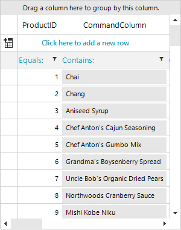

## Environment
|Product Version|Product|Author|
|----|----|----|
|2022.3.913|RadGridView for WinForms|[Desislava Yordanova](https://www.telerik.com/blogs/author/desislava-yordanova)|

## Description

By default, [filtering]() is not supposed to be supported for the [GridViewCommandColumn](). This article demonstrates a sample approach how to achieve such functionality.

## Solution

It is necessary to create a derivative of the **GridViewCommandColumn**. Then, overriding the **AllowFiltering** property for the custom GridViewCommandColumn allows you to enable filtering functionality. In order to show the filter operator ("Contains", "Starts With"), it is necessary to create a custom **GridFilterCellElement** and override its **SetSelectedFilterOperatorText** method which is skipped by default for the GridViewCommandColumn. A sample code snippet is demonstrated below:

 


````C#

private void RadForm1_Load(object sender, EventArgs e)
{ 
    this.productsTableAdapter.Fill(this.nwindDataSet.Products);
 
    this.radGridView1.EnableFiltering = true;

    FilterCommandColumn commandColumn = new FilterCommandColumn();
    commandColumn.AutoFilterDelay = 500;
    commandColumn.Name = "CommandColumn";
    commandColumn.DataType = typeof(string);
    commandColumn.UseDefaultText = false;
    commandColumn.FieldName = "ProductName";
    commandColumn.HeaderText = "CommandColumn";
    radGridView1.MasterTemplate.Columns.Add(commandColumn);

    this.radGridView1.BestFitColumns();
}

public class FilterCommandColumn : GridViewCommandColumn
{
    public FilterCommandColumn() : base()
    {
    }

    public FilterCommandColumn(string name) : base(name)
    {
    }

    public override Type GetCellType(GridViewRowInfo row)
    {
        if (row is GridViewFilteringRowInfo)
        {
            return typeof(CustomGridFilterCellElement);
        }
        return base.GetCellType(row);
    }
    public override bool AllowFiltering
    {
        get 
        { 
            return this.IsDataBound;
        } 
    }

    public override bool AllowSearching
    {
        get
        {
            return this.IsDataBound;
        }
    }

    public override IInputEditor GetDefaultEditor()
    {
        return new RadTextBoxEditor();
    }

    public override Type GetDefaultEditorType()
    {
        return typeof(RadTextBoxEditor);
    }
}

public class CustomGridFilterCellElement : GridFilterCellElement
{
    protected override Type ThemeEffectiveType
    {
        get
        {
            return typeof(GridFilterCellElement);
        }
    }

    public CustomGridFilterCellElement(GridViewDataColumn column, GridRowElement row)
        : base(column, row)
    { 
    }

    public override void Attach(GridViewColumn data, object context)
    {
        base.Attach(data, context);
    }
    public override void Detach()
    {
        base.Detach();
    }

    protected override void SetSelectedFilterOperatorText()
    { 
        string text = RadGridLocalizationProvider.CurrentProvider.GetLocalizedString(RadGridStringId.FilterOperatorNoFilter);

        if (this.Descriptor != null)
        {
            RadGridLocalizationProvider currentProvider = RadGridLocalizationProvider.CurrentProvider;
            if (this.Descriptor is CompositeFilterDescriptor)
            {
                text = currentProvider.GetLocalizedString(RadGridStringId.FilterOperatorCustom);
            }
            else
            {
                switch (this.Descriptor.Operator)
                {
                    case FilterOperator.IsLike:
                        text = currentProvider.GetLocalizedString(RadGridStringId.FilterOperatorIsLike);
                        break;
                    case FilterOperator.IsNotLike:
                        text = currentProvider.GetLocalizedString(RadGridStringId.FilterOperatorNotIsLike);
                        break;
                    case FilterOperator.IsLessThan:
                        text = currentProvider.GetLocalizedString(RadGridStringId.FilterOperatorLessThan);
                        break;
                    case FilterOperator.IsLessThanOrEqualTo:
                        text = currentProvider.GetLocalizedString(RadGridStringId.FilterOperatorLessThanOrEqualTo);
                        break;
                    case FilterOperator.IsEqualTo:
                        text = currentProvider.GetLocalizedString(RadGridStringId.FilterOperatorEqualTo);
                        break;
                    case FilterOperator.IsNotEqualTo:
                        text = currentProvider.GetLocalizedString(RadGridStringId.FilterOperatorNotEqualTo);
                        break;
                    case FilterOperator.IsGreaterThanOrEqualTo:
                        text = currentProvider.GetLocalizedString(RadGridStringId.FilterOperatorGreaterThanOrEqualTo);
                        break;
                    case FilterOperator.IsGreaterThan:
                        text = currentProvider.GetLocalizedString(RadGridStringId.FilterOperatorGreaterThan);
                        break;
                    case FilterOperator.StartsWith:
                        text = currentProvider.GetLocalizedString(RadGridStringId.FilterOperatorStartsWith);
                        break;
                    case FilterOperator.EndsWith:
                        text = currentProvider.GetLocalizedString(RadGridStringId.FilterOperatorEndsWith);
                        break;
                    case FilterOperator.Contains:
                        text = currentProvider.GetLocalizedString(RadGridStringId.FilterOperatorContains);
                        break;
                    case FilterOperator.NotContains:
                        text = currentProvider.GetLocalizedString(RadGridStringId.FilterOperatorDoesNotContain);
                        break;
                    case FilterOperator.IsNull:
                        text = currentProvider.GetLocalizedString(RadGridStringId.FilterOperatorIsNull);
                        break;
                    case FilterOperator.IsNotNull:
                        text = currentProvider.GetLocalizedString(RadGridStringId.FilterOperatorNotIsNull);
                        break;
                    case FilterOperator.IsContainedIn:
                        text = currentProvider.GetLocalizedString(RadGridStringId.FilterOperatorIsContainedIn);
                        break;
                    case FilterOperator.IsNotContainedIn:
                        text = currentProvider.GetLocalizedString(RadGridStringId.FilterOperatorNotIsContainedIn);
                        break;
                    default:
                        text = RadGridLocalizationProvider.CurrentProvider.GetLocalizedString(RadGridStringId.FilterOperatorNoFilter);
                        break;
                }
            }
        }

        this.FilterOperatorText.Text = text + ":";
    }

    public override bool IsCompatible(GridViewColumn data, object context)
    {
        return data is FilterCommandColumn;
    }
}


````
````VB.NET

Private Sub RadForm1_Load(sender As Object, e As EventArgs) Handles MyBase.Load 
    Me.ProductsTableAdapter.Fill(Me.NwindDataSet.Products)

    Me.RadGridView1.EnableFiltering = True
    Dim commandColumn As FilterCommandColumn = New FilterCommandColumn()
    commandColumn.AutoFilterDelay = 500
    commandColumn.Name = "CommandColumn"
    commandColumn.DataType = GetType(String)
    commandColumn.UseDefaultText = False
    commandColumn.FieldName = "ProductName"
    commandColumn.HeaderText = "CommandColumn"
    RadGridView1.MasterTemplate.Columns.Add(commandColumn)
    Me.RadGridView1.BestFitColumns()
End Sub

Public Class FilterCommandColumn
    Inherits GridViewCommandColumn

    Public Sub New()
        MyBase.New()
    End Sub

    Public Sub New(ByVal name As String)
        MyBase.New(name)
    End Sub

    Public Overrides Function GetCellType(ByVal row As GridViewRowInfo) As Type
        If TypeOf row Is GridViewFilteringRowInfo Then
            Return GetType(CustomGridFilterCellElement)
        End If

        Return MyBase.GetCellType(row)
    End Function

    Public Overrides Property AllowFiltering As Boolean
        Get
            Return Me.IsDataBound
        End Get
        Set(value As Boolean)

        End Set
    End Property

    Public Overrides Property AllowSearching As Boolean
        Get
            Return Me.IsDataBound
        End Get
        Set(value As Boolean)

        End Set
    End Property

    Public Overrides Function GetDefaultEditor() As IInputEditor
        Return New RadTextBoxEditor()
    End Function

    Public Overrides Function GetDefaultEditorType() As Type
        Return GetType(RadTextBoxEditor)
    End Function
End Class

Public Class CustomGridFilterCellElement
    Inherits GridFilterCellElement

    Protected Overrides ReadOnly Property ThemeEffectiveType As Type
        Get
            Return GetType(GridFilterCellElement)
        End Get
    End Property

    Public Sub New(ByVal column As GridViewDataColumn, ByVal row As GridRowElement)
        MyBase.New(column, row)
    End Sub

    Public Overrides Sub Attach(ByVal data As GridViewColumn, ByVal context As Object)
        MyBase.Attach(data, context)
    End Sub

    Public Overrides Sub Detach()
        MyBase.Detach()
    End Sub

    Protected Overrides Sub SetSelectedFilterOperatorText()
        Dim text As String = RadGridLocalizationProvider.CurrentProvider.GetLocalizedString(RadGridStringId.FilterOperatorNoFilter)

        If Me.Descriptor IsNot Nothing Then
            Dim currentProvider As RadGridLocalizationProvider = RadGridLocalizationProvider.CurrentProvider

            If TypeOf Me.Descriptor Is CompositeFilterDescriptor Then
                text = currentProvider.GetLocalizedString(RadGridStringId.FilterOperatorCustom)
            Else

                Select Case Me.Descriptor.[Operator]
                    Case FilterOperator.IsLike
                        text = currentProvider.GetLocalizedString(RadGridStringId.FilterOperatorIsLike)
                    Case FilterOperator.IsNotLike
                        text = currentProvider.GetLocalizedString(RadGridStringId.FilterOperatorNotIsLike)
                    Case FilterOperator.IsLessThan
                        text = currentProvider.GetLocalizedString(RadGridStringId.FilterOperatorLessThan)
                    Case FilterOperator.IsLessThanOrEqualTo
                        text = currentProvider.GetLocalizedString(RadGridStringId.FilterOperatorLessThanOrEqualTo)
                    Case FilterOperator.IsEqualTo
                        text = currentProvider.GetLocalizedString(RadGridStringId.FilterOperatorEqualTo)
                    Case FilterOperator.IsNotEqualTo
                        text = currentProvider.GetLocalizedString(RadGridStringId.FilterOperatorNotEqualTo)
                    Case FilterOperator.IsGreaterThanOrEqualTo
                        text = currentProvider.GetLocalizedString(RadGridStringId.FilterOperatorGreaterThanOrEqualTo)
                    Case FilterOperator.IsGreaterThan
                        text = currentProvider.GetLocalizedString(RadGridStringId.FilterOperatorGreaterThan)
                    Case FilterOperator.StartsWith
                        text = currentProvider.GetLocalizedString(RadGridStringId.FilterOperatorStartsWith)
                    Case FilterOperator.EndsWith
                        text = currentProvider.GetLocalizedString(RadGridStringId.FilterOperatorEndsWith)
                    Case FilterOperator.Contains
                        text = currentProvider.GetLocalizedString(RadGridStringId.FilterOperatorContains)
                    Case FilterOperator.NotContains
                        text = currentProvider.GetLocalizedString(RadGridStringId.FilterOperatorDoesNotContain)
                    Case FilterOperator.IsNull
                        text = currentProvider.GetLocalizedString(RadGridStringId.FilterOperatorIsNull)
                    Case FilterOperator.IsNotNull
                        text = currentProvider.GetLocalizedString(RadGridStringId.FilterOperatorNotIsNull)
                    Case FilterOperator.IsContainedIn
                        text = currentProvider.GetLocalizedString(RadGridStringId.FilterOperatorIsContainedIn)
                    Case FilterOperator.IsNotContainedIn
                        text = currentProvider.GetLocalizedString(RadGridStringId.FilterOperatorNotIsContainedIn)
                    Case Else
                        text = RadGridLocalizationProvider.CurrentProvider.GetLocalizedString(RadGridStringId.FilterOperatorNoFilter)
                End Select
            End If
        End If

        Me.FilterOperatorText.Text = text & ":"
    End Sub

    Public Overrides Function IsCompatible(ByVal data As GridViewColumn, ByVal context As Object) As Boolean
        Return TypeOf data Is FilterCommandColumn
    End Function
End Class 

````

 

# See Also

* [GridViewCommandColumn]()
* [Basic Filtering]()


 