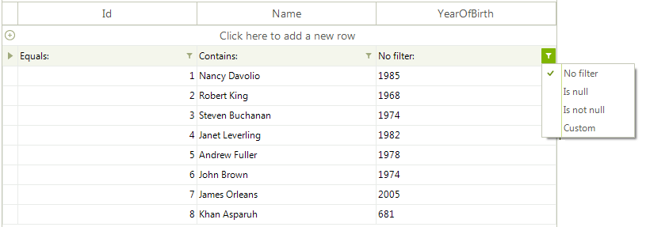
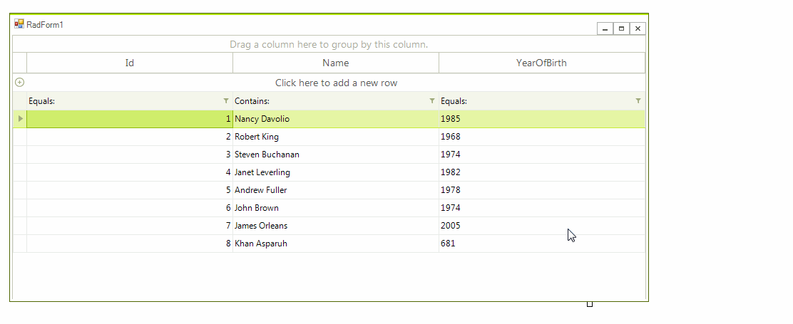

## Environment
 
|Product Version|Product|Author|
|----|----|----|
|2018.3.1016|RadGridView for WinForms|[Desislava Yordanova](https://www.telerik.com/blogs/author/desislava-yordanova)|
 

## Description

By design, the filter operators in the **RadGridView**'s columns depend on the data type that is being stored in that column. That is why when you have a complex object, *IsNull*, *IsNotNull* and *Custom* options are shown. However, you can handle this case and implement the logic for filtering the custom types.

## Solution 

Consider the case that you have a **Person** class that has an *int* **Id** property, a *string* **Name** property and a custom type property **YearOfBirth** that is a wrapper of the integer value for the year.

#### Custom classes

````C#

        public class Person
        {
            public int Id { get; set; }

            public string Name { get; set; }

            public YearOfBirth YearOfBirth { get; set; }

            public Person(int id, string name, YearOfBirth year)
            {
                this.Id = id;
                this.Name = name;
                this.YearOfBirth = year;
            }
        }

        public class YearOfBirth 
        {
            public int Year { get; set; }

            public YearOfBirth(int year)
            {
                this.Year = year;
            }

            public override string ToString()
            {
                return this.Year.ToString();
            }
        }

````
````VB.NET

    Public Class Person
        Public Property Id As Integer
        Public Property Name As String
        Public Property YearOfBirth As YearOfBirth

        Public Sub New(ByVal id As Integer, ByVal name As String, ByVal year As YearOfBirth)
            Me.Id = id
            Me.Name = name
            Me.YearOfBirth = year
        End Sub
    End Class

    Public Class YearOfBirth
        Public Property Year As Integer

        Public Sub New(ByVal year As Integer)
            Me.Year = year
        End Sub
        
    End Class

````

The grid is bound to a collection of **Person** objects:

#### Populate the grid

````C#

            List<Person> people = new List<Person>();
            people.Add(new Person(1, "Nancy Davolio", new YearOfBirth(1985)));
            people.Add(new Person(2, "Robert King", new YearOfBirth(1968)));
            people.Add(new Person(3, "Steven Buchanan", new YearOfBirth(1974)));
            people.Add(new Person(4, "Janet Leverling", new YearOfBirth(1982)));
            people.Add(new Person(5, "Andrew Fuller", new YearOfBirth(1978)));
            people.Add(new Person(6, "John Brown", new YearOfBirth(1974)));
            people.Add(new Person(7, "James Orleans", new YearOfBirth(2005)));
            people.Add(new Person(8, "Khan Asparuh", new YearOfBirth(681)));

            this.radGridView1.DataSource = people; 
            this.radGridView1.EnableFiltering = true;

````
````VB.NET

        Dim people As List(Of Person) = New List(Of Person)()
        people.Add(New Person(1, "Nancy Davolio", New YearOfBirth(1985)))
        people.Add(New Person(2, "Robert King", New YearOfBirth(1968)))
        people.Add(New Person(3, "Steven Buchanan", New YearOfBirth(1974)))
        people.Add(New Person(4, "Janet Leverling", New YearOfBirth(1982)))
        people.Add(New Person(5, "Andrew Fuller", New YearOfBirth(1978)))
        people.Add(New Person(6, "John Brown", New YearOfBirth(1974)))
        people.Add(New Person(7, "James Orleans", New YearOfBirth(2005)))
        people.Add(New Person(8, "Khan Asparuh", New YearOfBirth(681)))
        Me.RadGridView1.DataSource = people

````

If you try to filtering by the **YearOfBirth** property, you will notice that the *IsNull*, *IsNotNull* and *Custom* filter options are shown.



In order to allow filter by your custom **YearOfBirth** type you should perform the following steps:

1\. Set the **DataType** property of the column to *typeof(int)* since we will filter by the numeric value of the custom class.

2\. Your custom class **YearOfBirth** should implement the [IConvertible](https://docs.microsoft.com/de-de/dotnet/api/system.iconvertible?redirectedfrom=MSDN&view=netframework-4.7.2) interface.

3\. Create a custom [TypeConverter](https://docs.microsoft.com/en-us/dotnet/api/system.componentmodel.typeconverter?view=netframework-4.7.2) in order to convert the custom **YearOfBirth** type to string and vice versa.

````C#

        public RadForm1()
        {
            InitializeComponent();

            List<Person> people = new List<Person>();
            people.Add(new Person(1, "Nancy Davolio", new YearOfBirth(1985)));
            people.Add(new Person(2, "Robert King", new YearOfBirth(1968)));
            people.Add(new Person(3, "Steven Buchanan", new YearOfBirth(1974)));
            people.Add(new Person(4, "Janet Leverling", new YearOfBirth(1982)));
            people.Add(new Person(5, "Andrew Fuller", new YearOfBirth(1978)));
            people.Add(new Person(6, "John Brown", new YearOfBirth(1974)));
            people.Add(new Person(7, "James Orleans", new YearOfBirth(2005)));
            people.Add(new Person(8, "Khan Asparuh", new YearOfBirth(681)));

            this.radGridView1.DataSource = people;
            this.radGridView1.EnableFiltering = true;
            this.radGridView1.AutoSizeColumnsMode = Telerik.WinControls.UI.GridViewAutoSizeColumnsMode.Fill;

            this.radGridView1.Columns.Last().DataType = typeof(int);
        }

        public class Person
        {
            public int Id { get; set; }

            public string Name { get; set; }

            public YearOfBirth YearOfBirth { get; set; }

            public Person(int id, string name, YearOfBirth year)
            {
                this.Id = id;
                this.Name = name;
                this.YearOfBirth = year;
            }
        }

        [TypeConverter(typeof(YearTypeConverter))]
        public class YearOfBirth : IConvertible
        {
            public int Year { get; set; }

            public YearOfBirth(int year)
            {
                this.Year = year;
            }

            public override string ToString()
            {
                return this.Year.ToString();
            }

            public TypeCode GetTypeCode()
            {
                return TypeCode.Object;
            }

            public bool ToBoolean(IFormatProvider provider)
            {
                return false;
            }

            public byte ToByte(IFormatProvider provider)
            {
                return 0;
            }

            public char ToChar(IFormatProvider provider)
            {
                return ' ';
            }

            public DateTime ToDateTime(IFormatProvider provider)
            {
                return DateTime.MinValue;
            }

            public decimal ToDecimal(IFormatProvider provider)
            {
                return (Decimal)this.Year;
            }

            public double ToDouble(IFormatProvider provider)
            {
                return (Double)this.Year;
            }

            public short ToInt16(IFormatProvider provider)
            {
                return (Int16)this.Year;
            }

            public int ToInt32(IFormatProvider provider)
            {
                return (Int32)this.Year;
            }

            public long ToInt64(IFormatProvider provider)
            {
                return (Int64)this.Year;
            }

            public sbyte ToSByte(IFormatProvider provider)
            {
                return 0;
            }

            public float ToSingle(IFormatProvider provider)
            {
                return (Single)this.Year;
            }

            public string ToString(IFormatProvider provider)
            {
                return this.Year.ToString();
            }

            public object ToType(Type conversionType, IFormatProvider provider)
            {
                return this.ToString();
            }

            public ushort ToUInt16(IFormatProvider provider)
            {
                return (ushort)this.Year;
            }

            public uint ToUInt32(IFormatProvider provider)
            {
                return (UInt32)this.Year;
            }

            public ulong ToUInt64(IFormatProvider provider)
            {
                return (ulong)this.Year;
            }
        }

        public class YearTypeConverter : TypeConverter
        {
            public override bool CanConvertTo(ITypeDescriptorContext context, System.Type destinationType)
            {
                if (destinationType == typeof(string))
                {
                    return true;
                }
                return base.CanConvertTo(context, destinationType);
            }

            public override object ConvertTo(ITypeDescriptorContext context, System.Globalization.CultureInfo culture, object value, System.Type destinationType)
            {
                YearOfBirth c = value as YearOfBirth;
                if (destinationType == typeof(string) && c != null)
                {
                    return c.ToString();
                }
                return base.ConvertTo(context, culture, value, destinationType);
            }

            public override bool CanConvertFrom(ITypeDescriptorContext context, System.Type sourceType)
            {
                if (sourceType == typeof(string))
                {
                    return true;
                }
                return base.CanConvertFrom(context, sourceType);
            }

            public override object ConvertFrom(ITypeDescriptorContext context, System.Globalization.CultureInfo culture, object value)
            {
                if (value != null)
                {
                    if (value.ToString() == string.Empty)
                    {
                        return null;
                    }
                    int year = 0;
                    if (int.TryParse(value.ToString(), out year))
                    {
                        return new YearOfBirth(year);
                    }
                }

                return base.ConvertFrom(context, culture, value);
            }
        }


````
````VB.NET

    Sub New()

        InitializeComponent()

        Dim people As List(Of Person) = New List(Of Person)()
        people.Add(New Person(1, "Nancy Davolio", New YearOfBirth(1985)))
        people.Add(New Person(2, "Robert King", New YearOfBirth(1968)))
        people.Add(New Person(3, "Steven Buchanan", New YearOfBirth(1974)))
        people.Add(New Person(4, "Janet Leverling", New YearOfBirth(1982)))
        people.Add(New Person(5, "Andrew Fuller", New YearOfBirth(1978)))
        people.Add(New Person(6, "John Brown", New YearOfBirth(1974)))
        people.Add(New Person(7, "James Orleans", New YearOfBirth(2005)))
        people.Add(New Person(8, "Khan Asparuh", New YearOfBirth(681)))
        Me.RadGridView1.DataSource = people
        Me.RadGridView1.EnableFiltering = True
        Me.RadGridView1.AutoSizeColumnsMode = Telerik.WinControls.UI.GridViewAutoSizeColumnsMode.Fill
        Me.RadGridView1.Columns.Last().DataType = GetType(Integer)
    End Sub

    Public Class Person
        Public Property Id As Integer
        Public Property Name As String
        Public Property YearOfBirth As YearOfBirth

        Public Sub New(ByVal id As Integer, ByVal name As String, ByVal year As YearOfBirth)
            Me.Id = id
            Me.Name = name
            Me.YearOfBirth = year
        End Sub
    End Class

    <TypeConverter(GetType(YearTypeConverter))>
    Public Class YearOfBirth
    Implements IConvertible

        Public Property Year As Integer

        Public Sub New(ByVal year As Integer)
            Me.Year = year
        End Sub
        
        Public Function GetTypeCode() As TypeCode Implements IConvertible.GetTypeCode
            Return TypeCode.Object
        End Function

        Public Function ToBoolean(ByVal provider As IFormatProvider) As Boolean Implements IConvertible.ToBoolean
            Return False
        End Function

        Public Function ToByte(ByVal provider As IFormatProvider) As Byte Implements IConvertible.ToByte
            Return 0
        End Function

        Public Function ToChar(ByVal provider As IFormatProvider) As Char Implements IConvertible.ToChar
            Return " "c
        End Function

        Public Function ToDateTime(ByVal provider As IFormatProvider) As DateTime Implements IConvertible.ToDateTime
            Return DateTime.MinValue
        End Function

        Public Function ToDecimal(ByVal provider As IFormatProvider) As Decimal Implements IConvertible.ToDecimal
            Return CType(Me.Year, Decimal)
        End Function

        Public Function ToDouble(ByVal provider As IFormatProvider) As Double Implements IConvertible.ToDouble
            Return CType(Me.Year, Double)
        End Function

        Public Function ToInt16(ByVal provider As IFormatProvider) As Short Implements IConvertible.ToInt16
            Return CType(Me.Year, Int16)
        End Function

        Public Function ToInt32(ByVal provider As IFormatProvider) As Integer Implements IConvertible.ToInt32
            Return CType(Me.Year, Int32)
        End Function

        Public Function ToInt64(ByVal provider As IFormatProvider) As Long Implements IConvertible.ToInt64
            Return CType(Me.Year, Int64)
        End Function

        Public Function ToSByte(ByVal provider As IFormatProvider) As SByte Implements IConvertible.ToSByte
            Return 0
        End Function

        Public Function ToSingle(ByVal provider As IFormatProvider) As Single Implements IConvertible.ToSingle
            Return CType(Me.Year, Single)
        End Function

        Public Function ToString(ByVal provider As IFormatProvider) As String Implements IConvertible.ToString
            Return Me.Year.ToString()
        End Function

        Public Function ToType(ByVal conversionType As Type, ByVal provider As IFormatProvider) As Object Implements IConvertible.ToType
            Return GetType(YearOfBirth).ToString()
        End Function

        Public Function ToUInt16(ByVal provider As IFormatProvider) As UShort Implements IConvertible.ToUInt16
            Return CUShort(Me.Year)
        End Function

        Public Function ToUInt32(ByVal provider As IFormatProvider) As UInteger Implements IConvertible.ToUInt32
            Return CType(Me.Year, UInt32)
        End Function

        Public Function ToUInt64(ByVal provider As IFormatProvider) As ULong Implements IConvertible.ToUInt64 
            Return CULng(Me.Year)
        End Function
    End Class

    Public Class YearTypeConverter
    Inherits TypeConverter

        Public Overrides Function CanConvertTo(ByVal context As ITypeDescriptorContext, ByVal destinationType As System.Type) As Boolean
            If destinationType = GetType(String) Then
                Return True
            End If

            Return MyBase.CanConvertTo(context, destinationType)
        End Function

        Public Overrides Function ConvertTo(ByVal context As ITypeDescriptorContext, ByVal culture As System.Globalization.CultureInfo, ByVal value As Object, ByVal destinationType As System.Type) As Object
            Dim c As YearOfBirth = TryCast(value, YearOfBirth)

            If destinationType = GetType(String) AndAlso c IsNot Nothing Then
                Return c.Year.ToString()
            End If

            Return MyBase.ConvertTo(context, culture, value, destinationType)
        End Function

        Public Overrides Function CanConvertFrom(ByVal context As ITypeDescriptorContext, ByVal sourceType As System.Type) As Boolean
            If sourceType = GetType(String) Then
                Return True
            End If

            Return MyBase.CanConvertFrom(context, sourceType)
        End Function

        Public Overrides Function ConvertFrom(ByVal context As ITypeDescriptorContext, ByVal culture As System.Globalization.CultureInfo, ByVal value As Object) As Object
            If value IsNot Nothing Then

                If value.ToString() = String.Empty Then
                    Return Nothing
                End If

                Dim year As Integer = 0

                If Integer.TryParse(value.ToString(), year) Then
                    Return New YearOfBirth(year)
                End If
            End If

            Return MyBase.ConvertFrom(context, culture, value)
        End Function
    End Class

````

Now, you can filter by your custom property as if it is a numeric field:



>note This article demonstrates just a sample approach how you can handle filtering by custom types. You can extend this example and cover any custom scenario that you have.

# See Also

* [Basic Filtering]()
* [Custom Filtering]() 

