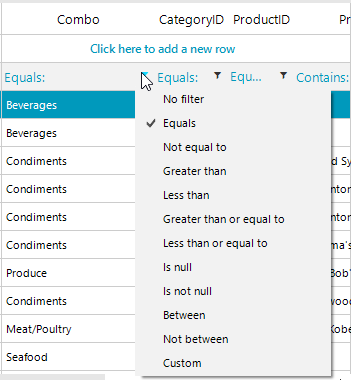
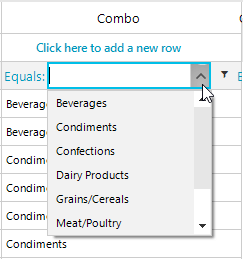
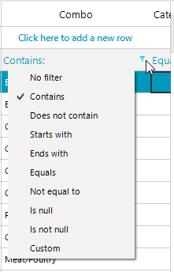
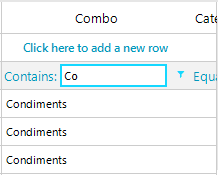

## Environment
 
|Product Version|Product|Author|
|----|----|----|
|2019.3.1022|RadGridView for WinForms|[Desislava Yordanova](https://www.telerik.com/blogs/author/desislava-yordanova)|
 
## Description

By default, the filter options for the [GridViewComboBoxColumn]() depends on the type of the specified **ValueMember**. Hence, if you set the **ValueMember** to be the unique numeric identifier of an object used in the **DataSource** collection, you will see filter options for numeric values in your case. 



In addition, the column requires selecting a certain item from the drop down in order to filter the grid rows.



A common requirement is to filter by a sub-string and type only a part of the text without the necessity to select a certain item from the drop down.

## Solution 

In order to allow filtering by using a text box editor and filtering by the text that is displayed in the column, you need to set the GridViewComboBoxColumn.**FilteringMode** property to GridViewFilteringMode.*DisplayMember* and replace the default editor in the filter row with a **RadTextBoxEditor** in the RadGridView.**EditorRequired** event. 
 

````C#
public RadForm1()
{
    InitializeComponent();
    GridViewComboBoxColumn comboColumn = new GridViewComboBoxColumn("Combo");
    comboColumn.FilteringMode = GridViewFilteringMode.DisplayMember;
    comboColumn.AutoCompleteMode = AutoCompleteMode.Suggest;
    comboColumn.DropDownStyle = RadDropDownStyle.DropDown;
    comboColumn.DataSource = this.categoriesBindingSource;
    comboColumn.ValueMember = "CategoryID";
    comboColumn.DisplayMember = "CategoryName";
    comboColumn.FieldName = "CategoryID";
    this.radGridView1.Columns.Insert(0, comboColumn);

    this.radGridView1.BestFitColumns();
    this.radGridView1.EnableFiltering = true;

    this.radGridView1.EditorRequired += radGridView1_EditorRequired;
}

private void radGridView1_EditorRequired(object sender, EditorRequiredEventArgs e)
{
    if (this.radGridView1.CurrentColumn is GridViewComboBoxColumn && this.radGridView1.CurrentRow is GridViewFilteringRowInfo)
    {
        RadTextBoxEditor editor = new RadTextBoxEditor();
        e.Editor = editor;
    }
}

        
````
````VB.NET

Public Sub New()
    InitializeComponent()
    Dim comboColumn As GridViewComboBoxColumn = New GridViewComboBoxColumn("Combo")
    comboColumn.FilteringMode = GridViewFilteringMode.DisplayMember
    comboColumn.AutoCompleteMode = AutoCompleteMode.Suggest
    comboColumn.DropDownStyle = RadDropDownStyle.DropDown
    comboColumn.DataSource = Me.categoriesBindingSource
    comboColumn.ValueMember = "CategoryID"
    comboColumn.DisplayMember = "CategoryName"
    comboColumn.FieldName = "CategoryID"
    Me.RadGridView1.Columns.Insert(0, comboColumn)
    Me.RadGridView1.BestFitColumns()
    Me.RadGridView1.EnableFiltering = True
    AddHandler Me.RadGridView1.EditorRequired, AddressOf radGridView1_EditorRequired
End Sub

Private Sub radGridView1_EditorRequired(ByVal sender As Object, ByVal e As EditorRequiredEventArgs)
    If TypeOf Me.RadGridView1.CurrentColumn Is GridViewComboBoxColumn AndAlso _
        TypeOf Me.RadGridView1.CurrentRow Is GridViewFilteringRowInfo Then
        Dim editor As RadTextBoxEditor = New RadTextBoxEditor()
        e.Editor = editor
    End If
End Sub
 

```` 

As a result you will get the filter options valid for string types:

>caption Text filter options
 


The dafult editor for the filtering row will be a pure text box:

>caption Text editor for the filtering row



# See Also

* [GridViewComboBoxColumn]()


    
   
  
    
 
