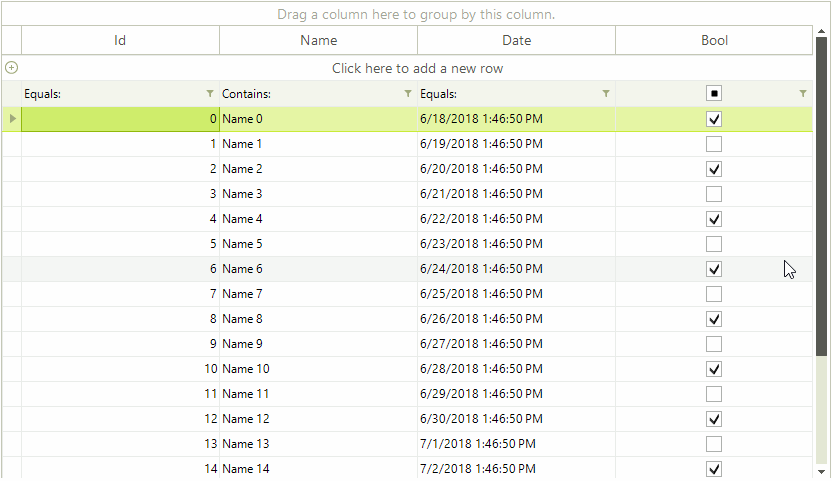

## Environment
<table>
	<tr>
		<td>Product Version</td>
		<td>2018.2 515</td>
	</tr>
	<tr>
		<td>Product</td>
		<td>RadGridView for WinForms</td>
	</tr>
</table>


## Description

**RadGridView** indicates that a filter has been added to a certain column by changing the icon. At some point it may become difficult to keep track of the filtered and non-filtered columns. 

## Solution

The solution in the KB project will demonstrate how the columns with applied filters can be additionally highlighted by adding a separate button. The button will also present a convenient way for the end user to remove the applied filter. The header cells in the filter row will be also customized with an additional element which once clicked will remove all of the filters. 

The animation below demonstrates the end result in **RadGridView**.

>caption Figure 1: Filtering Indicators


1\. Create a custom **GridFilterCellElement** and initialize a **RadButtonElement** in it. The layout of the cell will also need adjustments so the **ArrangeOverride** method of the cell will need customizations. The click event of the button will be responsible for removing the filter and the button`s visibility will by synced in the **SetContentCore** method.
 
#### Custom GridFilterCellElement

{{source=..\SamplesCS\KnowledgeBase\FilteringIndicatorsForm.cs region=CustomGridFilterCellElement}} 
{{source=..\SamplesVB\KnowledgeBase\FilteringIndicatorsForm.vb region=CustomGridFilterCellElement}}
````C#
public class MyGridFilterCellElement : GridFilterCellElement
{
    private RadButtonElement clearButtonElement;
    public MyGridFilterCellElement(GridViewDataColumn column, GridRowElement row)
        : base(column, row)
    {
    }
    protected override Type ThemeEffectiveType
    {
        get
        {
            return typeof(GridFilterCellElement);
        }
    }
    public RadButtonElement ClearButtonElement
    {
        get
        {
            return this.clearButtonElement;
        }
    }
    protected override void CreateChildElements()
    {
        base.CreateChildElements();
        this.clearButtonElement = new RadButtonElement();
        this.clearButtonElement.Image = Properties.Resources.cross16x16;
        this.clearButtonElement.Click += ClearButtonElement_Click;
        this.clearButtonElement.NotifyParentOnMouseInput = false;
        this.Children.Add(this.clearButtonElement);
    }
    protected override SizeF ArrangeOverride(SizeF finalSize)
    {
        SizeF size = base.ArrangeOverride(finalSize);
        if (this.IsFilterApplied)
        {
            RectangleF arrangeRect = new RectangleF(finalSize.Width - this.FilterButton.DesiredSize.Width - this.clearButtonElement.DesiredSize.Width - this.ElementSpacing, 4,
                this.clearButtonElement.DesiredSize.Width, this.clearButtonElement.DesiredSize.Height);
            this.clearButtonElement.Arrange(arrangeRect);
        }
        if (this.ColumnInfo is GridViewDecimalColumn)
        {
            this.TextAlignment = ContentAlignment.MiddleLeft;
        }
        return size;
    }
    protected override void SetTextAlignment()
    {
        base.SetTextAlignment();
        if (this.ColumnInfo is GridViewDecimalColumn)
        {
            this.TextAlignment = ContentAlignment.MiddleLeft;
        }
    }
    protected override void SetContentCore(object value)
    {
        base.SetContentCore(value);
        this.clearButtonElement.Visibility = this.DataColumnInfo.FilterDescriptor != null ? ElementVisibility.Visible : ElementVisibility.Collapsed;
    }
    public override bool IsCompatible(GridViewColumn data, object context)
    {
        return context is GridFilterRowElement;
    }
    private void ClearButtonElement_Click(object sender, EventArgs e)
    {
        this.DataColumnInfo.FilterDescriptor = null;
    }
}

````
````VB.NET
Public Class MyGridFilterCellElement
    Inherits GridFilterCellElement
    Private _clearButtonElement As RadButtonElement
    Public Sub New(ByVal column As GridViewDataColumn, ByVal row As GridRowElement)
        MyBase.New(column, row)
    End Sub
    Protected Overrides ReadOnly Property ThemeEffectiveType As Type
        Get
            Return GetType(GridFilterCellElement)
        End Get
    End Property
    Public ReadOnly Property ClearButtonElement As RadButtonElement
        Get
            Return Me._clearButtonElement
        End Get
    End Property
    Protected Overrides Sub CreateChildElements()
        MyBase.CreateChildElements()
        Me._clearButtonElement = New RadButtonElement()
        Me._clearButtonElement.Image = My.Resources.cross16x16
        AddHandler Me._clearButtonElement.Click, AddressOf ClearButtonElement_Click
        Me.ClearButtonElement.NotifyParentOnMouseInput = False
        Me.Children.Add(Me.ClearButtonElement)
    End Sub
    Protected Overrides Function ArrangeOverride(ByVal finalSize As SizeF) As SizeF
        Dim size As SizeF = MyBase.ArrangeOverride(finalSize)
        If Me.IsFilterApplied Then
            Dim arrangeRect As RectangleF = New RectangleF(finalSize.Width - Me.FilterButton.DesiredSize.Width - Me.ClearButtonElement.DesiredSize.Width - Me.ElementSpacing, 4, Me.ClearButtonElement.DesiredSize.Width, Me.ClearButtonElement.DesiredSize.Height)
            Me.ClearButtonElement.Arrange(arrangeRect)
        End If
        If TypeOf Me.ColumnInfo Is GridViewDecimalColumn Then
            Me.TextAlignment = ContentAlignment.MiddleLeft
        End If
        Return size
    End Function
    Protected Overrides Sub SetTextAlignment()
        MyBase.SetTextAlignment()
        If TypeOf Me.ColumnInfo Is GridViewDecimalColumn Then
            Me.TextAlignment = ContentAlignment.MiddleLeft
        End If
    End Sub
    Protected Overrides Sub SetContentCore(ByVal value As Object)
        MyBase.SetContentCore(value)
        Me.ClearButtonElement.Visibility = If(Me.DataColumnInfo.FilterDescriptor IsNot Nothing, ElementVisibility.Visible, ElementVisibility.Collapsed)
    End Sub
    Public Overrides Function IsCompatible(ByVal data As GridViewColumn, ByVal context As Object) As Boolean
        Return TypeOf context Is GridFilterRowElement
    End Function
    Private Sub ClearButtonElement_Click(ByVal sender As Object, ByVal e As EventArgs)
        Me.DataColumnInfo.FilterDescriptor = Nothing
    End Sub
End Class

````


{{endregion}}

2\. Clicking on filtering row will set the filter cell in edit mode. In our custom scenario we would like to avoid that and not enter edit mode when clicking on the newly created button. That is why we need a special row behavior class in which we can override the **OnMouseDown** method:

#### Custom GridFilterRowBehavior

{{source=..\SamplesCS\KnowledgeBase\FilteringIndicatorsForm.cs region=CustomGridFilterRowBehavior}} 
{{source=..\SamplesVB\KnowledgeBase\FilteringIndicatorsForm.vb region=CustomGridFilterRowBehavior}}
````C#
public class MyGridFilterRowBehavior : GridFilterRowBehavior
{
    protected override bool OnMouseDownLeft(MouseEventArgs e)
    {
        MyGridFilterCellElement filterCell = this.GetCellAtPoint(e.Location) as MyGridFilterCellElement;
        if (filterCell != null && filterCell.ClearButtonElement.ControlBoundingRectangle.Contains(e.Location))
        {
            return false;
        }
        return base.OnMouseDownLeft(e);
    }
}

````
````VB.NET
Public Class MyGridFilterRowBehavior
    Inherits GridFilterRowBehavior
    Protected Overrides Function OnMouseDownLeft(ByVal e As MouseEventArgs) As Boolean
        Dim filterCell As MyGridFilterCellElement = TryCast(Me.GetCellAtPoint(e.Location), MyGridFilterCellElement)
        If filterCell IsNot Nothing AndAlso filterCell.ClearButtonElement.ControlBoundingRectangle.Contains(e.Location) Then
            Return False
        End If
        Return MyBase.OnMouseDownLeft(e)
    End Function
End Class

````


{{endregion}}

3\. The image in the header cell located in the filter row can be customized as well. In its virtual **OnMouseDown** method we will add our special logic for clearing all the filters. 

#### Custom GridRowHeaderCellElement

{{source=..\SamplesCS\KnowledgeBase\FilteringIndicatorsForm.cs region=CustomGridRowHeaderCellElement}}
{{source=..\SamplesVB\KnowledgeBase\FilteringIndicatorsForm.vb region=CustomGridRowHeaderCellElement}}
````C#
public class MyGridRowHeaderCellElement : GridRowHeaderCellElement
{
    private Image clearImage;
    public MyGridRowHeaderCellElement(GridViewColumn column, GridRowElement row)
      : base(column, row)
    {
        this.clearImage = Properties.Resources.cross16x16;
    }
    protected override Type ThemeEffectiveType
    {
        get
        {
            return typeof(GridRowHeaderCellElement);
        }
    }
    public override bool IsCompatible(GridViewColumn data, object context)
    {
        return context is GridFilterRowElement;
    }
    protected override void UpdateImage()
    {
        if (this.GridControl != null && this.GridControl.FilterDescriptors.Count > 0 && !this.RowElement.IsCurrent && this.RowElement is GridFilterRowElement)
        {
            this.Image = this.clearImage;
            return;
        }
        base.UpdateImage();
    }
    protected override void OnMouseDown(MouseEventArgs e)
    {
        base.OnMouseDown(e);
        if (this.GridControl != null && this.GridControl.FilterDescriptors.Count > 0 && !this.RowElement.IsCurrent && this.RowElement is GridFilterRowElement)
        {
            this.GridControl.FilterDescriptors.Clear();
        }
    }
}

````
````VB.NET
Public Class MyGridRowHeaderCellElement
    Inherits GridRowHeaderCellElement
    Private clearImage As Image
    Public Sub New(ByVal column As GridViewColumn, ByVal row As GridRowElement)
        MyBase.New(column, row)
        Me.clearImage = My.Resources.cross16x16
    End Sub
    Protected Overrides ReadOnly Property ThemeEffectiveType As Type
        Get
            Return GetType(GridRowHeaderCellElement)
        End Get
    End Property
    Public Overrides Function IsCompatible(ByVal data As GridViewColumn, ByVal context As Object) As Boolean
        Return TypeOf context Is GridFilterRowElement
    End Function
    Protected Overrides Sub UpdateImage()
        If Me.GridControl IsNot Nothing AndAlso Me.GridControl.FilterDescriptors.Count > 0 AndAlso Not Me.RowElement.IsCurrent AndAlso TypeOf Me.RowElement Is GridFilterRowElement Then
            Me.Image = Me.clearImage
            Return
        End If
        MyBase.UpdateImage()
    End Sub
    Protected Overrides Sub OnMouseDown(ByVal e As MouseEventArgs)
        MyBase.OnMouseDown(e)
        If Me.GridControl IsNot Nothing AndAlso Me.GridControl.FilterDescriptors.Count > 0 AndAlso Not Me.RowElement.IsCurrent AndAlso TypeOf Me.RowElement Is GridFilterRowElement Then
            Me.GridControl.FilterDescriptors.Clear()
        End If
    End Sub
End Class

````


{{endregion}} 

4\. Below is the sample code demonstrating how the custom solution can be utilized. The custom cell elements can be specified in the RadGridView.**CreateCell** event. The custom row behavior class needs to be registered and this can be done in the form`s constructor. 

#### Initial Setup and Events

{{source=..\SamplesCS\KnowledgeBase\FilteringIndicatorsForm.cs region=InitialSetupAndEvents}}
{{source=..\SamplesVB\KnowledgeBase\FilteringIndicatorsForm.vb region=InitialSetupAndEvents}}
````C#
public partial class FilteringIndicatorsForm : Telerik.WinControls.UI.RadForm
{
    public FilteringIndicatorsForm()
    {
        InitializeComponent();
        this.radGridView1.CreateCell += RadGridView1_CreateCell;
        BaseGridBehavior gridBehavior = radGridView1.GridBehavior as BaseGridBehavior;
        gridBehavior.UnregisterBehavior(typeof(GridViewFilteringRowInfo));
        gridBehavior.RegisterBehavior(typeof(GridViewFilteringRowInfo), new MyGridFilterRowBehavior());
        this.radGridView1.DataSource = this.GetData();
        this.radGridView1.AutoSizeColumnsMode = Telerik.WinControls.UI.GridViewAutoSizeColumnsMode.Fill;
        this.radGridView1.EnableFiltering = true;
    }
    private void RadGridView1_CreateCell(object sender, GridViewCreateCellEventArgs e)
    {
        if (e.CellType == typeof(GridFilterCellElement))
        {
            e.CellElement = new MyGridFilterCellElement((GridViewDataColumn)e.Column, e.Row);
        }
        else if (e.CellType == typeof(GridRowHeaderCellElement))
        {
            e.CellElement = new MyGridRowHeaderCellElement(e.Column, e.Row);
        }
    }
    private DataTable GetData()
    {
        DataTable dt = new DataTable();
        dt.Columns.Add("Id", typeof(int));
        dt.Columns.Add("Name", typeof(string));
        dt.Columns.Add("Date", typeof(DateTime));
        dt.Columns.Add("Bool", typeof(bool));
        for (int i = 0; i < 20; i++)
        {
            dt.Rows.Add(i, "Name " + i, DateTime.Now.AddDays(i), i % 2 == 0);
        }
        return dt;
    }
}

````
````VB.NET
Public Class FilteringIndicatorsForm
    Public Sub New()
        InitializeComponent()
        AddHandler Me.RadGridView1.CreateCell, AddressOf RadGridView1_CreateCell
        Dim gridBehavior As BaseGridBehavior = TryCast(RadGridView1.GridBehavior, BaseGridBehavior)
        gridBehavior.UnregisterBehavior(GetType(GridViewFilteringRowInfo))
        gridBehavior.RegisterBehavior(GetType(GridViewFilteringRowInfo), New MyGridFilterRowBehavior())
        Me.RadGridView1.DataSource = Me.GetData()
        Me.RadGridView1.AutoSizeColumnsMode = Telerik.WinControls.UI.GridViewAutoSizeColumnsMode.Fill
        Me.RadGridView1.EnableFiltering = True
    End Sub
    Private Sub RadGridView1_CreateCell(ByVal sender As Object, ByVal e As GridViewCreateCellEventArgs)
        If e.CellType = GetType(GridFilterCellElement) Then
            e.CellElement = New MyGridFilterCellElement(CType(e.Column, GridViewDataColumn), e.Row)
        ElseIf e.CellType = GetType(GridRowHeaderCellElement) Then
            e.CellElement = New MyGridRowHeaderCellElement(e.Column, e.Row)
        End If
    End Sub
    Private Function GetData() As DataTable
        Dim dt As DataTable = New DataTable()
        dt.Columns.Add("Id", GetType(Integer))
        dt.Columns.Add("Name", GetType(String))
        dt.Columns.Add("Date", GetType(DateTime))
        dt.Columns.Add("Bool", GetType(Boolean))
        For i As Integer = 0 To 20 - 1
            dt.Rows.Add(i, "Name " & i, DateTime.Now.AddDays(i), i Mod 2 = 0)
        Next
        Return dt
    End Function
End Class

````


{{endregion}} 

>note A complete solution providing a C# and VB.NET project is available [here](https://github.com/telerik/winforms-sdk/tree/master/GridView/FilterinIngIndicatorsInGridView).