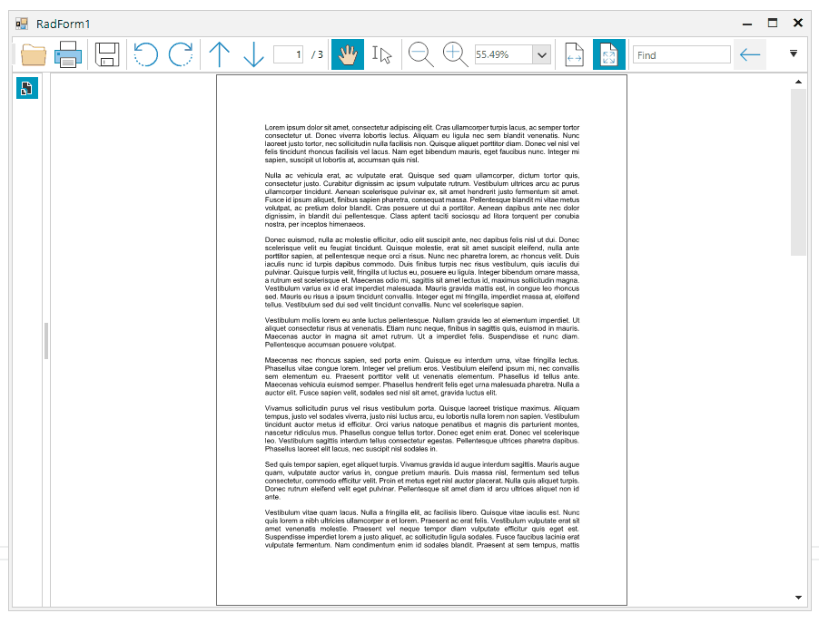

## Environment
|Product Version|Product|Author|
|----|----|----|
|2021.1.223|RadPdfViewer for WinForms|[Desislava Yordanova](https://www.telerik.com/blogs/author/desislava-yordanova)|

## Problem

Consider the case that you have a **RadPdfViewer** and you want to change page mode when you click over pdf document, between FitFullPage and FitToWidth.

When FitToWidth is applied, you would like to scroll the document to the clicked mouse position.

  

## Solution

It is appropriate to use the PdfViewerElement.**GoToDestination** method passing the location to which you need to scroll:

````C#
public RadForm1()
{
    InitializeComponent();
    this.radPdfViewer1.MouseDown += radPdfViewer1_MouseDown;
    this.radPdfViewer1.FitFullPage = true;
}

private void radPdfViewer1_MouseDown(object sender, MouseEventArgs e)
{ 
    var element = radPdfViewer1.ElementTree.GetElementAtPoint(e.Location) as RadFixedPageElement;
    Telerik.Windows.Documents.Fixed.Model.Navigation.Location location = null;
     
    if (element != null)
    { 
        location = new Telerik.Windows.Documents.Fixed.Model.Navigation.Location();
        location.Left = e.X;
        location.Top = e.Y;
        location.Page = element.Page; 
    }

    if (this.radPdfViewer1.FitFullPage)
    {
        this.radPdfViewer1.FitToWidth = true;
        if (location != null)
        {
            this.radPdfViewer1.PdfViewerElement.GoToDestination(location);
        }
    }
    else
    {
        this.radPdfViewer1.FitFullPage = true;
    }
}

````
````VB.NET
 Sub New()
    InitializeComponent()
    AddHandler Me.RadPdfViewer1.MouseDown, AddressOf radPdfViewer1_MouseDown
    Me.RadPdfViewer1.FitFullPage = True
End Sub

Private Sub radPdfViewer1_MouseDown(ByVal sender As Object, ByVal e As MouseEventArgs)
    Dim element = TryCast(RadPdfViewer1.ElementTree.GetElementAtPoint(e.Location), RadFixedPageElement)
    Dim location As Telerik.Windows.Documents.Fixed.Model.Navigation.Location = Nothing

    If element IsNot Nothing Then
        location = New Telerik.Windows.Documents.Fixed.Model.Navigation.Location()
        location.Left = e.X
        location.Top = e.Y
        location.Page = element.Page
    End If

    If Me.RadPdfViewer1.FitFullPage Then
        Me.RadPdfViewer1.FitToWidth = True

        If location IsNot Nothing Then
            Me.RadPdfViewer1.PdfViewerElement.GoToDestination(location)
        End If
    Else
        Me.RadPdfViewer1.FitFullPage = True
    End If
End Sub


````

# See Also

* [RadPdfViewer]()


