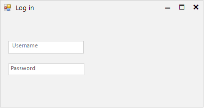

## Environment
 
|Product Version|Product|Author|
|----|----|----|
|2020.1.113|RadLabel for WinForms|[Nadya Karaivanova](https://www.telerik.com/blogs/author/nadya-karaivanova)|
 
## Description

A common practice is to display a text box control with a placeholder text that floats above the top of the input field (out of the input field) with an animation when the user starts typing. This is knows as floating label. The label floats in order to make free space for the user to enter some text. 

This tutorial demonstrates how you can create such a floating label in **RadTextBox** control.
 


## Solution 

You can create a floating label by by using **RadLabel** and [animations]() that **Telerik Presentation Framework** provides. We will animate the **Margin** property by using the **AnimatedPropertySetting** class. The **TextChanging** event will fire every time when a text is changing.

A full code snippet is illustrated below:
 

````C#
  public RadForm1()
        {
            InitializeComponent();
            this.radLabel1.AutoSize = false;
            this.radLabel1.Size = new Size(100, 15);
            this.radLabel1.Location = new Point(this.radTextBoxControl1.Location.X + 5, this.radTextBoxControl1.Location.Y + 2);
            this.radLabel1.Text = "Username";
            this.radLabel1.BackColor = Color.White;
            this.radLabel1.ForeColor = Color.Gray;
            this.radLabel1.BringToFront();

            this.radTextBoxControl1.TextChanging += this.RadTextBoxControl1_TextChanging;
        }

        private void RadTextBoxControl1_TextChanging(object sender, TextChangingEventArgs e)
        {
            if (this.radTextBoxControl1.Text == "" && e.NewValue.Length == 1)
            {
                this.radLabel1.Size = new Size(this.radLabel1.Size.Width, this.radLabel1.Size.Height + 1);
                this.radLabel1.Top -= 20;
                this.radLabel1.BackColor = Color.Transparent;
                this.radLabel1.ForeColor = Color.Black;
                AnimatedPropertySetting setting = new AnimatedPropertySetting();
                setting.Property = RadElement.MarginProperty;
                setting.StartValue = new Padding(0);
                setting.EndValue = new Padding(0, -9, 0, 0);
                setting.Interval = 30;
                setting.NumFrames = 20;
                setting.ApplyValue(this.radLabel1.LabelElement);
            }
            else if (this.radTextBoxControl1.Text.Length == 1 && e.OldValue.Length == 1)
            {
                this.radLabel1.Size = new Size(100, 15);
                this.radLabel1.ForeColor = Color.Gray;
                AnimatedPropertySetting setting = new AnimatedPropertySetting();
                setting.Property = RadElement.MarginProperty;
                setting.StartValue = new Padding(0);
                setting.EndValue = new Padding(0, 0, 0, 0);
                setting.Interval = 30;
                setting.NumFrames = 20;
                setting.ApplyValue(this.radLabel1.LabelElement);
                this.radLabel1.Top += 20;
                this.radLabel1.BackColor = Color.White;
            }
        }
    }
   
````
````VB.NET
Public Class RadForm1
    Public Sub New()
        InitializeComponent()
        Me.RadLabel1.AutoSize = False
        Me.RadLabel1.Size = New Size(100, 15)
        Me.RadLabel1.Location = New Point(Me.RadTextBoxControl1.Location.X + 5, Me.RadTextBoxControl1.Location.Y + 2)
        Me.RadLabel1.Text = "Username"
        Me.RadLabel1.BackColor = Color.White
        Me.RadLabel1.ForeColor = Color.Gray
        Me.RadLabel1.BringToFront()
        AddHandler RadTextBoxControl1.TextChanging, AddressOf Me.RadTextBoxControl1_TextChanging
    End Sub

    Private Sub RadTextBoxControl1_TextChanging(sender As Object, e As TextChangingEventArgs)
        If Me.RadTextBoxControl1.Text = "" AndAlso e.NewValue.Length = 1 Then
            Me.RadLabel1.Size = New Size(Me.RadLabel1.Size.Width, Me.RadLabel1.Size.Height + 1)
            Me.RadLabel1.Top -= 20
            Me.RadLabel1.BackColor = Color.Transparent
            Me.RadLabel1.ForeColor = Color.Black
            Dim setting As AnimatedPropertySetting = New AnimatedPropertySetting()
            setting.[Property] = RadElement.MarginProperty
            setting.StartValue = New Padding(0)
            setting.EndValue = New Padding(0, -9, 0, 0)
            setting.Interval = 30
            setting.NumFrames = 20
            setting.ApplyValue(Me.RadLabel1.LabelElement)
        ElseIf Me.RadTextBoxControl1.Text.Length = 1 AndAlso e.OldValue.Length = 1 Then
            Me.RadLabel1.Size = New Size(100, 15)
            Me.RadLabel1.ForeColor = Color.Gray
            Dim setting As AnimatedPropertySetting = New AnimatedPropertySetting()
            setting.[Property] = RadElement.MarginProperty
            setting.StartValue = New Padding(0)
            setting.EndValue = New Padding(0, 0, 0, 0)
            setting.Interval = 30
            setting.NumFrames = 20
            setting.ApplyValue(Me.RadLabel1.LabelElement)
            Me.RadLabel1.Top += 20
            Me.RadLabel1.BackColor = Color.White
        End If
    End Sub
End Class

````

