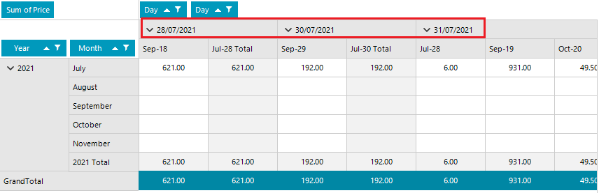

## Environment
|Product Version|Product|Author|
|----|----|----|
|2021.2.511|RadPivotGrid|[Desislava Yordanova](https://www.telerik.com/blogs/author/desislava-yordanova)|

## Description

Learn how to format specific DateTime fields without affecting other fields with the same type.



## Solution
Let's consider that we have the following custom class:

````C#
        public class Item
        {
            public DateTime ShipDate { get; set; }

            public DateTime OrderDate { get; set; }

            public decimal Price { get; set; }

            public Guid Id { get; set; }

            public string Name { get; set; }
             
            public Item(DateTime shipDate, DateTime orderDate, decimal price, Guid id, string name)
            {
                this.ShipDate = shipDate;
                this.OrderDate = orderDate;
                this.Price = price;
                this.Id = id;
                this.Name = name;
            }
        }

````
````VB.NET

    Public Class Item
        Public Property ShipDate As DateTime
        Public Property OrderDate As DateTime
        Public Property Price As Decimal
        Public Property Id As Guid
        Public Property Name As String

        Public Sub New(ByVal shipDate As DateTime, ByVal orderDate As DateTime, ByVal price As Decimal, ByVal id As Guid, ByVal name As String)
            Me.ShipDate = shipDate
            Me.OrderDate = orderDate
            Me.Price = price
            Me.Id = id
            Me.Name = name
        End Sub
    End Class

````

The goal is to apply custom format ("dd/MM/yyyy") only for the "OrderDate" without affecting the way "ShipDate" is displayed. For this purpose, it would be necessary to handle the **GroupElementFormatting** event before populating the pivot with data. The challenging part here is to get the field from the **PivotGroupElementEventArgs**. A possible solution is to get the **GroupDescription** from **DataGroup** Level. Then, you can use the **PropertyName** to format the cell:


````C#
        LocalDataSourceProvider dataProvider = new LocalDataSourceProvider();

        public RadForm1()
        {
            InitializeComponent();

            Random rand = new Random();
            List<Item> items = new List<Item>();
            for (int i = 0; i < 100; i++)
            {
                items.Add(new Item(DateTime.Now.AddDays(rand.Next(1, 100)),DateTime.Now.AddDays(rand.Next(1, 100)), i * 0.25m * rand.Next(1, 50),Guid.NewGuid(),"Item" + i));
            }

            radPivotGrid1.GroupElementFormatting += RadPivotGrid1_GroupElementFormatting;
            
            dataProvider.ItemsSource = items;
            this.radPivotGrid1.DataProvider = dataProvider;

            dataProvider.BeginInit();
            dataProvider.RowGroupDescriptions.Add(new DateTimeGroupDescription() { PropertyName = "OrderDate", Step = DateTimeStep.Year, GroupComparer = new GroupNameComparer() });
            dataProvider.RowGroupDescriptions.Add(new DateTimeGroupDescription() { PropertyName = "OrderDate", Step = DateTimeStep.Month, GroupComparer = new GroupNameComparer() });
            dataProvider.ColumnGroupDescriptions.Add(new DateTimeGroupDescription() { PropertyName = "OrderDate", Step = DateTimeStep.Day });
            dataProvider.ColumnGroupDescriptions.Add(new DateTimeGroupDescription() { PropertyName = "ShipDate", Step = DateTimeStep.Day });
            dataProvider.AggregateDescriptions.Add(new PropertyAggregateDescription() { PropertyName = "Price", AggregateFunction = AggregateFunctions.Sum }); 
            dataProvider.EndInit();
        }

        private void RadPivotGrid1_GroupElementFormatting(object sender, PivotGroupElementEventArgs e)
        {
            if (e.GroupElement.Data.Group.Type == GroupType.GrandTotal ||
                e.GroupElement.Data.Group.Type == GroupType.Subtotal)
            {
                // Exclude the Grand and Sub totals
                return;
            }
            int level = e.GroupElement.Data.Group.Level;
            int aggregatesCount = dataProvider.AggregateDescriptions.Count;
            int descriptionCount = e.GroupElement.Data.Axis == PivotAxis.Rows ? dataProvider.RowGroupDescriptions.Count :
                                   dataProvider.ColumnGroupDescriptions.Count;

            if (e.GroupElement.Data.Axis == e.GroupElement.Data.Owner.AggregatesPosition)
            {
                int aggregatesLevel = e.GroupElement.Data.Owner.AggregatesLevel;
                if (level == aggregatesLevel ||
                    (aggregatesLevel == -1 && aggregatesCount > 0 && level == descriptionCount))
                {
                    return;
                }
                else if (e.GroupElement.Data.Owner.AggregatesLevel > -1 &&
                         level > e.GroupElement.Data.Owner.AggregatesLevel)
                {
                    level--;
                }
            }

            if (level < descriptionCount)
            {
                var groupDescription = e.GroupElement.Data.Axis == PivotAxis.Rows ? dataProvider.RowGroupDescriptions[level] :
                                       dataProvider.ColumnGroupDescriptions[level];

                if (groupDescription.PropertyName == "OrderDate")
                {
                    DateTime dt;
                    if (DateTime.TryParse(e.GroupElement.Text, out dt))
                    {
                        e.GroupElement.Text = dt.ToString("dd/MM/yyyy");
                    }
                }
                // Depending on the PropertyName format the e.GroupElement.Text
            }
        }


````
````VB.NET
    Private dataProvider As LocalDataSourceProvider = New LocalDataSourceProvider()

    Public Sub New()
        InitializeComponent()
        Dim rand As Random = New Random()
        Dim items As List(Of Item) = New List(Of Item)()

        For i As Integer = 0 To 100 - 1
            items.Add(New Item(DateTime.Now.AddDays(rand.[Next](1, 100)), DateTime.Now.AddDays(rand.[Next](1, 100)), _
                               i * 0.25D * rand.[Next](1, 50), Guid.NewGuid(), "Item" & i))
        Next

        AddHandler RadPivotGrid1.GroupElementFormatting, AddressOf RadPivotGrid1_GroupElementFormatting
        dataProvider.ItemsSource = items
        Me.RadPivotGrid1.DataProvider = dataProvider
        dataProvider.BeginInit()
        dataProvider.RowGroupDescriptions.Add(New DateTimeGroupDescription() With {
            .PropertyName = "OrderDate",
            .[Step] = DateTimeStep.Year,
            .GroupComparer = New GroupNameComparer()
        })
        dataProvider.RowGroupDescriptions.Add(New DateTimeGroupDescription() With {
            .PropertyName = "OrderDate",
            .[Step] = DateTimeStep.Month,
            .GroupComparer = New GroupNameComparer()
        })
        dataProvider.ColumnGroupDescriptions.Add(New DateTimeGroupDescription() With {
            .PropertyName = "OrderDate",
            .[Step] = DateTimeStep.Day
        })
        dataProvider.ColumnGroupDescriptions.Add(New DateTimeGroupDescription() With {
            .PropertyName = "ShipDate",
            .[Step] = DateTimeStep.Day
        })
        dataProvider.AggregateDescriptions.Add(New PropertyAggregateDescription() With {
            .PropertyName = "Price",
            .AggregateFunction = AggregateFunctions.Sum
        })
        dataProvider.EndInit()
    End Sub

    Private Sub RadPivotGrid1_GroupElementFormatting(ByVal sender As Object, ByVal e As PivotGroupElementEventArgs)
        If e.GroupElement.Data.Group.Type = GroupType.GrandTotal OrElse e.GroupElement.Data.Group.Type = GroupType.Subtotal Then
            Return
        End If

        Dim level As Integer = e.GroupElement.Data.Group.Level
        Dim aggregatesCount As Integer = dataProvider.AggregateDescriptions.Count
        Dim descriptionCount As Integer = If(e.GroupElement.Data.Axis = PivotAxis.Rows, dataProvider.RowGroupDescriptions.Count, _
                                             dataProvider.ColumnGroupDescriptions.Count)

        If e.GroupElement.Data.Axis = e.GroupElement.Data.Owner.AggregatesPosition Then
            Dim aggregatesLevel As Integer = e.GroupElement.Data.Owner.AggregatesLevel

            If level = aggregatesLevel OrElse (aggregatesLevel = -1 AndAlso aggregatesCount > 0 AndAlso level = descriptionCount) Then
                Return
            ElseIf e.GroupElement.Data.Owner.AggregatesLevel > -1 AndAlso level > e.GroupElement.Data.Owner.AggregatesLevel Then
                level -= 1
            End If
        End If

        If level < descriptionCount Then
            Dim groupDescription = If(e.GroupElement.Data.Axis = PivotAxis.Rows, dataProvider.RowGroupDescriptions(level), _
                                      dataProvider.ColumnGroupDescriptions(level))

            If groupDescription.PropertyName = "OrderDate" Then
                Dim dt As DateTime

                If DateTime.TryParse(e.GroupElement.Text, dt) Then
                    e.GroupElement.Text = dt.ToString("dd/MM/yyyy")
                End If
            End If
        End If
    End Sub


````


 


