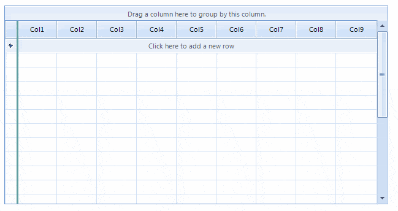

|Date Posted|Product|Author|
|----|----|----|
|March 17, 2016|RadGridView for WinForms|[Desislava Yordanova](https://www.telerik.com/blogs/author/desislava-yordanova)| 

## Problem

Columns in **RadGridView** can be pinned which will result in anchored columns to the left or right side of the grid. This article demonstrates a sample approach how to achieve left freeze pane.  

 

## Solution

Extend the **GridTableElement** and add a **LightVisualElement** which will be used as a splitter element. It is necessary to arrange the splitter considering the pinned columns container’s width. While moving the splitter, you should adjust its PositionOffset in order to position it correctly. When the mouse is released, all columns on the left side of the splitter should be pinned. The rest of them should be unpinned. Last, replace the default **GridTableElement** by using a derivative of the **TableViewDefinition**. You can find below a complete code snippet:

````C#
public Form1()
{
    InitializeComponent();
    this.radGridView1.ViewDefinition = new MyTableViewDefinition();
    for (int i = 1; i < 10; i++)
    {
        this.radGridView1.Columns.Add("Col" + i);
    }
    this.radGridView1.AutoSizeColumnsMode = Telerik.WinControls.UI.GridViewAutoSizeColumnsMode.Fill;
    for (int i = 0; i < 20; i++)
    {
        GridViewRowInfo row = this.radGridView1.Rows.NewRow();
        this.radGridView1.Rows.Add(row);
    }
}
public class MyGridTableElement : GridTableElement
{
    private int splitterWidth = 3;
    private MySplitter freezePaneSplitter;
    protected override void CreateChildElements()
    {
        base.CreateChildElements();
        this.freezePaneSplitter = new MySplitter(this);
        this.freezePaneSplitter.DrawFill = true;
        this.freezePaneSplitter.BackColor = Color.CadetBlue;
        this.freezePaneSplitter.GradientStyle = Telerik.WinControls.GradientStyles.Solid;
        this.Children.Add(this.freezePaneSplitter);
    }
    public override void Initialize(RadGridViewElement gridRootElement, GridViewInfo viewInfo)
    {
        base.Initialize(gridRootElement, viewInfo);
        this.freezePaneSplitter.Visibility = Telerik.WinControls.ElementVisibility.Visible;
    }
    protected override Type ThemeEffectiveType
    {
        get
        {
            return typeof(GridTableElement);
        }
    }
    protected override SizeF MeasureCore(SizeF availableSize)
    {
        SizeF size = base.MeasureCore(availableSize);
        this.freezePaneSplitter.Measure(new SizeF(this.splitterWidth, size.Height));
        return size;
    }
    protected override SizeF ArrangeOverride(SizeF finalSize)
    {
        SizeF size = base.ArrangeOverride(finalSize);
        RectangleF clientRect = this.GetClientRectangle(finalSize);
        PinnedColumnTraverser traverser = new PinnedColumnTraverser(this.ViewElement.RowLayout.RenderColumns, PinnedColumnPosition.Left);
        SizeF leftPinnedColumns = this.ViewElement.RowLayout.MeasurePinnedColumns(traverser);
        this.freezePaneSplitter.Arrange(new RectangleF(leftPinnedColumns.Width - this.splitterWidth / 2,
            clientRect.Y, this.splitterWidth, clientRect.Height));
        return size;
    }
}
public class MyTableViewDefinition : TableViewDefinition
{
    public override IRowView CreateViewUIElement(GridViewInfo viewInfo)
    {
        return new MyGridTableElement();
    }
}
public class MySplitter : LightVisualElement
{
    private bool moving = false;
    private Point mouseDownLocation;
    private GridTableElement owner;
    public MySplitter(GridTableElement owner)
    {
        this.owner = owner;
    }
    protected override void OnMouseDown(MouseEventArgs e)
    {
        base.OnMouseDown(e);
        this.Capture = true;
        this.moving = true;
        this.mouseDownLocation = e.Location;
    }
    protected override void OnMouseMove(MouseEventArgs e)
    {
        base.OnMouseMove(e);
        if (!this.moving)
        {
            return;
        }
        this.PositionOffset = new SizeF(e.X - this.mouseDownLocation.X, 0);
    }
    protected override void OnMouseUp(MouseEventArgs e)
    {
        base.OnMouseUp(e);
        this.Capture = false;
        this.moving = false;
        GridTableHeaderRowElement headerRowElement = this.owner.GetRowElement(this.owner.ViewInfo.TableHeaderRow) as GridTableHeaderRowElement;
        if (headerRowElement != null)
        {
            Point point = new Point(e.X, headerRowElement.ControlBoundingRectangle.Y + headerRowElement.ControlBoundingRectangle.Height / 2);
            GridHeaderCellElement cellElement = this.ElementTree.GetElementAtPoint<GridHeaderCellElement>(point);
            if (cellElement != null)
            {
                int half = 0;
                if (e.X > cellElement.ControlBoundingRectangle.X + cellElement.ControlBoundingRectangle.Width / 2)
                {
                    half++;
                }
                while (this.owner.ViewTemplate.PinnedColumns.Count > 0)
                {
                    this.owner.ViewTemplate.PinnedColumns[0].IsPinned = false;
                }
                for (int i = 0; i < cellElement.ColumnIndex + half; i++)
                {
                    this.owner.ViewTemplate.Columns[i].IsPinned = true;
                }
            }
            else
            {
                if (e.X < this.owner.RowHeaderColumnWidth)
                {
                    while (this.owner.ViewTemplate.PinnedColumns.Count > 0)
                    {
                        this.owner.ViewTemplate.PinnedColumns[0].IsPinned = false;
                    }
                }
                else if (e.X > this.owner.ControlBoundingRectangle.Right - this.owner.VScrollBar.Size.Width)
                {
                    foreach (GridViewColumn col in this.owner.ViewTemplate.Columns)
                    {
                        col.IsPinned = true;
                    }
                }
            }
        }
        this.PositionOffset = SizeF.Empty;
        this.owner.InvalidateMeasure();
        this.owner.UpdateLayout();
    }
}

````
````VB.NET
Public Sub New()
    InitializeComponent()
    Me.RadGridView1.ViewDefinition = New MyTableViewDefinition()
    For i As Integer = 1 To 9
        Me.RadGridView1.Columns.Add("Col"& i)
    Next
    Me.RadGridView1.AutoSizeColumnsMode = Telerik.WinControls.UI.GridViewAutoSizeColumnsMode.Fill
    For i As Integer = 0 To 19
        Dim row As GridViewRowInfo = Me.RadGridView1.Rows.NewRow()
        Me.RadGridView1.Rows.Add(row)
    Next
End Sub
Public Class MyGridTableElement
Inherits GridTableElement
    Private splitterWidth As Integer = 3
    Private freezePaneSplitter As MySplitter
    Protected Overrides Sub CreateChildElements()
        MyBase.CreateChildElements()
        Me.freezePaneSplitter = New MySplitter(Me)
        Me.freezePaneSplitter.DrawFill = True
        Me.freezePaneSplitter.BackColor = Color.CadetBlue
        Me.freezePaneSplitter.GradientStyle = Telerik.WinControls.GradientStyles.Solid
        Me.Children.Add(Me.freezePaneSplitter)
    End Sub
    Public Overrides Sub Initialize(gridRootElement As RadGridViewElement, viewInfo As GridViewInfo)
        MyBase.Initialize(gridRootElement, viewInfo)
        Me.freezePaneSplitter.Visibility = Telerik.WinControls.ElementVisibility.Visible
    End Sub
    Protected Overrides ReadOnly Property ThemeEffectiveType() As Type
        Get
            Return GetType(GridTableElement)
        End Get
    End Property
    Protected Overrides Function MeasureCore(availableSize As SizeF) As SizeF
        Dim size As SizeF = MyBase.MeasureCore(availableSize)
        Me.freezePaneSplitter.Measure(New SizeF(Me.splitterWidth, size.Height))
        Return size
    End Function
    Protected Overrides Function ArrangeOverride(finalSize As SizeF) As SizeF
        Dim size As SizeF = MyBase.ArrangeOverride(finalSize)
        Dim clientRect As RectangleF = Me.GetClientRectangle(finalSize)
        Dim traverser As New PinnedColumnTraverser(Me.ViewElement.RowLayout.RenderColumns, PinnedColumnPosition.Left)
        Dim leftPinnedColumns As SizeF = Me.ViewElement.RowLayout.MeasurePinnedColumns(traverser)
        Me.freezePaneSplitter.Arrange(New RectangleF(leftPinnedColumns.Width - Me.splitterWidth / 2, clientRect.Y, Me.splitterWidth, clientRect.Height))
        Return size
    End Function
End Class
Public Class MyTableViewDefinition
Inherits TableViewDefinition
    Public Overrides Function CreateViewUIElement(viewInfo As GridViewInfo) As IRowView
        Return New MyGridTableElement()
    End Function
End Class
Public Class MySplitter
Inherits LightVisualElement
    Private moving As Boolean = False
    Private mouseDownLocation As Point
    Private owner As GridTableElement
    Public Sub New(owner As GridTableElement)
        Me.owner = owner
    End Sub
    Protected Overrides Sub OnMouseDown(e As MouseEventArgs)
        MyBase.OnMouseDown(e)
        Me.Capture = True
        Me.moving = True
        Me.mouseDownLocation = e.Location
    End Sub
    Protected Overrides Sub OnMouseMove(e As MouseEventArgs)
        MyBase.OnMouseMove(e)
        If Not Me.moving Then
            Return
        End If
        Me.PositionOffset = New SizeF(e.X - Me.mouseDownLocation.X, 0)
    End Sub
    Protected Overrides Sub OnMouseUp(e As MouseEventArgs)
        MyBase.OnMouseUp(e)
        Me.Capture = False
        Me.moving = False
        Dim headerRowElement As GridTableHeaderRowElement = TryCast(Me.owner.GetRowElement(Me.owner.ViewInfo.TableHeaderRow), GridTableHeaderRowElement)
        If headerRowElement IsNot Nothing Then
            Dim point As New Point(e.X, headerRowElement.ControlBoundingRectangle.Y + headerRowElement.ControlBoundingRectangle.Height / 2)
            Dim cellElement As GridHeaderCellElement = Me.ElementTree.GetElementAtPoint(Of GridHeaderCellElement)(point)
            If cellElement IsNot Nothing Then
                Dim half As Integer = 0
                If e.X > cellElement.ControlBoundingRectangle.X + cellElement.ControlBoundingRectangle.Width / 2 Then
                    half += 1
                End If
                While Me.owner.ViewTemplate.PinnedColumns.Count > 0
                    Me.owner.ViewTemplate.PinnedColumns(0).IsPinned = False
                End While
                For i As Integer = 0 To cellElement.ColumnIndex + (half - 1)
                    Me.owner.ViewTemplate.Columns(i).IsPinned = True
                Next
            Else
                If e.X < Me.owner.RowHeaderColumnWidth Then
                    While Me.owner.ViewTemplate.PinnedColumns.Count > 0
                        Me.owner.ViewTemplate.PinnedColumns(0).IsPinned = False
                    End While
                ElseIf e.X > Me.owner.ControlBoundingRectangle.Right - Me.owner.VScrollBar.Size.Width Then
                    For Each col As GridViewColumn In Me.owner.ViewTemplate.Columns
                        col.IsPinned = True
                    Next
                End If
            End If
        End If
        Me.PositionOffset = SizeF.Empty
        Me.owner.InvalidateMeasure()
        Me.owner.UpdateLayout()
    End Sub
End Class

````

>note A complete solution in C# and VB.NET can be found [here](https://github.com/telerik/winforms-sdk/tree/master/GridView/FreezePane).


