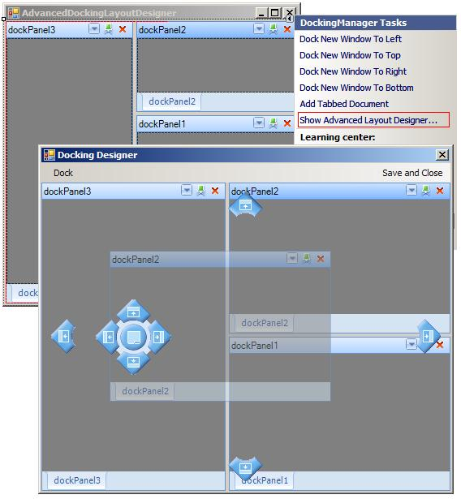

|Product Version|Product|Author|Last modified|
|----|----|----|----|
|Q2 2008|RadDock for WinForms|Angel Kanchev|August 07, 2008| 

 
**HOW-TO**       
How to have full control over the layout of the docking manager in design-time.  
 
**SOLUTION**

Select the **DockingManager** and from its **ActionList** choose "Show Advanced Layout Designer...".  
It opens a Fully functional docking, which works the same way as in run-time:  

   
   
The form that opens not simply allows to layout the same way as runtime but through its menu "Dock" gives the ability to add/remove **Documents** as well as **DockPanels**.

