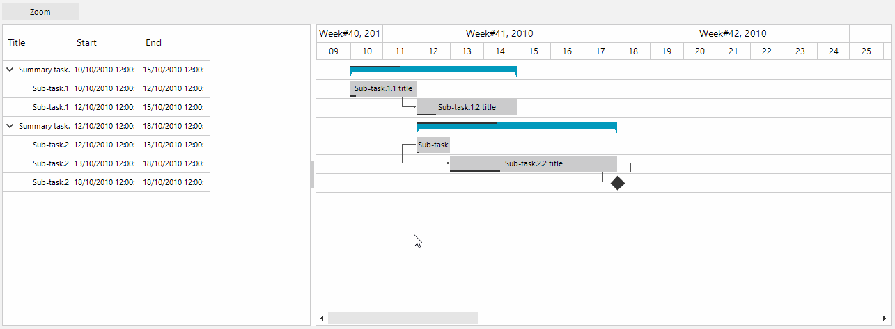

## Environment
<table>
	<tr>
		<td>Product Version</td>
		<td>2018.1 220</td>
	</tr>
	<tr>
		<td>Product</td>
		<td>RadGanttView for WinForms</td>
	</tr>
</table>


## Description

The RadGanttView.GanttViewElement.**GraphicalViewElement** exposes the **OnePixelTime** property. This property determines how much time a single pixel represents. This property can be also manipulated so that the view is zoomed to a particular date range. The example below will zoom the view-port to fit the first and last tasks.

## Solution

The gif file below demonstrates the end result.

>caption Figure 1: Zooming to a Specified Date Range


The desired behavior can be achieved by calculating the total seconds between the two dates and by dividing the result to the actual width of the of the graphical view. This way we will know how much time a single pixel will represent so that the segment between the the two dates can fit the screen.

>note Depending on the actual local setup it may also be necessary to change the [TimelineRange]() 

#### OnePixelTime Calculation

````C#
private void radButton1_Click(object sender, EventArgs e)
{
    // You can consider changing the time line range if necessary
    //this.radGanttView1.GanttViewElement.GraphicalViewElement.TimelineRange = TimeRange.YearQuarters;

    DateTime start = this.radGanttView1.Items[0].Start;
    DateTime end = this.radGanttView1.Items[this.radGanttView1.Items.Count - 1].End;
    int totalPixels = this.radGanttView1.GanttViewElement.GraphicalViewElement.BoundingRectangle.Width;
    double span = (end - start).TotalSeconds;
    this.radGanttView1.GanttViewElement.GraphicalViewElement.OnePixelTime = TimeSpan.FromSeconds((int)(span / totalPixels));

    // The code beloow will scroll the timeline so that it starts on the selected start date.
    int scroll = (int)((start - this.radGanttView1.GanttViewElement.GraphicalViewElement.TimelineBehavior.AdjustedTimelineStart).TotalSeconds / this.radGanttView1.GanttViewElement.GraphicalViewElement.OnePixelTime.TotalSeconds);
    this.radGanttView1.GanttViewElement.GraphicalViewElement.HorizontalScrollBarElement.Value = scroll;

}

````
````VB.NET
Private Sub radButton1_Click(ByVal sender As Object, ByVal e As EventArgs)
    Dim start As DateTime = Me.radGanttView1.Items(0).Start
    Dim [end] As DateTime = Me.radGanttView1.Items(Me.radGanttView1.Items.Count - 1).[End]
    Dim totalPixels As Integer = Me.radGanttView1.GanttViewElement.GraphicalViewElement.BoundingRectangle.Width
    Dim span As Double = ([end] - start).TotalSeconds
    Me.radGanttView1.GanttViewElement.GraphicalViewElement.OnePixelTime = TimeSpan.FromSeconds(CInt((span / totalPixels)))
    Dim scroll As Integer = CInt(((start - Me.radGanttView1.GanttViewElement.GraphicalViewElement.TimelineBehavior.AdjustedTimelineStart).TotalSeconds / Me.radGanttView1.GanttViewElement.GraphicalViewElement.OnePixelTime.TotalSeconds))
    Me.radGanttView1.GanttViewElement.GraphicalViewElement.HorizontalScrollBarElement.Value = scroll
End Sub

````

# See Also

* [Timeline Views]()