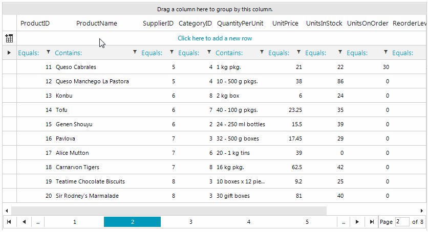

## Environment
 
|Product Version|Product|Author|
|----|----|----|
|2019.1.117|RadGridView for WinForms|[Desislava Yordanova](https://www.telerik.com/blogs/author/desislava-yordanova)|
 

## Description

**RadGridView** exposes two collections that contain data rows:

* **Rows** - contains all data rows that belong to **RadGridView**. Data operations such as grouping, sorting, filtering, etc. do not change the content of the collection or the order in which the row objects exist in the collection.

* **ChildRows** - returns the data rows that are currently represented by **RadGridView** in the order in which they appear. The collection is modified every time a data operation (grouping, sorting, filtering) occurs. 

Similar to filtering, sorting and grouping, the **ChildRows** collection is affected by the paging as well and it contains only the records on the current page. A common scenario is to access the whole filtered collection when the paging is enabled in the order the items appear in the grid.
 


## Solution 
 
The RadGridView.MasterTemplate.DataView.**Indexer** offers the **Items** collection which contains all the rows in the order in which they appear in the grid. The collection is affected every time a data operation like grouping, sorting, filtering occurs. 

>note It is necessary to cast the MasterTemplate.**DataView** to **GridDataView** in order to access the **Items** collection. 


#### Get data

````C#
        
            GridDataView dataView = this.radGridView1.MasterTemplate.DataView as GridDataView;
            foreach (GridViewRowInfo row in dataView.Indexer.Items)
            {
                Console.WriteLine(row.Cells[0].Value.ToString());
            }
       
````
````VB.NET
            Dim dataView As Telerik.WinControls.UI.GridDataView = TryCast(Me.RadGridView1.MasterTemplate.DataView, GridDataView)
        For Each row As GridViewRowInfo In dataView.Indexer.Items
            Console.WriteLine(row.Cells(0).Value.ToString())
        Next
      

````

# See Also
* [Filtering]()
* [Paging]()
 

 