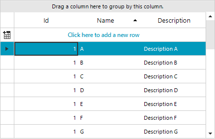

## Environment
|Product Version|Product|Author|
|----|----|----|
|2021.1.223|RadGridView for WinForms|[Desislava Yordanova](https://www.telerik.com/blogs/author/desislava-yordanova)|

## Description

A common case is editing a cell's value while the column is sorted. As a result, the cells jumps to a new position and it may be placed outside the current view. 

This behavior is expected and normal according to the internal sorting mechanism that RadGridView offers. 

## Explanation

When sorting is applied and the user modifies a certain cell value from the sorted column, this automatically will position the edited row according to the sorted criterion. Hence, this will lead to positioning the row at its correct place.

Please have in mind that adding a **SortDescriptor** to **RadGridView** doesn't perform a one time sorting operation. While the **SortDescriptor** is present in the grid, it is responsible to keep the rows sorted according to the sorting condition. Even newly added rows will be placed at the respective position considering the applied sort order.

The possible solution for ordering the rows to any certain logic that is different than the default behavior described above is to use the [custom sorting]() functionality that **RadGridView** offers. Thus, you can implement any rows ordering that fits your needs. A sample approach is demonstrated in the following help article: [Custom Sorting]().

>note Please refer to our Demo application >> GridView >> Sorting >> Custom Sorting example which is quite useful on this topic as well.

# See Also

* [Basic Sorting]()  

