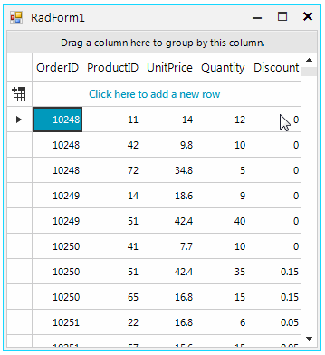

## Environment
 
|Product Version|Product|Author|
|----|----|----|
|2019.1.219|RadGridView for WinForms|[Desislava Yordanova](https://www.telerik.com/blogs/author/desislava-yordanova)|
 

## Description

This article demonstrates how to achieve column selection in **RadGridView**. For this purpose, it is necessary to keep the `Shift` key pressed and click the column's header. As a result all cells, belonging to this column, will be selected.
 


## Solution 

Create a derivative of the **BaseGridBehavior** class. Override its **OnMouseDown** method where, if the `Shift` key is pressed and the header cell element is clicked, you should iterate all rows and select programmatically the cells belonging to the clicked column.

>note When selecting multiple cells in RadGridView note that the selection should be wrapped in a MasterTemplate.SelectedCells.**BeginUpdate** - MasterTemplate.SelectedCells.**EndUpdate** block. Thus, the refresh operation will be done only once at the end of the operation but not with each selected cell. 

#### Column selection

````C#

        public RadForm1()
        {
            InitializeComponent();
            radGridView1.MultiSelect = true;
            radGridView1.SelectionMode = GridViewSelectionMode.CellSelect;
            this.radGridView1.GridViewElement.GridBehavior = new CustomGridBehavior();
        }

        private class CustomGridBehavior : Telerik.WinControls.UI.BaseGridBehavior
        {
            private bool isShiftPressed = false;

            public bool IsShiftPressed
            {
                get
                {
                    return isShiftPressed;
                }
                set
                {
                    isShiftPressed = value;
                }
            }

            private SortDescriptorCollection currentSortDescriptors;

            public override bool ProcessKeyDown(KeyEventArgs keys)
            {
                isShiftPressed = (keys.Modifiers & Keys.Shift) == keys.Modifiers;

                return base.ProcessKeyDown(keys);
            }

            public override bool ProcessKeyUp(KeyEventArgs keys)
            {
                if (isShiftPressed)
                {
                    isShiftPressed = false;
                }

                return base.ProcessKeyUp(keys);
            }

            public override bool OnMouseDown(MouseEventArgs e)
            {
                var cellHeaderElement = this.GridControl.ElementTree.GetElementAtPoint(e.Location) as GridHeaderCellElement;

                if (cellHeaderElement != null && isShiftPressed)
                {
                    this.GridControl.ClearSelection();
                    this.GridControl.MasterTemplate.SelectedCells.BeginUpdate();
                    foreach (var row in this.GridControl.Rows)
                    {
                        row.Cells[cellHeaderElement.ColumnIndex].IsSelected = true;
                    }
                    this.GridControl.MasterTemplate.SelectedCells.EndUpdate(true);

                    return true;
                }
                else
                    return base.OnMouseDown(e);
            }
        }
       
````
````VB.NET

    Public Sub New()
        InitializeComponent()
        RadGridView1.MultiSelect = True
        RadGridView1.SelectionMode = GridViewSelectionMode.CellSelect
        Me.RadGridView1.GridViewElement.GridBehavior = New CustomGridBehavior()
    End Sub

    Private Class CustomGridBehavior
    Inherits Telerik.WinControls.UI.BaseGridBehavior

        Private _isShiftPressed As Boolean = False

        Public Property IsShiftPressed As Boolean
            Get
                Return _isShiftPressed
            End Get
            Set(ByVal value As Boolean)
                _isShiftPressed = value
            End Set
        End Property

        Private currentSortDescriptors As SortDescriptorCollection

        Public Overrides Function ProcessKeyDown(ByVal keys As KeyEventArgs) As Boolean
            IsShiftPressed = (keys.Modifiers And keys.Shift) = keys.Modifiers
            Return MyBase.ProcessKeyDown(keys)
        End Function

        Public Overrides Function ProcessKeyUp(ByVal keys As KeyEventArgs) As Boolean
            If IsShiftPressed Then
                IsShiftPressed = False
            End If
            
            Return MyBase.ProcessKeyUp(keys)
        End Function

        Public Overrides Function OnMouseDown(ByVal e As MouseEventArgs) As Boolean
            Dim cellHeaderElement = TryCast(Me.GridControl.ElementTree.GetElementAtPoint(e.Location), GridHeaderCellElement)

            If cellHeaderElement IsNot Nothing AndAlso isShiftPressed Then
                Me.GridControl.ClearSelection()
                Me.GridControl.MasterTemplate.SelectedCells.BeginUpdate()

                For Each row In Me.GridControl.Rows
                    row.Cells(cellHeaderElement.ColumnIndex).IsSelected = True
                Next

                Me.GridControl.MasterTemplate.SelectedCells.EndUpdate(True)
                Return True
            Else
                Return MyBase.OnMouseDown(e)
            End If
        End Function
    End Class
    
````

