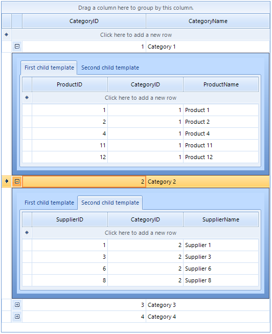

## Environment
 
|Product Version|Product|Author|
|----|----|----|
|2022.2.622|RadGridView for WinForms|[Desislava Yordanova](https://www.telerik.com/blogs/author/desislava-yordanova)|


## Description

This article shows how to setup a hierarchical RadGridView that contains a child level with two tabs:



## Solution

It is necessary to add a **GridViewTemplate** to the MasterTemplate.Templates collection for each child tab. Then, for each child template, define a **GridViewRelation** linking the master and child level via the respective ID property. 
 
````C#  

private void RadForm1_Load(object sender, EventArgs e)
{
    List<Category> categories = new List<Category>()
{
    new Category(1, "Category 1"),
    new Category(2, "Category 2"),
    new Category(3, "Category 3"),
    new Category(4, "Category 4")
};

    radGridView1.DataSource = categories;
    radGridView1.AutoSizeColumnsMode = GridViewAutoSizeColumnsMode.Fill;

    List<Product> products = new List<Product>()
{
    new Product(1, 1, "Product 1"),
    new Product(2, 1, "Product 2"),
    new Product(3, 2, "Product 3"),
    new Product(4, 1, "Product 4"),
    new Product(5, 3, "Product 5"),
    new Product(6, 2, "Product 6"),
    new Product(7, 2, "Product 7"),
    new Product(8, 2, "Product 8"),
    new Product(9, 3, "Product 9"),
    new Product(10, 3, "Product 10"),
    new Product(11, 1, "Product 11"),
    new Product(12, 1, "Product 12")
};

    GridViewTemplate firstChildTemplate = new GridViewTemplate();
    firstChildTemplate.DataSource = products;
    firstChildTemplate.Caption = "First child template";
    firstChildTemplate.AutoSizeColumnsMode = GridViewAutoSizeColumnsMode.Fill;
    radGridView1.MasterTemplate.Templates.Add(firstChildTemplate);

    GridViewRelation relation = new GridViewRelation(radGridView1.MasterTemplate);
    relation.ChildTemplate = firstChildTemplate;

    relation.RelationName = "CategoriesProducts";
    relation.ParentColumnNames.Add("CategoryID");
    relation.ChildColumnNames.Add("CategoryID");
    radGridView1.Relations.Add(relation);

    List<Supplier> suppliers = new List<Supplier>()
{
    new Supplier(1, 2, "Supplier 1"),
    new Supplier(2, 4, "Supplier 2"),
    new Supplier(3, 2, "Supplier 3"),
    new Supplier(4, 1, "Supplier 4"),
    new Supplier(5, 4, "Supplier 5"),
    new Supplier(6, 2, "Supplier 6"),
    new Supplier(7, 4, "Supplier 7"),
    new Supplier(8, 2, "Supplier 8"),
    new Supplier(9, 4, "Supplier 9")
};

    GridViewTemplate secondChildTemplate = new GridViewTemplate();
    secondChildTemplate.DataSource = suppliers;
    secondChildTemplate.Caption = "Second child template";
    secondChildTemplate.AutoSizeColumnsMode = GridViewAutoSizeColumnsMode.Fill;
    radGridView1.MasterTemplate.Templates.Add(secondChildTemplate);

    GridViewRelation relation2 = new GridViewRelation(radGridView1.MasterTemplate);
    relation2.ChildTemplate = secondChildTemplate;
    relation2.RelationName = "SuppliersCategories";
    relation2.ParentColumnNames.Add("CategoryID");
    relation2.ChildColumnNames.Add("CategoryID");
    radGridView1.Relations.Add(relation2);
}

public class Category
{
    public int CategoryID
    {
        get
        {
            return m_CategoryID;
        }
        set
        {
            m_CategoryID = value;
        }
    }
    private int m_CategoryID;

    public string CategoryName
    {
        get
        {
            return m_CategoryName;
        }
        set
        {
            m_CategoryName = value;
        }
    }
    private string m_CategoryName;

    public Category(int categoryID, string categoryName)
    {
        this.CategoryID = categoryID;
        this.CategoryName = categoryName;
    }
}

public class Product
{
    public int ProductID
    {
        get
        {
            return m_ProductID;
        }
        set
        {
            m_ProductID = value;
        }
    }
    private int m_ProductID;

    public int CategoryID
    {
        get
        {
            return m_CategoryID;
        }
        set
        {
            m_CategoryID = value;
        }
    }
    private int m_CategoryID;

    public string ProductName
    {
        get
        {
            return m_ProductName;
        }
        set
        {
            m_ProductName = value;
        }
    }
    private string m_ProductName;

    public Product(int productID, int categoryID, string productName)
    {
        this.ProductID = productID;
        this.CategoryID = categoryID;
        this.ProductName = productName;
    }
}

public class Supplier
{
    public int SupplierID
    {
        get
        {
            return m_SupplierID;
        }
        set
        {
            m_SupplierID = value;
        }
    }
    private int m_SupplierID;

    public int CategoryID
    {
        get
        {
            return m_CategoryID;
        }
        set
        {
            m_CategoryID = value;
        }
    }
    private int m_CategoryID;

    public string SupplierName
    {
        get
        {
            return m_SupplierName;
        }
        set
        {
            m_SupplierName = value;
        }
    }
    private string m_SupplierName;

    public Supplier(int supplierID, int categoryID, string supplierName)
    {
        this.SupplierID = supplierID;
        this.CategoryID = categoryID;
        this.SupplierName = supplierName;
    }
}
         
````
````VB.NET

Private Sub Form1_Load(sender As Object, e As EventArgs) Handles MyBase.Load
    Dim categories As New List(Of Category)() From {
        New Category(1, "Category 1"),
        New Category(2, "Category 2"),
        New Category(3, "Category 3"),
        New Category(4, "Category 4")
    }

    RadGridView1.DataSource = categories
    RadGridView1.AutoSizeColumnsMode = GridViewAutoSizeColumnsMode.Fill

    Dim products As New List(Of Product)() From {
        New Product(1, 1, "Product 1"),
        New Product(2, 1, "Product 2"),
        New Product(3, 2, "Product 3"),
        New Product(4, 1, "Product 4"),
        New Product(5, 3, "Product 5"),
        New Product(6, 2, "Product 6"),
        New Product(7, 2, "Product 7"),
        New Product(8, 2, "Product 8"),
        New Product(9, 3, "Product 9"),
        New Product(10, 3, "Product 10"),
        New Product(11, 1, "Product 11"),
        New Product(12, 1, "Product 12")
    }

    Dim firstChildTemplate As New GridViewTemplate()
    firstChildTemplate.DataSource = products
    firstChildTemplate.Caption = "First child template"
    firstChildTemplate.AutoSizeColumnsMode = GridViewAutoSizeColumnsMode.Fill
    RadGridView1.MasterTemplate.Templates.Add(firstChildTemplate)

    Dim relation As New GridViewRelation(RadGridView1.MasterTemplate)
    relation.ChildTemplate = firstChildTemplate

    relation.RelationName = "CategoriesProducts"
    relation.ParentColumnNames.Add("CategoryID")
    relation.ChildColumnNames.Add("CategoryID")
    RadGridView1.Relations.Add(relation)

    Dim suppliers As New List(Of Supplier)() From {
        New Supplier(1, 2, "Supplier 1"),
        New Supplier(2, 4, "Supplier 2"),
        New Supplier(3, 2, "Supplier 3"),
        New Supplier(4, 1, "Supplier 4"),
        New Supplier(5, 4, "Supplier 5"),
        New Supplier(6, 2, "Supplier 6"),
        New Supplier(7, 4, "Supplier 7"),
        New Supplier(8, 2, "Supplier 8"),
        New Supplier(9, 4, "Supplier 9")
    }

    Dim secondChildTemplate As New GridViewTemplate()
    secondChildTemplate.DataSource = suppliers
    secondChildTemplate.Caption = "Second child template"
    secondChildTemplate.AutoSizeColumnsMode = GridViewAutoSizeColumnsMode.Fill
    RadGridView1.MasterTemplate.Templates.Add(secondChildTemplate)

    Dim relation2 As New GridViewRelation(RadGridView1.MasterTemplate)
    relation2.ChildTemplate = secondChildTemplate
    relation2.RelationName = "SuppliersCategories"
    relation2.ParentColumnNames.Add("CategoryID")
    relation2.ChildColumnNames.Add("CategoryID")
    RadGridView1.Relations.Add(relation2)

End Sub
Public Class Category
    Public Property CategoryID() As Integer
        Get
            Return m_CategoryID
        End Get
        Set(value As Integer)
            m_CategoryID = value
        End Set
    End Property
    Private m_CategoryID As Integer

    Public Property CategoryName() As String
        Get
            Return m_CategoryName
        End Get
        Set(value As String)
            m_CategoryName = value
        End Set
    End Property
    Private m_CategoryName As String

    Public Sub New(categoryID As Integer, categoryName As String)
        Me.CategoryID = categoryID
        Me.CategoryName = categoryName
    End Sub
End Class

Public Class Product
    Public Property ProductID() As Integer
        Get
            Return m_ProductID
        End Get
        Set(value As Integer)
            m_ProductID = value
        End Set
    End Property
    Private m_ProductID As Integer

    Public Property CategoryID() As Integer
        Get
            Return m_CategoryID
        End Get
        Set(value As Integer)
            m_CategoryID = value
        End Set
    End Property
    Private m_CategoryID As Integer

    Public Property ProductName() As String
        Get
            Return m_ProductName
        End Get
        Set(value As String)
            m_ProductName = value
        End Set
    End Property
    Private m_ProductName As String

    Public Sub New(productID As Integer, categoryID As Integer, productName As String)
        Me.ProductID = productID
        Me.CategoryID = categoryID
        Me.ProductName = productName
    End Sub
End Class

Public Class Supplier
    Public Property SupplierID() As Integer
        Get
            Return m_SupplierID
        End Get
        Set(value As Integer)
            m_SupplierID = value
        End Set
    End Property
    Private m_SupplierID As Integer

    Public Property CategoryID() As Integer
        Get
            Return m_CategoryID
        End Get
        Set(value As Integer)
            m_CategoryID = value
        End Set
    End Property
    Private m_CategoryID As Integer

    Public Property SupplierName() As String
        Get
            Return m_SupplierName
        End Get
        Set(value As String)
            m_SupplierName = value
        End Set
    End Property
    Private m_SupplierName As String

    Public Sub New(supplierID As Integer, categoryID As Integer, supplierName As String)
        Me.SupplierID = supplierID
        Me.CategoryID = categoryID
        Me.SupplierName = supplierName
    End Sub
End Class

````


# See Also

* [Binding to Hierarchical Data Programmatically]()
