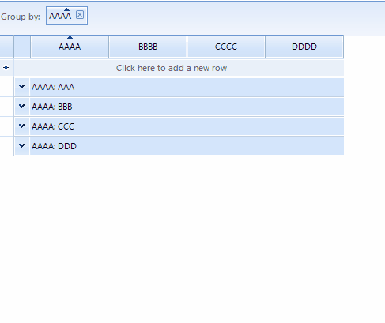

## Environment
|Product Version|Product|Author|
|----|----|----|
|2023.1.314|RadGridView for WinForms|[Dinko Krastev](https://www.telerik.com/blogs/author/dinko-krastev)|


## Description
 
When performing a grouping operation you may need to format specific child cells. For example, when the user clicks on a group cell, you may want to highlight important cell values. 



## Solution

To implement this requirement you will need to create custom __GridGroupRowBehavior__, in which you can indentify which group is clicked.

````C#
public class CustomGridGroupHeaderRowElement : GridGroupRowBehavior
{
    GridViewGroupRowInfo lastclickedGroupRowInfo;

    protected override bool OnMouseDownRight(MouseEventArgs e)
    {
        var clickedElement = this.GridViewElement.ElementTree.GetElementAtPoint(e.Location) as GridGroupContentCellElement;

        if (lastclickedGroupRowInfo != null)
        {
            lastclickedGroupRowInfo.Tag = null;
            lastclickedGroupRowInfo.InvalidateRow();
            foreach (var row in lastclickedGroupRowInfo.ChildRows)
            {
                row.InvalidateRow();
            }
        }

        if (clickedElement != null)
        {
            clickedElement.RowInfo.Tag = "clickedGroup";
            lastclickedGroupRowInfo = clickedElement.RowInfo as GridViewGroupRowInfo;
            clickedElement.RowInfo.InvalidateRow();
            foreach (var row in lastclickedGroupRowInfo.ChildRows)
            {
                row.InvalidateRow();
            }
        }

        return true;
    }
}

````
````VB.NET

Public Class CustomGridGroupHeaderRowElement
    Inherits GridGroupRowBehavior

    Private lastclickedGroupRowInfo As GridViewGroupRowInfo

    Protected Overrides Function OnMouseDownRight(ByVal e As MouseEventArgs) As Boolean
        Dim clickedElement = TryCast(Me.GridViewElement.ElementTree.GetElementAtPoint(e.Location), GridGroupContentCellElement)

        If lastclickedGroupRowInfo IsNot Nothing Then
            lastclickedGroupRowInfo.Tag = Nothing
            lastclickedGroupRowInfo.InvalidateRow()

            For Each row In lastclickedGroupRowInfo.ChildRows
                row.InvalidateRow()
            Next
        End If

        If clickedElement IsNot Nothing Then
            clickedElement.RowInfo.Tag = "clickedGroup"
            lastclickedGroupRowInfo = TryCast(clickedElement.RowInfo, GridViewGroupRowInfo)
            clickedElement.RowInfo.InvalidateRow()

            For Each row In lastclickedGroupRowInfo.ChildRows
                row.InvalidateRow()
            Next
        End If

        Return True
    End Function
End Class


````

Then you can call the __InvalidateRow()__ method for the group row and its child rows to trigger the __ViewCellFormatting__ event. In this event handler, you can customize the last clicked group and its child cells. The following code snippet demonstrates how to populate the grid with sample data and register the custom __GridGroupRowBehavior__.

````C#
public partial class Form1 : Form
{
    public Form1()
    {
        InitializeComponent();
        this.radGridView1.ShowGroupedColumns = true;
        this.radGridView1.DataSource = new List<Item>()
        {
            new Item("AAA", "1111", "0000", "0000"),
            new Item("AAA", "1111", "1111", "1111"),
            new Item("BBB", "1111", "2222", "2222"),
            new Item("BBB", "1111", "3333", "3333"),
            new Item("BBB", "1111", "4444", "4444"),
            new Item("BBB", "2222", "5555", "5555"),
            new Item("CCC", "2222", "6666", "6666"),
            new Item("CCC", "2222", "7777", "7777"),
            new Item("CCC", "2222", "8888", "8888"),
            new Item("DDD","2222", "9999", "9999"),
        };
        //register the custom row  behavior
        BaseGridBehavior gridBehavior = radGridView1.GridBehavior as BaseGridBehavior;
        gridBehavior.UnregisterBehavior(typeof(GridGroupRowBehavior));
        gridBehavior.RegisterBehavior(typeof(GridViewGroupRowInfo), new CustomGridGroupHeaderRowElement());
        this.radGridView1.ViewCellFormatting += RadGridView1_ViewCellFormatting;
    }

    private void RadGridView1_ViewCellFormatting(object sender, CellFormattingEventArgs e)
    {
        if (e.CellElement is GridGroupContentCellElement)
        {
            var cellTag = (e.CellElement as GridGroupContentCellElement).RowInfo.Tag;
            if (cellTag != null)
            {
                ApplyCellStyle(e.CellElement);
            }
            else
            {
                ResetStyles(e.CellElement);
            }
        }

        else if (e.CellElement.RowInfo.Parent is GridViewGroupRowInfo)
        {
            var cellTag = (e.CellElement.RowInfo.Parent as GridViewGroupRowInfo).Tag;
            if (cellTag != null && e.Column.Name == "CCCC")
            {
                ApplyCellStyle(e.CellElement);
            }
            else
            {
                ResetStyles(e.CellElement);
            }
        }
        else
        {
            ResetStyles(e.CellElement);
        }
    }

    private void ApplyCellStyle(GridCellElement cellElement)
    {
        cellElement.BorderColor = Color.Red;
        cellElement.BorderWidth = 2;
        cellElement.BorderBoxStyle = Telerik.WinControls.BorderBoxStyle.SingleBorder;
        cellElement.BorderGradientStyle = Telerik.WinControls.GradientStyles.Solid;
    }

    void ResetStyles(GridCellElement cellElement)
    {
        cellElement.ResetValue(LightVisualElement.BorderColorProperty, Telerik.WinControls.ValueResetFlags.Local);
        cellElement.ResetValue(LightVisualElement.BorderWidthProperty, Telerik.WinControls.ValueResetFlags.Local);
        cellElement.ResetValue(LightVisualElement.BorderBoxStyleProperty, Telerik.WinControls.ValueResetFlags.Local);
        cellElement.ResetValue(LightVisualElement.BorderGradientStyleProperty, Telerik.WinControls.ValueResetFlags.Local);
    }       
}

public class Item
{
    public Item(string aaaa, string bbbb, string cccc, string dddd, bool isPinned = false)
    {
        AAAA = aaaa;
        BBBB = bbbb;
        CCCC = cccc;
        DDDD = dddd;
    }
    public string AAAA { get; set; }
    public string BBBB { get; set; }
    public string CCCC { get; set; }
    public string DDDD { get; set; }
}

````
````VB.NET
Public Partial Class Form1
    Inherits Form

    Public Sub New()
        InitializeComponent()
        Me.radGridView1.ShowGroupedColumns = True
        Me.radGridView1.DataSource = New List(Of Item)() From {
            New Item("AAA", "1111", "0000", "0000"),
            New Item("AAA", "1111", "1111", "1111"),
            New Item("BBB", "1111", "2222", "2222"),
            New Item("BBB", "1111", "3333", "3333"),
            New Item("BBB", "1111", "4444", "4444"),
            New Item("BBB", "2222", "5555", "5555"),
            New Item("CCC", "2222", "6666", "6666"),
            New Item("CCC", "2222", "7777", "7777"),
            New Item("CCC", "2222", "8888", "8888"),
            New Item("DDD", "2222", "9999", "9999")
        }
        Dim gridBehavior As BaseGridBehavior = TryCast(radGridView1.GridBehavior, BaseGridBehavior)
        gridBehavior.UnregisterBehavior(GetType(GridGroupRowBehavior))
        gridBehavior.RegisterBehavior(GetType(GridViewGroupRowInfo), New CustomGridGroupHeaderRowElement())
        AddHandler Me.radGridView1.ViewCellFormatting, AddressOf RadGridView1_ViewCellFormatting
    End Sub

    Private Sub RadGridView1_ViewCellFormatting(ByVal sender As Object, ByVal e As CellFormattingEventArgs)
        If TypeOf e.CellElement Is GridGroupContentCellElement Then
            Dim cellTag = (TryCast(e.CellElement, GridGroupContentCellElement)).RowInfo.Tag

            If cellTag IsNot Nothing Then
                ApplyCellStyle(e.CellElement)
            Else
                ResetStyles(e.CellElement)
            End If
        ElseIf TypeOf e.CellElement.RowInfo.Parent Is GridViewGroupRowInfo Then
            Dim cellTag = (TryCast(e.CellElement.RowInfo.Parent, GridViewGroupRowInfo)).Tag

            If cellTag IsNot Nothing AndAlso e.Column.Name = "CCCC" Then
                ApplyCellStyle(e.CellElement)
            Else
                ResetStyles(e.CellElement)
            End If
        Else
            ResetStyles(e.CellElement)
        End If
    End Sub

    Private Sub ApplyCellStyle(ByVal cellElement As GridCellElement)
        cellElement.BorderColor = Color.Red
        cellElement.BorderWidth = 2
        cellElement.BorderBoxStyle = Telerik.WinControls.BorderBoxStyle.SingleBorder
        cellElement.BorderGradientStyle = Telerik.WinControls.GradientStyles.Solid
    End Sub

    Private Sub ResetStyles(ByVal cellElement As GridCellElement)
        cellElement.ResetValue(LightVisualElement.BorderColorProperty, Telerik.WinControls.ValueResetFlags.Local)
        cellElement.ResetValue(LightVisualElement.BorderWidthProperty, Telerik.WinControls.ValueResetFlags.Local)
        cellElement.ResetValue(LightVisualElement.BorderBoxStyleProperty, Telerik.WinControls.ValueResetFlags.Local)
        cellElement.ResetValue(LightVisualElement.BorderGradientStyleProperty, Telerik.WinControls.ValueResetFlags.Local)
    End Sub
End Class

Public Class Item
    Public Sub New(ByVal aaaa As String, ByVal bbbb As String, ByVal cccc As String, ByVal dddd As String, ByVal Optional isPinned As Boolean = False)
        AAAA = aaaa
        BBBB = bbbb
        CCCC = cccc
        DDDD = dddd
    End Sub

    Public Property AAAA As String
    Public Property BBBB As String
    Public Property CCCC As String
    Public Property DDDD As String
End Class


````


