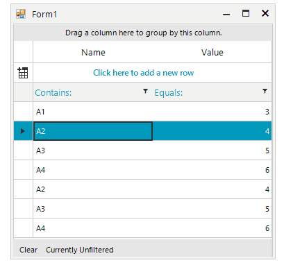

## Environment

|Product Version|Product|Author|
|----|----|----|
|2024.1.312|VirtualGrid for WinForms|[Dinko Krastev](https://www.telerik.com/blogs/author/dinko-krastev)|
 

## Description

The Quick Filter Bar for RadGridView adds a status bar directly to the bottom of the RadGridView which shows the current filter expression and allows all filters to be cleared using a button on the Quick Filter Bar.
 


## Solution 

````C#

public partial class Form1 : Telerik.WinControls.UI.RadForm
{
    private RadButtonElement m_FilterCancelButton;
    private RadLabelElement m_FilterLabel;

    public Form1()
    {
        InitializeComponent();
        this.Load += new EventHandler(Form1_Load);
    }

    void Form1_Load(object sender, EventArgs e)
    {
        this.radGridView1.EnableFiltering = true;
        this.radGridView1.ShowFilteringRow = true;

        this.radGridView1.AutoSizeColumnsMode = GridViewAutoSizeColumnsMode.None;
        this.radGridView1.Columns.Add(new GridViewTextBoxColumn("Name"));
        this.radGridView1.Columns.Add(new GridViewDecimalColumn("Value"));

        GridViewRowInfo rowInfo = this.radGridView1.Rows.AddNew();
        rowInfo.Cells[0].Value = "A1";
        rowInfo.Cells[1].Value = 3;
        rowInfo = this.radGridView1.Rows.AddNew();
        rowInfo.Cells[0].Value = "A2";
        rowInfo.Cells[1].Value = 4;
        rowInfo = this.radGridView1.Rows.AddNew();
        rowInfo.Cells[0].Value = "A3";
        rowInfo.Cells[1].Value = 5;
        rowInfo = this.radGridView1.Rows.AddNew();
        rowInfo.Cells[0].Value = "A4";
        rowInfo.Cells[1].Value = 6;
        rowInfo = this.radGridView1.Rows.AddNew();
        rowInfo.Cells[0].Value = "A2";
        rowInfo.Cells[1].Value = 4;
        rowInfo = this.radGridView1.Rows.AddNew();
        rowInfo.Cells[0].Value = "A3";
        rowInfo.Cells[1].Value = 5;
        rowInfo = this.radGridView1.Rows.AddNew();
        rowInfo.Cells[0].Value = "A4";
        rowInfo.Cells[1].Value = 6;

        RadStatusStrip statusBar = new RadStatusStrip();
        statusBar.StatusBarElement.GripStyle = ToolStripGripStyle.Hidden;

        m_FilterCancelButton = new RadButtonElement();
        m_FilterCancelButton.Text = "Clear";
        m_FilterCancelButton.MouseDown += new MouseEventHandler(m_FilterCancelButton_MouseDown);

        m_FilterLabel = new RadLabelElement();
        m_FilterLabel.Text = " Currently Unfiltered";

        statusBar.Items.Add(m_FilterCancelButton);
        statusBar.Items.Add(m_FilterLabel);

        RadHostItem hostItem = new RadHostItem(statusBar);
        hostItem.MinSize = new Size(0, 25);
        this.radGridView1.GridViewElement.Panel.Children.Insert(1, hostItem);
        Telerik.WinControls.Layouts.DockLayoutPanel.SetDock(hostItem, Telerik.WinControls.Layouts.Dock.Bottom);

        this.radGridView1.FilterExpressionChanged += new GridViewFilterExpressionChangedEventHandler(radGridView1_FilterExpressionChanged);

        this.radGridView1.AutoSizeColumnsMode = GridViewAutoSizeColumnsMode.Fill;
    }
    void m_FilterCancelButton_MouseDown(object sender, MouseEventArgs e)
    {
        this.radGridView1.FilterDescriptors.Clear();
    }
    void radGridView1_FilterExpressionChanged(object sender, FilterExpressionChangedEventArgs e)
    {
        if (e.FilterExpression.Length > 0)
        {
           m_FilterLabel.Text = e.FilterExpression; 
        }
        else
        {   
            if (m_FilterLabel != null)
            {
                m_FilterLabel.Text = "Currently unfiltered";
            }
        }
    }
}
        
       
````
````VB.NET

Public Class Form1

    Private m_FilterCancelButton As RadButtonElement
    Private m_FilterLabel As RadLabelElement

    Private Sub Form1_Load(ByVal sender As System.Object, ByVal e As System.EventArgs) Handles MyBase.Load

        Me.RadGridView1.EnableFiltering = True
        Me.RadGridView1.ShowFilteringRow = True

        Me.RadGridView1.AutoSizeColumnsMode = GridViewAutoSizeColumnsMode.None
        Me.RadGridView1.Columns.Add(New GridViewTextBoxColumn("Name"))
        Me.RadGridView1.Columns.Add(New GridViewDecimalColumn("Value"))

        Dim rowInfo As GridViewRowInfo = Me.RadGridView1.Rows.AddNew()
        rowInfo.Cells(0).Value = "A1"
        rowInfo.Cells(1).Value = 3
        rowInfo = Me.RadGridView1.Rows.AddNew()
        rowInfo.Cells(0).Value = "A2"
        rowInfo.Cells(1).Value = 4
        rowInfo = Me.RadGridView1.Rows.AddNew()
        rowInfo.Cells(0).Value = "A3"
        rowInfo.Cells(1).Value = 5
        rowInfo = Me.RadGridView1.Rows.AddNew()
        rowInfo.Cells(0).Value = "A4"
        rowInfo.Cells(1).Value = 6
        rowInfo = Me.RadGridView1.Rows.AddNew()
        rowInfo.Cells(0).Value = "A2"
        rowInfo.Cells(1).Value = 4
        rowInfo = Me.RadGridView1.Rows.AddNew()
        rowInfo.Cells(0).Value = "A3"
        rowInfo.Cells(1).Value = 5
        rowInfo = Me.RadGridView1.Rows.AddNew()
        rowInfo.Cells(0).Value = "A4"
        rowInfo.Cells(1).Value = 6


        Dim statusBar As New RadStatusStrip()
        statusBar.StatusBarElement.GripStyle = ToolStripGripStyle.Hidden

        m_FilterCancelButton = New RadButtonElement()
        m_FilterCancelButton.Text = "Clear"
        AddHandler m_FilterCancelButton.MouseDown, AddressOf FilterCancelButton_MouseDown

        m_FilterLabel = New RadLabelElement()
        m_FilterLabel.Text = " Currently Unfiltered"

        statusBar.Items.Add(m_FilterCancelButton)
        statusBar.Items.Add(m_FilterLabel)

        Dim hostItem As New RadHostItem(statusBar)
        hostItem.MinSize = New Size(0, 25)
        Me.RadGridView1.GridViewElement.Panel.Children.Insert(1, hostItem)
        Telerik.WinControls.Layouts.DockLayoutPanel.SetDock(hostItem, Telerik.WinControls.Layouts.Dock.Bottom)
        Me.RadGridView1.AutoSizeColumnsMode = GridViewAutoSizeColumnsMode.Fill
    End Sub

    Private Sub FilterCancelButton_MouseDown(ByVal sender As Object, ByVal e As MouseEventArgs)
        Me.RadGridView1.FilterDescriptors.Clear()
    End Sub

    Private Sub RadGridView1_FilterExpressionChanged(ByVal sender As System.Object, ByVal e As Telerik.WinControls.UI.FilterExpressionChangedEventArgs) Handles RadGridView1.FilterExpressionChanged
        If e.FilterExpression.Length > 0 Then
            m_FilterLabel.Text = e.FilterExpression
        Else
            If m_FilterLabel IsNot Nothing Then
                m_FilterLabel.Text = "Currently unfiltered"
            End If
        End If
    End Sub

End Class
    
    
````

