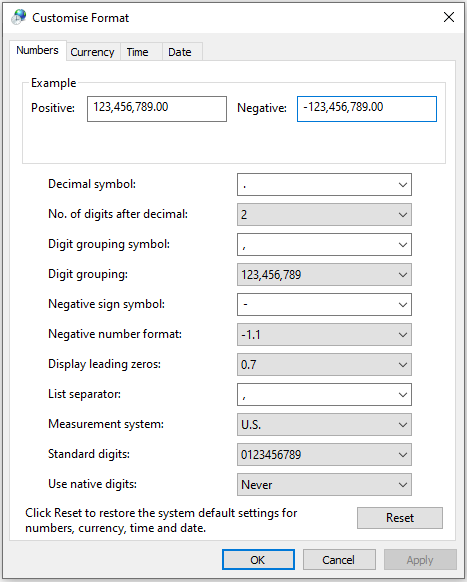
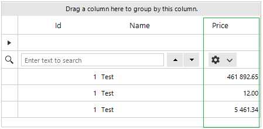
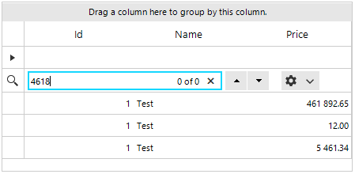
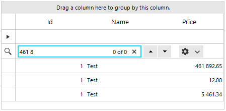
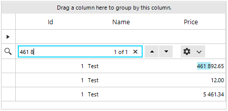
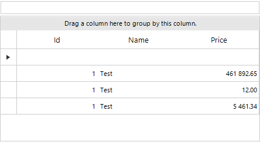

## Environment
 
|Product Version|Product|Author|
|----|----|----|
|2022.2.622|RadGridView for WinForms|[Desislava Yordanova](https://www.telerik.com/blogs/author/desislava-yordanova)|


## Description

The **Digit grouping symbol** is specified in the Regional settings of the local machine, e.g. **","**: 



However, it is possible to specify the **Culture** at application level and set another **NumberGroupSeparator**, e.g. **" "**:

````C#  

CultureInfo culture = new System.Globalization.CultureInfo("en-US");
NumberFormatInfo ni = new NumberFormatInfo();
ni.NumberGroupSeparator = " ";
culture.NumberFormat = ni;
System.Threading.Thread.CurrentThread.CurrentCulture = culture;   
         
````
````VB.NET

Dim culture As CultureInfo = New System.Globalization.CultureInfo("en-US")
Dim ni As NumberFormatInfo = New NumberFormatInfo()
ni.NumberGroupSeparator = " "
culture.NumberFormat = ni
System.Threading.Thread.CurrentThread.CurrentCulture = culture

````

Thus, if you specify the GridViewDecimalColumn.**FormatString** property to **N2**, the numeric cell values will be formatted according to the application's culture - there is a space as a number group separator: 



Once the user starts typing, the search functionality doesn't consider the **NumberGroupSeparator**:

|Type raw value|Type formatted value|
|----|----|
|||

This tutorial demonstrates the different approaches that can be followed to achieve proper search functionality in formatted decimal columns in RadGridView.

## Solution

When a specific Culture is applied to the application, note that the formatted **GridViewDecimalColumn** uses by default the regional settings of the local machine when performing the search operation. That is why it is necessary to specify this Culture to the column itself via the **FormatInfo** property:
  
````C#  

CultureInfo culture = new System.Globalization.CultureInfo("en-US");
NumberFormatInfo ni = new NumberFormatInfo();
ni.NumberGroupSeparator = " ";
culture.NumberFormat = ni;
System.Threading.Thread.CurrentThread.CurrentCulture = culture;

DataTable dt = new DataTable();
dt.Columns.Add("Id", typeof(int));
dt.Columns.Add("Name", typeof(string));
dt.Columns.Add("Price", typeof(decimal));

dt.Rows.Add(1, "Test", 461892.65);
dt.Rows.Add(1, "Test", 12);
dt.Rows.Add(1, "Test", 5461.34);

this.radGridView1.DataSource = dt;
this.radGridView1.AutoSizeColumnsMode = GridViewAutoSizeColumnsMode.Fill;

GridViewDecimalColumn decimalColumn = radGridView1.Columns["Price"] as GridViewDecimalColumn;
decimalColumn.FormatInfo = culture;
decimalColumn.FormatString = "{0:n2}";

this.radGridView1.AllowSearchRow = true;  
         
````
````VB.NET

Dim culture As CultureInfo = New System.Globalization.CultureInfo("en-US")
Dim ni As NumberFormatInfo = New NumberFormatInfo()
ni.NumberGroupSeparator = " "
culture.NumberFormat = ni
System.Threading.Thread.CurrentThread.CurrentCulture = culture
Dim dt As DataTable = New DataTable()
dt.Columns.Add("Id", GetType(Integer))
dt.Columns.Add("Name", GetType(String))
dt.Columns.Add("Price", GetType(Decimal))
dt.Rows.Add(1, "Test", 461892.65)
dt.Rows.Add(1, "Test", 12)
dt.Rows.Add(1, "Test", 5461.34)
Me.RadGridView1.DataSource = dt
Me.RadGridView1.AutoSizeColumnsMode = GridViewAutoSizeColumnsMode.Fill
Dim decimalColumn As GridViewDecimalColumn = TryCast(RadGridView1.Columns("Price"), GridViewDecimalColumn)
decimalColumn.FormatInfo = culture
decimalColumn.FormatString = "{0:n2}"
Me.RadGridView1.AllowSearchRow = True

````

Note that the search functionality in RadGridView is purposed to search for the matches considering the formatted cells' values /not the raw cell's value/ according to the applied culture to the column. The formatted text is actually highlighted then. That is why it is required to enter the NumberGroupSeparator when searching in order to find an exact match, e.g. **"461 8"**.



If you want to handle both cases , entering **"461 8"** and **"4618"**, the search functionality is not appropriate as it is expected to highlight the exact text match.

The appropriate way in this case is to use the [custom filtering]() functionality. Thus, you have full control over what rows to be visible or not according to the raw value. 

Add a RadTextBox control above the grid and use it for the user's input:

````C#  

public RadForm1()
{
    InitializeComponent();

    CultureInfo culture = new System.Globalization.CultureInfo("en-US");
    NumberFormatInfo ni = new NumberFormatInfo();
    ni.NumberGroupSeparator = " ";
    culture.NumberFormat = ni;
    System.Threading.Thread.CurrentThread.CurrentCulture = culture;

    DataTable dt = new DataTable();
    dt.Columns.Add("Id", typeof(int));
    dt.Columns.Add("Name", typeof(string));
    dt.Columns.Add("Price", typeof(decimal));

    dt.Rows.Add(1, "Test", 461892.65);
    dt.Rows.Add(1, "Test", 12);
    dt.Rows.Add(1, "Test", 5461.34);

    this.radGridView1.DataSource = dt;
    this.radGridView1.AutoSizeColumnsMode = GridViewAutoSizeColumnsMode.Fill;

    GridViewDecimalColumn decimalColumn = radGridView1.Columns["Price"] as GridViewDecimalColumn;
    decimalColumn.FormatInfo = culture;
    decimalColumn.FormatString = "{0:n2}";

    this.radGridView1.AllowSearchRow = false;

    this.radGridView1.EnableFiltering = true;
    this.radGridView1.ShowFilteringRow = false;
    this.radGridView1.EnableCustomFiltering = true;
    this.radGridView1.CustomFiltering += radGridView1_CustomFiltering;
    this.radTextBox1.TextChanged += radTextBox1_TextChanged;
}

private void radTextBox1_TextChanged(object sender, EventArgs e)
{
    this.radGridView1.MasterTemplate.Refresh();
}

private void radGridView1_CustomFiltering(object sender, GridViewCustomFilteringEventArgs e)
{
    if (string.IsNullOrEmpty(this.radTextBox1.Text))
    {
        this.radGridView1.BeginUpdate();
        e.Visible = true;
        for (int i = 0; i < this.radGridView1.ColumnCount; i++)
        {
            e.Row.Cells[i].Style.Reset();                   
        }

        this.radGridView1.EndUpdate(false);
        return;
    }
    this.radGridView1.BeginUpdate();
    e.Visible = false;
    for (int i = 0; i < this.radGridView1.ColumnCount; i++)
    {
        string text = e.Row.Cells[i].Value.ToString();
        decimal filterValue;
        if ((decimal.TryParse(this.radTextBox1.Text, out filterValue) && text.Contains(filterValue.ToString())) ||
            text.Contains(this.radTextBox1.Text))
        { 
            e.Visible = true;
            e.Row.Cells[i].Style.CustomizeFill = true;
            e.Row.Cells[i].Style.DrawFill = true;
            e.Row.Cells[i].Style.BackColor = Color.FromArgb(201, 252, 254);
        }
        else
        {
            e.Row.Cells[i].Style.Reset();                    
        }

        this.radGridView1.EndUpdate(false);
    }
}  
         
````
````VB.NET

Public Sub New()
    InitializeComponent()
    Dim culture As CultureInfo = New System.Globalization.CultureInfo("en-US")
    Dim ni As NumberFormatInfo = New NumberFormatInfo()
    ni.NumberGroupSeparator = " "
    culture.NumberFormat = ni
    System.Threading.Thread.CurrentThread.CurrentCulture = culture
    Dim dt As DataTable = New DataTable()
    dt.Columns.Add("Id", GetType(Integer))
    dt.Columns.Add("Name", GetType(String))
    dt.Columns.Add("Price", GetType(Decimal))
    dt.Rows.Add(1, "Test", 461892.65)
    dt.Rows.Add(1, "Test", 12)
    dt.Rows.Add(1, "Test", 5461.34)
    Me.RadGridView1.DataSource = dt
    Me.RadGridView1.AutoSizeColumnsMode = GridViewAutoSizeColumnsMode.Fill
    Dim decimalColumn As GridViewDecimalColumn = TryCast(RadGridView1.Columns("Price"), GridViewDecimalColumn)
    decimalColumn.FormatInfo = culture
    decimalColumn.FormatString = "{0:n2}"
    Me.RadGridView1.AllowSearchRow = False
    Me.RadGridView1.EnableFiltering = True
    Me.RadGridView1.ShowFilteringRow = False
    Me.RadGridView1.EnableCustomFiltering = True
    AddHandler Me.RadGridView1.CustomFiltering, AddressOf radGridView1_CustomFiltering
    AddHandler Me.RadTextBox1.TextChanged, AddressOf radTextBox1_TextChanged
End Sub

Private Sub radTextBox1_TextChanged(ByVal sender As Object, ByVal e As EventArgs)
    Me.RadGridView1.MasterTemplate.Refresh()
End Sub

Private Sub radGridView1_CustomFiltering(ByVal sender As Object, ByVal e As GridViewCustomFilteringEventArgs)
    If String.IsNullOrEmpty(Me.RadTextBox1.Text) Then
        Me.RadGridView1.BeginUpdate()
        e.Visible = True

        For i As Integer = 0 To Me.RadGridView1.ColumnCount - 1
            e.Row.Cells(i).Style.Reset()
        Next

        Me.RadGridView1.EndUpdate(False)
        Return
    End If

    Me.RadGridView1.BeginUpdate()
    e.Visible = False

    For i As Integer = 0 To Me.RadGridView1.ColumnCount - 1
        Dim text As String = e.Row.Cells(i).Value.ToString()
        Dim filterValue As Decimal

        If (Decimal.TryParse(Me.RadTextBox1.Text, filterValue) AndAlso text.Contains(filterValue.ToString())) _
            OrElse text.Contains(Me.RadTextBox1.Text) Then
            e.Visible = True
            e.Row.Cells(i).Style.CustomizeFill = True
            e.Row.Cells(i).Style.DrawFill = True
            e.Row.Cells(i).Style.BackColor = Color.FromArgb(201, 252, 254)
        Else
            e.Row.Cells(i).Style.Reset()
        End If

        Me.RadGridView1.EndUpdate(False)
    Next
End Sub

````



# See Also

* [StartsWith search in RadGridView]()
* [Search Row]()
