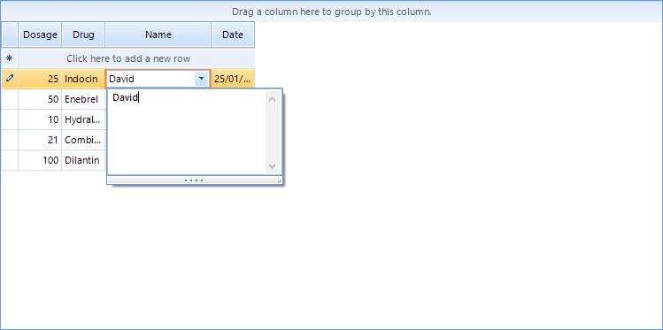

| Product Version                | Product                  | Author                                                             |
| ------------------------------ | ------------------------ | ------------------------------------------------------------------ |
| 2019.1.117 (.NET 4.0 or later) | RadGridView for WinForms | [Dimitar](https://www.telerik.com/blogs/author/dimitar-karamfilov) |

# Description

This article demonstrates how one can use [RadPopupEditor]() as an editor in RadGridView. For example this will allow the end user to easily view or enter multi line text.

# Solutionn

The tricky part is that you should have an existing PopupContainer and set it contents dynamically. You need to use [RadHostitem]() as well.

````C#
public class GridPopupEditor : BaseGridEditor
{
    RadPopupEditor popupEditor = new RadPopupEditor();
    MemoPopupContainer container = new MemoPopupContainer();
    public GridPopupEditor()
    {
         
        popupEditor.SetAssociatedControlRuntime(container);
    }
    public override object Value
    {
        get
        {
            return container.TextBox.Text;
        }
        set
        {
            if (value != null)
            {
                container.TextBox.Text = value.ToString();
            }
           
        }
    }
    public override void BeginEdit()
    {
        base.BeginEdit();
        this.EditorElement.Focus();
        
    }

    private void TextBox_TextChanged(object sender, EventArgs e)
    {
        OnValueChanged();
        popupEditor.Text = container.TextBox.Text;
    }

    public override bool EndEdit()
    {
        this.container.TextBox.TextChanged -= TextBox_TextChanged;
        return base.EndEdit();
    }
   
    protected override RadElement CreateEditorElement()
    {
        var host = new RadHostItem(popupEditor);
      
        return host;
    }
}

````
````VB 
Public Class GridPopupEditor
	Inherits BaseGridEditor

	Private popupEditor As New RadPopupEditor()
	Private container As New MemoPopupContainer()
	Public Sub New()

		popupEditor.SetAssociatedControlRuntime(container)
	End Sub
	Public Overrides Property Value() As Object
		Get
			Return container.TextBox.Text
		End Get
		Set(ByVal value As Object)
			If value IsNot Nothing Then
				container.TextBox.Text = value.ToString()
			End If

		End Set
	End Property
	Public Overrides Sub BeginEdit()
		MyBase.BeginEdit()
		Me.EditorElement.Focus()

	End Sub

	Private Sub TextBox_TextChanged(ByVal sender As Object, ByVal e As EventArgs)
		OnValueChanged()
		popupEditor.Text = container.TextBox.Text
	End Sub

	Public Overrides Function EndEdit() As Boolean
		RemoveHandler Me.container.TextBox.TextChanged, AddressOf TextBox_TextChanged
		Return MyBase.EndEdit()
	End Function

	Protected Overrides Function CreateEditorElement() As RadElement
		Dim host = New RadHostItem(popupEditor)

		Return host
	End Function
End Class
````

Here is a sample container that can be used with the above example:

````C#
class MemoPopupContainer : RadPopupContainer
{
    public MemoPopupContainer()
    {
        TextBox = new RadTextBox
        {
            Dock = DockStyle.Fill,
            Multiline = true,
            ScrollBars = ScrollBars.Both,
        };
        Controls.Add(TextBox);
    }
    public RadTextBox TextBox { get; }
}

````
````VB
Friend Class MemoPopupContainer
	Inherits RadPopupContainer

	Public Sub New()
		TextBox = New RadTextBox With {
			.Dock = DockStyle.Fill,
			.Multiline = True,
			.ScrollBars = ScrollBars.Both
		}
		Controls.Add(TextBox)
	End Sub
	Public ReadOnly Property TextBox() As RadTextBox
End Class
````

>caption Figure 1: PopupEditor in RadGridView


