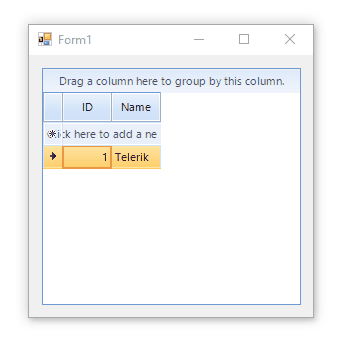

## Environment
 
|Product Version|Product|Author|
|----|----|----|
|2022.1.222|RadGridView for WinForms|[Dinko Krastev](https://www.telerik.com/blogs/author/dinko-krastev)|


## Solution

In the following example, we are going to display screentip in RadGridView using BackgroundWorker. We can create a class that derives from __RadOffice2007ScreenTipElement__. Inside the class, we can create our __BackgroundWorker__ and subscribe to its __DoWork__ and __RunWorkerCompleted__ events. Then we should define a __StartOperation__ method, which starts the __BackgroundWorker__ instance. In addition, we can notify the user of the operation by changing the text of the __MainTextLabel__ element.

 

````C#

public class AsyncRadOffice2007ScreenTipElement : RadOffice2007ScreenTipElement
{
    private BackgroundWorker backgroundWorker;

    public AsyncRadOffice2007ScreenTipElement()
    {
        this.backgroundWorker = new BackgroundWorker();
        this.backgroundWorker.DoWork += this.OnDoWork;
        this.backgroundWorker.RunWorkerCompleted += this.OnRunWorkerCompleted;
    }

    protected override Type ThemeEffectiveType
    {
        get { return typeof(RadOffice2007ScreenTipElement); }
    }

    public event DoWorkEventHandler OperationPerforming;

    protected virtual void OnOperationPerforming(DoWorkEventArgs e)
    {
        DoWorkEventHandler handler = this.OperationPerforming;

        if (handler != null)
        {
            handler(this, e);
        }
    }

    public event RunWorkerCompletedEventHandler OperationCompleted;

    protected virtual void OnOperationCompleted(RunWorkerCompletedEventArgs e)
    {
        RunWorkerCompletedEventHandler handler = this.OperationCompleted;

        if (handler != null)
        {
            handler(this, e);
        }
    }

    public void StartOperation(object arguments)
    {
        this.ResetVisualStyles();

        this.CaptionVisible = false;
        this.MainTextLabel.Text = "Loading content...";

        this.UpdateLayout();

        this.backgroundWorker.RunWorkerAsync(arguments);
    }

    private void ResetVisualStyles()
    {
        this.ResetValues(this.MainTextLabel);
        this.ResetValues(this.CaptionLabel);
        this.ResetValues(this.FooterTextLabel);
    }

    private void ResetValues(RadLabelElement element)
    {
        element.ResetValue(RadLabelElement.MarginProperty, ValueResetFlags.Local);
        element.ResetValue(RadLabelElement.ImageProperty, ValueResetFlags.Local);
        element.ResetValue(RadLabelElement.ImageAlignmentProperty, ValueResetFlags.Local);
        element.ResetValue(RadLabelElement.TextImageRelationProperty, ValueResetFlags.Local);
        element.ResetValue(RadLabelElement.TextProperty, ValueResetFlags.Local);
        element.ResetValue(RadLabelElement.MarginProperty, ValueResetFlags.Local);
    }

    protected override void DisposeManagedResources()
    {
        base.DisposeManagedResources();

        if (this.backgroundWorker != null)
        {
            this.backgroundWorker.Dispose();
            this.backgroundWorker = null;
        }
    }

    private void OnDoWork(object sender, DoWorkEventArgs e)
    {
        this.OnOperationPerforming(e);
    }

    private void OnRunWorkerCompleted(object sender, RunWorkerCompletedEventArgs e)
    {
        this.ResetVisualStyles();
        this.ResetValue(RadOffice2007ScreenTipElement.CaptionVisibleProperty, ValueResetFlags.Local);

        if (e.Cancelled || e.Error != null)
        {
            if (this.ElementTree != null)
            {
                this.ElementTree.Control.Hide();
            }
        }
        else
        {
            this.OnOperationCompleted(e);
        }
    }
}


````
````VB.NET

Public Class AsyncRadOffice2007ScreenTipElement
    Inherits RadOffice2007ScreenTipElement

    Private backgroundWorker As BackgroundWorker

    Public Sub New()
        Me.backgroundWorker = New BackgroundWorker()
        AddHandler Me.backgroundWorker.DoWork, AddressOf Me.OnDoWork
        AddHandler Me.backgroundWorker.RunWorkerCompleted, AddressOf Me.OnRunWorkerCompleted
    End Sub

    Protected Overrides ReadOnly Property ThemeEffectiveType As Type
        Get
            Return GetType(RadOffice2007ScreenTipElement)
        End Get
    End Property

    Public Event OperationPerforming As DoWorkEventHandler

    Protected Overridable Sub OnOperationPerforming(ByVal e As DoWorkEventArgs)
        Dim handler As DoWorkEventHandler = Me.OperationPerforming
        RaiseEvent handler(Me, e)
    End Sub

    Public Event OperationCompleted As RunWorkerCompletedEventHandler

    Protected Overridable Sub OnOperationCompleted(ByVal e As RunWorkerCompletedEventArgs)
        Dim handler As RunWorkerCompletedEventHandler = Me.OperationCompleted
        RaiseEvent handler(Me, e)
    End Sub

    Public Sub StartOperation(ByVal arguments As Object)
        Me.ResetVisualStyles()
        Me.CaptionVisible = False
        Me.MainTextLabel.Text = "Loading content..."
        Me.UpdateLayout()
        Me.backgroundWorker.RunWorkerAsync(arguments)
    End Sub

    Private Sub ResetVisualStyles()
        Me.ResetValues(Me.MainTextLabel)
        Me.ResetValues(Me.CaptionLabel)
        Me.ResetValues(Me.FooterTextLabel)
    End Sub

    Private Sub ResetValues(ByVal element As RadLabelElement)
        element.ResetValue(RadLabelElement.MarginProperty, ValueResetFlags.Local)
        element.ResetValue(RadLabelElement.ImageProperty, ValueResetFlags.Local)
        element.ResetValue(RadLabelElement.ImageAlignmentProperty, ValueResetFlags.Local)
        element.ResetValue(RadLabelElement.TextImageRelationProperty, ValueResetFlags.Local)
        element.ResetValue(RadLabelElement.TextProperty, ValueResetFlags.Local)
        element.ResetValue(RadLabelElement.MarginProperty, ValueResetFlags.Local)
    End Sub

    Protected Overrides Sub DisposeManagedResources()
        MyBase.DisposeManagedResources()

        If Me.backgroundWorker IsNot Nothing Then
            Me.backgroundWorker.Dispose()
            Me.backgroundWorker = Nothing
        End If
    End Sub

    Private Sub OnDoWork(ByVal sender As Object, ByVal e As DoWorkEventArgs)
        Me.OnOperationPerforming(e)
    End Sub

    Private Sub OnRunWorkerCompleted(ByVal sender As Object, ByVal e As RunWorkerCompletedEventArgs)
        Me.ResetVisualStyles()
        Me.ResetValue(RadOffice2007ScreenTipElement.CaptionVisibleProperty, ValueResetFlags.Local)

        If e.Cancelled OrElse e.[Error] IsNot Nothing Then

            If Me.ElementTree IsNot Nothing Then
                Me.ElementTree.Control.Hide()
            End If
        Else
            Me.OnOperationCompleted(e)
        End If
    End Sub
End Class

````

What's left to use our async custom screentip and replace the default one. This can be done in the ScreenTipNeeded event handler of the RadGridView. Before you start the operation and pass the necessary arguments, we should subscribe to the __OperationCompleted__ and __OperationPerforming__ events. The first event occurs when the operation is completed and can be used to initialize the screen tip's UI by using the operation's result. The second event is the actual operation.

````C#

private void OnScreenTipNeeded(object sender, Telerik.WinControls.ScreenTipNeededEventArgs e)
{
    GridCellElement cellElement = e.Item as GridCellElement;

    if (cellElement != null)
    {
        AsyncRadOffice2007ScreenTipElement screenTip = new AsyncRadOffice2007ScreenTipElement();
        screenTip.OperationCompleted += this.OnScreenTipOperationCompleted;
        screenTip.OperationPerforming += this.OnScreenTipOperationPerforming;
        screenTip.MainTextLabel.LabelImage.ImageScaling = Telerik.WinControls.Enumerations.ImageScaling.SizeToFit;
        screenTip.MainTextLabel.LabelImage.ScaleSize = new Size(screenTip.MainTextLabel.LabelImage.ScaleSize.Width+100, screenTip.MainTextLabel.LabelImage.ScaleSize.Height);
        screenTip.EnableCustomSize = true;
        screenTip.StartOperation(3000);
                
        cellElement.ScreenTip = screenTip;
    }
}

private void OnScreenTipOperationPerforming(object sender, DoWorkEventArgs e)
{
    // Here you should perform the highly intensive and performance heavy operation
    int delay = (int)e.Argument;
    Thread.Sleep(delay);
    e.Result = String.Format("Operation completed {0}ms", delay);
}

private void OnScreenTipOperationCompleted(object sender, RunWorkerCompletedEventArgs e)
{
    RadOffice2007ScreenTipElement screenTipElement = sender as RadOffice2007ScreenTipElement;
    screenTipElement.CaptionLabel.Text = "Operation finished!!!";           
    screenTipElement.MainTextLabel.Text = Convert.ToString(e.Result);
}


````
````VB.NET

Private Sub OnScreenTipNeeded(ByVal sender As Object, ByVal e As Telerik.WinControls.ScreenTipNeededEventArgs)
        Dim cellElement As GridCellElement = TryCast(e.Item, GridCellElement)

        If cellElement IsNot Nothing Then
            Dim screenTip As AsyncRadOffice2007ScreenTipElement = New AsyncRadOffice2007ScreenTipElement()
            AddHandler screenTip.OperationCompleted, AddressOf Me.OnScreenTipOperationCompleted
            AddHandler screenTip.OperationPerforming, AddressOf Me.OnScreenTipOperationPerforming
            screenTip.MainTextLabel.LabelImage.ImageScaling = Telerik.WinControls.Enumerations.ImageScaling.SizeToFit
            screenTip.MainTextLabel.LabelImage.ScaleSize = New Size(screenTip.MainTextLabel.LabelImage.ScaleSize.Width + 100, screenTip.MainTextLabel.LabelImage.ScaleSize.Height)
            screenTip.EnableCustomSize = True
            screenTip.StartOperation(3000)
            cellElement.ScreenTip = screenTip
        End If
    End Sub

    Private Sub OnScreenTipOperationPerforming(ByVal sender As Object, ByVal e As DoWorkEventArgs)
        Dim delay As Integer = CInt(e.Argument)
        Thread.Sleep(delay)
        e.Result = String.Format("Operation completed {0}ms", delay)
    End Sub

    Private Sub OnScreenTipOperationCompleted(ByVal sender As Object, ByVal e As RunWorkerCompletedEventArgs)
        Dim screenTipElement As RadOffice2007ScreenTipElement = TryCast(sender, RadOffice2007ScreenTipElement)
        screenTipElement.CaptionLabel.Text = "Operation finished!!!"
        screenTipElement.MainTextLabel.Text = Convert.ToString(e.Result)
    End Sub


````


