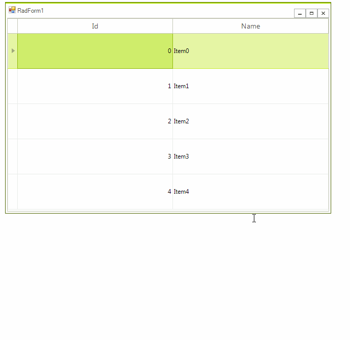

## Environment
<table>
	<tr>
		<td>Product Version</td>
		<td>2018.3.911</td>
	</tr>
	<tr>
		<td>Product</td>
		<td>RadGridView for WinForms</td>
	</tr>
</table>


## Description

**RadGridView** allows you to adjust the columns' width automatically to fill the entire width of the control. This is controlled by the [AutoSizeColumnsMode]() property. This article will demonstrate a sample approach how to achieve a similar functionality for the rows. In other words, it shows how to adjust the rows' height to fill the height of the control. 



## Solution 

The TableElement.**RowHeight** property controls the height of the rows in the grid. The following code snippet calculates the **RowHeight** considering the current size of **RadGridView** and rows count:

````C#

        public RadForm1()
        {
            InitializeComponent();

            DataTable dt = new DataTable();
            dt.Columns.Add("Id", typeof(int));
            dt.Columns.Add("Name", typeof(string));
            for (int i = 0; i < 5; i++)
            {
                dt.Rows.Add(i, "Item" + i);
            }
            this.radGridView1.DataSource = dt;
            this.radGridView1.AutoSizeColumnsMode = Telerik.WinControls.UI.GridViewAutoSizeColumnsMode.Fill;

            this.radGridView1.AutoSizeColumnsMode = Telerik.WinControls.UI.GridViewAutoSizeColumnsMode.Fill;
            this.radGridView1.ShowGroupPanel = false;
            this.radGridView1.EnableFiltering = false;
            this.radGridView1.AllowAddNewRow = false;
            this.radGridView1.AutoSizeColumnsMode = Telerik.WinControls.UI.GridViewAutoSizeColumnsMode.Fill;
            this.radGridView1.SizeChanged += radGridView1_SizeChanged;
        }

        private void radGridView1_SizeChanged(object sender, EventArgs e)
        {
            AdjustRowHeight();
        }
 
        private void AdjustRowHeight()
        {
            int rowHeight = (this.radGridView1.Size.Height - this.radGridView1.TableElement.TableHeaderHeight) / this.radGridView1.ChildRows.Count;
            if (rowHeight > 0)
            {
                this.radGridView1.TableElement.RowHeight = rowHeight;
            }
        }

        private void RadForm1_Load(object sender, EventArgs e)
        {
            AdjustRowHeight();
        }

````
````VB.NET

    Sub New()

        InitializeComponent()

        Me.RadGridView1.DataSource = Nothing
        Dim dt As DataTable = New DataTable()
        dt.Columns.Add("Id", GetType(Integer))
        dt.Columns.Add("Name", GetType(String))

        For i As Integer = 0 To 5 - 1
            dt.Rows.Add(i, "Item" & i)
        Next

        Me.RadGridView1.DataSource = dt
        Me.RadGridView1.AutoSizeColumnsMode = Telerik.WinControls.UI.GridViewAutoSizeColumnsMode.Fill
        Me.RadGridView1.AutoSizeColumnsMode = Telerik.WinControls.UI.GridViewAutoSizeColumnsMode.Fill
        Me.RadGridView1.ShowGroupPanel = False
        Me.RadGridView1.EnableFiltering = False
        Me.RadGridView1.AllowAddNewRow = False
        Me.RadGridView1.AutoSizeColumnsMode = Telerik.WinControls.UI.GridViewAutoSizeColumnsMode.Fill
        AddHandler Me.RadGridView1.SizeChanged, AddressOf radGridView1_SizeChanged

    End Sub

    Private Sub radGridView1_SizeChanged(ByVal sender As Object, ByVal e As EventArgs)
        AdjustRowHeight()
    End Sub

    Private Sub AdjustRowHeight()
        Dim rowHeight As Integer = (Me.RadGridView1.Size.Height - Me.RadGridView1.TableElement.TableHeaderHeight) / Me.RadGridView1.ChildRows.Count

        If rowHeight > 0 Then
            Me.RadGridView1.TableElement.RowHeight = rowHeight
        End If
    End Sub

    Private Sub RadForm1_Load(sender As Object, e As EventArgs) Handles MyBase.Load
        AdjustRowHeight()
    End Sub

````

>note If some of the system rows are displayed as well, their height should participate in the calculation. You can access a system row by the  respective property exposed in the **MasterView**.

