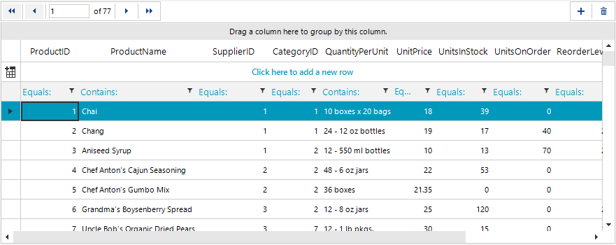
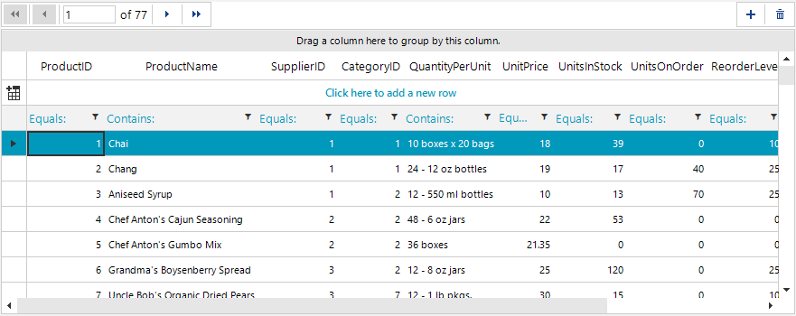

## Environment
 
|Product Version|Product|Author|
|----|----|----|
|2019.2.618|RadGridView for WinForms|[Desislava Yordanova](https://www.telerik.com/blogs/author/desislava-yordanova)|
 

## Description

Consider that you have a **RadGridView** and a **RadBindingNavigator** bound to the same **BindingSource**. **RadBindingNavigator** allows you to iterate the grid rows in an easier way. However, if you sort the grid, **RadBindingNavigator** keeps traversing the records in their original order. If you filter the grid, the number of records is not updated in **RadBindignNavigator**. The following gif file illustrates better the undesired behavior:



## Solution 

This behavior is normal. **RadBindingNavigator** and the standard MS **BindingNavigator** uses the **CurrencyManager** to navigate through the records. However, when the **RadGridView** is sorted/filtered, its child rows are reordered/filtered according to the current **SortDescriptor**/**FilterDescriptor**. When clicking the next button in the binding navigator, it will navigate to the next record in the original data order. That is why you obtain the "jumping" in a sorted **RadGridView**. 

This article demonstrates a sample code snippet how to filter the binding navigator as well and traverse the records in the same order they appear in the grid. The obtained result is illustrated in the below gif file:



It is necessary to handle the RadGridView.**FilterExpressionChanged** event and apply the same filter expression to **RadBindingNavigator**. As to the sorting behavior, it is necessary to use a custom implementation for **RadBindingNavigator** as it is demonstrated below:


````C#

            private void RadForm1_Load(object sender, EventArgs e)
        { 
            this.productsTableAdapter.Fill(this.nwindDataSet.Products);
            this.radGridView1.DataSource = this.productsBindingSource;
            this.radGridView1.BestFitColumns();
            this.radGridView1.EnableFiltering = true;

            this.radBindingNavigator1.BindingSource = this.productsBindingSource;

            this.radGridView1.FilterExpressionChanged += Grid_FilterExpressionChanged;
        }
        public class CustomBindingNavigator : RadBindingNavigator
        {
            protected override RadBindingNavigatorElement CreateNavigatorElement()
            {
                return new CustomBindingNavigatorElement();
            }

            public class CustomBindingNavigatorElement : RadBindingNavigatorElement
            {
                protected override void FirstButton_Click(object sender, EventArgs e)
                {
                    Form f = this.ElementTree.Control.FindForm();
                    if (f != null)
                    {
                        RadGridView grid = f.Controls[0] as RadGridView;
                        grid.GridNavigator.SelectFirstRow();
                    }
                }
                protected override void LastButton_Click(object sender, EventArgs e)
                {
                    Form f = this.ElementTree.Control.FindForm();
                    if (f != null)
                    {
                        RadGridView grid = f.Controls[0] as RadGridView;
                        grid.GridNavigator.SelectLastRow();
                    }
                }
                protected override void PreviousButton_Click(object sender, EventArgs e)
                {
                    Form f = this.ElementTree.Control.FindForm();
                    if (f != null)
                    {
                        RadGridView grid = f.Controls[0] as RadGridView;
                        grid.GridNavigator.SelectPreviousRow(1);
                    }
                }

                protected override void NextButton_Click(object sender, EventArgs e)
                {
                    Form f = this.ElementTree.Control.FindForm();
                    if (f != null)
                    {
                        RadGridView grid = f.Controls[0] as RadGridView;
                        grid.GridNavigator.SelectNextRow(1);
                    }
                }
            }
        }

        private void Grid_FilterExpressionChanged(object sender, FilterExpressionChangedEventArgs e)
        {
            this.productsBindingSource.Filter = e.FilterExpression;
        }               
       
````
````VB.NET
    
        Private Sub RadForm1_Load(sender As Object, e As EventArgs) Handles MyBase.Load 
        Me.ProductsTableAdapter.Fill(Me.NwindDataSet.Products)

        Me.RadGridView1.DataSource = Me.ProductsBindingSource
        Me.RadGridView1.BestFitColumns()
        Me.RadGridView1.EnableFiltering = True

        Me.RadBindingNavigator1.BindingSource = Me.ProductsBindingSource

        AddHandler Me.RadGridView1.FilterExpressionChanged, AddressOf Grid_FilterExpressionChanged
    End Sub

    Public Class CustomBindingNavigator
        Inherits RadBindingNavigator

        Protected Overrides Function CreateNavigatorElement() As RadBindingNavigatorElement
            Return New CustomBindingNavigatorElement()
        End Function

        Public Class CustomBindingNavigatorElement
            Inherits RadBindingNavigatorElement
            Protected Overrides Sub FirstButton_Click(sender As Object, e As EventArgs)
                Dim f As Form = Me.ElementTree.Control.FindForm()
                If f IsNot Nothing Then
                    Dim grid As RadGridView = TryCast(f.Controls(0), RadGridView)
                    grid.GridNavigator.SelectFirstRow()
                End If
            End Sub
            Protected Overrides Sub LastButton_Click(sender As Object, e As EventArgs)
                Dim f As Form = Me.ElementTree.Control.FindForm()
                If f IsNot Nothing Then
                    Dim grid As RadGridView = TryCast(f.Controls(0), RadGridView)
                    grid.GridNavigator.SelectLastRow()
                End If

            End Sub
            Protected Overrides Sub PreviousButton_Click(sender As Object, e As EventArgs)
                Dim f As Form = Me.ElementTree.Control.FindForm()
                If f IsNot Nothing Then
                    Dim grid As RadGridView = TryCast(f.Controls(0), RadGridView)
                    grid.GridNavigator.SelectPreviousRow(1)
                End If
            End Sub

            Protected Overrides Sub NextButton_Click(sender As Object, e As EventArgs)
                Dim f As Form = Me.ElementTree.Control.FindForm()
                If f IsNot Nothing Then
                    Dim grid As RadGridView = TryCast(f.Controls(0), RadGridView)
                    grid.GridNavigator.SelectNextRow(1)
                End If
            End Sub
        End Class
    End Class

    Private Sub Grid_FilterExpressionChanged(sender As Object, e As FilterExpressionChangedEventArgs)
        Me.ProductsBindingSource.Filter = e.FilterExpression
    End Sub   
    
````


    
   
  
    
 
