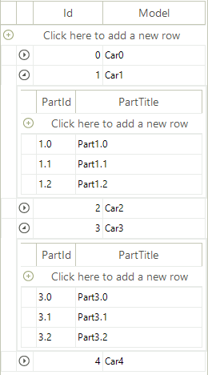

## Environment
 
|Product Version|Product|Author|
|----|----|----|
|2019.2.618|RadGridView for WinForms|[Desislava Yordanova](https://www.telerik.com/blogs/author/desislava-yordanova)|
 

## Description

Consider that you have a class which contains a property that represents a list of records of another type:

#### Class Car with a nested list of Part objects


````C#

          public class Car
        {
            public int Id { get; set; }

            public string Model { get; set; }

            public BindingList<Part> Parts { get; set; }

            public Car(int id, string model, BindingList<Part> parts)
            {
                this.Id = id;
                this.Model = model;
                this.Parts = parts;
            }
        }

        public class Part
        {
            public string PartId { get; set; }

            public string PartTitle { get; set; }

            public Part(string partId, string partTitle)
            {
                this.PartId = partId;
                this.PartTitle = partTitle;
            }
        }            
       
````
````VB.NET
    
       Public Class Car
        Public Property Id As Integer
        Public Property Model As String
        Public Property Parts As BindingList(Of Part)

        Public Sub New(ByVal id As Integer, ByVal model As String, ByVal parts As BindingList(Of Part))
            Me.Id = id
            Me.Model = model
            Me.Parts = parts
        End Sub
    End Class

    Public Class Part
        Public Property PartId As String
        Public Property PartTitle As String

        Public Sub New(ByVal partId As String, ByVal partTitle As String)
            Me.PartId = partId
            Me.PartTitle = partTitle
        End Sub
    End Class
  
    
````

A common requirement is to generate a hierarchy in **RadGridView** when setting the **DataSource** property to a collection of Cars.




## Solution 

**RadGridView** offers the following solutions:

### Autogenerate the hierarchy

Set the **AutoGenerateHierarchy** property to *true* before setting the **DataSource**. You can also hide the column that is automatically generated for the list property:

````C#

            BindingList<Car> cars = new BindingList<Car>();

            for (int i = 0; i < 5; i++)
            {
                BindingList<Part> parts = new BindingList<Part>();
                for (int j = 0; j < 3; j++)
                {
                    parts.Add(new Part(i + "." + j, "Part" + i + "." + j));
                }
                cars.Add(new Car(i, "Car" + i, parts));
            }
            this.radGridView1.AutoGenerateHierarchy = true;
            this.radGridView1.DataSource = cars;
            this.radGridView1.MasterTemplate.Columns["Parts"].IsVisible = false;          
       
````
````VB.NET
    
        Dim cars As BindingList(Of Car) = New BindingList(Of Car)()

        For i As Integer = 0 To 5 - 1
            Dim parts As BindingList(Of Part) = New BindingList(Of Part)()

            For j As Integer = 0 To 3 - 1
                parts.Add(New Part(i & "." & j, "Part" & i & "." & j))
            Next

            cars.Add(New Car(i, "Car" & i, parts))
        Next

        Me.radGridView1.AutoGenerateHierarchy = True
        Me.radGridView1.DataSource = cars
        Me.radGridView1.MasterTemplate.Columns("Parts").IsVisible = False
  
    
````

### Load the hierarchy on demand

Set the **AutoGenerateHierarchy** property to *false*. Then, use the [load on demand hierarchy]() approach to display the nested data.


````C#

           public RadForm1()
        {
            InitializeComponent();

            BindingList<Car> cars = new BindingList<Car>();
            for (int i = 0; i < 5; i++)
            {
                BindingList<Part> parts = new BindingList<Part>();
                for (int j = 0; j < 3; j++)
                {
                    parts.Add(new Part(i + "." + j, "Part" + i + "." + j));
                }
                cars.Add(new Car(i, "Car" + i, parts));
            }

            this.radGridView1.AutoGenerateHierarchy = false;
            this.radGridView1.DataSource = cars;
            this.radGridView1.MasterTemplate.Columns["Parts"].IsVisible = false;
            
            GridViewTemplate childTemplate = CreateChildTemplate();
            this.radGridView1.Templates.Add(childTemplate);
            childTemplate.HierarchyDataProvider =
                new GridViewEventDataProvider(childTemplate);

            this.radGridView1.RowSourceNeeded += radGridView1_RowSourceNeeded;
        }

        private void radGridView1_RowSourceNeeded(object sender, GridViewRowSourceNeededEventArgs e)
        {
            Car car = e.ParentRow.DataBoundItem as Car;
            BindingList<Part> parts = car.Parts;

            foreach (Part r in parts)
            {
                GridViewRowInfo row = e.Template.Rows.NewRow();
                row.Cells["Title"].Value = r.PartTitle;
                row.Cells["Id"].Value = r.PartId;
                e.SourceCollection.Add(row);
            }
        }

        private GridViewTemplate CreateChildTemplate()
        {
            GridViewTemplate template = new GridViewTemplate();
            template.AutoSizeColumnsMode = GridViewAutoSizeColumnsMode.Fill;

            GridViewDecimalColumn idColumn = new GridViewDecimalColumn("Id");
            template.Columns.Add(idColumn);
            GridViewTextBoxColumn descriptionColumn =
                new GridViewTextBoxColumn("Title");
            template.Columns.Add(descriptionColumn);

            return template;
        }      
       
````
````VB.NET

    Public Sub New()
        InitializeComponent()
        Dim cars As BindingList(Of Car) = New BindingList(Of Car)()

        For i As Integer = 0 To 5 - 1
            Dim parts As BindingList(Of Part) = New BindingList(Of Part)()

            For j As Integer = 0 To 3 - 1
                parts.Add(New Part(i & "." & j, "Part" & i & "." & j))
            Next

            cars.Add(New Car(i, "Car" & i, parts))
        Next

        Me.RadGridView1.AutoGenerateHierarchy = False
        Me.RadGridView1.DataSource = cars
        Me.RadGridView1.MasterTemplate.Columns("Parts").IsVisible = False
        Dim childTemplate As GridViewTemplate = CreateChildTemplate()
        Me.RadGridView1.Templates.Add(childTemplate)
        childTemplate.HierarchyDataProvider = New GridViewEventDataProvider(childTemplate)
        AddHandler Me.RadGridView1.RowSourceNeeded, AddressOf radGridView1_RowSourceNeeded
    End Sub

    Private Sub radGridView1_RowSourceNeeded(ByVal sender As Object, ByVal e As GridViewRowSourceNeededEventArgs)
        Dim car As Car = TryCast(e.ParentRow.DataBoundItem, Car)
        Dim parts As BindingList(Of Part) = car.Parts

        For Each r As Part In parts
            Dim row As GridViewRowInfo = e.Template.Rows.NewRow()
            row.Cells("Title").Value = r.PartTitle
            row.Cells("Id").Value = r.PartId
            e.SourceCollection.Add(row)
        Next
    End Sub

    Private Function CreateChildTemplate() As GridViewTemplate
        Dim template As GridViewTemplate = New GridViewTemplate()
        template.AutoSizeColumnsMode = GridViewAutoSizeColumnsMode.Fill
        Dim idColumn As GridViewDecimalColumn = New GridViewDecimalColumn("Id")
        template.Columns.Add(idColumn)
        Dim descriptionColumn As GridViewTextBoxColumn = New GridViewTextBoxColumn("Title")
        template.Columns.Add(descriptionColumn)
        Return template
    End Function


````


    
   
  
    
 
