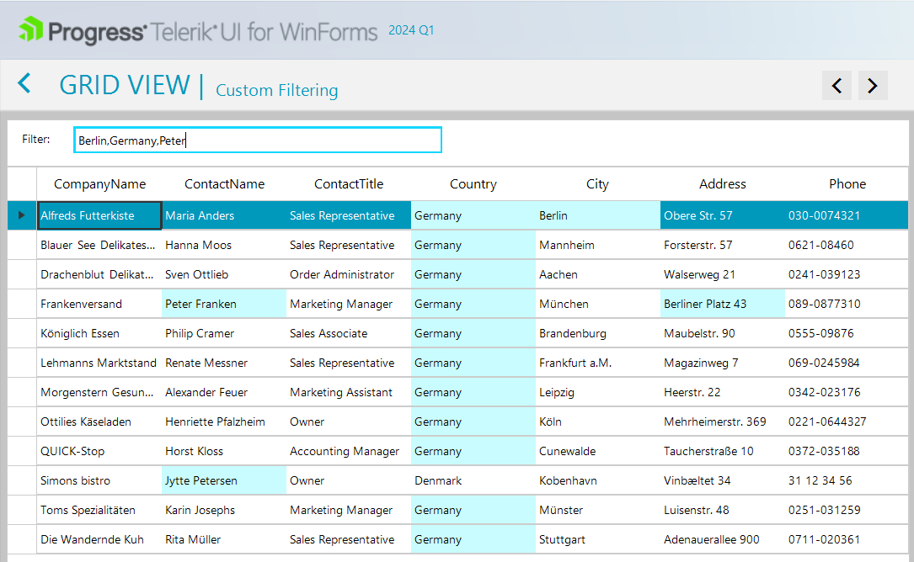

## Environment
|Product Version|Product|Author|
|----|----|----|
|2024.1.130|UI for WinForms|[Dinko Krastev](https://www.telerik.com/blogs/author/dinko-krastev)|

## Description

In this tutorial we will demonstrate how to filter RadGridView by a list of values copied from an Excel column without having to use the "is in list" option. We will modify the Custom Filtering demo from our WinForms Demos Application.



## Solution

To filter RadGridView by multiple values, you can modify the code from the Custom Filtering demo, by following these steps:

1. Modify the `radGridView1_CustomFiltering` event from the Custom Filtering demo.
2. Check if the filter text is empty. If it is, reset the styles of all cells and make all rows visible.
3. If the filter text is not empty, split it into multiple values using a comma as the separator.
4. Iterate through each cell in the row and compare its value to each of the filter values.
5. If a match is found, make the row visible and customize the fill color of the cell.
6. If no match is found, reset the style of the cell.
7. End the update of the RadGridView.

Here is the modified code:

````C#  
private void radGridView1_CustomFiltering(object sender, GridViewCustomFilteringEventArgs e)
{
    if (string.IsNullOrEmpty(this.filterTextBox.Text))
    {
        this.radGridView.BeginUpdate();
        e.Visible = true;
        for (int i = 0; i < this.radGridView.ColumnCount; i++)
        {
            e.Row.Cells[i].Style.Reset();
        }
        this.radGridView.EndUpdate(false);
        return;
    }

    this.radGridView.BeginUpdate();
    e.Visible = false;

    var searchValues = this.filterTextBox.Text.Split(',');

    for (int i = 0; i < this.radGridView.ColumnCount; i++)
    {
        string text = e.Row.Cells[i].Value.ToString();
        bool searchWordFound = false;

        foreach (var searchValue in searchValues)
        {
            if (string.IsNullOrEmpty(searchValue))
            {
                continue;
            }

            if (text.IndexOf(searchValue, 0, StringComparison.InvariantCultureIgnoreCase) >= 0)
            {
                searchWordFound = true;
            }
        }

        if (searchWordFound)
        {
            e.Visible = true;
            e.Row.Cells[i].Style.CustomizeFill = true;
            e.Row.Cells[i].Style.DrawFill = true;
            e.Row.Cells[i].Style.BackColor = Color.FromArgb(201, 252, 254);
        }
        else
        {
            e.Row.Cells[i].Style.Reset();
        }
    }

    this.radGridView.EndUpdate(false);
}

````
````VB.NET

Private Sub radGridView1_CustomFiltering(ByVal sender As Object, ByVal e As GridViewCustomFilteringEventArgs)
    If String.IsNullOrEmpty(Me.filterTextBox.Text) Then
        Me.radGridView.BeginUpdate()
        e.Visible = True

        For i As Integer = 0 To Me.radGridView.ColumnCount - 1
            e.Row.Cells(i).Style.Reset()
        Next

        Me.radGridView.EndUpdate(False)
        Return
    End If

    Me.radGridView.BeginUpdate()
    e.Visible = False
    Dim searchValues = Me.filterTextBox.Text.Split(","c)

    For i As Integer = 0 To Me.radGridView.ColumnCount - 1
        Dim text As String = e.Row.Cells(i).Value.ToString()
        Dim searchWordFound As Boolean = False

        For Each searchValue In searchValues

            If String.IsNullOrEmpty(searchValue) Then
                Continue For
            End If

            If text.IndexOf(searchValue, 0, StringComparison.InvariantCultureIgnoreCase) >= 0 Then
                searchWordFound = True
            End If
        Next

        If searchWordFound Then
            e.Visible = True
            e.Row.Cells(i).Style.CustomizeFill = True
            e.Row.Cells(i).Style.DrawFill = True
            e.Row.Cells(i).Style.BackColor = Color.FromArgb(201, 252, 254)
        Else
            e.Row.Cells(i).Style.Reset()
        End If
    Next

    Me.radGridView.EndUpdate(False)
End Sub


````


Now you can use this modified code to filter the RadGridView by multiple values.
