## Environment
 
|Product Version|Product|Author|
|----|----|----|
|2022.2.622|RadGridView for WinForms|[Desislava Yordanova](https://www.telerik.com/blogs/author/desislava-yordanova)|

## Description

This article offers a step-by-step tutorial how to bind the RadGridView control to the Northwind.Categories table from a local SQL server. 

## Solution

Consider that we have a local SQL server with the Northwind database:

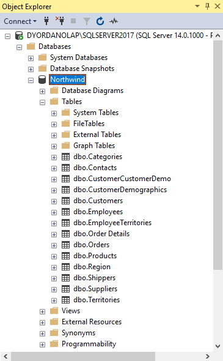

Now, we are going to bind the **RadGridView** control in the project to the Northwind.**Categories** table:

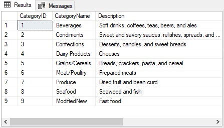

Let's follow the steps:

1\. Select the RadGridView control at design time and open its smart tag. Then, select *Choose DataSource >> Add Project Data Source...* :

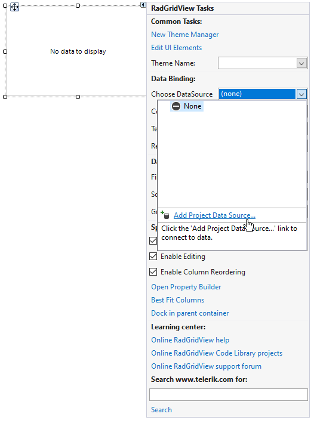

2\. Follow the wizard:

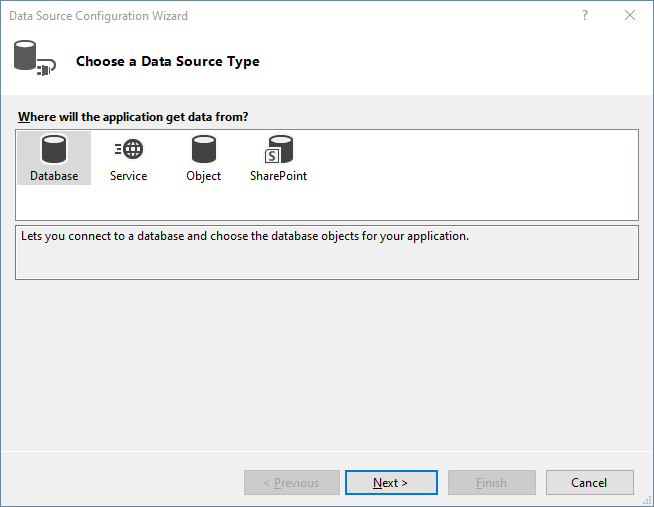

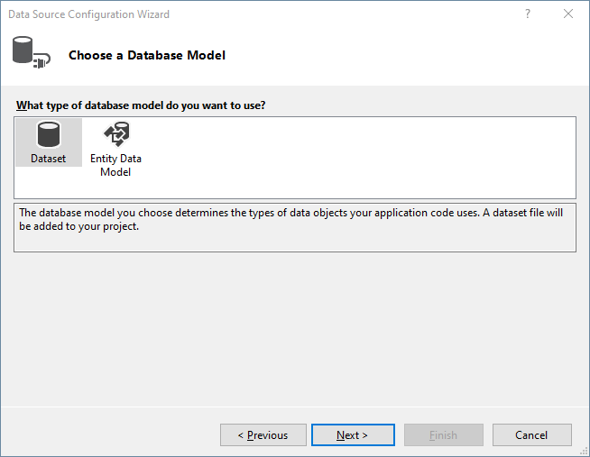

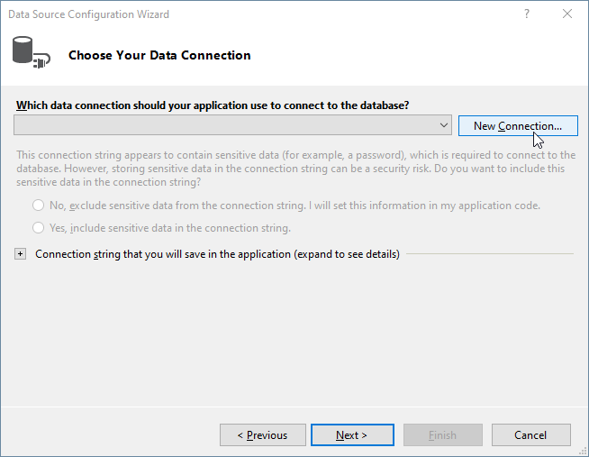

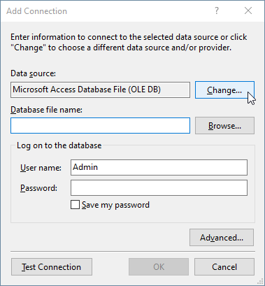

3\. Change the Data source to *Microsoft SQL Server* and press OK:

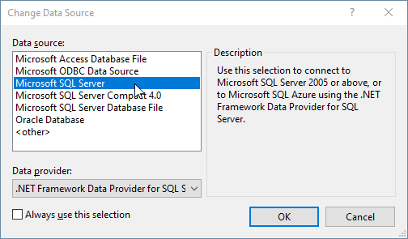

4\. Enter your *Server name* and select the *database name*, e.g. Northwind:

5\. Confirm the changes and continue the wizard:

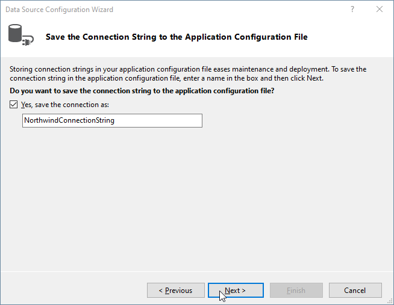

6\. Select the Northwind.**Categories** table and click Finish:

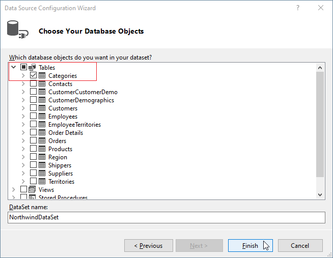

7\. Once the wizard is completed, the respective BindingSource is generated:

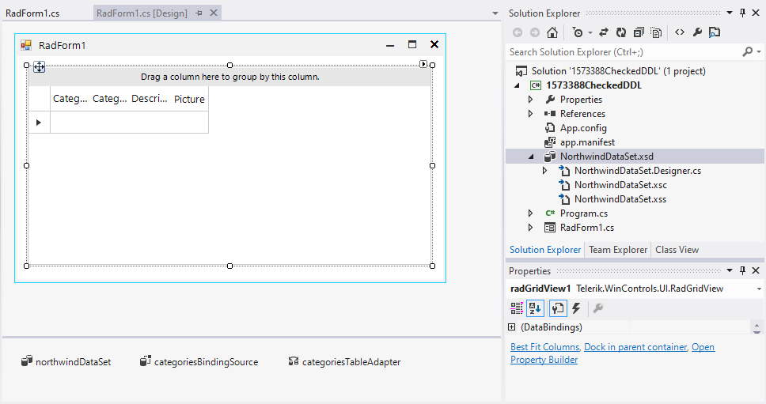

8\. Run the project and the grid will be populated with data:

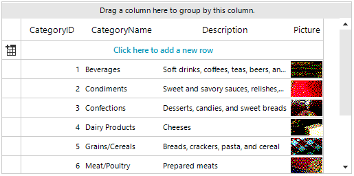

# See Also

* [Tutorial Binding to DataTable or DataSet]()

* [Binding to EntityFramework using Database first approach]()
