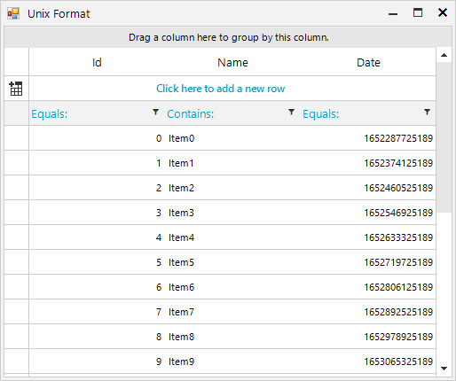

## Environment
 
|Product Version|Product|Author|
|----|----|----|
|2022.1.222|RadGridView for WinForms|[Desislava Yordanova](https://www.telerik.com/blogs/author/desislava-yordanova)|


## Description

The UNIX format is storing DateTime values as a Int64 number representing milliseconds after 1.1.1970. This will generate a GridViewDecimalColumn if you have such a field in the DataSource collection applied to the RadGridView control.
 


This article demonstrates a sample approach how to convert this value to a DateTime and use a [GridViewDateTimeColumn]().

## Solution

In order to make this display correctly inside a **GridViewDateTimeColumn** you will have to create a [TypeConverter]() and assign it to the column's **DataTypeConverter** property.


````C#  
   
public partial class RadForm1 : Telerik.WinControls.UI.RadForm
{
    public RadForm1()
    {
        InitializeComponent(); 
        DataTable dt = new DataTable();
        dt.Columns.Add("Id", typeof(int));
        dt.Columns.Add("Name", typeof(string));
        dt.Columns.Add("Date", typeof(long));

        for (int i = 0; i < 20; i++)
        {
            dt.Rows.Add(i, "Item" + i, (DateTime.Now.AddDays(i) - new DateTime(1970, 1, 1)).TotalMilliseconds);  
        }

        this.radGridView1.DataSource = dt;
        this.radGridView1.Columns.Remove("Date");
        GridViewDateTimeColumn dateColumn = new GridViewDateTimeColumn();
        dateColumn.FieldName = "Date";
        dateColumn.FilteringMode = GridViewTimeFilteringMode.Date;
        dateColumn.DataTypeConverter = new CustomDateTimeConverter();
        this.radGridView1.Columns.Add(dateColumn);

        this.radGridView1.AutoSizeColumnsMode = GridViewAutoSizeColumnsMode.Fill;
        this.radGridView1.EnableFiltering = true;
    }
}

public class CustomDateTimeConverter : TypeConverter
{
    public override bool CanConvertTo(ITypeDescriptorContext context, Type destinationType)
    {
        return destinationType == typeof(long) || destinationType == typeof(DateTime) || destinationType == typeof(string);
    }

    public override object ConvertTo(ITypeDescriptorContext context, CultureInfo culture, object value, Type destinationType)
    {
        if (destinationType == typeof(long) && value is long)
        {
            return value;
        }

        if (destinationType == typeof(long) && value is DateTime)
        {
            return (long)((DateTime)value - new DateTime(1970, 1, 1)).TotalMilliseconds;
        }

        if (destinationType == typeof(DateTime) && value is long)
        {
            return new DateTime(1970, 1, 1).AddMilliseconds((long)value);
        }

        if (destinationType == typeof(string))
        {
            return (new DateTime(1970, 1, 1).AddMilliseconds((long)value)).ToString();
        }

        if (destinationType == typeof(DateTime) && value is DateTime)
        {
            return value;
        }

        return base.ConvertTo(context, culture, value, destinationType);
    }

    public override bool CanConvertFrom(ITypeDescriptorContext context, Type sourceType)
    {
        return sourceType == typeof(DateTime) || sourceType == typeof(long);
    }

    public override object ConvertFrom(ITypeDescriptorContext context, CultureInfo culture, object value)
    {
        if (value is DateTime)
        {
            return (long)((DateTime)value - new DateTime(1970, 1, 1)).TotalMilliseconds;
        }
        else if (value is long)
        {
            return new DateTime(1970, 1, 1).AddMilliseconds((long)value);
        }

        return base.ConvertFrom(context, culture, value);
    }
}


````
````VB.NET

Sub New() 
    InitializeComponent()

    Dim dt As DataTable = New DataTable()
    dt.Columns.Add("Id", GetType(Integer))
    dt.Columns.Add("Name", GetType(String))
    dt.Columns.Add("Date", GetType(Long))

    For i As Integer = 0 To 20 - 1
        dt.Rows.Add(i, "Item" & i, (DateTime.Now.AddDays(i) - New DateTime(1970, 1, 1)).TotalMilliseconds)
    Next

    Me.RadGridView1.DataSource = dt
    Me.RadGridView1.Columns.Remove("Date")
    Dim dateColumn As GridViewDateTimeColumn = New GridViewDateTimeColumn()
    dateColumn.FieldName = "Date"
    dateColumn.FilteringMode = GridViewTimeFilteringMode.Date
    dateColumn.DataTypeConverter = New CustomDateTimeConverter()
    Me.RadGridView1.Columns.Add(dateColumn)
    Me.RadGridView1.AutoSizeColumnsMode = GridViewAutoSizeColumnsMode.Fill
    Me.RadGridView1.EnableFiltering = True

End Sub

Public Class CustomDateTimeConverter
    Inherits TypeConverter

    Public Overrides Function CanConvertTo(ByVal context As ITypeDescriptorContext, ByVal destinationType As Type) As Boolean
        Return destinationType = GetType(Long) OrElse destinationType = GetType(DateTime) OrElse destinationType = GetType(String)
    End Function

    Public Overrides Function ConvertTo(ByVal context As ITypeDescriptorContext, ByVal culture As CultureInfo, ByVal value As Object, ByVal destinationType As Type) As Object
        If destinationType = GetType(Long) AndAlso TypeOf value Is Long Then
            Return value
        End If

        If destinationType = GetType(Long) AndAlso TypeOf value Is DateTime Then
            Return CLng((CType(value, DateTime) - New DateTime(1970, 1, 1)).TotalMilliseconds)
        End If

        If destinationType = GetType(DateTime) AndAlso TypeOf value Is Long Then
            Return New DateTime(1970, 1, 1).AddMilliseconds(CLng(value))
        End If

        If destinationType = GetType(String) Then
            Return (New DateTime(1970, 1, 1).AddMilliseconds(CLng(value))).ToString()
        End If

        If destinationType = GetType(DateTime) AndAlso TypeOf value Is DateTime Then
            Return value
        End If

        Return MyBase.ConvertTo(context, culture, value, destinationType)
    End Function

    Public Overrides Function CanConvertFrom(ByVal context As ITypeDescriptorContext, ByVal sourceType As Type) As Boolean
        Return sourceType = GetType(DateTime) OrElse sourceType = GetType(Long)
    End Function

    Public Overrides Function ConvertFrom(ByVal context As ITypeDescriptorContext, ByVal culture As CultureInfo, ByVal value As Object) As Object
        If TypeOf value Is DateTime Then
            Return CLng((CType(value, DateTime) - New DateTime(1970, 1, 1)).TotalMilliseconds)
        ElseIf TypeOf value Is Long Then
            Return New DateTime(1970, 1, 1).AddMilliseconds(CLng(value))
        End If

        Return MyBase.ConvertFrom(context, culture, value)
    End Function
End Class

````

# See Also

* [Converting Data Types]()
* [GridViewDateTimeColumn]()