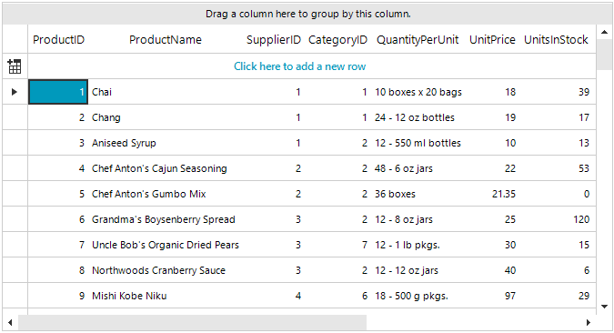

## Environment
 
|Product Version|Product|Author|
|----|----|----|
|2019.2.618|RadGridView for WinForms|[Desislava Yordanova](https://www.telerik.com/blogs/author/desislava-yordanova)|
 

## Description

This tutorial demonstrates how to drag a single cell in **RadGridView** in such a way that you can copy the content of one cell into multiple cells similar to MS Excel. 



>note While performing the multiple selection in **RadGridView** and dragging and dropping the cell, it is necessary to keep the `Ctrl` key pressed. Thus, the multiple selection will be preserved. 

## Solution 

You can enable the multiple cell selection in **RadGridView** by setting the [MultiSelect]() property to *true* and the **SelectionMode** property to *CellSelect*. Then, in the **PreviewDragDrop** event of the [RadDragDropService](), you can adjust the value of the selected cells considering the value of the current cell. 

````C#
public RadForm1()
{
    InitializeComponent();

    this.radGridView1.MultiSelect = true;
    this.radGridView1.SelectionMode = GridViewSelectionMode.CellSelect;

    RadDragDropService svc =
        this.radGridView1.GridViewElement.GetService<RadDragDropService>();
    svc.PreviewDragStart += svc_PreviewDragStart;
    svc.PreviewDragDrop += svc_PreviewDragDrop;
    svc.PreviewDragOver += svc_PreviewDragOver;
    svc.PreviewDropTarget += svc_PreviewDropTarget;

    //register the custom row selection behavior
    var gridBehavior = this.radGridView1.GridBehavior as BaseGridBehavior;
    gridBehavior.UnregisterBehavior(typeof(GridViewDataRowInfo));
    gridBehavior.RegisterBehavior(typeof(GridViewDataRowInfo), new RowSelectionGridBehavior());
}

private void svc_PreviewDropTarget(object sender, PreviewDropTargetEventArgs e)
{
    e.DropTarget = e.HitTarget;
}

//initiates drag and drop service for clicked rows
public class RowSelectionGridBehavior : GridDataRowBehavior
{
    protected override bool OnMouseDownLeft(MouseEventArgs e)
    {
        GridDataRowElement row = this.GetRowAtPoint(e.Location) as GridDataRowElement;
        if (row != null)
        {
            RadGridViewDragDropService svc = this.GridViewElement.GetService<RadGridViewDragDropService>();
            svc.AllowAutoScrollColumnsWhileDragging = false;
            svc.AllowAutoScrollRowsWhileDragging = true;
            svc.Start(new SnapshotDragItem(row));
        }
        return base.OnMouseDownLeft(e);
    }
}
GridViewRowInfo draggedRow;
//required to initiate drag and drop when grid is in bound mode
private void svc_PreviewDragStart(object sender, PreviewDragStartEventArgs e)
{
    SnapshotDragItem draggedSnapShot = e.DragInstance as SnapshotDragItem;
    if (draggedSnapShot == null)
    {
        e.CanStart = false;
    }
    else
    {
        e.CanStart = true;
          GridDataRowElement dragRowElement = draggedSnapShot.Item as GridDataRowElement;
          draggedRow = dragRowElement.RowInfo;
    }
}

private void svc_PreviewDragOver(object sender, RadDragOverEventArgs e)
{
    SnapshotDragItem draggedSnapShot = e.DragInstance as SnapshotDragItem;
    if (draggedSnapShot == null)
    {
        return;
    }
    GridDataRowElement dragRowElement = draggedSnapShot.Item as GridDataRowElement;
    if (dragRowElement != null)
    {
        GridCellElement targetCell = e.HitTarget as GridCellElement;
        if (targetCell != null && draggedRow.ViewTemplate.CurrentColumn == targetCell.ColumnInfo)
        {
            e.CanDrop = true;
        }
        else
        {
            e.CanDrop = false;
        }
    }
}

private void svc_PreviewDragDrop(object sender, RadDropEventArgs e)
{
    SnapshotDragItem draggedSnapShot = e.DragInstance as SnapshotDragItem;
    if (draggedSnapShot==null)
    {
        return;
    }
    GridDataRowElement dragRowElement = draggedSnapShot.Item as GridDataRowElement;
    GridCellElement targetCell = e.HitTarget as GridCellElement;
    if (dragRowElement == null || targetCell == null)
    {
        return;
    }
    e.Handled = true;

    foreach (GridViewCellInfo cell in targetCell.GridControl.SelectedCells)
    {
        if (cell != draggedRow.ViewTemplate.MasterTemplate.CurrentRow.Cells[draggedRow.ViewTemplate.CurrentColumn.Name])
        {
             cell.Value = draggedRow.ViewTemplate.MasterTemplate.CurrentRow.Cells[draggedRow.ViewTemplate.CurrentColumn.Name].Value;
        }
    }
}

````
````VB.NET

    Public Sub New()
        InitializeComponent()
        Me.RadGridView1.MultiSelect = True
        Me.RadGridView1.SelectionMode = GridViewSelectionMode.CellSelect
        Dim svc As RadDragDropService = Me.RadGridView1.GridViewElement.GetService(Of RadDragDropService)()
        AddHandler svc.PreviewDragStart, AddressOf svc_PreviewDragStart
        AddHandler svc.PreviewDragDrop, AddressOf svc_PreviewDragDrop
        AddHandler svc.PreviewDragOver, AddressOf svc_PreviewDragOver
        AddHandler svc.PreviewDropTarget, AddressOf svc_PreviewDropTarget
        Dim gridBehavior = TryCast(Me.RadGridView1.GridBehavior, BaseGridBehavior)
        gridBehavior.UnregisterBehavior(GetType(GridViewDataRowInfo))
        gridBehavior.RegisterBehavior(GetType(GridViewDataRowInfo), New RowSelectionGridBehavior())
    End Sub

    Private Sub svc_PreviewDropTarget(ByVal sender As Object, ByVal e As PreviewDropTargetEventArgs)
        e.DropTarget = e.HitTarget
    End Sub

    Public Class RowSelectionGridBehavior
    Inherits GridDataRowBehavior

        Protected Overrides Function OnMouseDownLeft(ByVal e As MouseEventArgs) As Boolean
            Dim row As GridDataRowElement = TryCast(Me.GetRowAtPoint(e.Location), GridDataRowElement)

            If row IsNot Nothing Then
                Dim svc As RadGridViewDragDropService = Me.GridViewElement.GetService(Of RadGridViewDragDropService)()
                svc.AllowAutoScrollColumnsWhileDragging = False
                svc.AllowAutoScrollRowsWhileDragging = False
                svc.Start(row)
            End If

            Return MyBase.OnMouseDownLeft(e)
        End Function
    End Class

    Private Sub svc_PreviewDragStart(ByVal sender As Object, ByVal e As PreviewDragStartEventArgs)
        e.CanStart = True
    End Sub

    Private Sub svc_PreviewDragOver(ByVal sender As Object, ByVal e As RadDragOverEventArgs)
        Dim dragRowElement As GridDataRowElement = TryCast(e.DragInstance, GridDataRowElement)

        If dragRowElement IsNot Nothing Then
            Dim targetCell As GridCellElement = TryCast(e.HitTarget, GridCellElement)

            If targetCell IsNot Nothing AndAlso dragRowElement.GridControl.CurrentColumn.Equals(targetCell.ColumnInfo) Then
                e.CanDrop = True
            Else
                e.CanDrop = False
            End If
        End If
    End Sub

    Private Sub svc_PreviewDragDrop(ByVal sender As Object, ByVal e As RadDropEventArgs)
        Dim dragRowElement As GridDataRowElement = TryCast(e.DragInstance, GridDataRowElement)
        Dim targetCell As GridCellElement = TryCast(e.HitTarget, GridCellElement)

        If dragRowElement Is Nothing OrElse targetCell Is Nothing Then
            Return
        End If

        e.Handled = True

        For Each cell As GridViewCellInfo In targetCell.GridControl.SelectedCells

            If Not cell.Equals(dragRowElement.GridViewElement.CurrentRow.Cells(dragRowElement.GridViewElement.CurrentColumn.Name)) Then
                cell.Value = dragRowElement.GridViewElement.CurrentCell.Value
            End If
        Next
    End Sub      

```` 

# See Also

* [RadDragDropService]()
* [Copy, Paste, Cut]() 


    
   
  
    
 
