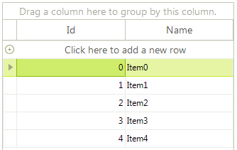

## Environment
<table>
	<tr>
		<td>Product Version</td>
		<td>2018.2.621</td>
	</tr>
	<tr>
		<td>Product</td>
		<td>RadGridView for WinForms</td>
	</tr>
</table>


## Description

**RadGridView** supports [rows reordering]() and it can be done by the user at run time. However, rows reordering is only available for grids in unbound mode. This article demonstrates a sample approach how to achieve rows reordering by drag and drop functionality in a bound grid.

## Solution

Consider the grid is bound to a collection of custom objects. Note that **RadGridView** handles the whole drag and drop operation by its [RadGridViewDragDropService](). We will utilize the service in order to achieve the desired rows reordering by using drag and drop behavior. 

>caption Figure 1: Rows reordering in bound grid



There are two main points for accomplishing the following behavior:

1. Register a custom [GridDataRowBehavior]() which starts the [RadGridViewDragDropService]() when you click with the left mouse button.

1. Handle the RadDragDropService.**PreviewDragStart** event in order to indicate that **RadGridView** can start the drag operation. In the RadDragDropService.**PreviewDragOver** event you can control on what targets the row being dragged can be dropped on. In the **PreviewDragDrop** event you can perform the actual reordering of the data bound records. Note that it is important to remove the dragged record from the **DataSource** collection and insert it at the new index. You don't manipulate the RadGridView.**Rows** collection but the **DataSource** collection and its records.

You can find below a complete sample code snippet demonstrating how to bind **RadGridView** to a collection of custom objects and 

{{source=..\SamplesCS\KnowledgeBase\GridViewRowsReorderBoundMode.cs region=ReorderRows}} 
{{source=..\SamplesVB\KnowledgeBase\GridViewRowsReorderBoundMode.vb region=ReorderRows}} 

````C#
public GridViewRowsReorderBoundMode()
{
    InitializeComponent();
    BindingList<Item> items = new BindingList<Item>();
    for (int i = 0; i < 5; i++)
    {
        items.Add(new Item(i, "Item" + i));
    }
    this.radGridView1.DataSource = items;
    this.radGridView1.AutoSizeColumnsMode = Telerik.WinControls.UI.GridViewAutoSizeColumnsMode.Fill;
    //register the custom row behavior
    BaseGridBehavior gridBehavior = this.radGridView1.GridBehavior as BaseGridBehavior;
    gridBehavior.UnregisterBehavior(typeof(GridViewDataRowInfo));
    gridBehavior.RegisterBehavior(typeof(GridViewDataRowInfo), new CustomGridDataRowBehavior());
    //handle drag and drop events for the grid through the DragDrop service
    RadDragDropService svc =
        this.radGridView1.GridViewElement.GetService<RadDragDropService>();
    svc.PreviewDragStart += svc_PreviewDragStart;
    svc.PreviewDragDrop += svc_PreviewDragDrop;
    svc.PreviewDragOver += svc_PreviewDragOver;
}
//required to initiate drag and drop when grid is in bound mode
private void svc_PreviewDragStart(object sender, PreviewDragStartEventArgs e)
{
    e.CanStart = true;
}
private void svc_PreviewDragOver(object sender, RadDragOverEventArgs e)
{
    if (e.DragInstance is GridDataRowElement)
    {
        e.CanDrop = e.HitTarget is GridDataRowElement ||
                    e.HitTarget is GridTableElement ||
                    e.HitTarget is GridSummaryRowElement;
    }
}
//initiate the move of selected row
private void svc_PreviewDragDrop(object sender, RadDropEventArgs e)
{
    GridDataRowElement rowElement = e.DragInstance as GridDataRowElement;
    if (rowElement == null)
    {
        return;
    }
    e.Handled = true;
    RadItem dropTarget = e.HitTarget as RadItem;
    RadGridView targetGrid = dropTarget.ElementTree.Control as RadGridView;
    if (targetGrid == null)
    {
        return;
    }
    var dragGrid = rowElement.ElementTree.Control as RadGridView;
    if (targetGrid == dragGrid)
    {
        e.Handled = true;
        GridDataRowElement dropTargetRow = dropTarget as GridDataRowElement;
        int index = dropTargetRow != null ? this.GetTargetRowIndex(dropTargetRow, e.DropLocation) : targetGrid.RowCount;
        GridViewRowInfo rowToDrag = dragGrid.SelectedRows[0];
        this.MoveRows(dragGrid, rowToDrag, index);
    }
}
private int GetTargetRowIndex(GridDataRowElement row, Point dropLocation)
{
    int halfHeight = row.Size.Height / 2;
    int index = row.RowInfo.Index;
    if (dropLocation.Y > halfHeight)
    {
        index++;
    }
    return index;
}
private void MoveRows(RadGridView dragGrid,
    GridViewRowInfo dragRow, int index)
{
    dragGrid.BeginUpdate();
    GridViewRowInfo row = dragRow;
    if (row is GridViewSummaryRowInfo)
    {
        return;
    }
    if (dragGrid.DataSource != null && typeof(System.Collections.IList).IsAssignableFrom(dragGrid.DataSource.GetType()))
    {
        //bound to a list of objects scenario
        var sourceCollection = (System.Collections.IList)dragGrid.DataSource;
        if (row.Index < index)
        {
            index--;
        }
        sourceCollection.Remove(row.DataBoundItem);
        sourceCollection.Insert(index, row.DataBoundItem);
    }
    else
    {
        throw new ApplicationException("Unhandled Scenario");
    }
    dragGrid.EndUpdate(true);
}
public class CustomGridDataRowBehavior : GridDataRowBehavior
{
    protected override bool OnMouseDownLeft(MouseEventArgs e)
    {
        GridDataRowElement row = this.GetRowAtPoint(e.Location) as GridDataRowElement;
        if (row != null)
        {
            RadGridViewDragDropService svc = this.GridViewElement.GetService<RadGridViewDragDropService>();
            svc.AllowAutoScrollColumnsWhileDragging = false;
            svc.AllowAutoScrollRowsWhileDragging = false;
            svc.Start(row);
        }
        return base.OnMouseDownLeft(e);
    }
}
public class Item
{
    public Item(int id, string name)
    {
        this.Id = id;
        this.Name = name;
    }
    public int Id { get; set; }
    public string Name { get; set; }
}

````
````VB.NET
Sub New()
    InitializeComponent()
    Dim items As BindingList(Of Item) = New BindingList(Of Item)()
    For i As Integer = 0 To 5 - 1
        items.Add(New Item(i, "Item" & i))
    Next
    Me.RadGridView1.DataSource = items
    Me.RadGridView1.AutoSizeColumnsMode = Telerik.WinControls.UI.GridViewAutoSizeColumnsMode.Fill
    Dim gridBehavior As BaseGridBehavior = TryCast(Me.RadGridView1.GridBehavior, BaseGridBehavior)
    gridBehavior.UnregisterBehavior(GetType(GridViewDataRowInfo))
    gridBehavior.RegisterBehavior(GetType(GridViewDataRowInfo), New CustomGridDataRowBehavior())
    Dim svc As RadDragDropService = Me.RadGridView1.GridViewElement.GetService(Of RadDragDropService)()
    AddHandler svc.PreviewDragStart, AddressOf svc_PreviewDragStart
    AddHandler svc.PreviewDragDrop, AddressOf svc_PreviewDragDrop
    AddHandler svc.PreviewDragOver, AddressOf svc_PreviewDragOver
End Sub
Private Sub svc_PreviewDragStart(ByVal sender As Object, ByVal e As PreviewDragStartEventArgs)
    e.CanStart = True
End Sub
Private Sub svc_PreviewDragOver(ByVal sender As Object, ByVal e As RadDragOverEventArgs)
    If TypeOf e.DragInstance Is GridDataRowElement Then
        e.CanDrop = TypeOf e.HitTarget Is GridDataRowElement OrElse TypeOf e.HitTarget Is GridTableElement OrElse TypeOf e.HitTarget Is GridSummaryRowElement
    End If
End Sub
Private Sub svc_PreviewDragDrop(ByVal sender As Object, ByVal e As RadDropEventArgs)
    Dim rowElement As GridDataRowElement = TryCast(e.DragInstance, GridDataRowElement)
    If rowElement Is Nothing Then
        Return
    End If
    e.Handled = True
    Dim dropTarget As RadItem = TryCast(e.HitTarget, RadItem)
    Dim targetGrid As RadGridView = TryCast(dropTarget.ElementTree.Control, RadGridView)
    If targetGrid Is Nothing Then
        Return
    End If
    Dim dragGrid = TryCast(rowElement.ElementTree.Control, RadGridView)
    If targetGrid.Equals(dragGrid) Then
        e.Handled = True
        Dim dropTargetRow As GridDataRowElement = TryCast(dropTarget, GridDataRowElement)
        Dim index As Integer = If(dropTargetRow IsNot Nothing, Me.GetTargetRowIndex(dropTargetRow, e.DropLocation), targetGrid.RowCount)
        Dim rowToDrag As GridViewRowInfo = dragGrid.SelectedRows(0)
        Me.MoveRows(dragGrid, rowToDrag, index)
    End If
End Sub
Private Function GetTargetRowIndex(ByVal row As GridDataRowElement, ByVal dropLocation As Point) As Integer
    Dim halfHeight As Integer = row.Size.Height / 2
    Dim index As Integer = row.RowInfo.Index
    If dropLocation.Y > halfHeight Then
        index += 1
    End If
    Return index
End Function
Private Sub MoveRows(ByVal dragGrid As RadGridView, ByVal dragRow As GridViewRowInfo, ByVal index As Integer)
    dragGrid.BeginUpdate()
    Dim row As GridViewRowInfo = dragRow
    If TypeOf row Is GridViewSummaryRowInfo Then
        Return
    End If
    If dragGrid.DataSource IsNot Nothing AndAlso GetType(System.Collections.IList).IsAssignableFrom(dragGrid.DataSource.[GetType]()) Then
        Dim sourceCollection = CType(dragGrid.DataSource, System.Collections.IList)
        If row.Index < index Then
            index -= 1
        End If
        sourceCollection.Remove(row.DataBoundItem)
        sourceCollection.Insert(index, row.DataBoundItem)
    Else
        Throw New ApplicationException("Unhandled Scenario")
    End If
    dragGrid.EndUpdate(True)
End Sub
Public Class CustomGridDataRowBehavior
Inherits GridDataRowBehavior
    Protected Overrides Function OnMouseDownLeft(ByVal e As MouseEventArgs) As Boolean
        Dim row As GridDataRowElement = TryCast(Me.GetRowAtPoint(e.Location), GridDataRowElement)
        If row IsNot Nothing Then
            Dim svc As RadGridViewDragDropService = Me.GridViewElement.GetService(Of RadGridViewDragDropService)()
            svc.AllowAutoScrollColumnsWhileDragging = False
            svc.AllowAutoScrollRowsWhileDragging = False
            svc.Start(row)
        End If
        Return MyBase.OnMouseDownLeft(e)
    End Function
End Class
Public Class Item
    Public Sub New(ByVal id As Integer, ByVal name As String)
        Me.Id = id
        Me.Name = name
    End Sub
    Public Property Id As Integer
    Public Property Name As String
End Class

````

{{endregion}} 

>tip A complete solution providing a C# and VB.NET project is available [here](https://github.com/telerik/winforms-sdk/tree/master/GridView/BoundGridReorderRows).

# See Also

 * [RadGridViewDragDropService]()
 * [Rows Reordering in Self-reference Hierarchy]()

