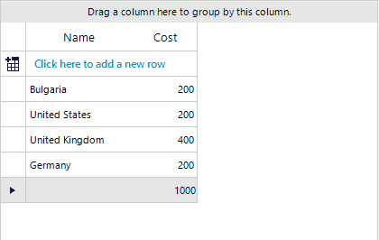

## Environment

|Product Version|Product|Author|
|----|----|----|
|2022.1.222|RadGridView for WinForms|[Dinko Krastev](https://www.telerik.com/blogs/author/dinko-krastev)|


## Description

Some scenarios will require to have an editable summary row. This article shows how to achieve this functionality, so when the user clicks on the summary cell, the editor will appear. Editing the summary cell value will affect the values of the cells in this column. For the purpose of this tutorial, we will populate our RadGridVew with custom data and set the second column to be __GridViewDecimalColumn__. The value in the summary cell will represent the sum of all cells inside this column. Modifying the summary cell will proportionally change the values inside each cell.



## Solution 

1. First we need to populate our RadGridVew with some dummy data.

````C#

public class Country :ViewModelBase
{
    private string name;

    public string Name
    {
        get { return name; }
        set { name = value;this.OnPropertyChanged("Name"); }
    }

    private double cost;
    public double Cost
    {
        get { return cost; }
        set { cost = value; this.OnPropertyChanged("Cost"); }
    }
}

public partial class RadForm1 : Telerik.WinControls.UI.RadForm
{
    public RadForm1()
    {
        InitializeComponent();
        BindingList<Country> countries = new BindingList<Country>();
        countries.Add(new Country() { Name = "Bulgaria", Cost = 200 });
        countries.Add(new Country() { Name = "United States", Cost = 200 });
        countries.Add(new Country() { Name = "United Kingdom", Cost = 400 });
        countries.Add(new Country() { Name = "Germany", Cost = 200 });

        this.radGridView1.AutoGenerateColumns = false;
        this.radGridView1.Columns.Add(new GridViewTextBoxColumn("Name"));
        this.radGridView1.Columns.Add(new CustomColumn("Cost"));
        this.radGridView1.DataSource = countries;

        GridViewSummaryItem summaryItem = new GridViewSummaryItem();
        summaryItem.Name = "Cost";
        summaryItem.Aggregate = GridAggregateFunction.Sum;

        GridViewSummaryRowItem summaryRowItem = new GridViewSummaryRowItem();
        summaryRowItem.Add(summaryItem);

        this.radGridView1.SummaryRowsTop.Add(summaryRowItem);
    }
}
          

````
````VB.NET
    
Public Class Country
    Inherits ViewModelBase

    Private _name As String

    Public Property Name As String
        Get
            Return Name
        End Get
        Set(ByVal value As String)
            _name = value
            Me.OnPropertyChanged("Name")
        End Set
    End Property

    Private _cost As Double

    Public Property Cost As Double
        Get
            Return Cost
        End Get
        Set(ByVal value As Double)
            _cost = value
            Me.OnPropertyChanged("Cost")
        End Set
    End Property
End Class

Public Partial Class RadForm1
    Inherits Telerik.WinControls.UI.RadForm

    Public Sub New()
        InitializeComponent()
        Dim countries As BindingList(Of Country) = New BindingList(Of Country)()
        countries.Add(New Country() With {
            .Name = "Bulgaria",
            .Cost = 200
        })
        countries.Add(New Country() With {
            .Name = "United States",
            .Cost = 200
        })
        countries.Add(New Country() With {
            .Name = "United Kingdom",
            .Cost = 400
        })
        countries.Add(New Country() With {
            .Name = "Germany",
            .Cost = 200
        })
        Me.radGridView1.AutoGenerateColumns = False
        Me.radGridView1.Columns.Add(New GridViewTextBoxColumn("Name"))
        Me.radGridView1.Columns.Add(New CustomColumn("Cost"))
        Me.radGridView1.DataSource = countries
        Dim summaryItem As GridViewSummaryItem = New GridViewSummaryItem()
        summaryItem.Name = "Cost"
        summaryItem.Aggregate = GridAggregateFunction.Sum
        Dim summaryRowItem As GridViewSummaryRowItem = New GridViewSummaryRowItem()
        summaryRowItem.Add(summaryItem)
        Me.radGridView1.SummaryRowsTop.Add(summaryRowItem)
    End Sub
End Class

    
````

2. Now to implement editable summary cell, we need to create custom column(__GridViewDecimalColumn__) and replace the default summary cell with a custom one.

````C#

public class CustomColumn : GridViewDecimalColumn
{
    public CustomColumn(string fieldName) : base(fieldName) { }

    public override Type GetCellType(GridViewRowInfo row)
    {
        if (row is GridViewSummaryRowInfo && this.FieldName == "Cost")
        {
            return typeof(CustomSummaryCell);
        }
        return base.GetCellType(row);
    }
}         

````
````VB.NET
Public Class CustomColumn
    Inherits GridViewDecimalColumn

    Public Sub New(ByVal fieldName As String)
        MyBase.New(fieldName)
    End Sub

    Public Overrides Function GetCellType(ByVal row As GridViewRowInfo) As Type
        If TypeOf row Is GridViewSummaryRowInfo AndAlso Me.FieldName = "Cost" Then
            Return GetType(CustomSummaryCell)
        End If

        Return MyBase.GetCellType(row)
    End Function
End Class
    
    
````

3. The final step will be our custom summary cell. Your class should derive from the __GridDataCellElement__ so that you can get advantage of the default editing mechanism and editor. In the following code snippet, you can observe that we have subscribe to the __ValueChanged__ of the editor. In the event handler, when the summary cell is edited, the values inside the cells will proportionally change.

````C#

public class CustomSummaryCell : GridDataCellElement
{
    private double initialValue = -1;       
    public CustomSummaryCell(GridViewColumn column, GridRowElement row) : base(column, row)
    {
          
    }
    protected override void OnMouseUp(MouseEventArgs e)
    {
        base.OnMouseUp(e);
        this.GridControl.CurrentRow = this.RowInfo;
        this.GridControl.CurrentColumn = this.ColumnInfo;
        this.IsCurrent = true;
        this.GridViewElement.BeginEdit();
        if (this.Editor != null)
        {
            var spinEditor = this.Editor as GridSpinEditor;
            spinEditor.Step = 200;
            spinEditor.MinValue = 200;
            spinEditor.ValueChanged += SpinEditor_ValueChanged;
        }
    }
    public override bool IsCompatible(GridViewColumn data, object context)
    {
        if (data is CustomColumn && context is GridViewSummaryRowInfo)
        {
            return true;
        }
        return base.IsCompatible(data, context);
    }
    private void SpinEditor_ValueChanged(object sender, EventArgs e)
    {
        this.Editor.ValueChanged -= SpinEditor_ValueChanged;
        var gridSpinEditor = this.Editor as GridSpinEditor;

        if (gridSpinEditor == null)
        {
            return;
        }

        var newTextBoxValue = double.Parse(gridSpinEditor.Value.ToString());

        if (newTextBoxValue < 100)
        {
            gridSpinEditor.Value = 100;
            return;
        }

        if (Double.TryParse(this.Value + "", out initialValue))
        {

            var increase = newTextBoxValue - initialValue;
            bool isIncreased = true;
            if (increase < 0)
            {
                increase = increase * -1;
                isIncreased = false;
            }

            double percentComplete = Math.Round((double)(100 * increase) / initialValue) / 100;

            var sourceCollection = this.RowInfo.ViewTemplate.DataSource as BindingList<Country>;
            double currentSum = 0;
            this.RowInfo.ViewTemplate.BeginUpdate();
            foreach (var item in sourceCollection)
            {
                if (isIncreased)
                {
                    item.Cost += Math.Round(item.Cost * percentComplete, 1);
                }
                else
                {
                    item.Cost -= Math.Round(item.Cost * percentComplete, 1);

                }

                if (item.Cost <= 0)
                {
                    item.Cost = 1;
                }

                currentSum += item.Cost;
            }
            if (currentSum != newTextBoxValue)
            {
                sourceCollection.Last().Cost += newTextBoxValue - currentSum;
            }
            this.Editor.ValueChanged += SpinEditor_ValueChanged;

            this.RowInfo.ViewTemplate.EndUpdate();
        }

    }
    public override void RemoveEditor(IInputEditor editor)
    {
        this.Editor.ValueChanged -= SpinEditor_ValueChanged;
        base.RemoveEditor(editor);
    }
}
         

````
````VB.NET

Public Class CustomSummaryCell
    Inherits GridDataCellElement

    Private initialValue As Double = -1

    Public Sub New(ByVal column As GridViewColumn, ByVal row As GridRowElement)
        MyBase.New(column, row)
    End Sub

    Protected Overrides Sub OnMouseUp(ByVal e As MouseEventArgs)
        MyBase.OnMouseUp(e)
        Me.GridControl.CurrentRow = Me.RowInfo
        Me.GridControl.CurrentColumn = Me.ColumnInfo
        Me.IsCurrent = True
        Me.GridViewElement.BeginEdit()

        If Me.Editor IsNot Nothing Then
            Dim spinEditor = TryCast(Me.Editor, GridSpinEditor)
            spinEditor.[Step] = 200
            spinEditor.MinValue = 200
            AddHandler spinEditor.ValueChanged, AddressOf SpinEditor_ValueChanged
        End If
    End Sub

    Public Overrides Function IsCompatible(ByVal data As GridViewColumn, ByVal context As Object) As Boolean
        If TypeOf data Is CustomColumn AndAlso TypeOf context Is GridViewSummaryRowInfo Then
            Return True
        End If

        Return MyBase.IsCompatible(data, context)
    End Function

    Private Sub SpinEditor_ValueChanged(ByVal sender As Object, ByVal e As EventArgs)
        RemoveHandler Me.Editor.ValueChanged, AddressOf SpinEditor_ValueChanged
        Dim gridSpinEditor = TryCast(Me.Editor, GridSpinEditor)

        If gridSpinEditor Is Nothing Then
            Return
        End If

        Dim newTextBoxValue = Double.Parse(gridSpinEditor.Value.ToString())

        If newTextBoxValue < 100 Then
            gridSpinEditor.Value = 100
            Return
        End If

        If Double.TryParse(Me.Value & "", initialValue) Then
            Dim increase = newTextBoxValue - initialValue
            Dim isIncreased As Boolean = True

            If increase < 0 Then
                increase = increase * -1
                isIncreased = False
            End If

            Dim percentComplete As Double = Math.Round(CDbl((100 * increase)) / initialValue) / 100
            Dim sourceCollection = TryCast(Me.RowInfo.ViewTemplate.DataSource, BindingList(Of Country))
            Dim currentSum As Double = 0
            Me.RowInfo.ViewTemplate.BeginUpdate()

            For Each item In sourceCollection

                If isIncreased Then
                    item.Cost += Math.Round(item.Cost * percentComplete, 1)
                Else
                    item.Cost -= Math.Round(item.Cost * percentComplete, 1)
                End If

                If item.Cost <= 0 Then
                    item.Cost = 1
                End If

                currentSum += item.Cost
            Next

            If currentSum <> newTextBoxValue Then
                sourceCollection.Last().Cost += newTextBoxValue - currentSum
            End If

            AddHandler Me.Editor.ValueChanged, AddressOf SpinEditor_ValueChanged
            Me.RowInfo.ViewTemplate.EndUpdate()
        End If
    End Sub

    Public Overrides Sub RemoveEditor(ByVal editor As IInputEditor)
        RemoveHandler Me.Editor.ValueChanged, AddressOf SpinEditor_ValueChanged
        MyBase.RemoveEditor(editor)
    End Sub
End Class

    
````


    
   
  
    
 
