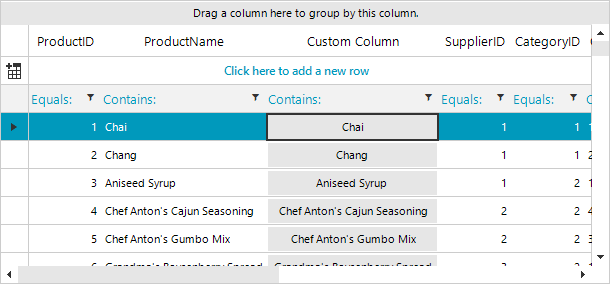

## Environment
 
|Product Version|Product|Author|
|----|----|----|
|2022.1.222|RadGridView for WinForms|[Desislava Yordanova](https://www.telerik.com/blogs/author/desislava-yordanova)|


## Description

[GridViewCommandColumn]() is not purposed to provide filtering as its data cells are expected to offer a button element, not a text value. This tutorial will demonstrate a sample approach how to provide such a filtering functionality.



## Solution

A possible solution is to use a [GridViewTextBoxColumn]() and construct a [custom cell element]() for its data cells that contain a button. Thus, the filtering functionality will be allowed out of the box considering the text value of each cell. 

You can find below a sample code snippet for your reference. Let's consider that the RadGridView control is bound to the Northwind.Products table: 


````C#            

public Form1()
{
    InitializeComponent();          

    CustomGridViewTextBoxColumn customColumn = new CustomGridViewTextBoxColumn();
    customColumn.HeaderText = "Custom Column";
    customColumn.FieldName = "ProductName";
    this.radGridView1.Columns.Add(customColumn);
    this.radGridView1.EnableFiltering = true;
}

public class CustomGridViewTextBoxColumn : GridViewTextBoxColumn
{
    public override Type GetCellType(GridViewRowInfo row)
    {
        if (row is GridViewDataRowInfo)
        {
            return typeof(ButtonGridDataCellElement);
        }
        return base.GetCellType(row);
    }
}

public class ButtonGridDataCellElement : GridDataCellElement
{
    public override void AddEditor(IInputEditor editor)
    {
        if (this.GridControl.CurrentRow is GridViewDataRowInfo)
        {
            return;
        }
        base.AddEditor(editor);
    }

    public ButtonGridDataCellElement(GridViewColumn column, GridRowElement row) : base(column, row)
    {
    }
    protected override Type ThemeEffectiveType
    {
        get
        {
            return typeof(GridDataCellElement);
        }
    }
    public override bool IsCompatible(GridViewColumn data, object context)
    {
        return data is CustomGridViewTextBoxColumn && context is GridDataRowElement;
    }

    RadButtonElement btn = new RadButtonElement();
    protected override void CreateChildElements()
    {
        base.CreateChildElements();
        this.Children.Add(btn);
        btn.Click += Btn_Click;
    }

    private void Btn_Click(object? sender, EventArgs e)
    {
        RadMessageBox.Show(this.Value + "");
    }


    protected override void SetContentCore(object value)
    {
        base.SetContentCore(value);
        this.DrawText = false;
        this.btn.Text = this.Text;
    }

    public RadButtonElement Button { get { return this.btn; } }
}

````
````VB.NET

Sub New()

    InitializeComponent()

    Dim customColumn As New CustomGridViewTextBoxColumn()
    customColumn.HeaderText = "Custom Column"
    customColumn.FieldName = "ProductName"
    Me.RadGridView1.Columns.Add(customColumn)
    Me.RadGridView1.EnableFiltering = True
End Sub

Public Class CustomGridViewTextBoxColumn
    Inherits GridViewTextBoxColumn

    Public Overrides Function GetCellType(ByVal row As GridViewRowInfo) As Type
        If TypeOf row Is GridViewDataRowInfo Then
            Return GetType(ButtonGridDataCellElement)
        End If

        Return MyBase.GetCellType(row)
    End Function
End Class

Public Class ButtonGridDataCellElement
    Inherits GridDataCellElement

    Public Overrides Sub AddEditor(ByVal editor As IInputEditor)
        If TypeOf Me.GridControl.CurrentRow Is GridViewDataRowInfo Then
            Return
        End If

        MyBase.AddEditor(editor)
    End Sub

    Public Sub New(ByVal column As GridViewColumn, ByVal row As GridRowElement)
        MyBase.New(column, row)
    End Sub

    Protected Overrides ReadOnly Property ThemeEffectiveType As Type
        Get
            Return GetType(GridDataCellElement)
        End Get
    End Property

    Public Overrides Function IsCompatible(ByVal data As GridViewColumn, ByVal context As Object) As Boolean
        Return TypeOf data Is CustomGridViewTextBoxColumn AndAlso TypeOf context Is GridDataRowElement
    End Function

    Private btn As RadButtonElement

    Protected Overrides Sub CreateChildElements()
        MyBase.CreateChildElements()
        btn = New RadButtonElement()
        Me.Children.Add(btn)
        AddHandler btn.Click, AddressOf Btn_Click
    End Sub

    Private Sub Btn_Click(ByVal sender As Object, ByVal e As EventArgs)
        RadMessageBox.Show(Me.Value & "")
    End Sub

    Protected Overrides Sub SetContentCore(ByVal value As Object)
        MyBase.SetContentCore(value)
        Me.DrawText = False
        Me.btn.Text = Me.Text
    End Sub

    Public ReadOnly Property Button As RadButtonElement
        Get
            Return Me.btn
        End Get
    End Property
End Class


````

# See Also

* [GridViewCommandColumn]()