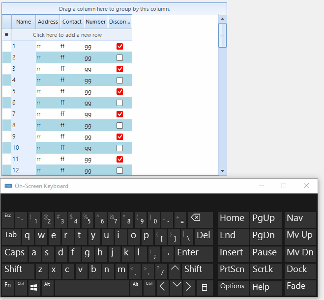

## Environment
 
|Product Version|Product|Author|
|----|----|----|
|2021.3.914|RadGridView for WinForms|[Desislava Yordanova](https://www.telerik.com/blogs/author/desislava-yordanova)|
 
## Description

When you press the down arrow key, it is expected to move the current row in RadGridView to the next one. Thus, the style for the new current row should be updated depending on the theme and the old current row's style to be reset. This will move the vertical scrollbar respectively. However, if you keep the down arrow key pressed, this will trigger multiple operations of moving the current row to the next row until you release the down arrow key. RadGridView will try to scroll the view according to the current row and refresh the view. However, when multiple scrolling operations and changing the current row are being executed at the same time, this invalidation is not instant as changing the current row is an expensive operation. This tutorial demonstrates a sample approach how to speed up the scrolling behavior when the down arrow key is kept pressed.
 
#### Imporved scrolling performance with Down Arrow key



## Solution 

One possible approach is to use the vertical scrollbar and scroll the view. The TableElement.RowScroller.**ScrollMode** property gives you different options for scrolling the view. ItemScrollerScrollModes.**Deferred** is a perfect fit for improving performance as the view is scrolled when you release the thumb. Thus, the current row is not changed in this case and the scrolling is smooth. 

Alternatively, with the help of a custom [row behavior](), you can customize the behavior for the down arrow and change the current row only when you release the down arrow key. While the key is pressed, only scrolling operation is performed. I have prepared a sample code snippet for your reference: 

#### Custom row behavior

````C#

public class CustomGridDataRowBehavior : GridDataRowBehavior
{
    protected override bool ProcessDownKey(KeyEventArgs keys)
    {
        if (this.GridControl.CurrentRow is GridViewNewRowInfo && 
            this.MasterTemplate.SelectLastAddedRow && this.GridControl.IsInEditMode)
        {
            this.GridControl.EndEdit();
            return true;
        }

        this.GridControl.TableElement.VScrollBar.Value = Math.Min(this.GridControl.TableElement.VScrollBar.Maximum - 
            this.GridControl.TableElement.VScrollBar.LargeChange - 1,
            this.GridControl.TableElement.VScrollBar.Value + this.GridControl.TableElement.VScrollBar.SmallChange);

        return true;
    }
    public override bool ProcessKeyUp(KeyEventArgs keys)
    {
        if (keys.KeyData == Keys.Down)
        {
            this.GridControl.CurrentRow = this.GridControl.CurrentView.VisualRows.Last().RowInfo;
        }
        return base.ProcessKeyUp(keys);
    }
}      

````
````VB.NET
Public Class CustomGridDataRowBehavior
    Inherits GridDataRowBehavior

    Protected Overrides Function ProcessDownKey(ByVal keys As KeyEventArgs) As Boolean
        If TypeOf Me.GridControl.CurrentRow Is GridViewNewRowInfo AndAlso
            Me.MasterTemplate.SelectLastAddedRow AndAlso Me.GridControl.IsInEditMode Then
            Me.GridControl.EndEdit()
            Return True
        End If

        Me.GridControl.TableElement.VScrollBar.Value = Math.Min(Me.GridControl.TableElement.VScrollBar.Maximum -
                   Me.GridControl.TableElement.VScrollBar.LargeChange - 1,
               Me.GridControl.TableElement.VScrollBar.Value + Me.GridControl.TableElement.VScrollBar.SmallChange)
        Return True
    End Function

    Public Overrides Function ProcessKeyUp(ByVal keys As KeyEventArgs) As Boolean
        If keys.KeyData.Equals(Windows.Forms.Keys.Down) Then
            Me.GridControl.CurrentRow = Me.GridControl.CurrentView.VisualRows.Last().RowInfo
        End If

        Return MyBase.ProcessKeyUp(keys)
    End Function
End Class  

```` 

Then, apply the behavior:

````C#

BaseGridBehavior gridBehavior = radGridView1.GridBehavior as BaseGridBehavior;
gridBehavior.UnregisterBehavior(typeof(GridViewDataRowInfo));
gridBehavior.RegisterBehavior(typeof(GridViewDataRowInfo), new CustomGridDataRowBehavior());      

````
````VB.NET
Dim gridBehavior As BaseGridBehavior = TryCast(RadGridView1.GridBehavior, BaseGridBehavior)
gridBehavior.UnregisterBehavior(GetType(GridViewDataRowInfo))
gridBehavior.RegisterBehavior(GetType(GridViewDataRowInfo), New CustomGridDataRowBehavior()) 

```` 

# See Also

* [Row Behaviors]() 


    
   
  
    
 
