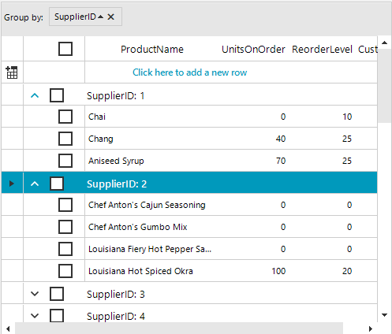

## Environment

|Product Version|Product|Author|
|----|----|----|
|2024.3.806|RadGridView for WinForms|[Dinko Krastev](https://www.telerik.com/blogs/author/dinko-krastev)|

## Description

When using the `GridViewSelectColumn` in a grouped scenario within RadGridView for WinForms, it might be beneficial to visually distinguish group rows from child rows. One way to achieve this is by indenting the Select Column Checkbox inside the parent group rows. This article demonstrates how to simulate checkbox indentation for a clearer visual hierarchy.



## Solution

To achieve the indentation effect for the Select Checkbox of child rows, you can adjust the `SelectColumnWidth` property and modify the `CheckBoxElement` alignment and margin in the `GridGroupRowSelectCellElement` through the `ViewCellFormatting` event. Follow these steps:

1. Increase the size of the select column by setting the `SelectColumnWidth` property to a larger value, for example, 50:

````C#
this.radGridView1.TableElement.SelectColumnWidth = 50;

````

2. Subscribe to the `ViewCellFormatting` event of RadGridView. Within the `ViewCellFormatting` event handler, adjust the `CheckBoxElement` in the `GridGroupRowSelectCellElement` to align it to the left and add a left margin. This simulates an indentation effect for group row checkboxes, leaving the child items' checkbox select cell position unchanged.

````C#
private void RadGridView1_ViewCellFormatting(object sender, CellFormattingEventArgs e)
{
    if (e.CellElement is GridGroupRowSelectCellElement selectGroupCellElement )
    {
        selectGroupCellElement.CheckBoxElement.CheckAlignment = ContentAlignment.MiddleLeft;
        selectGroupCellElement.CheckBoxElement.Margin = new Padding(5,0,0,0);
    }
}

````

## See Also

- [RadGridView for WinForms Documentation]()
- [GridViewSelectColumn]()
