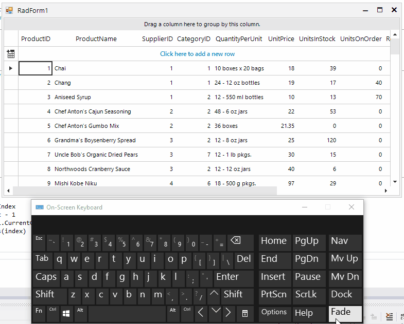

## Environment
 
|Product Version|Product|Author|
|----|----|----|
|2021.3.914|RadGridView for WinForms|[Desislava Yordanova](https://www.telerik.com/blogs/author/desislava-yordanova)|
 
## Description

A common requirement is to move to a specific row in a RadGridView by typing first letters of where you want to move (e.g. within the selected column). For example, select column **Description** and type **"L"**. The expected behavior is to move to the first description which begins with a **"L"**, if the user types **"LE"**, move to the first description which begins with **"LE"**, and so on.
 


This type of functionality is not supported out of the box. However, this article demonstrates a sample approach how to accomplish it. 

## Solution 

Such kind of behavior can be achieved by using a custom [row behavior]().


````C#

private void RadForm1_Load(object sender, EventArgs e)
{ 
    this.productsTableAdapter.Fill(this.nwindDataSet.Products);
    this.radGridView1.BestFitColumns();

    // register the custom row  behavior
    BaseGridBehavior gridBehavior = radGridView1.GridBehavior as BaseGridBehavior;
    gridBehavior.UnregisterBehavior(typeof(GridViewDataRowInfo));
    gridBehavior.RegisterBehavior(typeof(GridViewDataRowInfo), new CustomGridDataRowBehavior());

    this.radGridView1.SelectionMode = GridViewSelectionMode.CellSelect;
    this.radGridView1.BeginEditMode = Telerik.WinControls.RadGridViewBeginEditMode.BeginEditProgrammatically;
}

public class CustomGridDataRowBehavior : GridDataRowBehavior
{
    private Timer timer = new Timer();
    private string searchPattern = string.Empty;
    protected override bool ProcessAlphaNumericKey(KeyPressEventArgs keys)
    {
        if (!timer.Enabled)
        {
            timer.Interval = 1000;
            searchPattern = string.Empty;
            timer.Tick -= timer_Tick;
            timer.Tick += timer_Tick;
            timer.Start();
        }
        searchPattern = searchPattern + keys.KeyChar;
        Console.WriteLine(searchPattern);

        return base.ProcessAlphaNumericKey(keys);
    }

    private void timer_Tick(object sender, EventArgs e)
    {
        if (this.GridControl.CurrentColumn != null)
        {
            int startIndex = this.GridControl.CurrentRow.Index;
            for (var index = startIndex + 1; index <= this.GridControl.Rows.Count - 1; index++)
            {
                if ((this.GridControl.Rows[index].Cells[this.GridControl.CurrentColumn.Name].Value +
                    "").ToString().ToLower().StartsWith(searchPattern.ToLower()))
                {
                    this.GridControl.CurrentRow = this.GridControl.Rows[index];
                    break;
                }
            }
        }
        timer.Stop();
    }
}

````
````VB.NET

Private Sub RadForm1_Load(sender As Object, e As EventArgs) Handles MyBase.Load
    Me.ProductsTableAdapter.Fill(Me.NwindDataSet.Products)
    Me.RadGridView1.BestFitColumns()

    'register the custom row  behavior
    Dim gridBehavior As BaseGridBehavior = TryCast(RadGridView1.GridBehavior, BaseGridBehavior)
    gridBehavior.UnregisterBehavior(GetType(GridViewDataRowInfo))
    gridBehavior.RegisterBehavior(GetType(GridViewDataRowInfo), New CustomGridDataRowBehavior())

    Me.RadGridView1.SelectionMode = GridViewSelectionMode.CellSelect
    Me.RadGridView1.BeginEditMode = Telerik.WinControls.RadGridViewBeginEditMode.BeginEditProgrammatically
End Sub

Public Class CustomGridDataRowBehavior
    Inherits GridDataRowBehavior
    Dim timer As New Timer
    Dim searchPattern As String = String.Empty
    Protected Overrides Function ProcessAlphaNumericKey(keys As KeyPressEventArgs) As Boolean
        If Not timer.Enabled Then
            timer.Interval = 1000
            searchPattern = String.Empty
            RemoveHandler timer.Tick, AddressOf timer_Tick
            AddHandler timer.Tick, AddressOf timer_Tick
            timer.Start()
        End If
        searchPattern = searchPattern & keys.KeyChar
        Console.WriteLine(searchPattern)

        Return MyBase.ProcessAlphaNumericKey(keys)
    End Function

    Private Sub timer_Tick(sender As Object, e As EventArgs)
        If Me.GridControl.CurrentColumn IsNot Nothing Then
            Dim startIndex As Integer = Me.GridControl.CurrentRow.Index
            For index = startIndex + 1 To Me.GridControl.Rows.Count - 1
                If (Me.GridControl.Rows(index).Cells(Me.GridControl.CurrentColumn.Name).Value & "").ToString().ToLower().StartsWith(searchPattern.ToLower()) Then
                    Me.GridControl.CurrentRow = Me.GridControl.Rows(index)
                    Exit For
                End If 
            Next
        End If
        timer.Stop()
    End Sub

End Class


```` 

# See Also

* [Row Behaviors]() 


    
   
  
    
 
