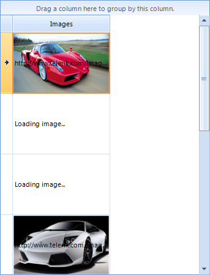

|Article relates to|Product|Author|
|----|----|----|
|Q2 2012|RadGridView for WinForms|Ivan Petrov|
  
## How To  

This article will demonstrate how to add a **GridViewImageColumn** to the grid and populate it asynchronously with images.  
   
## Solution  

Create a custom **GridDataCellElement** and in its **SetContentCore** method start asynchronous loading of the images. When a result comes back, it is saved in the respective **RowInfo** and the row is invalidated, thus the **SetContentCore** is called again and this time the image is cached so it is assigned to the cell element.  
   
  
   
>note A complete solution in C# and VB.NET can be found [here](https://github.com/telerik/winforms-sdk/tree/master/GridView/GridViewWithAsyncImageDownload).

