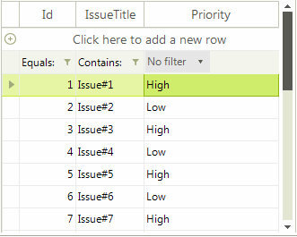

## Environment
<table>
	<tr>
		<td>Product Version</td>
		<td>2018.1 220</td>
	</tr>
	<tr>
		<td>Product</td>
		<td>RadGridView for WinForms</td>
	</tr>
</table>


## Description

By design, **RadGridView** uses editing mechanism. Thus, only one cell can be edited at a moment. A common scenario is to display a permanent editor in the filter cells in order to indicate better to the user that there are several options to choose.

## Solution

At the end of this solution the illustrated result in the following video will be achieved:



Follow the detailed steps in order to create a custom filter cell and embed a permanent **RadDropDownListElement** to manage filtering.

1\. Create a derivative of **GridFilterCellElement**. 

* In its **CreateChildElements** method you can add a **RadDropDownListElement** which holds the distinct column values, a **LightVisualElement** which displays the filter operator and a **StackLayoutPanel** which is the host container.

* Subscribe to the RadDropDownListElement.**SelectedIndexChanged** event where the respective **FilterDescriptor** will be added/deleted according to the currently selected drop down item. 

* Override the **SetContentCore** method where to bind the **RadDropDownList** and synchronize its selection. Since **RadGridView** uses data virtualization and cell elements are being reused during operations like scrolling, the RowInfo.**Tag** property will store the currently selected index.

* In the **UpdateFilterButtonVisibility** method the default filter button is collapsed.

* The **IsCompatible** method indicates with which columns and data rows the custom cell element is compatible during the cells reuse. Since this filter cell will be used only for e specific column and the filtering row, the returned Boolean result is *true* only in this case.

#### Custom GridFilterCellElement

{{source=..\SamplesCS\KnowledgeBase\GridViewPermanentEditorInFilterCell.cs region=CustomFilterCell}} 
{{source=..\SamplesVB\KnowledgeBase\GridViewPermanentEditorInFilterCell.vb region=CustomFilterCell}}

````C#
    
public class DropDownGridFilterCellElement : GridFilterCellElement
{
    RadDropDownListElement dropDown;
    LightVisualElement operatorElement;
    StackLayoutPanel container; 
    BindingList<string> filterValues = new BindingList<string>();
    
    public DropDownGridFilterCellElement(GridViewDataColumn column, GridRowElement row) : base(column, row)
    {
    }
    
    BindingContext bc = new BindingContext();
        
    protected override void CreateChildElements()
    {
        base.CreateChildElements();
        operatorElement = new LightVisualElement();
        container = new StackLayoutPanel();
        dropDown = new RadDropDownListElement();
        
        dropDown.BindingContext = bc;
        dropDown.DropDownStyle = RadDropDownStyle.DropDownList; 
        dropDown.SelectedIndexChanged += dropDown_SelectedIndexChanged;
        
        this.Children.Add(container);
        container.Children.Add(operatorElement);
        container.Children.Add(dropDown);
    }
        
    private void dropDown_SelectedIndexChanged(object sender, Telerik.WinControls.UI.Data.PositionChangedEventArgs e)
    {
        GridViewDataColumn dataColumn = this.ColumnInfo as GridViewDataColumn;
            
        if (dataColumn.FilterDescriptor == null)
        {
            dataColumn.FilterDescriptor = new Telerik.WinControls.Data.FilterDescriptor(this.ColumnInfo.Name, Telerik.WinControls.Data.FilterOperator.Contains, null);
            dataColumn.FilterDescriptor.IsFilterEditor = true;
        }
        if (e.Position > -1)
        {
            this.Value = dropDown.Items[e.Position].Text;
            this.RowInfo.Tag = e.Position;
            dataColumn.FilterDescriptor.Value = this.Value;
        }
        if (e.Position == 0)
        {
            dataColumn.FilterDescriptor = null;
        }
    }
        
    public override void Detach()
    {
        dropDown.SelectedIndexChanged -= dropDown_SelectedIndexChanged;
        base.Detach();
    }
        
    protected override void SetContentCore(object value)
    {
        base.SetContentCore(value);
        
        GridViewDataColumn dataColumn = this.ColumnInfo as GridViewDataColumn;
        if (dropDown.DataSource == null)
        {
            filterValues.Add("No filter");
            foreach (string distinctValue in dataColumn.DistinctValues)
            {
                filterValues.Add(distinctValue);
            }
            dropDown.SelectedIndexChanged -= dropDown_SelectedIndexChanged;
            dropDown.DataSource = filterValues;
        
            dropDown.SelectedIndex = 0;
            dropDown.SelectedIndexChanged += dropDown_SelectedIndexChanged;
        }
        this.DrawText = false;
        this.ForeColor = Color.Transparent;
        operatorElement.ForeColor = Color.Black; 
            
        if (this.RowInfo.Tag != null && this.RowInfo.Tag.ToString() != dropDown.SelectedIndex.ToString())
        {
            dropDown.SelectedIndexChanged -= dropDown_SelectedIndexChanged;
            //synchronize the selected option
            dropDown.SelectedIndex = (int)this.RowInfo.Tag;
            dropDown.SelectedIndexChanged += dropDown_SelectedIndexChanged;
        }
            
        if (dataColumn != null && dataColumn.FilterDescriptor != null)
        {
            //synchronize the filter operator
            this.operatorElement.Text = dataColumn.FilterDescriptor.Operator.ToString();
        }
        else
        {
            dropDown.SelectedIndexChanged -= dropDown_SelectedIndexChanged;
            dropDown.SelectedIndex = 0;
            dropDown.SelectedIndexChanged += dropDown_SelectedIndexChanged;
        }
    }
    
    //hide the default filter button
    protected override void UpdateFilterButtonVisibility(bool enabled)
    {
        enabled = false;
        base.UpdateFilterButtonVisibility(enabled);
    }
        
    public override bool IsCompatible(GridViewColumn data, object context)
    {
        return data is CustomColumn && context is GridViewFilteringRowInfo;
    }
}

````
````VB.NET
Public Class DropDownGridFilterCellElement
    Inherits GridFilterCellElement
    Private dropDown As RadDropDownListElement
    Private operatorElement As LightVisualElement
    Private container As StackLayoutPanel
    Private filterValues As BindingList(Of String)
    Private bc As BindingContext
    Public Sub New(column As GridViewDataColumn, row As GridRowElement)
        MyBase.New(column, row)
    End Sub
    Protected Overrides Sub CreateChildElements()
        MyBase.CreateChildElements()
        filterValues = New BindingList(Of String)()
        bc = New Windows.Forms.BindingContext()
        operatorElement = New LightVisualElement()
        container = New StackLayoutPanel()
        dropDown = New RadDropDownListElement()
        dropDown.BindingContext = bc
        dropDown.DropDownStyle = RadDropDownStyle.DropDownList
        AddHandler dropDown.SelectedIndexChanged, AddressOf dropDown_SelectedIndexChanged
        Me.Children.Add(container)
        container.Children.Add(operatorElement)
        container.Children.Add(dropDown)
    End Sub
    Private Sub dropDown_SelectedIndexChanged(ByVal sender As Object, ByVal e As Telerik.WinControls.UI.Data.PositionChangedEventArgs)
        Dim dataColumn As GridViewDataColumn = TryCast(Me.ColumnInfo, GridViewDataColumn)
        If dataColumn.FilterDescriptor Is Nothing Then
            dataColumn.FilterDescriptor = New Telerik.WinControls.Data.FilterDescriptor(Me.ColumnInfo.Name, Telerik.WinControls.Data.FilterOperator.Contains, Nothing)
            dataColumn.FilterDescriptor.IsFilterEditor = True
        End If
        If e.Position > -1 Then
            Me.Value = dropDown.Items(e.Position).Text
            Me.RowInfo.Tag = e.Position
            dataColumn.FilterDescriptor.Value = Me.Value
        End If
        If e.Position = 0 Then
            dataColumn.FilterDescriptor = Nothing
        End If
    End Sub
    Public Overrides Sub Detach()
        RemoveHandler dropDown.SelectedIndexChanged, AddressOf dropDown_SelectedIndexChanged
        MyBase.Detach()
    End Sub
    Protected Overrides Sub SetContentCore(ByVal value As Object)
        MyBase.SetContentCore(value)
        Dim dataColumn As GridViewDataColumn = TryCast(Me.ColumnInfo, GridViewDataColumn)
        If dropDown.DataSource Is Nothing Then
            filterValues.Add("No filter")
            For Each distinctValue As String In dataColumn.DistinctValues
                filterValues.Add(distinctValue)
            Next
            RemoveHandler dropDown.SelectedIndexChanged, AddressOf dropDown_SelectedIndexChanged
            dropDown.DataSource = filterValues
            dropDown.SelectedIndex = 0
            AddHandler dropDown.SelectedIndexChanged, AddressOf dropDown_SelectedIndexChanged
        End If
        Me.DrawText = False
        Me.ForeColor = Color.Transparent
        operatorElement.ForeColor = Color.Black
        If Me.RowInfo.Tag IsNot Nothing AndAlso Me.RowInfo.Tag.ToString() <> dropDown.SelectedIndex.ToString() Then
            RemoveHandler dropDown.SelectedIndexChanged, AddressOf dropDown_SelectedIndexChanged
            dropDown.SelectedIndex = CInt(Me.RowInfo.Tag)
            AddHandler dropDown.SelectedIndexChanged, AddressOf dropDown_SelectedIndexChanged
        End If
        If dataColumn IsNot Nothing AndAlso dataColumn.FilterDescriptor IsNot Nothing Then
            Me.operatorElement.Text = dataColumn.FilterDescriptor.[Operator].ToString()
        Else
            RemoveHandler dropDown.SelectedIndexChanged, AddressOf dropDown_SelectedIndexChanged
            dropDown.SelectedIndex = 0
            AddHandler dropDown.SelectedIndexChanged, AddressOf dropDown_SelectedIndexChanged
        End If
    End Sub
    Protected Overrides Sub UpdateFilterButtonVisibility(ByVal enabled As Boolean)
        enabled = False
        MyBase.UpdateFilterButtonVisibility(enabled)
    End Sub
    Public Overrides Function IsCompatible(ByVal data As GridViewColumn, ByVal context As Object) As Boolean
        Return TypeOf data Is CustomColumn AndAlso TypeOf context Is GridViewFilteringRowInfo
    End Function
End Class

````

{{endregion}} 

2\. Create a custom column which will use the newly implemented filter cell element.

* Create a derivative of **GridViewTextBoxColumn**.

* Override its **GetCellType** method. Thus, you can return the type of the custom filter cell for the **GridViewFilteringRowInfo**.

#### Custom column

{{source=..\SamplesCS\KnowledgeBase\GridViewPermanentEditorInFilterCell.cs region=CustomColumn}} 
{{source=..\SamplesVB\KnowledgeBase\GridViewPermanentEditorInFilterCell.vb region=CustomColumn}}

````C#
    
public class CustomColumn : GridViewTextBoxColumn
{
    public override Type GetCellType(GridViewRowInfo row)
    {
        if (row is GridViewFilteringRowInfo)
        {
            return typeof(DropDownGridFilterCellElement);
        }
        return base.GetCellType(row);
    }
}

````
````VB.NET
Public Class CustomColumn
    Inherits GridViewTextBoxColumn
    Public Overrides Function GetCellType(ByVal row As GridViewRowInfo) As Type
        If TypeOf row Is GridViewFilteringRowInfo Then
            Return GetType(DropDownGridFilterCellElement)
        End If
        Return MyBase.GetCellType(row)
    End Function
End Class

````

{{endregion}}

3\. Next, add the custom column to **RadGridView** and fill the grid with data: 

#### Fill data and add the custom column

{{source=..\SamplesCS\KnowledgeBase\GridViewPermanentEditorInFilterCell.cs region=FillData}} 
{{source=..\SamplesVB\KnowledgeBase\GridViewPermanentEditorInFilterCell.vb region=FillData}}

````C#
            
DataTable dt = new DataTable();
dt.Columns.Add("Id", typeof(int));
dt.Columns.Add("IssueTitle", typeof(string));
dt.Columns.Add("Priority", typeof(string));
for (int i = 1; i < 20; i++)
{
    if (i % 2 == 0)
    {
        dt.Rows.Add(i, "Issue#" + i, "Low");
    }
    else
    {
        dt.Rows.Add(i, "Issue#" + i, "High");
    }
}
            
this.radGridView1.AutoGenerateColumns = false;
            
GridViewDecimalColumn idColumn = new GridViewDecimalColumn("Id");
this.radGridView1.Columns.Add(idColumn);
GridViewTextBoxColumn titleColumn = new GridViewTextBoxColumn("IssueTitle");
this.radGridView1.Columns.Add(titleColumn);
CustomColumn myColumn = new CustomColumn();
myColumn.FieldName = myColumn.Name = myColumn.HeaderText = "Priority";
this.radGridView1.Columns.Add(myColumn);
            
this.radGridView1.DataSource = dt;
this.radGridView1.BestFitColumns(BestFitColumnMode.AllCells);
this.radGridView1.EnableFiltering = true;

````
````VB.NET
Dim dt As DataTable = New DataTable()
dt.Columns.Add("Id", GetType(Integer))
dt.Columns.Add("IssueTitle", GetType(String))
dt.Columns.Add("Priority", GetType(String))
For i As Integer = 1 To 20 - 1
    If i Mod 2 = 0 Then
        dt.Rows.Add(i, "Issue#" & i, "Low")
    Else
        dt.Rows.Add(i, "Issue#" & i, "High")
    End If
Next
Me.radGridView1.AutoGenerateColumns = False
Dim idColumn As GridViewDecimalColumn = New GridViewDecimalColumn("Id")
Me.radGridView1.Columns.Add(idColumn)
Dim titleColumn As GridViewTextBoxColumn = New GridViewTextBoxColumn("IssueTitle")
Me.radGridView1.Columns.Add(titleColumn)
Dim myColumn As CustomColumn = New CustomColumn()
myColumn.FieldName = "Priority"
myColumn.Name = "Priority"
myColumn.HeaderText = "Priority"
Me.radGridView1.Columns.Add(myColumn)
Me.radGridView1.DataSource = dt
Me.radGridView1.BestFitColumns(BestFitColumnMode.AllCells)
Me.radGridView1.EnableFiltering = True

````

{{endregion}}

4\. The last thing we need to do is to prevent entering edit mode for the filter cell since there is a permanent editor now. For this purpose, it is necessary to cancel the **CellBeginEdit** event: 

#### Fill data and add the custom column

{{source=..\SamplesCS\KnowledgeBase\GridViewPermanentEditorInFilterCell.cs region=CancelEditing}} 
{{source=..\SamplesVB\KnowledgeBase\GridViewPermanentEditorInFilterCell.vb region=CancelEditing}}

````C#
    
private void radGridView1_CellBeginEdit(object sender, GridViewCellCancelEventArgs e)
{
    if (e.Row is GridViewFilteringRowInfo && e.Column.Name == "Priority")
    {
        e.Cancel = true;
    }
}

````
````VB.NET
Private Sub radGridView1_CellBeginEdit(ByVal sender As Object, ByVal e As GridViewCellCancelEventArgs)
    If TypeOf e.Row Is GridViewFilteringRowInfo AndAlso e.Column.Name = "Priority" Then
        e.Cancel = True
    End If
End Sub

````

{{endregion}}


