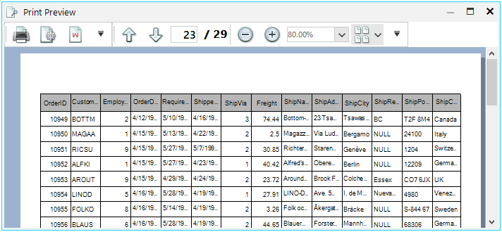

## Environment
 
|Product Version|Product|Author|
|----|----|----|
|2020.3.1020|RadGridView for WinForms|[Desislava Yordanova](https://www.telerik.com/blogs/author/desislava-yordanova)|
 
## Description

This tutorial demonstrates how to have header only on the first printed page and skip it for the rest of the pages. 




## Solution 

For this purpose, it is necessary to create a custom [RadPrintDocument]() and in its **PrintHeader** method you can draw the header only for the necessary pages. 

````C#
public class MyPrintDocument : RadPrintDocument
{  
    protected override void PrintHeader(System.Drawing.Printing.PrintPageEventArgs args)
    {
        if (this.PrintedPage == 1)
        { 
            Rectangle headerRect = new Rectangle(args.MarginBounds.Location, new Size(args.MarginBounds.Width, HeaderHeight));

    StringFormat stringFormat = new StringFormat();
    stringFormat.LineAlignment = StringAlignment.Center;

    string leftString = (this.ReverseHeaderOnEvenPages && this.PrintedPage % 2 == 0) ? this.RightHeader : this.LeftHeader;
    string rightString = (this.ReverseHeaderOnEvenPages && this.PrintedPage % 2 == 0) ? this.LeftHeader : this.RightHeader;

    if (this.HasLogoInHeaderFooterString(leftString) && this.Logo != null)
    {
        this.PrintLogo(args.Graphics, new Rectangle(headerRect.X, headerRect.Y, headerRect.Width / 3, headerRect.Height));
    }

    stringFormat.Alignment = StringAlignment.Near;
    args.Graphics.DrawString(ParseHeaderFooterString(leftString), this.HeaderFont, Brushes.Black, headerRect, stringFormat);

    if (this.HasLogoInHeaderFooterString(this.MiddleHeader) && this.Logo != null)
    {
        this.PrintLogo(args.Graphics, new Rectangle(headerRect.X + (headerRect.Width / 3), headerRect.Y, headerRect.Width / 3, headerRect.Height));
    }

    stringFormat.Alignment = StringAlignment.Center;
    args.Graphics.DrawString(ParseHeaderFooterString(this.MiddleHeader), this.HeaderFont, Brushes.Black, headerRect, stringFormat);

    if (this.HasLogoInHeaderFooterString(rightString) && this.Logo != null)
    {
        this.PrintLogo(args.Graphics, new Rectangle(headerRect.Right - (headerRect.Width / 3), headerRect.Y, headerRect.Width / 3, headerRect.Height));
    }

    stringFormat.Alignment = StringAlignment.Far;
    args.Graphics.DrawString(ParseHeaderFooterString(rightString), this.HeaderFont, Brushes.Black, headerRect, stringFormat);
            this.HeaderHeight = -1; 
        } 
    }
}

private void radButton1_Click(object sender, EventArgs e)
{
    //setup print style for the drid
    GridPrintStyle style = new GridPrintStyle();
    style.PrintHiddenColumns = false;
    style.FitWidthMode = PrintFitWidthMode.FitPageWidth;
    style.PrintHeaderOnEachPage = true;
    style.AlternatingRowColor = Color.LightGray;
    this.radGridView1.PrintStyle = style;

    {
        MyPrintDocument doc = new MyPrintDocument();
        doc.Margins.Left = 35;
        doc.Margins.Right = 35;
        doc.Margins.Top = 75;
        doc.Margins.Bottom = 50;
        doc.HeaderHeight = 100;
        doc.Landscape = false;
        doc.AssociatedObject = this.radGridView1;
        doc.LeftHeader = "Left";
        doc.MiddleHeader = "[Logo]";
        doc.RightHeader = "Right";
        doc.Logo = Properties.Resources.Ferrari_Enzo;
        doc.FooterFont = new Font("Tahoma", 6);
        doc.RightFooter = "Page [Page #] of [Total Pages]. Printed on [Date Printed] [Time Printed].";
        RadPrintPreviewDialog dialog = new RadPrintPreviewDialog(doc);
        dialog.Owner = this;
        dialog.ShowDialog();
    }
}

````
````VB.NET
Public Class MyPrintDocument
    Inherits RadPrintDocument

    Protected Overrides Sub PrintHeader(ByVal args As System.Drawing.Printing.PrintPageEventArgs)
        If Me.PrintedPage = 1 Then
            Dim headerRect As Rectangle = New Rectangle(args.MarginBounds.Location, New Size(args.MarginBounds.Width, HeaderHeight))
            Dim stringFormat As StringFormat = New StringFormat()
            stringFormat.LineAlignment = StringAlignment.Center
            Dim leftString As String = If((Me.ReverseHeaderOnEvenPages AndAlso Me.PrintedPage Mod 2 = 0), Me.RightHeader, Me.LeftHeader)
            Dim rightString As String = If((Me.ReverseHeaderOnEvenPages AndAlso Me.PrintedPage Mod 2 = 0), Me.LeftHeader, Me.RightHeader)

            If Me.HasLogoInHeaderFooterString(leftString) AndAlso Me.Logo IsNot Nothing Then
                Me.PrintLogo(args.Graphics, New Rectangle(headerRect.X, headerRect.Y, headerRect.Width / 3, headerRect.Height))
            End If

            stringFormat.Alignment = StringAlignment.Near
            args.Graphics.DrawString(ParseHeaderFooterString(leftString), Me.HeaderFont, Brushes.Black, headerRect, stringFormat)

            If Me.HasLogoInHeaderFooterString(Me.MiddleHeader) AndAlso Me.Logo IsNot Nothing Then
                Me.PrintLogo(args.Graphics, New Rectangle(headerRect.X + (headerRect.Width / 3), headerRect.Y, headerRect.Width / 3, headerRect.Height))
            End If

            stringFormat.Alignment = StringAlignment.Center
            args.Graphics.DrawString(ParseHeaderFooterString(Me.MiddleHeader), Me.HeaderFont, Brushes.Black, headerRect, stringFormat)

            If Me.HasLogoInHeaderFooterString(rightString) AndAlso Me.Logo IsNot Nothing Then
                Me.PrintLogo(args.Graphics, New Rectangle(headerRect.Right - (headerRect.Width / 3), headerRect.Y, headerRect.Width / 3, headerRect.Height))
            End If

            stringFormat.Alignment = StringAlignment.Far
            args.Graphics.DrawString(ParseHeaderFooterString(rightString), Me.HeaderFont, Brushes.Black, headerRect, stringFormat)
            Me.HeaderHeight = -1
        End If
    End Sub
End Class

Private Sub RadButton1_Click(sender As Object, e As EventArgs) Handles RadButton1.Click
    Dim style As GridPrintStyle = New GridPrintStyle()
    style.PrintHiddenColumns = False
    style.FitWidthMode = PrintFitWidthMode.FitPageWidth
    style.PrintHeaderOnEachPage = True
    style.AlternatingRowColor = Color.LightGray
    Me.RadGridView1.PrintStyle = style

    If True Then
        Dim doc As MyPrintDocument = New MyPrintDocument()
        doc.Margins.Left = 35
        doc.Margins.Right = 35
        doc.Margins.Top = 75
        doc.Margins.Bottom = 50
        doc.HeaderHeight = 100
        doc.Landscape = False
        doc.AssociatedObject = Me.RadGridView1
        doc.LeftHeader = "Left"
        doc.MiddleHeader = "[Logo]"
        doc.RightHeader = "Right"
        doc.Logo = My.Resources.Ferrari_Enzo
        doc.FooterFont = New Font("Tahoma", 6)
        doc.RightFooter = "Page [Page #] of [Total Pages]. Printed on [Date Printed] [Time Printed]."
        Dim dialog As RadPrintPreviewDialog = New RadPrintPreviewDialog(doc)
        dialog.Owner = Me
        dialog.ShowDialog()
    End If
End Sub

```` 

# See Also

* [RadPrintDocument]()
* [GridPrintStyle]()

