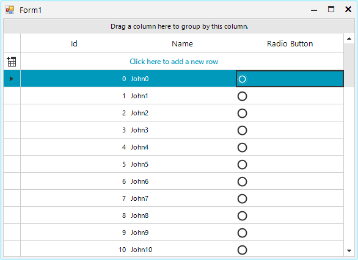

|Product Version|Product|Author|
|----|----|----|
|2025.1.211|RadGridView for WinForms|[Nadya Todorova](https://www.telerik.com/blogs/author/nadya-karaivanova)|

  
## Description
   
The following example will guide you how to create custom RadRadioButtonColumn that displays RadRadioButton in each cell element in RadGridView and ensures exclusive behavior (only one button can be selected at a time). 

   
## Solution  

>note Complete solution in C# is available in the following [SDK repo](https://github.com/telerik/winforms-sdk/tree/master/GridView/RadRadioButtonColumn).
 
This is it! Now you have your new RadRadioButtonColumn ready to use.
