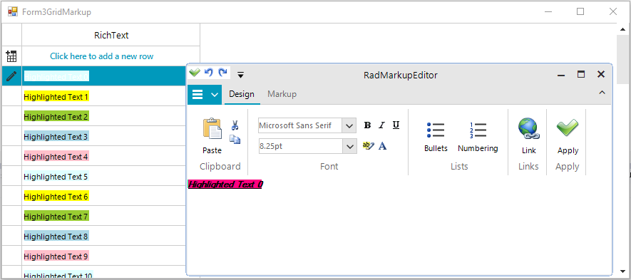

## Environment
 
|Product Version|Product|Author|
|----|----|----|
|2021.1.223|RadGridView for WinForms|[Nadya Karaivanova](https://www.telerik.com/blogs/author/nadya-karaivanova)|
 
## Description

A common requirement is to have a column in **RadGridView** that allows text formatting such as bold, italics, underline, link, etc. The following example demonstrates how you can achieve such custom column that uses **RadMarkupEditor**. Once, you enter the cell in edit mode the dialog is shown and you are able to format the text according to your needs.



>caution As of R1 2023 the Microsoft.mshtml assembly is excluded from Telerik.WinControls.RadMarkupEditor.dll. For .NET Core (.NET 6, .NET 7 or newer) projects, it is necessary to add the reference explicitly to use RadMarkupupEditor since it uses the MS WebBrowser internally.
 
## Solution 

[RadMarkupEditor](https://docs.telerik.com/devtools/winforms/telerik-presentation-framework/markup-dialog/radmarkupdialog) is a dialog used to create a formatted text and is suitable to be used as an editor within **GridViewColumn**. 

>note You should have reference to **Telerik.WinControls.RadMarkupEditor** assembly in your project.

Let's first create our custom **GridViewMarkupEditor** that inherits from the **BaseGridEditor**:

````C#
public class GridViewMarkupEditor : BaseGridEditor
{
    RadMarkupDialog markupDialog;

    public GridViewMarkupEditor()
    {
    }

    protected override RadElement CreateEditorElement()
    {
        return new RadLabelElement();
    }

    public override object Value
    {
        get
        {
            GridDataCellElement dataCell = this.OwnerElement as GridDataCellElement;
            return dataCell.Value;
        }
        set
        {
            GridDataCellElement dataCell = this.OwnerElement as GridDataCellElement;
            dataCell.Value = value;
        }
    }

    public override void BeginEdit()
    {
        base.BeginEdit();

        RadMarkupDialog dialog = new RadMarkupDialog();
        dialog.Value = Convert.ToString(this.Value);

        DialogResult result = dialog.ShowDialog();

        if (result == DialogResult.OK)
        {
            this.Value = dialog.Value;
        }
    }

    public override bool EndEdit()
    {
        return base.EndEdit();
    }
}

````
````VB.NET
Public Class GridViewMarkupEditor
    Inherits BaseGridEditor
    Private markupDialog As RadMarkupDialog
    Public Sub New()
    End Sub

    Protected Overrides Function CreateEditorElement() As RadElement
        Return New RadLabelElement()
    End Function

    Public Overrides Property Value As Object
        Get
            Dim dataCell As GridDataCellElement = TryCast(Me.OwnerElement, GridDataCellElement)
            Return dataCell.Value
        End Get
        Set(ByVal value As Object)
            Dim dataCell As GridDataCellElement = TryCast(Me.OwnerElement, GridDataCellElement)
            dataCell.Value = value
        End Set
    End Property

    Public Overrides Sub BeginEdit()
        MyBase.BeginEdit()
        Dim dialog As RadMarkupDialog = New RadMarkupDialog()
        dialog.Value = Convert.ToString(Me.Value)
        Dim result As DialogResult = dialog.ShowDialog()

        If result = DialogResult.OK Then
            Me.Value = dialog.Value
        End If
    End Sub

    Public Overrides Function EndEdit() As Boolean
        Return MyBase.EndEdit()
    End Function
End Class

````

Second, we should create our custom **GridViewMarkupColumn** that will use the custom **GridViewMarkupEditor**:

````C#
public class GridViewMarkupColumn : GridViewDataColumn
{
    public GridViewMarkupColumn(string fieldName)
        : base(fieldName)
    {

    }
    public GridViewMarkupColumn(string uniqueName, string fieldName)
        : base(uniqueName, fieldName)
    {
    }

    protected override void Initialize()
    {
        base.Initialize();
        this.DisableHTMLRendering = false;
    }


    public override Type GetDefaultEditorType()
    {
        return typeof(GridViewMarkupEditor);
    }

    public override IInputEditor GetDefaultEditor()
    {
        return new GridViewMarkupEditor();
    }
}

````
````VB.NET
Public Class GridViewMarkupColumn
    Inherits GridViewDataColumn
    Public Sub New(ByVal fieldName As String)
        MyBase.New(fieldName)
    End Sub

    Public Sub New(ByVal uniqueName As String, ByVal fieldName As String)
        MyBase.New(uniqueName, fieldName)
    End Sub

    Protected Overrides Sub Initialize()
        MyBase.Initialize()
        Me.DisableHTMLRendering = False
    End Sub

    Public Overrides Function GetDefaultEditorType() As Type
        Return GetType(GridViewMarkupEditor)
    End Function

    Public Overrides Function GetDefaultEditor() As IInputEditor
        Return New GridViewMarkupEditor()
    End Function
End Class

````

Then, we can use the custom column in the **RadGridView**:

````C#
public Form3GridMarkup()
{
    InitializeComponent();
    this.radGridView1.Columns.Add(new GridViewMarkupColumn("RichText", "RichText"));
    this.radGridView1.Columns[0].Width = 250;

    string[] colors = new string[] { "LightCyan", "Yellow", "YellowGreen", "LightBlue", "Pink" };
    for (int i = 0; i < 50; i++)
    {
        GridViewRowInfo row = radGridView1.Rows.AddNew();
        row.Cells[0].Value = string.Format("<html><span style=\"background-color:{0}\">Highlighted Text {1}</span></html>", colors[i % 5], i);
    }
}

````
````VB.NET
Public Class Form3GridMarkup
    Public Sub New()
        InitializeComponent()
        Me.RadGridView1.Columns.Add(New GridViewMarkupColumn("RichText", "RichText"))
        Me.RadGridView1.Columns(0).Width = 250
        Dim colors As String() = New String() {"LightCyan", "Yellow", "YellowGreen", "LightBlue", "Pink"}

        For i As Integer = 0 To 50 - 1
            Dim row As GridViewRowInfo = RadGridView1.Rows.AddNew()
            row.Cells(0).Value = String.Format("<html><span style=""background-color:{0}"">Highlighted Text {1}</span></html>", colors(i Mod 5), i)
        Next
    End Sub
End Class

````


