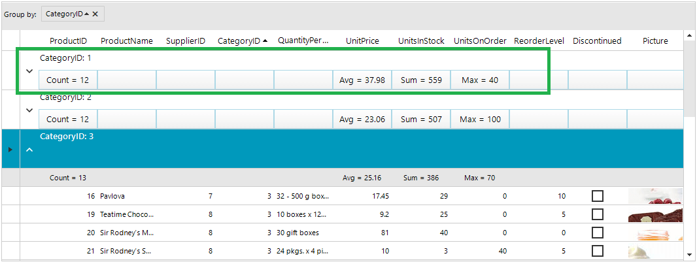

## Environment
 
|Product Version|Product|Author|
|----|----|----|
|2020.2.616|RadGridView for WinForms|[Desislava Yordanova](https://www.telerik.com/blogs/author/desislava-yordanova)|
 

## Description

Usually, when **RadGridView** is grouped by a column and there are summary rows defined, the summary values for each group will be shown only when the group row is expanded.


The following tutorial will show you a sample approach how to create custom group elements with embedded summary values inside the group when it is collapsed:



## Solution 

It is necessary to create a custom **GridGroupContentCellElement** which contains a summary element (**LightVisualElement**) for each cell which should either display the corresponding summary calculation or an empty string if no summary item is added for this column.


````C#

        public RadForm1()
        {
            InitializeComponent();

            this.radGridView1.CreateCell += radGridView1_CreateCell;
            this.radGridView1.GroupByChanged+=radGridView1_GroupByChanged;
        }

        private void radGridView1_GroupByChanged(object sender, GridViewCollectionChangedEventArgs e)
        {
            this.radGridView1.MasterTemplate.Refresh();
        }

        private void radGridView1_CreateCell(object sender, GridViewCreateCellEventArgs e)
        {
            if (e.CellType == typeof(GridGroupContentCellElement))
            {
                e.CellElement = new MyGridGroupContentCellElement(e.Column, e.Row);
            }
        }

        private void RadForm1_Load(object sender, EventArgs e)
        {
            this.productsTableAdapter.Fill(this.nwindDataSet.Products);
            this.radGridView1.DataSource = this.productsBindingSource;
            this.radGridView1.AutoSizeColumnsMode = GridViewAutoSizeColumnsMode.Fill;
            this.radGridView1.AllowAddNewRow = false;

            this.radGridView1.EnableGrouping = true;
            this.radGridView1.MasterTemplate.ShowGroupedColumns = true;
             this.radGridView1.TableElement.GroupHeaderHeight = 60;

            // group by CategoryID
            GroupDescriptor descriptor = new GroupDescriptor();
            descriptor.GroupNames.Add("CategoryID", ListSortDirection.Ascending);
            this.radGridView1.GroupDescriptors.Add(descriptor);

            // add summary items
            GridViewSummaryItem item1 = new GridViewSummaryItem("UnitPrice", "Avg = {0:N2}", GridAggregateFunction.Avg);
            GridViewSummaryItem item2 = new GridViewSummaryItem("ProductID", "Count = {0}", GridAggregateFunction.Count);
            GridViewSummaryItem item4 = new GridViewSummaryItem("UnitsOnOrder", "Max = {0}", GridAggregateFunction.Max);
            GridViewSummaryItem item5 = new GridViewSummaryItem("UnitsInStock", "Sum = {0}", GridAggregateFunction.Sum);
            GridViewSummaryRowItem row = new GridViewSummaryRowItem(new GridViewSummaryItem[] { item1, item2, item4, item5 });
            this.radGridView1.SummaryRowsTop.Add(row);
        }

        public class MyGridGroupContentCellElement : GridGroupContentCellElement
        {
            private StackLayoutElement stack;
            private bool showSummaryCells_Renamed = true;

            public MyGridGroupContentCellElement(GridViewColumn column, GridRowElement row) : base(column, row)
            {
                // creating the elements here in order to have a valid insance of a row
                if (this.stack == null)
                    this.CreateStackElement(row);

                this.ClipDrawing = true;
                row.GridControl.TableElement.HScrollBar.Scroll += HScrollBar_Scroll;
                row.GridControl.ColumnWidthChanged += GridControl_ColumnWidthChanged;
                row.GridControl.GroupDescriptors.CollectionChanged += GroupDescriptors_CollectionChanged;
            }

            private void GroupDescriptors_CollectionChanged(object sender, NotifyCollectionChangedEventArgs e)
            {
                if (this.RowInfo.Parent is GridViewGroupRowInfo && ((GridViewGroupRowInfo)this.RowInfo.Parent).IsExpanded)
                    this.InvalidateArrange();
            }

            private void HScrollBar_Scroll(object sender, ScrollEventArgs e)
            {
                if (e.NewValue != e.OldValue)
                    this.stack.PositionOffset = new SizeF(0 - e.NewValue, 0);
            }

            private void CreateStackElement(GridRowElement row)
            {
                this.stack = new StackLayoutElement();
                this.stack.AutoSizeMode = Telerik.WinControls.RadAutoSizeMode.FitToAvailableSize;
                this.stack.AutoSize = true;
                this.stack.StretchHorizontally = true;
                this.stack.Alignment = ContentAlignment.BottomCenter;
                this.stack.DrawFill = true;
                this.stack.BackColor = Color.White;
                int i = 0;
                while (i < row.RowInfo.Cells.Count)
                {
                    SummaryCellElement element = new SummaryCellElement();
                    element.ColumnName = row.RowInfo.Cells[i].ColumnInfo.Name;
                    element.StretchHorizontally = false;
                    element.StretchVertically = true;
                    element.DrawBorder = true;
                    element.BorderGradientStyle = Telerik.WinControls.GradientStyles.Solid;
                    element.BorderColor = Color.LightBlue;
                    element.ForeColor = Color.Black;
                    element.GradientStyle = GradientStyles.Solid;
                    this.stack.Children.Add(element);
                    i += 1;
                }

                this.Children.Add(this.stack);
            }

            public override void Initialize(GridViewColumn column, GridRowElement row)
            {
                base.Initialize(column, row);
                this.ShowSummaryCells = (!row.Data.IsExpanded) || row.Data.Group.Groups.Count > 0;
            }

            protected override void DisposeManagedResources()
            {
                if (this.GridControl != null)
                {
                    this.GridControl.ColumnWidthChanged -= GridControl_ColumnWidthChanged;
                    this.GridControl.GroupDescriptors.CollectionChanged -= GroupDescriptors_CollectionChanged;
                }

                base.DisposeManagedResources();
            }

            public bool ShowSummaryCells
            {
                get
                {
                    return this.showSummaryCells_Renamed;
                }
                set
                {
                    if (this.showSummaryCells_Renamed != value)
                    {
                        this.showSummaryCells_Renamed = value;

                        if (this.stack == null)
                            this.CreateStackElement(this.RowElement);

                        if (this.showSummaryCells_Renamed)
                            this.stack.Visibility = ElementVisibility.Visible;
                        else
                            this.stack.Visibility = ElementVisibility.Hidden;
                    }
                }
            }

            private void GridControl_ColumnWidthChanged(object sender, ColumnWidthChangedEventArgs e)
            {
                this.InvalidateArrange();
            }

            protected override SizeF ArrangeOverride(SizeF finalSize)
            {
                SizeF size = base.ArrangeOverride(finalSize);

                float x = this.GridControl.TableElement.GroupIndent * (this.GridControl.GroupDescriptors.Count - this.RowInfo.Group.Level - 1);
                float y = size.Height - this.stack.DesiredSize.Height - 2.0F;
                float width = size.Width - x;
                float height = this.stack.DesiredSize.Height;

                this.stack.Arrange(new RectangleF(x, y, width, height));

                foreach (SummaryCellElement element in this.stack.Children)
                {
                    Size elementSize = new Size(this.RowInfo.Cells[element.ColumnName].ColumnInfo.Width + this.GridControl.TableElement.CellSpacing, 30);
                    Console.WriteLine(this.RowInfo.Cells[element.ColumnName].ColumnInfo.Width + " " + this.RowInfo.Cells[element.ColumnName].ColumnInfo.Name);
                    element.MinSize = elementSize;
                    element.MaxSize = elementSize;
                }

                return size;
            }

            public override void SetContent()
            {
                base.SetContent();
                this.TextAlignment = ContentAlignment.TopLeft;
                this.ShowSummaryCells = (!this.RowInfo.Group.IsExpanded) || this.RowInfo.Group.Groups.Count > 0;

                GridViewGroupRowInfo rowInfo = (GridViewGroupRowInfo)this.RowInfo;

                if (rowInfo.Parent is GridViewGroupRowInfo && !((GridViewGroupRowInfo)rowInfo.Parent).IsExpanded)
                    return;

                Dictionary<string, string> values = this.GetSummaryValues();
                int index = 0;

                foreach (KeyValuePair<string, string> column in values)
                {
                    SummaryCellElement element = ((SummaryCellElement)this.stack.Children[index]);
                    index += 1;

                    if (this.ViewTemplate.Columns[column.Key].IsGrouped && this.ViewTemplate.ShowGroupedColumns == false)
                        element.Visibility = Telerik.WinControls.ElementVisibility.Collapsed;
                    else
                    {
                        element.Visibility = Telerik.WinControls.ElementVisibility.Visible;
                        element.Text = column.Value;
                    }
                }
            }

            public virtual Dictionary<string, string> GetSummaryValues()
            {
                if (this.ElementTree == null)
                    return new Dictionary<string, string>();

                Dictionary<string, string> result = new Dictionary<string, string>();
                if (this.GridControl.SummaryRowsTop.Count > 0)
                {
                    foreach (SummaryCellElement cell in this.stack.Children)
                    {
                        if (this.GridControl.SummaryRowsTop[0][cell.ColumnName] == null)
                            result.Add(cell.ColumnName, string.Empty);
                        else
                        {
                            GridViewSummaryItem summaryItem = this.GridControl.SummaryRowsTop[0][cell.ColumnName][0];
                            object value = this.ViewTemplate.DataView.Evaluate(summaryItem.GetSummaryExpression(), this.GetDataRows());
                            string text = string.Format(summaryItem.FormatString, value);
                            result.Add(summaryItem.Name, text);
                        }
                    }
                }
                return result;
            }

            private IEnumerable<GridViewRowInfo> GetDataRows()
            {
                Queue<GridViewRowInfo> queue = new Queue<GridViewRowInfo>();
                queue.Enqueue(this.RowInfo);

                List<GridViewRowInfo> list = new List<GridViewRowInfo>();

                while (queue.Count != 0)
                {
                    GridViewRowInfo currentRow = queue.Dequeue();

                    if (currentRow is GridViewDataRowInfo)
                        list.Add(currentRow);

                    foreach (GridViewRowInfo row in currentRow.ChildRows)
                        queue.Enqueue(row);
                }

                return list;
            }

            protected override Type ThemeEffectiveType
            {
                get
                {
                    return typeof(GridGroupContentCellElement);
                }
            }
        }

        public class SummaryCellElement : LightVisualElement
        {
            private string columnName_Renamed;

            public string ColumnName
            {
                get
                {
                    return this.columnName_Renamed;
                }
                set
                {
                    this.columnName_Renamed = value;
                }
            }
        }       
    

````
````VB.NET

     Sub New()

        InitializeComponent()

        AddHandler Me.RadGridView1.CreateCell, AddressOf radGridView1_CreateCell
        AddHandler Me.RadGridView1.GroupByChanged, AddressOf radGridView1_GroupByChanged

    End Sub
    Private Sub RadForm1_Load(sender As Object, e As EventArgs) Handles MyBase.Load
        'TODO: This line of code loads data into the 'NwindDataSet.Products' table. You can move, or remove it, as needed.
        Me.ProductsTableAdapter.Fill(Me.NwindDataSet.Products)
        Me.RadGridView1.DataSource = Me.ProductsBindingSource
        Me.RadGridView1.AutoSizeColumnsMode = GridViewAutoSizeColumnsMode.Fill
        Me.RadGridView1.AllowAddNewRow = False
        Me.RadGridView1.EnableGrouping = True
        Me.RadGridView1.MasterTemplate.ShowGroupedColumns = True
        Me.RadGridView1.TableElement.GroupHeaderHeight = 60
        Dim descriptor As GroupDescriptor = New GroupDescriptor()
        descriptor.GroupNames.Add("CategoryID", ListSortDirection.Ascending)
        Me.RadGridView1.GroupDescriptors.Add(descriptor)
        Dim item1 As GridViewSummaryItem = New GridViewSummaryItem("UnitPrice", "Avg = {0:N2}", GridAggregateFunction.Avg)
        Dim item2 As GridViewSummaryItem = New GridViewSummaryItem("ProductID", "Count = {0}", GridAggregateFunction.Count)
        Dim item4 As GridViewSummaryItem = New GridViewSummaryItem("UnitsOnOrder", "Max = {0}", GridAggregateFunction.Max)
        Dim item5 As GridViewSummaryItem = New GridViewSummaryItem("UnitsInStock", "Sum = {0}", GridAggregateFunction.Sum)
        Dim row As GridViewSummaryRowItem = New GridViewSummaryRowItem(New GridViewSummaryItem() {item1, item2, item4, item5})
        Me.RadGridView1.SummaryRowsTop.Add(row)
    End Sub

    Private Sub radGridView1_GroupByChanged(ByVal sender As Object, ByVal e As GridViewCollectionChangedEventArgs)
        Me.RadGridView1.MasterTemplate.Refresh()
    End Sub

    Private Sub radGridView1_CreateCell(ByVal sender As Object, ByVal e As GridViewCreateCellEventArgs)
        If e.CellType = GetType(GridGroupContentCellElement) Then
            e.CellElement = New MyGridGroupContentCellElement(e.Column, e.Row)
        End If
    End Sub

    Public Class MyGridGroupContentCellElement
        Inherits GridGroupContentCellElement

        Private stack As StackLayoutElement
        Private showSummaryCells_Renamed As Boolean = True

        Public Sub New(ByVal column As GridViewColumn, ByVal row As GridRowElement)
            MyBase.New(column, row)
            If Me.stack Is Nothing Then Me.CreateStackElement(row)
            Me.ClipDrawing = True
            AddHandler row.GridControl.TableElement.HScrollBar.Scroll, AddressOf HScrollBar_Scroll
            AddHandler row.GridControl.ColumnWidthChanged, AddressOf GridControl_ColumnWidthChanged
            AddHandler row.GridControl.GroupDescriptors.CollectionChanged, AddressOf GroupDescriptors_CollectionChanged
        End Sub

        Private Sub GroupDescriptors_CollectionChanged(ByVal sender As Object, ByVal e As NotifyCollectionChangedEventArgs)
            If TypeOf Me.RowInfo.Parent Is GridViewGroupRowInfo AndAlso (CType(Me.RowInfo.Parent, GridViewGroupRowInfo)).IsExpanded Then Me.InvalidateArrange()
        End Sub

        Private Sub HScrollBar_Scroll(ByVal sender As Object, ByVal e As ScrollEventArgs)
            If e.NewValue <> e.OldValue Then Me.stack.PositionOffset = New SizeF(0 - e.NewValue, 0)
        End Sub

        Private Sub CreateStackElement(ByVal row As GridRowElement)
            Me.stack = New StackLayoutElement()
            Me.stack.AutoSizeMode = Telerik.WinControls.RadAutoSizeMode.FitToAvailableSize
            Me.stack.AutoSize = True
            Me.stack.StretchHorizontally = True
            Me.stack.Alignment = ContentAlignment.BottomCenter
            Me.stack.DrawFill = True
            Me.stack.BackColor = Color.White
            Dim i As Integer = 0

            While i < row.RowInfo.Cells.Count
                Dim element As SummaryCellElement = New SummaryCellElement()
                element.ColumnName = row.RowInfo.Cells(i).ColumnInfo.Name
                element.StretchHorizontally = False
                element.StretchVertically = True
                element.DrawBorder = True
                element.BorderGradientStyle = Telerik.WinControls.GradientStyles.Solid
                element.BorderColor = Color.LightBlue
                element.ForeColor = Color.Black
                element.GradientStyle = GradientStyles.Solid
                Me.stack.Children.Add(element)
                i += 1
            End While

            Me.Children.Add(Me.stack)
        End Sub

        Public Overrides Sub Initialize(ByVal column As GridViewColumn, ByVal row As GridRowElement)
            MyBase.Initialize(column, row)
            Me.ShowSummaryCells = (Not row.Data.IsExpanded) OrElse row.Data.Group.Groups.Count > 0
        End Sub

        Protected Overrides Sub DisposeManagedResources()
            If Me.GridControl IsNot Nothing Then
                RemoveHandler Me.GridControl.ColumnWidthChanged, AddressOf GridControl_ColumnWidthChanged
                RemoveHandler Me.GridControl.GroupDescriptors.CollectionChanged, AddressOf GroupDescriptors_CollectionChanged
            End If

            MyBase.DisposeManagedResources()
        End Sub

        Public Property ShowSummaryCells As Boolean
            Get
                Return Me.showSummaryCells_Renamed
            End Get
            Set(ByVal value As Boolean)

                If Me.showSummaryCells_Renamed <> value Then
                    Me.showSummaryCells_Renamed = value
                    If Me.stack Is Nothing Then Me.CreateStackElement(Me.RowElement)

                    If Me.showSummaryCells_Renamed Then
                        Me.stack.Visibility = ElementVisibility.Visible
                    Else
                        Me.stack.Visibility = ElementVisibility.Hidden
                    End If
                End If
            End Set
        End Property

        Private Sub GridControl_ColumnWidthChanged(ByVal sender As Object, ByVal e As ColumnWidthChangedEventArgs)
            Me.InvalidateArrange()
        End Sub

        Protected Overrides Function ArrangeOverride(ByVal finalSize As SizeF) As SizeF
            Dim size As SizeF = MyBase.ArrangeOverride(finalSize)
            Dim x As Single = Me.GridControl.TableElement.GroupIndent * (Me.GridControl.GroupDescriptors.Count - Me.RowInfo.Group.Level - 1)
            Dim y As Single = size.Height - Me.stack.DesiredSize.Height - 2.0F
            Dim width As Single = size.Width - x
            Dim height As Single = Me.stack.DesiredSize.Height
            Me.stack.Arrange(New RectangleF(x, y, width, height))

            For Each element As SummaryCellElement In Me.stack.Children
                Dim elementSize As Size = New Size(Me.RowInfo.Cells(element.ColumnName).ColumnInfo.Width + Me.GridControl.TableElement.CellSpacing, 30)
                Console.WriteLine(Me.RowInfo.Cells(element.ColumnName).ColumnInfo.Width & " " + Me.RowInfo.Cells(element.ColumnName).ColumnInfo.Name)
                element.MinSize = elementSize
                element.MaxSize = elementSize
            Next

            Return size
        End Function

        Public Overrides Sub SetContent()
            MyBase.SetContent()
            Me.TextAlignment = ContentAlignment.TopLeft
            Me.ShowSummaryCells = (Not Me.RowInfo.Group.IsExpanded) OrElse Me.RowInfo.Group.Groups.Count > 0
            Dim rowInfo As GridViewGroupRowInfo = CType(Me.RowInfo, GridViewGroupRowInfo)
            If TypeOf rowInfo.Parent Is GridViewGroupRowInfo AndAlso Not (CType(rowInfo.Parent, GridViewGroupRowInfo)).IsExpanded Then Return
            Dim values As Dictionary(Of String, String) = Me.GetSummaryValues()
            Dim index As Integer = 0

            For Each column As KeyValuePair(Of String, String) In values
                Dim element As SummaryCellElement = (CType(Me.stack.Children(index), SummaryCellElement))
                index += 1

                If Me.ViewTemplate.Columns(column.Key).IsGrouped AndAlso Me.ViewTemplate.ShowGroupedColumns = False Then
                    element.Visibility = Telerik.WinControls.ElementVisibility.Collapsed
                Else
                    element.Visibility = Telerik.WinControls.ElementVisibility.Visible
                    element.Text = column.Value
                End If
            Next
        End Sub

        Public Overridable Function GetSummaryValues() As Dictionary(Of String, String)
            If Me.ElementTree Is Nothing Then Return New Dictionary(Of String, String)()
            Dim result As Dictionary(Of String, String) = New Dictionary(Of String, String)()

            If Me.GridControl.SummaryRowsTop.Count > 0 Then

                For Each cell As SummaryCellElement In Me.stack.Children

                    If Me.GridControl.SummaryRowsTop(0)(cell.ColumnName) Is Nothing Then
                        result.Add(cell.ColumnName, String.Empty)
                    Else
                        Dim summaryItem As GridViewSummaryItem = Me.GridControl.SummaryRowsTop(0)(cell.ColumnName)(0)
                        Dim value As Object = Me.ViewTemplate.DataView.Evaluate(summaryItem.GetSummaryExpression(), Me.GetDataRows())
                        Dim text As String = String.Format(summaryItem.FormatString, value)
                        result.Add(summaryItem.Name, text)
                    End If
                Next
            End If

            Return result
        End Function

        Private Function GetDataRows() As IEnumerable(Of GridViewRowInfo)
            Dim queue As Queue(Of GridViewRowInfo) = New Queue(Of GridViewRowInfo)()
            queue.Enqueue(Me.RowInfo)
            Dim list As List(Of GridViewRowInfo) = New List(Of GridViewRowInfo)()

            While queue.Count <> 0
                Dim currentRow As GridViewRowInfo = queue.Dequeue()
                If TypeOf currentRow Is GridViewDataRowInfo Then list.Add(currentRow)

                For Each row As GridViewRowInfo In currentRow.ChildRows
                    queue.Enqueue(row)
                Next
            End While

            Return list
        End Function

        Protected Overrides ReadOnly Property ThemeEffectiveType As Type
            Get
                Return GetType(GridGroupContentCellElement)
            End Get
        End Property
    End Class

    Public Class SummaryCellElement
        Inherits LightVisualElement

        Private columnName_Renamed As String

        Public Property ColumnName As String
            Get
                Return Me.columnName_Renamed
            End Get
            Set(ByVal value As String)
                Me.columnName_Renamed = value
            End Set
        End Property
    End Class   

````

>note A complete solution providing a C# and VB.NET project is available [here](https://github.com/telerik/winforms-sdk/tree/master/GridView/GroupRowsWithSummaryValues).

# See Also

* [Grouping]()
* [Summary Rows]() 

