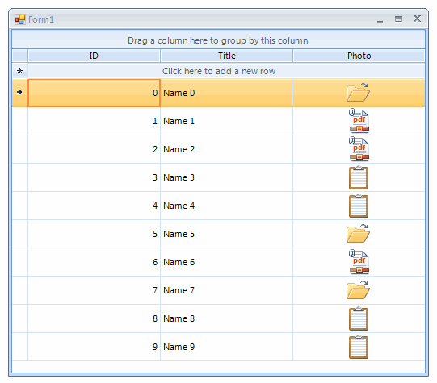

|Date Posted|Product|Author|
|----|----|----|
|May 09, 2014|RadGridView|[Desislava Yordanova](https://www.telerik.com/blogs/author/desislava-yordanova)| 


## How To
 
By default, **RadGridView** does not support grouping by **GridViewImageColumn** functionality. This article demonstrates how to implement such a behavior.
 
## Solution
 
1\. First, let’s populate the **RadGridView** with data. For this purpose, we will start with creating a sample class MyObject**, **which have **Photo** property of type *Image*.
 
````C#
List<Image> images = new List<Image>()
{
    Properties.Resources.open,
    Properties.Resources.paste,
    Properties.Resources.pdf
};
     
public Form1()
{
    InitializeComponent();
     
    Random rand = new Random();
    List<MyObject> list = new List<MyObject>() { };
    for (int i = 0; i < 10; i++)
    {
        list.Add(new MyObject(rand.Next(0, 4), "Name " + i, images[rand.Next(0, images.Count)]));
    }
     
    radGridView1.DataSource = list;
    radGridView1.AutoSizeRows = true;
    radGridView1.AutoSizeColumnsMode = GridViewAutoSizeColumnsMode.Fill;
 }

````
````VB.NET
Private images As New List(Of Image)() From { _
 My.Resources.open, _
 My.Resources.paste, _
 My.Resources.pdf _
}
  
Public Sub New()
    InitializeComponent()
  
    Dim rand As New Random()
    Dim list As New List(Of MyObject)()
  
    For i As Integer = 0 To 9
        list.Add(New MyObject(rand.[Next](0, 4), "Name " & i, images(rand.[Next](0, images.Count))))
    Next
  
    RadGridView1.DataSource = list
    RadGridView1.AutoSizeRows = True
    RadGridView1.AutoSizeColumnsMode = GridViewAutoSizeColumnsMode.Fill
End Sub

```` 

The custom business object:


````C#
public class MyObject
{
    public int ID { get; set; }
     
    public string Title { get; set; }
     
    public Image Photo { get; set; }
     
    public MyObject(int iD, string title, Image photo)
    {
        this.ID = iD;
        this.Title = title;
        this.Photo = photo;
    }
}

````
````VB.NET
Public Class MyObject
    Public Property ID() As Integer
        Get
            Return m_ID
        End Get
        Set(value As Integer)
            m_ID = value
        End Set
    End Property
    Private m_ID As Integer
  
    Public Property Title() As String
        Get
            Return m_Title
        End Get
        Set(value As String)
            m_Title = value
        End Set
    End Property
    Private m_Title As String
  
    Public Property Photo() As Image
        Get
            Return m_Photo
        End Get
        Set(value As Image)
            m_Photo = value
        End Set
    End Property
    Private m_Photo As Image
  
    Public Sub New(iD As Integer, title As String, photo AsImage)
        Me.ID = iD
        Me.Title = title
        Me.Photo = photo
    End Sub
End Class

````

You will notice that you are not allowed to drag the GridViewImageColumn’s header and drop it over the “Drag a column here to group by this column” area. 

 
 
   
2\. In order to enable drag and drop functionality for the **GridViewImageColumn**’s header over the **[GroupPanelElement](https://docs.telerik.com/devtools/winforms/gridview/fundamentals/overview-of-radgridview-structure)**, it is necessary to use the **RadDragDropService**. Subscribe for its **PreviewDragStart** event to start the **RadDragDropService** if you are dragging a **GridHeaderCellElement**. Use the **PreviewDragOver** event to allow dropping over the **GroupPanelElement**: 
   
````C#
public Form1()
{
    InitializeComponent();
    //populate the grid with data
     
    RadDragDropService svc =this.radGridView1.GridViewElement.GetService<RadDragDropService>();
    svc.PreviewDragStart += svc_PreviewDragStart;
    svc.PreviewDragOver += svc_PreviewDragOver;
     
    radGridView1.GroupByChanged += radGridView1_GroupByChanged;
    radGridView1.EnableCustomGrouping = true;
    radGridView1.CustomGrouping += radGridView1_CustomGrouping;
    radGridView1.GroupSummaryEvaluate += radGridView1_GroupSummaryEvaluate;
}
     
private void svc_PreviewDragStart(object sender, PreviewDragStartEventArgs e)
{
    SnapshotDragItem dragged = e.DragInstance asSnapshotDragItem;
    if (dragged != null && dragged.Item isGridHeaderCellElement)
    {
        e.CanStart = true;
    }
}
     
private void svc_PreviewDragOver(object sender, RadDragOverEventArgs e)
{
    SnapshotDragItem dragged = e.DragInstance asSnapshotDragItem;
    if (dragged != null && dragged.Item isGridHeaderCellElement)
    {
        e.CanDrop = e.HitTarget is GroupPanelElement;       
    }
}

````
````VB.NET
Public Sub New()
    InitializeComponent()
    'populate the grid with data
   
    Dim svc As RadDragDropService =Me.RadGridView1.GridViewElement.GetService(Of RadDragDropService)()
    AddHandler svc.PreviewDragStart, AddressOfsvc_PreviewDragStart
    AddHandler svc.PreviewDragOver, AddressOfsvc_PreviewDragOver
   
    AddHandler RadGridView1.GroupByChanged, AddressOfradGridView1_GroupByChanged
    RadGridView1.EnableCustomGrouping = True
    AddHandler RadGridView1.CustomGrouping, AddressOfradGridView1_CustomGrouping
    AddHandler RadGridView1.GroupSummaryEvaluate, AddressOfradGridView1_GroupSummaryEvaluate
End Sub
   
Private Sub svc_PreviewDragStart(sender As Object, e AsPreviewDragStartEventArgs)
    Dim dragged As SnapshotDragItem = TryCast(e.DragInstance, SnapshotDragItem)
    If dragged IsNot Nothing AndAlso TypeOf dragged.Item IsGridHeaderCellElement Then
        e.CanStart = True
    End If
End Sub
   
Private Sub svc_PreviewDragOver(sender As Object, e AsRadDragOverEventArgs)
    Dim dragged As SnapshotDragItem = TryCast(e.DragInstance, SnapshotDragItem)
    If dragged IsNot Nothing AndAlso TypeOf dragged.Item IsGridHeaderCellElement Then
        e.CanDrop = TypeOf e.HitTarget Is GroupPanelElement   
    End If
End Sub

````

3\. Use the **GroupByChanged** event to display the GroupFieldElement.**RemoveButton**

````C#
private void radGridView1_GroupByChanged(object sender, GridViewCollectionChangedEventArgs e)
{
    if(this.radGridView1.GridViewElement.GroupPanelElement.PanelContainer.Children != null &&
        this.radGridView1.GridViewElement.GroupPanelElement.PanelContainer.Children.Count > 0)
    {
        TemplateGroupsElement templateGroupsElement = radGridView1.GridViewElement.GroupPanelElement.PanelContainer.Children[0] as TemplateGroupsElement;
        if (templateGroupsElement != null)
        {
            foreach (GroupElement groupElement intemplateGroupsElement.GroupElements)
            {
                foreach (GroupFieldElement groupFieldsElement in groupElement.GroupingFieldElements)
                {
                    if(groupFieldsElement.RemoveButton.Visibility != ElementVisibility.Visible)
                    {
                        groupFieldsElement.RemoveButton.Visibility = ElementVisibility.Visible;
                    }
                }
            }
        }
    }
}

````
````VB.NET
Private Sub radGridView1_GroupByChanged(sender As Object, e AsGridViewCollectionChangedEventArgs)
    IfMe.RadGridView1.GridViewElement.GroupPanelElement.PanelContainer.Children IsNot Nothing AndAlso _
        Me.RadGridView1.GridViewElement.GroupPanelElement.PanelContainer.Children.Count > 0 Then
        Dim templateGroupsElement As TemplateGroupsElement = TryCast(RadGridView1.GridViewElement.GroupPanelElement.PanelContainer.Children(0), TemplateGroupsElement)
        If templateGroupsElement IsNot Nothing Then
            For Each groupElement As GroupElement IntemplateGroupsElement.GroupElements
                For Each groupFieldsElement AsGroupFieldElement In groupElement.GroupingFieldElements
                    IfgroupFieldsElement.RemoveButton.Visibility <> ElementVisibility.Visible Then
                        groupFieldsElement.RemoveButton.Visibility = ElementVisibility.Visible
                    End If
                Next
            Next
        End If
    End If
End Sub

````

4\. Now, we need to implement the logic for grouping the rows. We will use the custom grouping functionality of the RadGridView. Set the **EnableCustomGrouping** property to **true** and subscribe to the **CustomGrouping** event, where we will group rows by image name:

````C#
private void radGridView1_CustomGrouping(object sender, GridViewCustomGroupingEventArgs e)
{
    if (this.UseDefaultGrouping(e.Level))
    {
        e.Handled = false;
        return;
    }
    Image photo = e.Row.Cells["Photo"].Value as Image;
    int index = images.IndexOf(photo);
    
    switch (index)
    {
        case 0:
            e.GroupKey = "open";
    
            break;
        case 1:
            e.GroupKey = "paste";
            break;
        case 2:
            e.GroupKey = "pdf";
            break;
        default:
            e.GroupKey = "Other image";
            break;
    }
}
    
private bool UseDefaultGrouping(int level)
{
    GroupDescriptor groupDescriptor =this.radGridView1.GroupDescriptors[level];
    for (int i = 0; i < groupDescriptor.GroupNames.Count; i++)
    {
        if(groupDescriptor.GroupNames[i].PropertyName.Equals("Photo", StringComparison.InvariantCultureIgnoreCase))
        {
            return false;
        }
    }
    return true;
}

````
````VB.NET
Private Sub radGridView1_CustomGrouping(sender As Object, e AsGridViewCustomGroupingEventArgs)
    If Me.UseDefaultGrouping(e.Level) Then
        e.Handled = False
        Return
    End If
    Dim photo As Image = TryCast(e.Row.Cells("Photo").Value, Image)
    Dim index As Integer = images.IndexOf(photo)
  
    Select Case index
        Case 0
            e.GroupKey = "open"
  
            Exit Select
        Case 1
            e.GroupKey = "paste"
            Exit Select
        Case 2
            e.GroupKey = "pdf"
            Exit Select
        Case Else
            e.GroupKey = "Other image"
            Exit Select
    End Select
End Sub
  
Private Function UseDefaultGrouping(level As Integer) As Boolean
    Dim groupDescriptor AsTelerik.WinControls.Data.GroupDescriptor =Me.RadGridView1.GroupDescriptors(level)
    For i As Integer = 0 To groupDescriptor.GroupNames.Count - 1
        IfgroupDescriptor.GroupNames(i).PropertyName.Equals("Photo", StringComparison.InvariantCultureIgnoreCase) Then
            Return False
        End If
    Next
    Return True
End Function

````

5\. The last thing we need to do is to subscribe to the **GroupSummaryEvaluate** event and construct the desired string for the group’s title:

````C#
private void radGridView1_GroupSummaryEvaluate(object sender, GroupSummaryEvaluationEventArgs e)
{
    if (this.UseDefaultGrouping(e.Group.Level))
    {
        return;
    }
     
    if (e.Value == null)
    {
        e.FormatString = "Photo \"" + e.Group.Key.ToString() + "\"";
    }
}

````
````VB.NET
Private Sub radGridView1_GroupSummaryEvaluate(sender As Object, e As GroupSummaryEvaluationEventArgs)
    If Me.UseDefaultGrouping(e.Group.Level) Then
        Return
    End If
  
    If e.Value Is Nothing Then
        e.FormatString = "Photo """ + e.Group.Key.ToString() + """"
    End If
End Sub

````

 


>note A complete solution in C# and VB.NET can be found [here](https://github.com/telerik/winforms-sdk/tree/master/GridView/GroupByImage).


