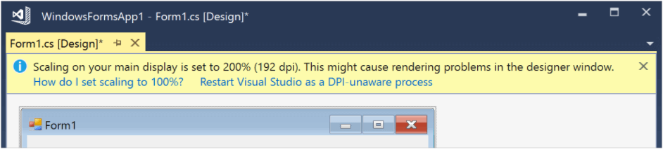

## Environment
<table>
    <tr>
        <td>Product Version</td>
        <td>2018.1 220</td>
    </tr>
    <tr>
        <td>Product</td>
        <td>UI for WinForms</td>
    </tr>
    <tr>
        <td>Last Update</td>
        <td>2020.3.1020</td>
    </tr>
</table>

## HDPI Tips and Tricks

Telerik UI for WinForms has built-in supports for High DPI. This means that when your application is run on a system where the scaling settings are different that 100%, it will be scaled.

### Enabling the scaling

There are more than one ways to enable/disable the scaling. They are discusses here: [DPI support](). The important part is that enabling the DPI awareness in the **app.manifest** file will break the ClickOnce installer. The following KB article demonstrates how to deal with this problem: [ClickOnce Application is Broken]().

### Developing on HDPI 

If your development machine has HDPI monitor and the scaling settings are larger than 100%, this can cause issues with the layout because opening the designer on such machines will set the __AutoScaleDimensions__ property (the default value in Designer.cs is **SizeF(6F, 13F)**). In the **AutoScaleDimensions** property the Visual Studio designer will serialize the dimensions of the unit used for comparison (either Font or DPI). These are the dimensions of the unit on the system the form is being designed on. When you run the form on a system with different settings, its dimensions are obtained and compared against the serialized dimensions. The scaling factor is computed based on that and then it is applied. And if a wrong factor is passed, the application can look smaller or larger than it should be. Please make sure that this property has its default value (__SizeF(6F, 13F)__).

The **AutoScaleMode** property indicates the method of calculating the scale factor. Depending on it, the scaling mechanism will calculate the scale factor according to the dimensions of the system font or the system DPI. If you set it to **None**, no scaling will be performed at all.

There is a warning in Visual Studio that recommends developing on 100%: [DPI-awareness in Visual Studio](https://docs.microsoft.com/en-us/dotnet/framework/winforms/disable-dpi-awareness-visual-studio)

When the scale factor is calculated, the framework calls the **Scale** method of the form which basically recalculates the **Size** and the **Location** of all child controls on it. Then their **Scale** method is also called so they can properly scale.

Unfortunately, this mechanism does not work as seamlessly as the one in WPF where you don’t even have to worry about scaling. But with the improvements that started with .NET Framework 4.5.1 the scaling has been improved. For more information check out [this](https://docs.microsoft.com/en-us/dotnet/desktop/winforms/automatic-scaling-in-windows-forms?view=netframeworkdesktop-4.8) article.

### General Tips for Designing Scalable WinForms

If you are designing a scalable application there are few simple guidelines that will help a lot:

* Design your forms under 96 DPI (100%) – as mentioned above, Visual Studio will serialize the scaling size of the form at design time and there are often problems when the form has been designed under higher DPI.
* Consider using [TableLayoutPanel](https://docs.microsoft.com/en-us/dotnet/api/system.windows.forms.tablelayoutpanel?view=netcore-3.1) when creating a DPI-aware application. Thus, the controls do not have specific location and size. This way when the form is resized the controls will fit in the available space. You can easily set Margin between the controls instead of using anchoring. The application will look better when it is scaled.   
* Always test different scenarios – running the application at different DPI settings; changing the DPI while it is running; moving the application to another monitor with different DPI.
* Design the interface of your forms so that it can “reflow” – use Anchored, Docked, AutoSized controls where possible.
* All containers must use the same AutoScaleMode.
* Use default font size (8.25 px) on all containers. If you need custom font size for a specific control, set it on that control instead on the container class.
* If it is possible to use [vector images](), it will improve the image rendering on HDPI monitors.
* Pay special attention to whether the font size scales correctly. If not, you will have to manually scale the font size for specific controls.
* If you have some custom layout logic, always keep in mind that the sizes and the locations of the controls will be different if the form is scaled. Also keep in mind that you should manually scale any constants you use if they denote pixels.

### Application Becomes DPI Aware at RunTime.

>tip An indicator for this is that there are dots after the strings in the application, despite that there is enough space. 

Telerik’s Document Processing library (**RadSpreadProcessing**, **RadWordProecessing** or **RadPdfProcessing**) is referencing assemblies which are used in WPF. All WPF-based applications are DPI aware by default and this is declared in the manifest files of the WPF assemblies. Therefore, if you use the document processing library in WinForms applications that are not DPI-aware, they might suddenly become DPI-aware at run time when you instantiate a type from the DPL assemblies (when the DPL assemblies are loaded by the CLR, this will also load the WPF assemblies which they depend on, which in turn will make the application DPI aware). The following KB article lists the available options for handling this situation: [App becomes DPI-aware at runtime]()

## See Also

* [DPI-support]()
* [App becomes DPI-aware at runtime]()
* [WinForms Scaling at Large DPI Settings–Is It Even Possible?](https://www.telerik.com/blogs/winforms-scaling-at-large-dpi-settings-is-it-even-possible-)
* [High DPI support in Windows Forms](https://docs.microsoft.com/en-us/dotnet/framework/winforms/high-dpi-support-in-windows-forms)
* [DoubleBufferedTableLayoutPanel]()