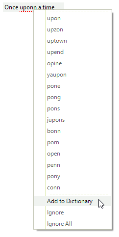

## Environment
 
|Product Version|Product|Author|
|----|----|----|
|2019.3.917|RadSpellChecker for WinForms|[Desislava Yordanova](https://www.telerik.com/blogs/author/desislava-yordanova)|
 
## Description

**RadSpellChecker** offers [spell-check as you type]() functionality that is supported for **RadTextBox** and **RadTextBoxControl**. This article demonstrates how to hide the *'Add to Dictionary'* option in the context menu which is shown once you right-click an incorrect word. 



## Solution 

You can find below two sample code snippets demonstrating how to access the context menu with suggested words and hide the 'Add to Dictionary' option.

### Hide the 'Add to Dictionary' menu item for RadTextBoxControl

````C#

public RadForm1()
{
    InitializeComponent();
    this.radSpellChecker1.AutoSpellCheckControl = this.radTextBoxControl1;
    this.radTextBoxControl1.Text = "Once uponn a time";

    this.radTextBoxControl1.ContextMenuOpening += radTextBoxControl1_ContextMenuOpening;
}

private void radTextBoxControl1_ContextMenuOpening(object sender, TreeBoxContextMenuOpeningEventArgs e)
{
    foreach (RadItem item in e.ContextMenu.Items)
    {
        if (item.Text.Contains("Add to Dictionary"))
            item.Visibility = Telerik.WinControls.ElementVisibility.Collapsed;
    }
}

        
````
````VB.NET

Sub New()

    InitializeComponent()

    Me.RadSpellChecker1.AutoSpellCheckControl = Me.RadTextBoxControl1
    Me.RadTextBoxControl1.Text = "Once uponn a time"

    AddHandler Me.RadTextBoxControl1.ContextMenuOpening, AddressOf RadTextBoxControl1_ContextMenuOpening
End Sub

Private Sub RadTextBoxControl1_ContextMenuOpening(sender As Object, e As TreeBoxContextMenuOpeningEventArgs)
    For Each item As RadItem In e.ContextMenu.Items

        If item.Text.Contains("Add to Dictionary") Then
            item.Visibility = Telerik.WinControls.ElementVisibility.Collapsed
        End If
    Next
End Sub
   

```` 

### Hide the 'Add to Dictionary' menu item for RadTextBox 

````C#
public RadForm1()
{
    InitializeComponent();
    this.radSpellChecker1.AutoSpellCheckControl = this.radTextBox1;
    this.radTextBox1.Text = "Once uponn a time";
    
    TextBoxSpellChecker textSpellChecker = this.radSpellChecker1.GetControlSpellChecker(typeof(RadTextBox)) as TextBoxSpellChecker;
    if (textSpellChecker != null)
    {
        textSpellChecker.DropDownMenu.PopupOpening += DropDownMenu_PopupOpening;
    }
}

private void DropDownMenu_PopupOpening(object sender, CancelEventArgs args)
{
    RadDropDownMenu menu = sender as RadDropDownMenu;
    foreach (RadItem item in menu.Items)
    {
        if (item.Text.Contains("Add to Dictionary"))
        {
            item.Visibility = Telerik.WinControls.ElementVisibility.Collapsed;
        }
    }
}
        
````
````VB.NET

Sub New()

    InitializeComponent()

    Me.RadSpellChecker1.AutoSpellCheckControl = Me.RadTextBox1
    Me.RadTextBox1.Text = "Once uponn a time"
    Dim textSpellChecker As TextBoxSpellChecker = TryCast(Me.RadSpellChecker1.GetControlSpellChecker(GetType(RadTextBox)), TextBoxSpellChecker)

    If textSpellChecker IsNot Nothing Then
        AddHandler textSpellChecker.DropDownMenu.PopupOpening, AddressOf DropDownMenu_PopupOpening
    End If
End Sub
Private Sub DropDownMenu_PopupOpening(ByVal sender As Object, ByVal args As CancelEventArgs)
    Dim menu As RadDropDownMenu = TryCast(sender, RadDropDownMenu)

    For Each item As RadItem In menu.Items

        If item.Text.Contains("Add to Dictionary") Then
            item.Visibility = Telerik.WinControls.ElementVisibility.Collapsed
        End If
    Next
End Sub


    

```` 
 


    
   
  
    
 
