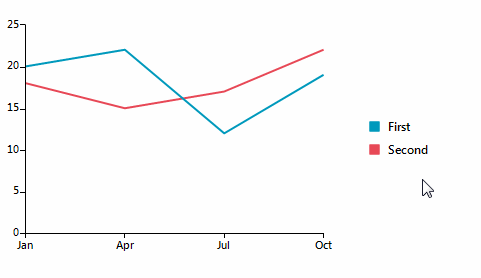

## Environment
 
|Product Version|Product|Author|
|----|----|----|
|2019.1.219|RadChartView for WinForms|[Desislava Yordanova](https://www.telerik.com/blogs/author/desislava-yordanova)|
 

## Description

This article aims to show you a sample approach how to hide/show a chart series by clicking its legend item.




## Solution 

It is necessary to handle the **Click** event of each **LegendItemElement** and manipulate the visibility of the associated chart series. Handling the **MouseEnter** event of **RadChartView** and setting the **ItemCapture** to *null* ensures that the chart is focused as soon as you move the mouse cursor over the chart:

#### Hide/Show chart series from legend items

````C#

        public RadForm1()
        {
            InitializeComponent();

            LineSeries lineSeries = new LineSeries();
            lineSeries.LegendTitle = "First";
            lineSeries.DataPoints.Add(new CategoricalDataPoint(20, "Jan"));
            lineSeries.DataPoints.Add(new CategoricalDataPoint(22, "Apr"));
            lineSeries.DataPoints.Add(new CategoricalDataPoint(12, "Jul"));
            lineSeries.DataPoints.Add(new CategoricalDataPoint(19, "Oct"));
            this.radChartView1.Series.Add(lineSeries);
            LineSeries lineSeries2 = new LineSeries();
            lineSeries2.LegendTitle = "Second";
            lineSeries2.DataPoints.Add(new CategoricalDataPoint(18, "Jan"));
            lineSeries2.DataPoints.Add(new CategoricalDataPoint(15, "Apr"));
            lineSeries2.DataPoints.Add(new CategoricalDataPoint(17, "Jul"));
            lineSeries2.DataPoints.Add(new CategoricalDataPoint(22, "Oct"));
            this.radChartView1.Series.Add(lineSeries2);

            this.radChartView1.ShowLegend = true;

            foreach (LegendItemElement item in this.radChartView1.ChartElement.LegendElement.StackElement.Children)
            {
                item.TitleElement.Click += TitleElement_Click;
            }
            this.radChartView1.MouseEnter += radChartView1_MouseEnter;
        }

        private void radChartView1_MouseEnter(object sender, EventArgs e)
        {
            this.radChartView1.Behavior.ItemCapture = null;
        }

        private void TitleElement_Click(object sender, EventArgs e)
        {
            LegendItemTitle title = sender as LegendItemTitle;
            LegendItemElement itemElement = title.Parent as LegendItemElement;
            itemElement.LegendItem.Element.IsVisible = !itemElement.LegendItem.Element.IsVisible;
            if (!itemElement.LegendItem.Element.IsVisible)
            {
                title.Opacity = 0.5;
            }
            else
            {
                title.Opacity = 1;
            }
        }
     
       
````
````VB.NET

    Sub New()

        InitializeComponent()

        Dim lineSeries As New LineSeries()
        lineSeries.LegendTitle = "First"
        lineSeries.DataPoints.Add(New CategoricalDataPoint(20, "Jan"))
        lineSeries.DataPoints.Add(New CategoricalDataPoint(22, "Apr"))
        lineSeries.DataPoints.Add(New CategoricalDataPoint(12, "Jul"))
        lineSeries.DataPoints.Add(New CategoricalDataPoint(19, "Oct"))
        Me.RadChartView1.Series.Add(lineSeries)
        Dim lineSeries2 As New LineSeries()
        lineSeries2.LegendTitle = "Second"
        lineSeries2.DataPoints.Add(New CategoricalDataPoint(18, "Jan"))
        lineSeries2.DataPoints.Add(New CategoricalDataPoint(15, "Apr"))
        lineSeries2.DataPoints.Add(New CategoricalDataPoint(17, "Jul"))
        lineSeries2.DataPoints.Add(New CategoricalDataPoint(22, "Oct"))
        Me.RadChartView1.Series.Add(lineSeries2)

        Me.RadChartView1.ShowLegend = True

        For Each item As LegendItemElement In Me.RadChartView1.ChartElement.LegendElement.StackElement.Children
            AddHandler item.TitleElement.Click, AddressOf TitleElement_Click
        Next

        AddHandler Me.RadChartView1.MouseEnter, AddressOf RadChartView_MouseEnter
    End Sub

    Private Sub RadChartView_MouseEnter(sender As Object, e As EventArgs)
        Me.RadChartView1.Behavior.ItemCapture = Nothing
    End Sub

    Private Sub TitleElement_Click(sender As Object, e As EventArgs)
        Dim title As LegendItemTitle = TryCast(sender, LegendItemTitle)
        Dim itemElement As LegendItemElement = TryCast(title.Parent, LegendItemElement)
        itemElement.LegendItem.Element.IsVisible = Not itemElement.LegendItem.Element.IsVisible
        If Not itemElement.LegendItem.Element.IsVisible Then
            title.Opacity = 0.5
        Else
            title.Opacity = 1
        End If
    End Sub
    
````

      
    

