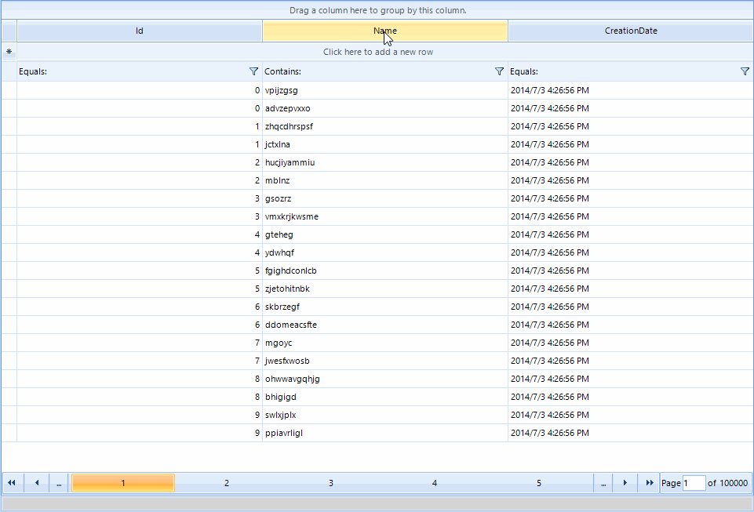

|Date Posted|Product|Author|
|----|----|----|
|Q1 2013|RadGridView|Georgi Georgiev| 

## Problem

You want to bind **RadGridView** to over a million items. In such cases it is recommended to use [Virtual Mode](https://docs.telerik.com/devtools/winforms/gridview/virtual-mode/virtual-mode), however this removes the Filtering, Sorting and Grouping capabilities of **RadGridView** since **RadGridView** has no direct access to its DataSource.

>important As of **Q1 2016 (version 2016.1.112)** Telerik UI for WinForms suite offers [RadVirtualGrid](https://docs.telerik.com/devtools/winforms/controls/virtualgrid/overview) control. It is a grid component developed on top of Telerik Presentation Framework which provides a convenient way to implement your own data management operations and optimizes the performance when interacting with large amounts of data.

## Solution

We can create a special Data Layer which will manage our **DataSource** and only provide the needed data to the grid. This layer will also allow RadGridView to be responsive while the operations are being executed. Below you can see the speed at which the operations will be performed when **RadGridView **is bound to 2 million items:

   

*NOTE: The projects below requires NET 4 since it uses some NET 4 features, such as Parallel LINQ and UI for Winforms version **Q1 2014 or above** due to the paging functionality and some API changes.*

First of all we need to create our Data Layer. It will be called **ItemSource**. It needs a few essential properties:

- **DataSource** – This will be the property which will keep the collection with all items which were initially passed to it.
- **View** – This will be the collection of items which will be represented by RadGridView. This collection will always be sorted or filtered according to the descriptors of RadGridView.
- **BoundProperties** – This collection will keep all the properties of the bound objects, so we can get or set the value when needed.
- **Count** – Will return the amount of items in the View.
- **Indexer** – Will return a value from the View by index.
- **CurrentOperation** – This will allow us to track what operation is executing at any given moment

The implementation of the above properties can be seen below:  
  
````C#
public ItemSourceOperation CurrentOperation { get; private set; }
  
public object DataSource
{
    get
    {
        return this.dataSource;
    }
    set
    {
        if (value == null)
        {
            this.dataSource = this.view = null;
            return;
        }
  
        IList dsList = ListBindingHelper.GetList(value) as IList;
        if (dsList == null || this.dataSource == dsList)
        {
            return;
        }
  
        this.dataSource = this.view = dsList;
        this.boundProperties = null;
    }
}
  
public IList View
{
    get { return this.view; }
}
  
public object this[int index]
{
    get { return this.view[index]; }
}
  
public PropertyDescriptorCollection BoundProperties
{
    get
    {
        if (this.dataSource == null || this.dataSource.Count == 0)
        {
            return new PropertyDescriptorCollection(null);
        }
  
        if (boundProperties == null)
        {
            boundProperties = ListBindingHelper.GetListItemProperties(this.dataSource);
        }
  
        return boundProperties;
    }
}
  
public int Count
{
    get
    {
        return this.view.Count;
    }
}

````
````VB.NET
Public Property CurrentOperation() As ItemSourceOperation
    Get
        Return m_CurrentOperation
    End Get
    Private Set(value As ItemSourceOperation)
        m_CurrentOperation = Value
    End Set
End Property
Private m_CurrentOperation As ItemSourceOperation
  
Public Property DataSource() As Object
    Get
        Return Me.m_dataSource
    End Get
    Set(value As Object)
        If value Is Nothing Then
            Me.m_dataSource = InlineAssignHelper(Me.m_view, Nothing)
            Return
        End If
  
        Dim dsList As IList = TryCast(ListBindingHelper.GetList(value), IList)
        If dsList Is Nothing OrElse Object.Equals(Me.m_dataSource, dsList) Then
            Return
        End If
  
        Me.m_dataSource = InlineAssignHelper(Me.m_view, dsList)
        Me.m_boundProperties = Nothing
    End Set
End Property
  
Public ReadOnly Property View() As IList
    Get
        Return Me.m_view
    End Get
End Property
  
Default Public ReadOnly Property Item(index As Integer) As Object
    Get
        Return Me.m_view(index)
    End Get
End Property
  
Public ReadOnly Property BoundProperties() As PropertyDescriptorCollection
    Get
        If Me.m_dataSource Is Nothing OrElse Me.m_dataSource.Count = 0 Then
            Return New PropertyDescriptorCollection(Nothing)
        End If
  
        If m_boundProperties Is Nothing Then
            m_boundProperties = ListBindingHelper.GetListItemProperties(Me.m_dataSource)
        End If
  
        Return m_boundProperties
    End Get
End Property
  
Public ReadOnly Property Count() As Integer
    Get
        If Me.m_view Is Nothing Then
            Return 0
        End If
  
        Return Me.m_view.Count
    End Get
End Property

```` 

It will also need to have methods which will allow us to get the values from the items in the **DataSource**, namely **GetValue** and **SetValue**:

````C#
public virtual bool SetValue(object entry, int index, object value)
{
    if (!this.BoundProperties[index].IsReadOnly)
    {
        this.BoundProperties[index].SetValue(entry, value);
        return true;
    }
  
    return false;
}
  
public virtual bool SetValue(object entry, string member, object value)
{
    if (!this.BoundProperties[member].IsReadOnly)
    {
        this.BoundProperties[member].SetValue(entry, value);
        return true;
    }
  
    return false;
}
  
public virtual object GetValue(object entry, int index)
{
    return this.BoundProperties[index].GetValue(entry);
}
  
public virtual object GetValue(object entry, string member)
{
    return this.BoundProperties[member].GetValue(entry);
}


````
````VB.NET
Public Overridable Function SetValue(entry As Object, index As Integer, value As Object) As Boolean
    If Not Me.BoundProperties(index).IsReadOnly Then
        Me.BoundProperties(index).SetValue(entry, value)
        Return True
    End If
  
    Return False
End Function
  
Public Overridable Function SetValue(entry As Object, member As String, value As Object) As Boolean
    If Not Me.BoundProperties(member).IsReadOnly Then
        Me.BoundProperties(member).SetValue(entry, value)
        Return True
    End If
  
    Return False
End Function
  
Public Overridable Function GetValue(entry As Object, index As Integer) As Object
    Return Me.BoundProperties(index).GetValue(entry)
End Function
  
Public Overridable Function GetValue(entry As Object, member As String) As Object
    Return Me.BoundProperties(member).GetValue(entry)
End Function

````

Now, our **ItemSource** has to be able to perform the very important Sorting and Filtering operations. For the sorting we will use PLINQ. The queries will be executed over the view. Here is how our sorting method will look like:

````C#
protected virtual void Sort(SortDescriptorCollection descriptors)
{
    SortDescriptor[] currentDescriptors = descriptors.ToArray();
    if (this.CurrentOperation != ItemSourceOperation.None)
    {
        return;
    }
  
    if (currentDescriptors.Length == 0)
    {
        this.view = this.dataSource;
        this.Filter(this.masterTemplate.FilterDescriptors);
  
        return;
    }
  
    this.CurrentOperation = ItemSourceOperation.Sorting;
    List<object> sortView = this.view as List<object>;
  
    if (sortView == null)
    {
        sortView = new List<object>(this.view.Count);
        foreach (object item in this.view)
        {
            sortView.Add(item);
        }
    }
  
    ParallelQuery<object> query = sortView.AsParallel();
    SortDescriptor firstDescriptor = currentDescriptors.First();
    if (firstDescriptor.Direction == ListSortDirection.Descending)
    {
        query = query.OrderByDescending(x => this.GetValue(x, firstDescriptor.PropertyName));
    }
    else
    {
        query = query.OrderBy(x => this.GetValue(x, firstDescriptor.PropertyName));
    }
  
    OrderedParallelQuery<object> orderedQuery = query as OrderedParallelQuery<object>;
    for (int i = 1; i < currentDescriptors.Length; i++)
    {
        SortDescriptor currentDescriptor = currentDescriptors[i];
        if (currentDescriptor.Direction == ListSortDirection.Descending)
        {
            orderedQuery = orderedQuery.ThenByDescending(x => this.GetValue(x, currentDescriptor.PropertyName));
        }
        else
        {
            orderedQuery = orderedQuery.ThenBy(x => this.GetValue(x, currentDescriptor.PropertyName));
        }
    }
  
    this.view = orderedQuery.ToList();
    this.CurrentOperation = ItemSourceOperation.None;
}

````
````VB.NET
Protected Overridable Sub Sort(descriptors As SortDescriptorCollection)
    Dim currentDescriptors As SortDescriptor() = descriptors.ToArray()
    If Me.CurrentOperation <> ItemSourceOperation.None Then
        Return
    End If
  
    If currentDescriptors.Length = 0 Then
  
        Me.m_view = m_dataSource
        Me.Filter(Me.masterTemplate.FilterDescriptors)
  
        Return
    End If
  
  
    Me.CurrentOperation = ItemSourceOperation.Sorting
    Dim sortView As List(Of Object) = TryCast(Me.m_view, List(Of Object))
  
    If sortView Is Nothing Then
        sortView = New List(Of Object)()
        For Each item As Object In Me.m_view
            sortView.Add(item)
        Next
    End If
  
    Dim query As ParallelQuery(Of Object) = sortView.AsParallel()
  
    Dim firstDescriptor As SortDescriptor = currentDescriptors.First()
    If firstDescriptor.Direction = ListSortDirection.Descending Then
        query = query.OrderByDescending(Function(x) Me.GetValue(x, firstDescriptor.PropertyName))
    Else
        query = query.OrderBy(Function(x) Me.GetValue(x, firstDescriptor.PropertyName))
    End If
  
    Dim orderedQuery As OrderedParallelQuery(Of Object) = TryCast(query, OrderedParallelQuery(Of Object))
    For i As Integer = 1 To currentDescriptors.Length - 1
        Dim currentDescriptor As SortDescriptor = currentDescriptors(i)
        If currentDescriptor.Direction = ListSortDirection.Descending Then
            orderedQuery = orderedQuery.ThenByDescending(Function(x) Me.GetValue(x, currentDescriptor.PropertyName))
        Else
            orderedQuery = orderedQuery.ThenBy(Function(x) Me.GetValue(x, currentDescriptor.PropertyName))
        End If
    Next
  
    Me.m_view = orderedQuery.ToList()
    Me.CurrentOperation = ItemSourceOperation.None
End Sub

````

For the filtering we will use the ExpressionParser which RadGridView uses internally to check whether an object passes certain filter:

````C#
protected virtual void Filter(FilterDescriptorCollection descriptors)
{
    FilterDescriptor[] currentDescriptors = descriptors.ToArray();
    ExpressionNode node = ExpressionParser.Parse(descriptors.Expression,this.masterTemplate.CaseSensitive);
  
    if (this.CurrentOperation != ItemSourceOperation.None || node == null || currentDescriptors.Length == 0)
    {
        this.view = this.dataSource;
        this.CurrentOperation = ItemSourceOperation.None;
        return;
    }
  
    this.CurrentOperation = ItemSourceOperation.Filtering;
    List<object> newView = new List<object>();
    IList filteredView = this.dataSource;
  
    for (int i = 0; i < filteredView.Count; i++)
    {
        if (!this.perform)
        {
            this.CurrentOperation = ItemSourceOperation.None;
            return;
        }
  
        object entry = filteredView[i];
        ExpressionContext context = new ExpressionContext();
  
        for (int j = 0; j < currentDescriptors.Length; j++)
        {
            string member = currentDescriptors[j].PropertyName;
            if (!context.ContainsKey(member))
            {
                context.Add(member, this.GetValue(entry, member));
            }
            else
            {
                context[member] = this.GetValue(entry, member);
            }
        }
  
        object evalResult = node.Eval(null, context);
  
        if (evalResult is bool && (bool)evalResult)
        {
            newView.Add(entry);
        }
    }
  
    this.view = newView;
    this.CurrentOperation = ItemSourceOperation.None;
}

````
````VB.NET
Protected Overridable Sub Filter(descriptors As FilterDescriptorCollection)
    Dim currentDescriptors As FilterDescriptor() = descriptors.ToArray()
    Dim node As ExpressionNode = ExpressionParser.Parse(descriptors.Expression, Me.masterTemplate.CaseSensitive)
  
    If Me.CurrentOperation <> ItemSourceOperation.None OrElse node Is Nothing OrElse currentDescriptors.Length = 0 Then
        Me.m_view = Me.m_dataSource
        Me.CurrentOperation = ItemSourceOperation.None
        Return
    End If
  
    Me.CurrentOperation = ItemSourceOperation.Filtering
    Dim newView As New List(Of Object)()
    Dim filteredView As IList = Me.m_dataSource
  
    For i As Integer = 0 To filteredView.Count - 1
        If Not Me.m_perform Then
            Me.CurrentOperation = ItemSourceOperation.None
            Return
        End If
  
        Dim entry As Object = filteredView(i)
        Dim context As New ExpressionContext()
  
        For j As Integer = 0 To currentDescriptors.Length - 1
            Dim member As String = currentDescriptors(j).PropertyName
            If Not context.ContainsKey(member) Then
                context.Add(member, Me.GetValue(entry, member))
            Else
                context(member) = Me.GetValue(entry, member)
            End If
        Next
  
        Dim evalResult As Object = node.Eval(Nothing, context)
  
        If TypeOf evalResult Is Boolean AndAlso CBool(evalResult) Then
            newView.Add(entry)
        End If
    Next
  
    Me.m_view = newView
    Me.CurrentOperation = ItemSourceOperation.None
End Sub

````

The grouping will still be performed by RadGridView, due to its nature. That is why it is recommended to use the Paging functionality along with the PagingBeforeGrouping property set to true. Now we can filter or sort our data, however these methods are protected, moreover, even if we execute them they will be synchronous, which will block the UI thread. We will prevent that by implementing a queuing mechanism which will execute these methods and provide events for when the operations are complete. For this we will use a [BackgroundWorker](https://docs.microsoft.com/en-us/dotnet/api/system.componentmodel.backgroundworker?redirectedfrom=MSDN&view=net-5.0):

````C#
protected BackgroundWorker BackgroundWorker
{
    get { return this.backgroundWorker; }
}

````
````VB.NET
Protected ReadOnly Property BackgroundWorker() As BackgroundWorker
    Get
        Return Me.m_backgroundWorker
    End Get
End Property

````

The **WorkerCompleted**, **ProgressChanged** and **DoWork** events will be used to respectively:

* Start another cycle which will execute tasks if there are such and report that there are no more tasks to execute

* Report that a task is finished

* Dequeue tasks and execute them in order

We will use one class and one enumeration that in the process of execution of pending tasks:

````C#
public enum ItemSourceOperation
{
    None = 0,
    Filtering = 1,
    Sorting = Filtering << 1
}
  
public class ItemSourceOperationEventArgs : EventArgs
{
    public ItemSourceOperation OperationType { get; private set; }
  
    public ItemSourceOperationEventArgs(ItemSourceOperation operation)
    {
        this.OperationType = operation;
    }
}


````
````VB.NET
Public Enum ItemSourceOperation
    None = 0
    Filtering = 1
    Sorting = Filtering << 1
End Enum
  
Public Class ItemSourceOperationEventArgs
    Inherits EventArgs
    Public Property OperationType() As ItemSourceOperation
        Get
            Return m_OperationType
        End Get
        Private Set(value As ItemSourceOperation)
            m_OperationType = Value
        End Set
    End Property
    Private m_OperationType As ItemSourceOperation
  
    Public Sub New(operation As ItemSourceOperation)
        Me.OperationType = operation
    End Sub
End Class

````

And these are the event handlers of the background worker, described above:

````C#
protected virtual void BgWorkerRunWorkerCompleted(object sender, RunWorkerCompletedEventArgs e)
{
    if (this.queuedOperations.Count > 0)
    {
        this.perform = true;
        this.backgroundWorker.RunWorkerAsync();
    }
  
    this.OnOperationCompleted((ItemSourceOperationCompletedEventArgs)e.Result);
}
  
protected virtual void BgWorkerProgressChanged(object sender, ProgressChangedEventArgs e)
{
    this.OnOperationStarted(new ItemSourceOperationEventArgs((ItemSourceOperation)e.UserState));
}
  
protected virtual void BgWorkerDoWork(object sender, DoWorkEventArgs e)
{
    ItemSourceOperation operations = default(ItemSourceOperation);
    while (this.queuedOperations.Count > 0 && this.perform)
    {
        OperationParameters currentParams;
        if (!this.queuedOperations.TryDequeue(out currentParams))
        {
            System.Threading.Thread.Sleep(100);
            continue;
        }
  
        this.backgroundWorker.ReportProgress(0, currentParams.Operation);
        switch (currentParams.Operation)
        {
            case ItemSourceOperation.Filtering:
                this.Filter(currentParams.Descriptors as FilterDescriptorCollection);
                break;
            case ItemSourceOperation.Sorting:
                this.Sort(currentParams.Descriptors as SortDescriptorCollection);
                break;
            default:
                break;
        }
  
        operations |= currentParams.Operation;
    }
  
    e.Result = new ItemSourceOperationCompletedEventArgs(operations, !this.perform);
}

````
````VB.NET
Protected Overridable Sub BgWorkerProgressChanged(sender As Object, e As ProgressChangedEventArgs)
    Me.OnOperationStarted(New ItemSourceOperationEventArgs(CType(e.UserState, ItemSourceOperation)))
End Sub
  
Protected Overridable Sub BgWorkerDoWork(sender As Object, e As DoWorkEventArgs)
    Dim operations As ItemSourceOperation = Nothing
    While Me.queuedOperations.Count > 0 AndAlso Me.m_perform
        Dim currentParams As OperationParameters
        If Not Me.queuedOperations.TryDequeue(currentParams) Then
            System.Threading.Thread.Sleep(100)
            Continue While
        End If
  
        Me.m_backgroundWorker.ReportProgress(0, currentParams.Operation)
        Select Case currentParams.Operation
            Case ItemSourceOperation.Filtering
                Me.Filter(TryCast(currentParams.Descriptors, FilterDescriptorCollection))
                Exit Select
            Case ItemSourceOperation.Sorting
                Me.Sort(TryCast(currentParams.Descriptors, SortDescriptorCollection))
                Exit Select
            Case Else
                Exit Select
        End Select
  
        operations = operations Or currentParams.Operation
    End While
  
    e.Result = New ItemSourceOperationCompletedEventArgs(operations, Not Me.m_perform)
End Sub

````

After we have a mechanism which can execute tasks in order we need a way to start it up. We will expose one method which be responsible for this:

````C#
public void PerformOperation(ItemSourceOperation operation, IList descriptors, bool force = false)
{
    switch (operation)
    {
        case ItemSourceOperation.Filtering:
            FilterDescriptorCollection filterDescriptors = descriptors as FilterDescriptorCollection;
            if (this.lastFilterExpression == filterDescriptors.Expression && !force)
            {
                return;
            }
  
            this.lastFilterExpression = filterDescriptors.Expression;
            break;
        case ItemSourceOperation.Sorting:
            SortDescriptorCollection sortDescriptors = descriptors as SortDescriptorCollection;
            if (this.lastSortExpression == sortDescriptors.Expression && !force)
            {
                return;
            }
  
            this.lastSortExpression = sortDescriptors.Expression;
            break;
        default:
            break;
    }
  
    OperationParameters operationParams = new OperationParameters(operation, descriptors);
    this.queuedOperations.Enqueue(operationParams);
    if (this.backgroundWorker.IsBusy)
    {
        OperationParameters peek;
        bool peeked = this.queuedOperations.TryPeek(out peek);
        if (peeked && peek.Operation == operationParams.Operation && peek != operationParams)
        {
            OperationParameters dequeued;
            this.queuedOperations.TryDequeue(out dequeued);
        }
        else if (peeked && peek.Operation != operationParams.Operation)
        {
            this.perform = false;
        }
    }
  
    if (!this.backgroundWorker.IsBusy)
    {
        this.perform = true;
        this.backgroundWorker.RunWorkerAsync();
        this.OnOperationStarted(new ItemSourceOperationEventArgs(operationParams.Operation));
    }
}

````
````VB.NET
Public Sub PerformOperation(operation As ItemSourceOperation, descriptors As IList, Optional force As Boolean = False)
    Select Case operation
        Case ItemSourceOperation.Filtering
            Dim filterDescriptors As FilterDescriptorCollection = TryCast(descriptors, FilterDescriptorCollection)
            If Me.lastFilterExpression = filterDescriptors.Expression AndAlso Not force Then
                Return
            End If
  
            Me.lastFilterExpression = filterDescriptors.Expression
            Exit Select
        Case ItemSourceOperation.Sorting
            Dim sortDescriptors As SortDescriptorCollection = TryCast(descriptors, SortDescriptorCollection)
            If Me.lastSortExpression = sortDescriptors.Expression AndAlso Not force Then
                Return
            End If
  
            Me.lastSortExpression = sortDescriptors.Expression
            Exit Select
        Case Else
            Exit Select
    End Select
  
    Dim operationParams As New OperationParameters(operation, descriptors)
    Me.queuedOperations.Enqueue(operationParams)
    If Me.m_backgroundWorker.IsBusy Then
        Dim peek As OperationParameters
        Dim peeked As Boolean = Me.queuedOperations.TryPeek(peek)
        If peeked AndAlso peek.Operation = operationParams.Operation AndAlso peek IsNot operationParams Then
            Dim dequeued As OperationParameters
            Me.queuedOperations.TryDequeue(dequeued)
        ElseIf peeked AndAlso peek.Operation <> operationParams.Operation Then
            Me.m_perform = False
        End If
    End If
  
    If Not Me.m_backgroundWorker.IsBusy Then
        Me.m_perform = True
        Me.m_backgroundWorker.RunWorkerAsync()
        Me.OnOperationStarted(New ItemSourceOperationEventArgs(operationParams.Operation))
    End If
End Sub

````

Now, we need to integrate this layer into RadGridView. To do this we will inherit from RadGridView and add a few properties:

* **ItemsSource** – This will keep a reference to the ItemSource which will manage the data

* **VirtualDataSource** – It will set the DataSource of the ItemSource and initialize the Rows and Columns according to the properties and the amount of items

* **ShowLoadingOverlay** – Determines whether a waiting bar will be displayed in the middle of RadGridView while the operations are being performed in the background

* **AutomaticallyRetreiveCellValues** – As we know, in VirtualMode we need to provide the values of the cells by ourselves. In this case this is not a trivial task, since many factors such as groups and pages should be taken into consideration, that is why we will provide a built-in way to do this.

* **AutomaticallyPushCellValues** – The same as the previous property, however this time we will set the value of the data bound items.

* **LoadingOverlay** – Provides reference to the waiting bar being displayed in the middle of RadGridView 

````C#
public ItemSource ItemsSource
{
    get { return (this.GridViewElement as VirtualRadGridViewElement).ItemsSource; }
}
  
public object VirtualDataSource
{
    get { return this.ItemsSource.DataSource; }
    set
    {
        this.FilterDescriptors.Clear();
        this.SortDescriptors.Clear();
        this.GroupDescriptors.Clear();
        this.ItemsSource.DataSource = value;
        this.Initialize();
    }
}
  
public bool ShowLoadingOverlay { get; set; }
  
public bool AutomaticallyRetreiveCellValues { get; set; }
  
public bool AutomaticallyPushCellValues { get; set; }
  
public RadWaitingBar LoadingOverlay
{
    get { return this.loadingOverlay;
}

````
````VB.NET
Public ReadOnly Property ItemsSource() As ItemSource
    Get
        Return TryCast(Me.GridViewElement, VirtualRadGridViewElement).ItemsSource
    End Get
End Property
  
Public Property VirtualDataSource() As Object
    Get
        Return Me.ItemsSource.DataSource
    End Get
    Set(value As Object)
        Me.FilterDescriptors.Clear()
        Me.SortDescriptors.Clear()
        Me.GroupDescriptors.Clear()
        Me.ItemsSource.DataSource = value
        Me.Initialize()
    End Set
End Property
  
Public Property ShowLoadingOverlay() As Boolean
    Get
        Return m_ShowLoadingOverlay
    End Get
    Set(value As Boolean)
        m_ShowLoadingOverlay = Value
    End Set
End Property
Private m_ShowLoadingOverlay As Boolean
  
Public Property AutomaticallyRetreiveCellValues() As Boolean
    Get
        Return m_AutomaticallyRetreiveCellValues
    End Get
    Set(value As Boolean)
        m_AutomaticallyRetreiveCellValues = Value
    End Set
End Property
Private m_AutomaticallyRetreiveCellValues As Boolean
  
Public Property AutomaticallyPushCellValues() As Boolean
    Get
        Return m_AutomaticallyPushCellValues
    End Get
    Set(value As Boolean)
        m_AutomaticallyPushCellValues = Value
    End Set
End Property
Private m_AutomaticallyPushCellValues As Boolean
  
Public ReadOnly Property LoadingOverlay() As RadWaitingBar
    Get
        Return Me.m_loadingOverlay
    End Get
End Property

````

The Initialize method is very essential as it manages the rows and columns of RadGridView. It should be executed either when the DataSource changes or when BindingContext changes:

````C#
protected override void OnBindingContextChanged(EventArgs e)
{
    base.OnBindingContextChanged(e);
    this.Initialize();
}
  
protected virtual void Initialize()
{
    if (this.BindingContext == null)
    {
        return;
    }
  
    if (this.RowCount == this.ItemsSource.Count && this.ColumnCount == this.ItemsSource.BoundProperties.Count)
    {
        return;
    }
  
    this.InitializeRowsAndColumns();
}
  
protected virtual void InitializeRowsAndColumns()
{
    if (!this.IsLoaded || this.VirtualDataSource == null)
    {
        return;
    }
  
    this.BeginUpdate();
    this.InitializeColumns();
    this.InitializeRows();
    this.EndUpdate();
}
  
protected virtual void InitializeColumns()
{
    if (this.ColumnCount != this.ItemsSource.BoundProperties.Count)
    {
        this.ColumnCount = this.ItemsSource.BoundProperties.Count;
        for (int i = 0; i < this.Columns.Count; i++)
        {
            PropertyDescriptor prop = this.ItemsSource.BoundProperties[i];
            GridViewDataColumn newColumn = GridViewHelper.AutoGenerateGridColumn(prop.PropertyType, null);
            newColumn.HeaderText = prop.DisplayName;
            newColumn.Name = prop.Name;
  
            this.Columns.RemoveAt(i);
            this.Columns.Insert(i, newColumn);
        }
    }
}
  
protected virtual void InitializeRows()
{
    if (this.RowCount != this.ItemsSource.Count)
    {
        this.RowCount = this.ItemsSource.Count;
    }
}

````
````VB.NET
Protected Overrides Sub OnBindingContextChanged(e As EventArgs)
    MyBase.OnBindingContextChanged(e)
    Me.Initialize()
End Sub
  
Protected Overridable Sub Initialize()
    If Me.BindingContext Is Nothing Then
        Return
    End If
  
    If Me.RowCount = Me.ItemsSource.Count AndAlso Me.ColumnCount = Me.ItemsSource.BoundProperties.Count Then
        Return
    End If
  
    Me.InitializeRowsAndColumns()
End Sub
  
Protected Overridable Sub InitializeRowsAndColumns()
    If Not Me.IsLoaded OrElse Me.VirtualDataSource Is Nothing Then
        Return
    End If
  
    Me.BeginUpdate()
    Me.InitializeColumns()
    Me.InitializeRows()
    Me.EndUpdate()
End Sub
  
Protected Overridable Sub InitializeColumns()
    If Me.ColumnCount <> Me.ItemsSource.BoundProperties.Count Then
        Me.ColumnCount = Me.ItemsSource.BoundProperties.Count
        For i As Integer = 0 To Me.Columns.Count - 1
            Dim prop As PropertyDescriptor = Me.ItemsSource.BoundProperties(i)
            Dim newColumn As GridViewDataColumn = GridViewHelper.AutoGenerateGridColumn(prop.PropertyType, Nothing)
            newColumn.HeaderText = prop.DisplayName
            newColumn.Name = prop.Name
  
            Me.Columns.RemoveAt(i)
            Me.Columns.Insert(i, newColumn)
        Next
    End If
End Sub
  
Protected Overridable Sub InitializeRows()
    If Me.RowCount <> Me.ItemsSource.Count Then
        Me.RowCount = Me.ItemsSource.Count
    End If
End Sub

````

Now we just need to replace some of the classes of RadGridView. First we start with the RadGridViewElement:

````C#
protected override RadGridViewElement CreateGridViewElement()
{
    return new VirtualRadGridViewElement();
}

````
````VB.NET
Protected Overrides Function CreateGridViewElement() As RadGridViewElement
    Return New VirtualRadGridViewElement()
End Function

````

In the VirtualRadGridViewElement we will need to create a custom MasterTemplate:

````C#
protected override MasterGridViewTemplate CreateTemplate()
{
    return new VirtualMasterGridViewTemplate();
}

````
````VB.NET
Protected Overrides Function CreateTemplate() As MasterGridViewTemplate
    Return New VirtualMasterGridViewTemplate()
End Function

````

And in the VirtualMasterGridViewTemplate, a custom ListSource:

````C#
protected override GridViewListSource CreateListSource()
{
    return new VirtualGridViewListSource(this);
}

````
````VB.NET
Protected Overrides Function CreateListSource() As GridViewListSource
    Return New VirtualGridViewListSource(Me)
End Function

````

In the ListSource we need to set the DataBoundItem to our rows manually, in order to be able to group by these rows and create a custom RadCollectionView:

````C#
protected override void InsertItem(int index, GridViewRowInfo item)
{
    base.InsertItem(index, item);
    this.InitializeBoundRow(item, this.DataView.ItemsSource[index]);
}
  
protected override Telerik.WinControls.Data.RadCollectionView<GridViewRowInfo> CreateDefaultCollectionView()
{
    this.DataView = new VirtualGridDataView(this);
    return this.DataView;
}

````
````VB.NET
Protected Overrides Sub InsertItem(index As Integer, item As GridViewRowInfo)
    MyBase.InsertItem(index, item)
    Me.InitializeBoundRow(item, Me.DataView.ItemsSource(index))
End Sub
  
Protected Overrides Function CreateDefaultCollectionView() As Telerik.WinControls.Data.RadCollectionView(Of GridViewRowInfo)
    Me.DataView = New VirtualGridDataView(Me)
    Return Me.DataView
End Function

````

The DataView actually creates the ItemSource, the GroupBuilder and the Indexer which simply keeps reference to the rows:

````C#
public VirtualGridDataView(GridViewListSource listSource)
    : base(listSource)
{
    this.listSource = listSource;
}
  
public GridViewListSource ListSource
{
    get { return this.listSource; }
}
  
protected override Telerik.Collections.Generic.Index<GridViewRowInfo> CreateIndex()
{
    return new VirtualIndex(this);
}
  
protected override GroupBuilder<GridViewRowInfo> CreateGroupBuilder()
{
    return new VirtualGroupBuilder(this.Indexer, this);
}

````
````VB.NET
Public ReadOnly Property ListSource() As GridViewListSource
    Get
        Return Me.m_listSource
    End Get
End Property
  
Public Sub New(listSource As GridViewListSource)
    MyBase.New(listSource)
    Me.m_listSource = listSource
End Sub
  
Protected Overrides Function CreateIndex() As Telerik.Collections.Generic.Index(Of GridViewRowInfo)
    Return New VirtualIndex(Me)
End Function
  
Protected Overrides Function CreateGroupBuilder() As GroupBuilder(Of GridViewRowInfo)
    Return New VirtualGroupBuilder(Me.Indexer, Me)
End Function

````

This is what the VirtualIndex requires to work properly:

````C#
public VirtualIndex(RadCollectionView<GridViewRowInfo> collectionView)
    : base(collectionView)
{
}
  
public override IList<GridViewRowInfo> Items
{
    get
    {
        return (this.CollectionView as VirtualGridDataView).ListSource;
    }
}
  
protected override void Perform()
{
}

````
````VB.NET
Public Class VirtualIndex
    Inherits Index(Of GridViewRowInfo)
    Public Sub New(collectionView As RadCollectionView(Of GridViewRowInfo))
        MyBase.New(collectionView)
    End Sub
  
    Public Overrides ReadOnly Property Items() As IList(Of GridViewRowInfo)
        Get
            Return TryCast(Me.CollectionView, VirtualGridDataView).ListSource
        End Get
    End Property
  
    Protected Overrides Sub Perform()
    End Sub
End Class

````

And this is what our GroupBuilder requires:

````C#
private VirtualGridDataView dataView;
  
public VirtualGroupBuilder(Telerik.Collections.Generic.Index<GridViewRowInfo> index, VirtualGridDataView dataView)
    : base(index)
{
    this.dataView = dataView;
}
  
protected override object GetItemKey(GridViewRowInfo item, SortDescriptor descriptor)
{
    return this.dataView.ItemsSource.GetValue(item.DataBoundItem, descriptor.PropertyIndex);
}

````
````VB.NET
Public Class VirtualGroupBuilder
    Inherits GroupBuilder(Of GridViewRowInfo)
    Private dataView As VirtualGridDataView
  
    Public Sub New(index As Telerik.Collections.Generic.Index(Of GridViewRowInfo), dataView As VirtualGridDataView)
        MyBase.New(index)
        Me.dataView = dataView
    End Sub
  
    Protected Overrides Function GetItemKey(item As GridViewRowInfo, descriptor As SortDescriptor) As Object
        Return Me.dataView.ItemsSource.GetValue(item.DataBoundItem, descriptor.PropertyIndex)
    End Function
End Class

````

NOTE: In order to see the full implementation of the classes you should download the source code below.

In order to use the grid it is enough to set the **VirtualDataSource** property to some collection. You can also use the **OperationStarted** and **OperationCompleted** events at will.

>note A complete solution in C# and VB.NET can be found [here](https://github.com/telerik/winforms-sdk/tree/master/GridView/VirtualRadGridView).