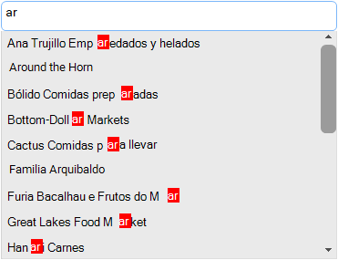

## Environment
 
|Product Version|Product|Author|
|----|----|----|
|2020.1.113|RadListView for WinForms|[Nadya Karaivanova](https://www.telerik.com/blogs/author/nadya-karaivanova)|
 
## Description

This tutorial demonstrates how to highlight text results both backcolor and forecolor when filtering in **RadListView** by using [HTML-like text formatting]() approach. 
 


## Solution 

First, I would like to note that HTML-like text formatting uses uses GDI+ to measure and render the text. You can find more information about text rendering [here](). 

The desired text highlight effect can be achieved by subscribing to the [VisualItemFormatting]() event that provides a convenient way for customizing the items appearance. In this event you have access to the **ListViewDataItem** via the **VisualItem.Data** property. Then, you can separate the text to a small parts by the searched symbol/s. Finally, you can use the HTML-like text formatting to apply a specific look of the text parts accordingly.  

A full code snippet is illustrated below:
 

````C#

public RadForm1()
{
    InitializeComponent();
    this.radListView1.UseCompatibleTextRendering = true;

    radListView1.EnableFiltering = true;
    this.radTextBoxControl1.TextChanged += this.radTextBoxControl1_TextChanged;
    this.radListView1.VisualItemFormatting += this.RadListView1_VisualItemFormatting;
}

string searchedValue;
private void RadListView1_VisualItemFormatting(object sender, ListViewVisualItemEventArgs e)
{
    ListViewDataItem data = e.VisualItem.Data as ListViewDataItem;
    if (data != null && searchedValue != null)
    {
        string dataText = data.Text;
        if (dataText.Contains(searchedValue))
        {
            string firstPart = dataText.Substring(0, dataText.IndexOf(searchedValue));
            int startFormatting = dataText.IndexOf(searchedValue) + searchedValue.Length;
            string secondPart = dataText.Substring(startFormatting, dataText.Length - startFormatting);

            e.VisualItem.Text = String.Format(@"<html>" + firstPart + "<span style=\"color: white\"><span style=\"background-color:red\">" + searchedValue + "</span><span style=\"color: black\">" + secondPart) + "</span></html>";
        }
    }
}
private void radTextBoxControl1_TextChanged(object sender, EventArgs e)
{
    searchedValue = (sender as RadTextBoxControl).Text;
    if (searchedValue != null)
    {
        FilterDescriptor valueFilter = new FilterDescriptor(this.radListView1.DisplayMember, FilterOperator.Contains, searchedValue);
        this.radListView1.FilterDescriptors.Add(valueFilter);
    }
}

   
````
````VB.NET

Public Class RadForm1
    Public Sub New()
        InitializeComponent()
        Me.RadListView1.UseCompatibleTextRendering = True
        RadListView1.EnableFiltering = True
        AddHandler Me.RadTextBoxControl1.TextChanged, AddressOf RadTextBoxControl1_TextChanged_1
        AddHandler Me.RadListView1.VisualItemFormatting, AddressOf Me.RadListView1_VisualItemFormatting
    End Sub

    Private searchedValue As String
    Private Sub RadListView1_VisualItemFormatting(ByVal sender As Object, ByVal e As ListViewVisualItemEventArgs)
        Dim data As ListViewDataItem = TryCast(e.VisualItem.Data, ListViewDataItem)

        If data IsNot Nothing AndAlso searchedValue IsNot Nothing Then
            Dim dataText As String = data.Text

            If dataText.Contains(searchedValue) Then
                Dim firstPart As String = dataText.Substring(0, dataText.IndexOf(searchedValue))
                Dim startFormatting As Integer = dataText.IndexOf(searchedValue) + searchedValue.Length
                Dim secondPart As String = dataText.Substring(startFormatting, dataText.Length - startFormatting)
                e.VisualItem.Text = String.Format("<html>" & firstPart & "<span style=""color: white""><span style=""background-color:red"">" & searchedValue & "</span><span style=""color: black"">" & secondPart) & "</span></html>"
            End If
        End If
    End Sub

    Private Sub RadTextBoxControl1_TextChanged_1(sender As Object, e As EventArgs) Handles RadTextBoxControl1.TextChanged
        searchedValue = (TryCast(sender, RadTextBoxControl)).Text
        If searchedValue IsNot Nothing Then
            Dim valueFilter As FilterDescriptor = New FilterDescriptor(Me.RadListView1.DisplayMember, FilterOperator.Contains, searchedValue)
            Me.RadListView1.FilterDescriptors.Add(valueFilter)
        End If
    End Sub
End Class

````

