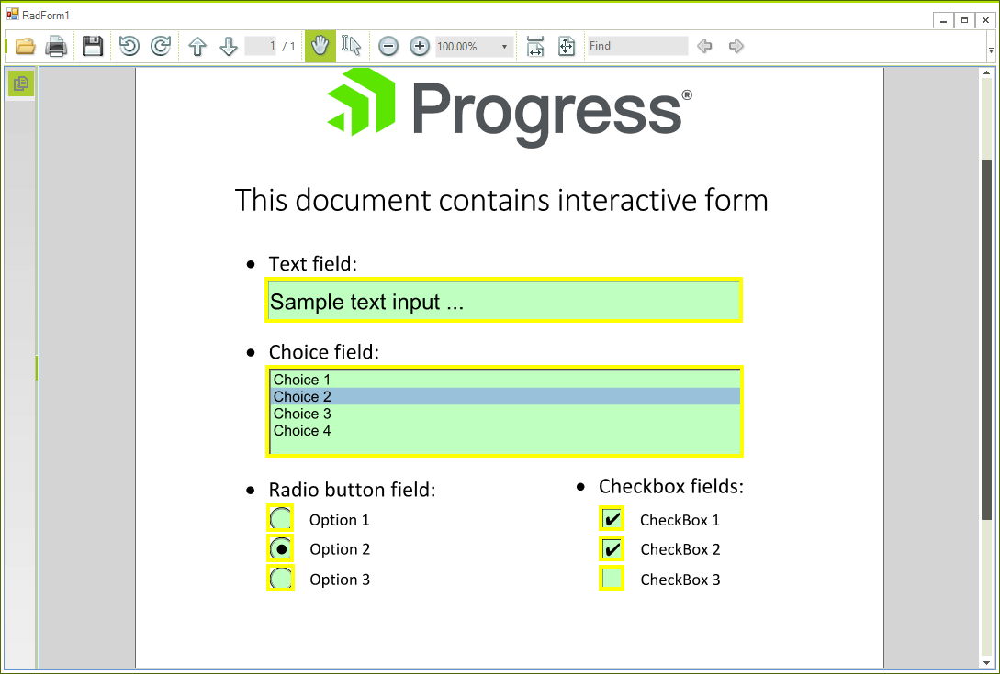

Highlight form fields in RadPdfViewer

This article demonstrates how you can use the custom painting functionality in order to highlight the editable fields in PDF document. 


1\. Subscribe to the __DocumentLoaded__ event. This event will allow you to access the pages of the document ans subscribe to their __ElementPainted__ event. 


````C#
private void RadPdfViewer1_DocumentLoaded(object sender, EventArgs e)
{
    radPdfViewer1.PdfViewerElement.InvalidateMeasure(true);
    radPdfViewer1.PdfViewerElement.UpdateLayout();
    Application.DoEvents();
    foreach (var page in radPdfViewer1.PdfViewerElement.ViewElement.Children)
    {
        page.ElementPainted += PdfViewerElement_ElementPainted;
        page.Invalidate();
    }
 
}
````
````VB.NET
Private Sub RadPdfViewer1_DocumentLoaded(ByVal sender As Object, ByVal e As EventArgs)
    radPdfViewer1.PdfViewerElement.InvalidateMeasure(True)
    radPdfViewer1.PdfViewerElement.UpdateLayout()
    Application.DoEvents()
    For Each page In radPdfViewer1.PdfViewerElement.ViewElement.Children
        page.ElementPainted += PdfViewerElement_ElementPainted
        page.Invalidate()
    Next page

End Sub
````

2. Use the __ElementPainted__ event to paint the border. You will need to consider the scroll and the zoom as well. Here is the code:

````C#
private void PdfViewerElement_ElementPainted(object sender, PaintEventArgs e)
{
 
    RadFixedPageElement p = sender as RadFixedPageElement;
    foreach (var item in p.Page.Annotations)
    {
        e.Graphics.TranslateTransform(p.Transform.DX, p.Transform.DY);
 
        var zoom = radPdfViewer1.PdfViewerElement.ScaleFactor;
        e.Graphics.DrawRectangle(new Pen(Color.Yellow, 4), (int)(item.Rect.X * zoom), (int)(item.Rect.Y * zoom), (int)(item.Rect.Width * zoom), (int)(item.Rect.Height));
 
        e.Graphics.TranslateTransform(-p.Transform.DX, -p.Transform.DY);
    }
}
````
````VB.NET

Private Sub PdfViewerElement_ElementPainted(ByVal sender As Object, ByVal e As PaintEventArgs)

    Dim p As RadFixedPageElement = TryCast(sender, RadFixedPageElement)
    For Each item In p.Page.Annotations
        e.Graphics.TranslateTransform(p.Transform.DX, p.Transform.DY)

        Dim zoom = radPdfViewer1.PdfViewerElement.ScaleFactor
        e.Graphics.DrawRectangle(New Pen(Color.Yellow, 4), CInt(Fix(item.Rect.X * zoom)), CInt(Fix(item.Rect.Y * zoom)), CInt(Fix(item.Rect.Width * zoom)), CInt(Fix(item.Rect.Height)))

        e.Graphics.TranslateTransform(-p.Transform.DX, -p.Transform.DY)
    Next item
End Sub

````


This example will paint a yellow border around each field.

