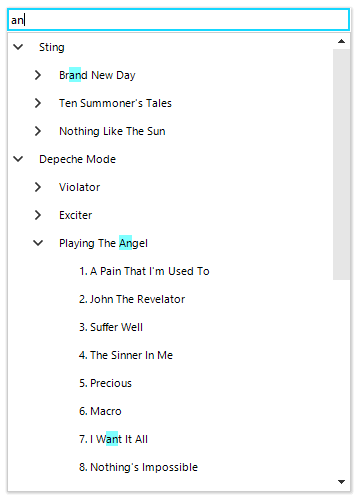

## Environment
 
|Product Version|Product|Author|
|----|----|----|
|2020.1.113|RadTreeView for WinForms|[Todor Vyagov](https://www.telerik.com/blogs/author/todor-vyagov)|
 
## Description

This tutorial demonstrates how to highlight search results in **RadTreeView**. 
 


## Solution 

The desired text highlight effect can be achieved by setting the **TextParams** **highlightRanges** and **highlightColor** properties just before the paint cycle of **TreeNodeContentElement**. 

* First, we need to create a custom **TreeNodeElement** by subscribing to the **CreateNodeElement** event of **RadTreeView**. 

* The custom **TreeNodeElement** has three main highlight related properties: **HighlightText**, **HighlightTextColor**, **HighlightCompareOptions**. It has also a custom **TreeNodeContentElement** (this is the element that holds the text).

* To modify the **TextParams** of **TreeNodeContentElement** we need to override the **CreateTextParams** method and there we can add our **hightlightRanges** and set the **highlightColor**. The **GetSearchHighlightRanges** method is responsible for creating the **highlightRanges** and considers the **HightlightText** and **HighlightCompareOptions**.

* Last, but not least we need to update the **HighlightText** when the text of a text box is changed and force the **RadTreeView** to repaint.

A full code snippet is illustrated below:
 

````C#
public RadForm1()
{
    InitializeComponent();
    
    this.radTreeView1.CreateNodeElement += radTreeView1_CreateNodeElement;
    this.radTextBox1.TextChanged += radTextBox1_TextChanged; 
}

private void radTextBox1_TextChanged(object sender, EventArgs e)
{
    HighlightTreeNodeElement.HighlightText = this.radTextBox1.Text;
    this.radTreeView1.Refresh();
}

private void radTreeView1_CreateNodeElement(object sender, CreateTreeNodeElementEventArgs e)
{
    e.NodeElement = new HighlightTreeNodeElement();
}

public class HighlightTreeNodeElement : TreeNodeElement
{
    public static string HighlightText { get; set; }

    public static Color HighlightTextColor { get; set; }

    public static CompareOptions HighlightCompareOptions { get; set; }

    static HighlightTreeNodeElement()
    {
        HighlightText = string.Empty;
        HighlightTextColor = Color.FromArgb(128, Color.Aqua);
        HighlightCompareOptions = CompareOptions.OrdinalIgnoreCase;
    }

    protected override Type ThemeEffectiveType
    {
        get
        {
            return typeof(TreeNodeElement);
        }
    }

    protected override TreeNodeContentElement CreateContentElement()
    {
        HighlightTreeNodeContentElement contentElement = new HighlightTreeNodeContentElement();
        contentElement.ShouldHandleMouseInput = false;
        return contentElement;
    }
}

public class HighlightTreeNodeContentElement : TreeNodeContentElement
{
    protected override Type ThemeEffectiveType
    {
        get
        {
            return typeof(TreeNodeContentElement);
        }
    }

    protected override TextParams CreateTextParams()
    {
        TextParams textParams = base.CreateTextParams();
        if (!string.IsNullOrEmpty(HighlightTreeNodeElement.HighlightText))
        {
            List<CharacterRange> ranges = this.GetSearchHighlightRanges();
            if (ranges.Count > 0)
            {
                textParams.highlightRanges = ranges.ToArray();
                textParams.highlightColor = HighlightTreeNodeElement.HighlightTextColor;
            }
        }

        return textParams;
    }

    private List<CharacterRange> GetSearchHighlightRanges()
    {
        List<CharacterRange> ranges = new List<CharacterRange>();
        string criteria = HighlightTreeNodeElement.HighlightText;

        int index = -1;
        CompareOptions options = HighlightTreeNodeElement.HighlightCompareOptions;
        string text = this.Text;
        do
        {
            if (index + 1 >= text.Length)
            {
                break;
            }

            index = System.Threading.Thread.CurrentThread.CurrentUICulture.CompareInfo.IndexOf(text, criteria, index + 1, options);

            if (index >= 0)
            {
                if ((options & CompareOptions.IgnoreSymbols) == CompareOptions.IgnoreSymbols)
                {
                    int rangeLength = 0;
                    int criteriaLength = criteria.Length;
                    int currentIndex = index;

                    while (criteriaLength > 0 && currentIndex < text.Length)
                    {
                        if (Char.IsLetterOrDigit(text[currentIndex]))
                        {
                            criteriaLength--;
                        }

                        rangeLength++;
                        currentIndex++;
                    }

                    ranges.Add(new CharacterRange(index, rangeLength));
                }
                else
                {
                    ranges.Add(new CharacterRange(index, criteria.Length));
                }
            }
        }
        while (index >= 0 && ranges.Count < 32);

        return ranges;
    }
}

        
````
````VB.NET

Public Sub New()
    InitializeComponent()
    AddHandler Me.RadTreeView1.CreateNodeElement, AddressOf radTreeView1_CreateNodeElement
    AddHandler Me.RadTextBox1.TextChanged, AddressOf radTextBox1_TextChanged
End Sub

Private Sub radTextBox1_TextChanged(ByVal sender As Object, ByVal e As EventArgs)
    HighlightTreeNodeElement.HighlightText = Me.RadTextBox1.Text
    Me.RadTreeView1.Refresh()
End Sub

Private Sub radTreeView1_CreateNodeElement(ByVal sender As Object, ByVal e As CreateTreeNodeElementEventArgs)
    e.NodeElement = New HighlightTreeNodeElement()
End Sub

Public Class HighlightTreeNodeElement
Inherits TreeNodeElement

    Public Shared Property HighlightText As String
    Public Shared Property HighlightTextColor As Color
    Public Shared Property HighlightCompareOptions As CompareOptions

    Shared Sub New()
        HighlightText = String.Empty
        HighlightTextColor = Color.FromArgb(128, Color.Aqua)
        HighlightCompareOptions = CompareOptions.OrdinalIgnoreCase
    End Sub

    Protected Overrides ReadOnly Property ThemeEffectiveType As Type
        Get
            Return GetType(TreeNodeElement)
        End Get
    End Property

    Protected Overrides Function CreateContentElement() As TreeNodeContentElement
        Dim contentElement As HighlightTreeNodeContentElement = New HighlightTreeNodeContentElement()
        contentElement.ShouldHandleMouseInput = False
        Return contentElement
    End Function
End Class

Public Class HighlightTreeNodeContentElement
Inherits TreeNodeContentElement

    Protected Overrides ReadOnly Property ThemeEffectiveType As Type
        Get
            Return GetType(TreeNodeContentElement)
        End Get
    End Property

    Protected Overrides Function CreateTextParams() As TextParams
        Dim textParams As TextParams = MyBase.CreateTextParams()

        If Not String.IsNullOrEmpty(HighlightTreeNodeElement.HighlightText) Then
            Dim ranges As List(Of CharacterRange) = Me.GetSearchHighlightRanges()

            If ranges.Count > 0 Then
                textParams.highlightRanges = ranges.ToArray()
                textParams.highlightColor = HighlightTreeNodeElement.HighlightTextColor
            End If
        End If

        Return textParams
    End Function

    Private Function GetSearchHighlightRanges() As List(Of CharacterRange)
        Dim ranges As List(Of CharacterRange) = New List(Of CharacterRange)()
        Dim criteria As String = HighlightTreeNodeElement.HighlightText
        Dim index As Integer = -1
        Dim options As CompareOptions = HighlightTreeNodeElement.HighlightCompareOptions
        Dim text As String = Me.Text

        Do

            If index + 1 >= text.Length Then
                Exit Do
            End If

            index = System.Threading.Thread.CurrentThread.CurrentUICulture.CompareInfo.IndexOf(text, criteria, index + 1, options)

            If index >= 0 Then

                If (options And CompareOptions.IgnoreSymbols) = CompareOptions.IgnoreSymbols Then
                    Dim rangeLength As Integer = 0
                    Dim criteriaLength As Integer = criteria.Length
                    Dim currentIndex As Integer = index

                    While criteriaLength > 0 AndAlso currentIndex < text.Length

                        If Char.IsLetterOrDigit(text(currentIndex)) Then
                            criteriaLength -= 1
                        End If

                        rangeLength += 1
                        currentIndex += 1
                    End While

                    ranges.Add(New CharacterRange(index, rangeLength))
                Else
                    ranges.Add(New CharacterRange(index, criteria.Length))
                End If
            End If
        Loop While index >= 0 AndAlso ranges.Count < 32

        Return ranges
    End Function


```` 


    
   
  
    
 
