|Date Posted|Product|Author|
|----|----|----|
|June 18, 2021|UI for WinForms|[Desislava Yordanova](https://www.telerik.com/blogs/author/desislava-yordanova)|

## Problem

Combining the performance and productivity of C#/.NET with the familiarity of HTML/CSS UI rendering is powerful and appealing. This tutorial aims to show you a sample approach how to host Blazor components in your WinForms application.

>important If you are building your first Blazor app, have a look at the [Blazor Tutorial](https://dotnet.microsoft.com/learn/aspnet/blazor-tutorial/install) and the [First Steps with Client-side Telerik UI for Blazor](https://docs.telerik.com/blazor-ui/getting-started/client-blazor).

>note [Telerik UI for Blazor](https://www.telerik.com/blazor-ui) is a completely original product and does not wrap existing jQuery/JavaScript products in C#. The wrapper programming model is a leaky abstraction that would “bleed back” into the .NET API layer and possibly interfere with the RenderTree. The Telerik UI for Blazor started from scratch, writing components with .NET whenever possible and only relying on JavaScript interop when necessary. The native .NET approach is a longterm investment that allows seamless integration with the [Blazor framework](https://dotnet.microsoft.com/apps/aspnet/web-apps/blazor).

## Solution

[.NET 6 Preview 3](https://devblogs.microsoft.com/dotnet/announcing-net-6-preview-3/) brings support for building cross-platform hybrid desktop apps using Blazor. This enables the possibility to build a hybrid app that uses an embedded web view control to render web UI. Hence, you can write your app UI using web technologies like HTML & CSS, while also leveraging native device capabilities.  

**.NET 6 Preview 3** introduced **BlazorWebView** controls for WPF and Windows Forms apps that enable embedding Blazor functionality into existing Windows desktop apps based on .NET 6. Let's have a closer look at how to use it.

1\. To use the new **BlazorWebView** controls, you first need to make sure that you have [WebView2](https://developer.microsoft.com/microsoft-edge/webview2/#download-section) installed.

> For this sample we will use a brand new [Telerik WinForms project](https://docs.telerik.com/devtools/winforms/visual-studio-integration/visual-studio-extensions/create-project) with a [RadTabbedForm](https://docs.telerik.com/devtools/winforms/controls/forms-and-dialogs/tabbedform/overview) that has two tabs:

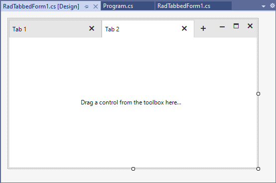

2\. Update the Windows Forms app to target **.NET 6**.

>note Since R2 2020 Telerik UI for WinForms suite provides tooling in Visual Studio 2019, via our Visual Studio Extensions, that will convert client projects that use .NET Framework 4.8 (or lower) into .NET Core projects to ease out the migration: [.NET Core Project Converter](https://docs.telerik.com/devtools/winforms/core/net-core-project-converter).

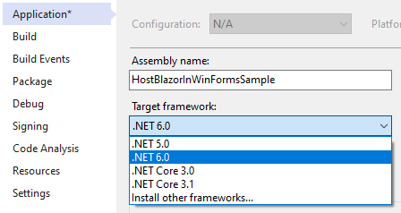

Make sure that the correct Telerik NuGet is installed as well:

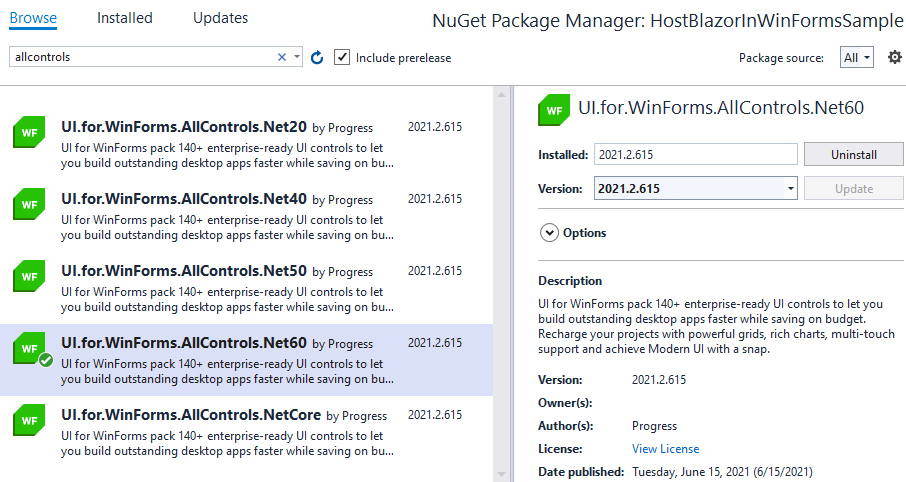

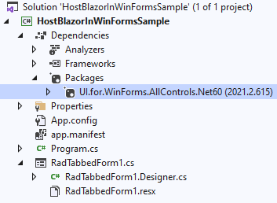
 
3\. Update the SDK used in the app’s project file to **Microsoft.NET.Sdk.Razor**.

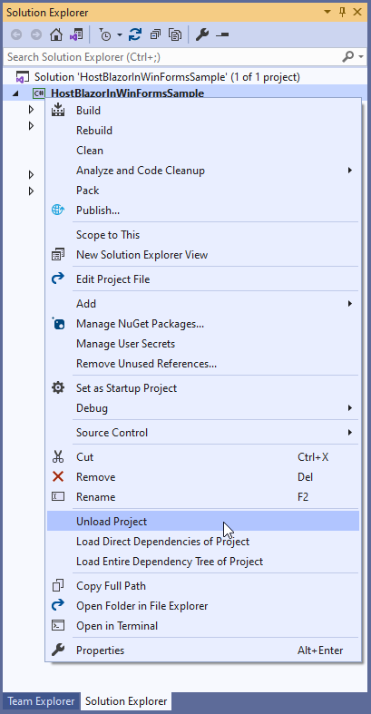

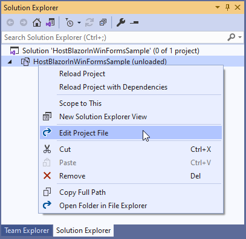

Change this line of code:

````XML
<Project Sdk="Microsoft.NET.Sdk.WindowsDesktop">
````

with this one and reload the project:

````XML
<Project Sdk="Microsoft.NET.Sdk.Razor">
````

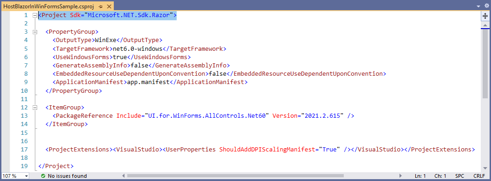

4\. Add a package reference to [Microsoft.AspNetCore.Components.WebView.WindowsForms](https://nuget.org/packages/Microsoft.AspNetCore.Components.WebView.WindowsForms):

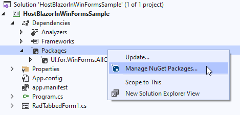

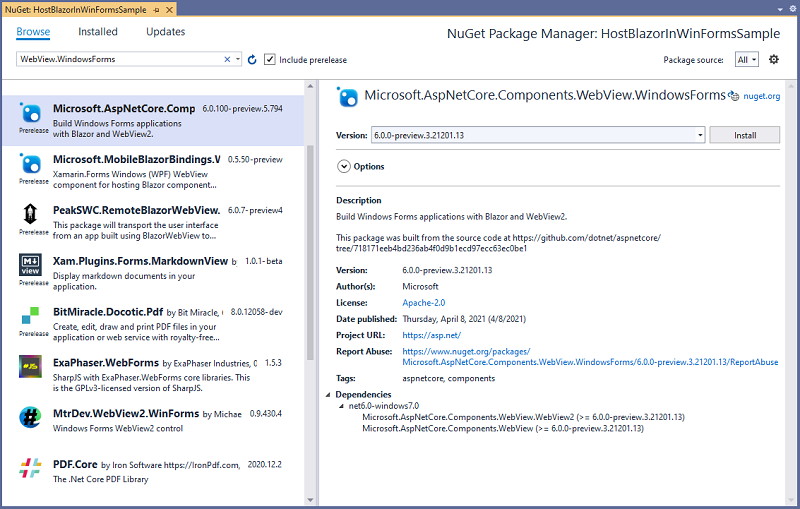

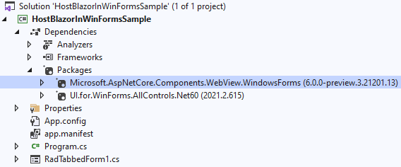


5\. Add the following **wwwroot/index.html** file to the project, replacing **{PROJECT NAME}** with the actual project name:
 
````
<!DOCTYPE html>
<html>

<head>
    <meta charset="utf-8" />
    <meta name="viewport" content="width=device-width, initial-scale=1.0, maximum-scale=1.0, user-scalable=no" />
    <title>Blazor app</title>
    <base href="/" />
    <link href="{HostBlazorInWinFormsSample}.styles.css" rel="stylesheet" />
    <link href="app.css" rel="stylesheet" />
    <link rel="stylesheet"
          href="https://blazor.cdn.telerik.com/blazor/2.24.0/kendo-theme-default/all.css"
          asp-fallback-href="_content/Telerik.UI.for.Blazor/css/kendo-theme-default/all.css"
          asp-fallback-test-class="k-theme-test-class"
          asp-fallback-test-property="opacity"
          asp-fallback-test-value="0" />
</head>

<body>
    <div id="app"></div>
    <div id="blazor-error-ui">
        Weekly weather forecast.
        <a href="" class="reload">Reload</a>
        <a class="dismiss">🗙</a>
    </div>
    <script src="_framework/blazor.webview.js"></script>
</body>
</html>

````

6\. Add the following **app.css** file with some basic styles to the wwwroot folder:

```` 
html, body {
    font-family: 'Helvetica Neue', Helvetica, Arial, sans-serif;
}

.valid.modified:not([type=checkbox]) {
    outline: 1px solid #26b050;
}

.invalid {
    outline: 1px solid red;
}

.validation-message {
    color: red;
}

#blazor-error-ui {
    background: lightyellow;
    bottom: 0;
    box-shadow: 0 -1px 2px rgba(0, 0, 0, 0.2);
    display: none;
    left: 0;
    padding: 0.6rem 1.25rem 0.7rem 1.25rem;
    position: fixed;
    width: 100%;
    z-index: 1000;
}

 #blazor-error-ui .dismiss {
        cursor: pointer;
        position: absolute;
        right: 0.75rem;
        top: 0.5rem;
    }
````

7\. For all files in the **wwwroot** folder, set the **Copy to Output Directory** property to **Copy if newer**.

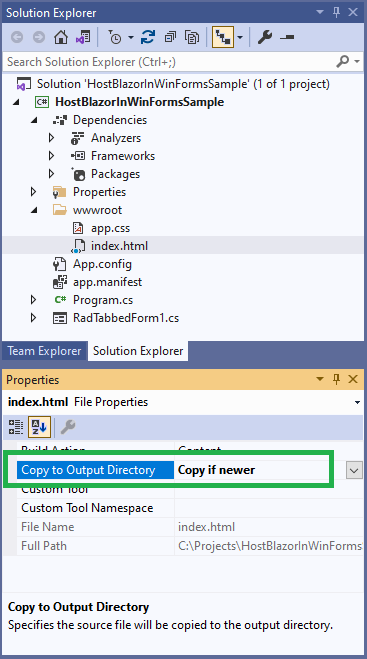


8\. Add a root **Blazor** component, **WeatherDay.razor**, to the project:

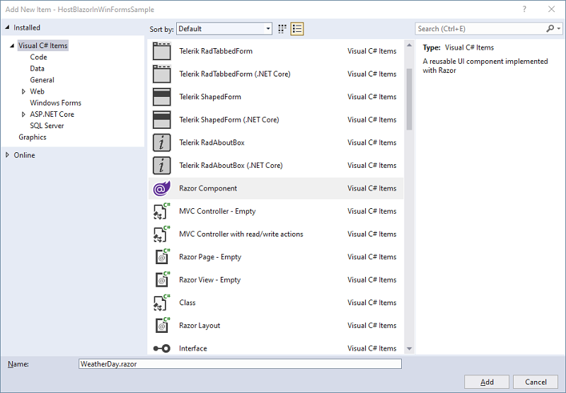

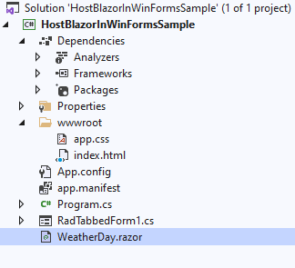

```` 
@using Telerik.Blazor.Components
@inject WeatherForecastService ForecastService

<TelerikListView Data="@forecasts" Width="700px" Pageable="true">
    <HeaderTemplate>
        <h2>Weather forecast</h2>
    </HeaderTemplate>
    <Template>
        <div class="listview-item">
            <h4>@context.Date.DayOfWeek</h4>
            <h5>@context.TemperatureC C&deg;</h5>
            <h5>@context.Summary</h5>
             
        </div>
    </Template>
</TelerikListView>

 

@code{

    private WeatherForecast[] forecasts;

    protected override async Task OnInitializedAsync()
    {
        forecasts = await ForecastService.GetForecastAsync(DateTime.Now);
    } 
}

<style>
    .listview-item {
        height: 250px;
        width: 100px;
        display: inline-block;
        margin: 10px;
        border: 1px solid black;
        border-radius: 10px;
        padding: 10px;
    }
</style> 

````
This requires installing the [Telerik.UI.for.Blazor NuGet](https://docs.telerik.com/blazor-ui/installation/nuget):

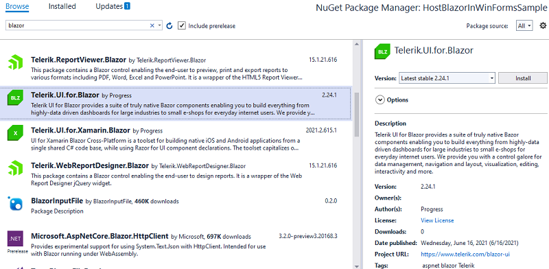

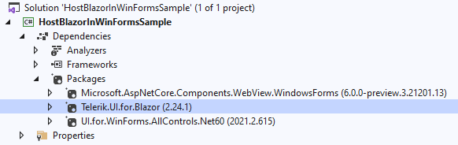

9\. Add the following .cs classes, **WeatherForecast.cs** and **WeatherForecastService.cs** that will be used for generating the weather data: 

#### WeatherForecast

````C#
    public class WeatherForecast
    {
        public DateTime Date { get; set; }

        public int TemperatureC { get; set; }

        public int TemperatureF => 32 + (int)(TemperatureC / 0.5556);

        public string Summary { get; set; }

        public string ImagePath
        {
            get
            {
                return this.Summary.ToLower() + ".png";
            }
        }
    }
 
````

#### WeatherForecastService

````C#
    public class WeatherForecastService
    {
        private static readonly string[] Summaries = new[]
        {
        "Rainy", "Sunny", "Cloudy"
    };

        public Task<WeatherForecast[]> GetForecastAsync(DateTime startDate)
        {
            var rng = new Random();
            return Task.FromResult(Enumerable.Range(1, 10).Select(index => new WeatherForecast
            {
                Date = startDate.AddDays(index),
                TemperatureC = rng.Next(-20, 35),
                Summary = Summaries[rng.Next(Summaries.Length)]
            }).ToArray());
        }
    }
 
````

10\. Add another root **Blazor** component, **Counter.razor**, to the project:

````
@using Microsoft.AspNetCore.Components.Web 
@using Telerik.Blazor.Components
<h1>Blazor Counter</h1>

<p>The current count is: @currentCount</p>
<TelerikButton Primary="true" Icon="plus" OnClick="IncrementCount">Count</TelerikButton>

@code {
    int currentCount = 0;

    void IncrementCount()
    {
        currentCount++;
    }
}
````

11\. Now, it is necessary to host the two Blazor components on the two tabs in the WinForms RadTabbedForm by using the [BlazorWebView](https://devblogs.microsoft.com/aspnet/asp-net-core-updates-in-net-6-preview-3/#blazorwebview-controls-for-wpf-windows-forms):

````C#
using Microsoft.AspNetCore.Components.WebView.WindowsForms;
using Microsoft.Extensions.DependencyInjection; 
using System.Windows.Forms; 

namespace HostBlazorInWinFormsSample
{
    public partial class RadTabbedForm1 : Telerik.WinControls.UI.RadTabbedForm
    {
        public RadTabbedForm1()
        {
            InitializeComponent();

            this.AllowAero = false;

            ServiceCollection serviceCollection = new ServiceCollection();
            serviceCollection.AddSingleton<WeatherForecastService>();
            serviceCollection.AddBlazorWebView();
            BlazorWebView blazorWeather = new BlazorWebView()
            {
                Dock = DockStyle.Fill,
                HostPage = "wwwroot/index.html",
                Services = serviceCollection.BuildServiceProvider(),
            };
            
            blazorWeather.RootComponents.Add<WeatherDay>("#app");
            this.radTabbedFormControlTab1.Text = "Weather";
            this.radTabbedFormControlTab1.Controls.Add(blazorWeather);

            BlazorWebView blazorCounter = new BlazorWebView()
            {
                Dock = DockStyle.Fill,
                HostPage = "wwwroot/index.html",
                Services = serviceCollection.BuildServiceProvider(),
            };
            blazorCounter.RootComponents.Add<Counter>("#app");
            this.radTabbedFormControlTab2.Text = "Counter";
            this.radTabbedFormControlTab2.Controls.Add(blazorCounter);
        }
    }
}

```` 

That's it! Run the Telerik WinForms app and you will see two tabs that hosts the Blazor components (WeatherDay.razor and Counter.razor) in a desktop application quite similar to a web browser:

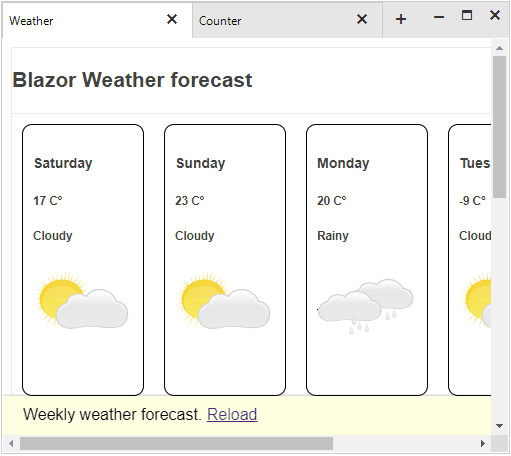 

> This example uses the [TelerikListView](https://docs.telerik.com/blazor-ui/components/listview/overview) and [TelerikButton](https://docs.telerik.com/blazor-ui/components/button/overview) from the UI for Blazor suite.

>note A complete solution can be found [here](https://github.com/telerik/winforms-sdk/tree/master/HostBlazorInWinFormsSample).

# See Also

* [ASP.NET Core updates in .NET 6 Preview 3](https://devblogs.microsoft.com/aspnet/asp-net-core-updates-in-net-6-preview-3/)
* [BlazorWebView ](https://devblogs.microsoft.com/aspnet/asp-net-core-updates-in-net-6-preview-3/#blazorwebview-controls-for-wpf-windows-forms)
* [Blazor on Desktop](https://www.telerik.com/blogs/blazor-on-desktop)
* [Telerik e-book: Blazor: A Beginner's Guide](https://www.telerik.com/campaigns/blazor/wp-beginners-guide-ebook)
* [Hybrid Blazor Apps (Blazor Web apps running in WinForms, WPF, MAUI)](https://github.com/telerik/blazor-ui/tree/master/common/hybrid-blazor-apps)