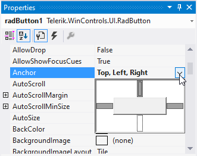
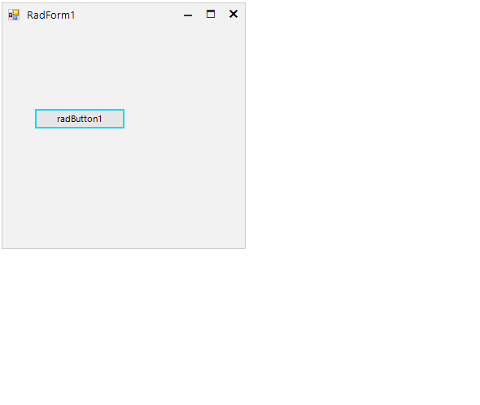
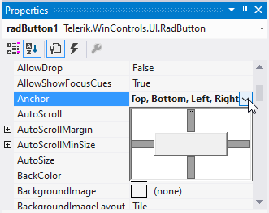
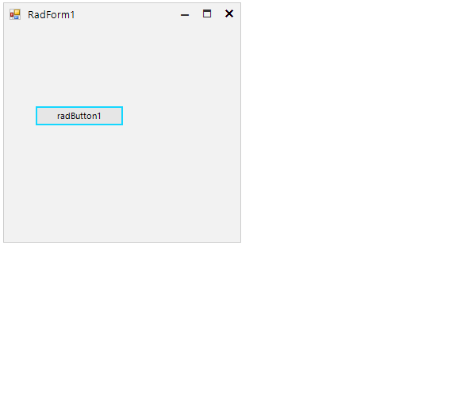

## Environment
 
|Product Version|Product|Author|
|----|----|----|
|2022.2.622|UI for WinForms|[Desislava Yordanova](https://www.telerik.com/blogs/author/desislava-yordanova)|

## Description

The [Anchor](https://docs.microsoft.com/en-us/dotnet/api/system.windows.forms.control.anchor?view=windowsdesktop-6.0) property offered by all WinForms controls specifies the edges that affect the control's size when its parent container gets resized. This article gives more details what to expect from the Anchor property.

## Solution

Basically, when a control is anchored, it listens for the **SizeChanged** of its parent and recalculates its bounds accordingly. 

|Anchor|Resizing Behavior|
|----|----|
|||
|||

>note [Anchoring a control to its parent control ensures that the anchored edges remain in the same position relative to the edges of the parent control when the parent control is resized.](https://docs.microsoft.com/en-us/dotnet/api/system.windows.forms.control.anchor?view=windowsdesktop-6.0#remarks)

No recalculation will happen if the parent's layout was suspended using the SuspendLayout method. Тhis is mostly used in the .Designer.cs initialization but it might be needed in some cases where you initialize controls dynamically (in the form's constructor or Load handler).

Another thing is that a control in Windows Forms cannot have a negative size. Thus, if you have a control which is Left-Right anchored and you reduce the size of its parent container so that its size must have become negative, its size will actually stay 0. Then, when you increase the size of the parent container, the size of the anchored control will start to grow from 0 immediately. 
