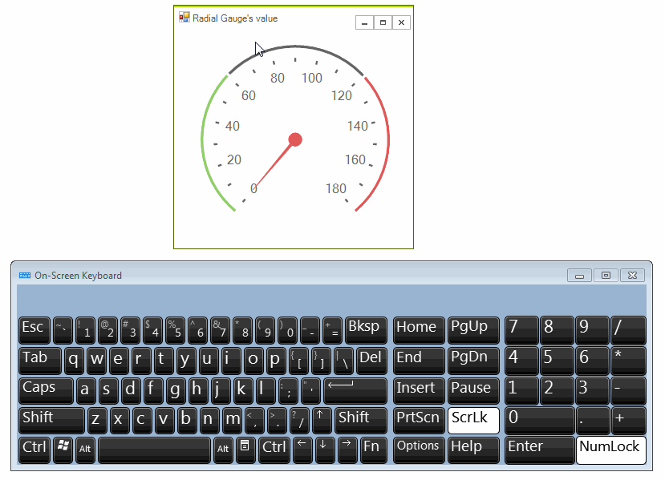

## Environment
<table>
	<tr>
		<td>Product</td>
		<td>RadRadialGauge for WinForms</td>
	</tr>
</table>


## Description
This article demonstrates a sample approach how to change the value of **RadRadialGauge** by handling user's mouse/keyboard input.
 
## Solution

We will detect when the user either moves the mouse, keeping pressed the left mouse button or presses the up/down arrow keys. The below gif file illustrates the achieved behavior:




## Changing the Value with the Mouse

Handle the **MouseMove** event and check whether the left mouse button is pressed. Then, calculate the new gauge's value considering the angle of the current mouse location to the center of the gauge. 

{{source=..\SamplesCS\KnowledgeBase\GaugeValueChange.cs region=MouseValueChange}} 
{{source=..\SamplesVB\KnowledgeBase\GaugeValueChange.vb region=MouseValueChange}}

````C#
        
protected override void OnLoad(EventArgs e)
{
    base.OnLoad(e);
    
    this.radRadialGauge1.MouseMove += radRadialGauge1_MouseMove; 
    this.radialGaugeNeedle1.BindValue = true;
}
        
private void radRadialGauge1_MouseMove(object sender, MouseEventArgs e)
{
    if (e.Button == System.Windows.Forms.MouseButtons.Left)
    {
        UpdateValue(e.Location);
    }
}
        
private void UpdateValue(Point pointLocation)
{
    float centerX = this.radRadialGauge1.GaugeElement.GaugeCenter.X + this.radialGaugeNeedle1.TotalTransform.DX;
    float centerY = this.radRadialGauge1.GaugeElement.GaugeCenter.Y + this.radialGaugeNeedle1.TotalTransform.DY;
    PointF center = new PointF(centerX, centerY);
    
    double radian = Math.Atan2(pointLocation.Y - center.Y, pointLocation.X - center.X);
    double angle = radian * (180 / Math.PI);
    if (angle < 0.0)
    {
        angle += 360.0;
    }
    
    float newValue = CalculateValueByAngle(angle, this.radRadialGauge1.RangeStart, this.radRadialGauge1.RangeEnd, this.radRadialGauge1.StartAngle, this.radRadialGauge1.SweepAngle);
    this.radRadialGauge1.Value = Math.Min(newValue, (float)this.radRadialGauge1.RangeEnd);
}
        
public float CalculateValueByAngle(double needleAngleDegree, double rangeStart, double rangeEnd, double startAngle, double sweepAngle)
{
    float value = 0;
    double angleDiff = needleAngleDegree - startAngle;
    if (angleDiff < 0)
    {
        angleDiff += 360;
    }
    double ratio = (angleDiff) / sweepAngle;
    value = (float)(ratio * Math.Abs(rangeEnd - rangeStart) + rangeStart);
    return value;
}

````
````VB.NET
Private Sub radRadialGauge1_MouseMove(ByVal sender As Object, ByVal e As MouseEventArgs)
    If e.Button = System.Windows.Forms.MouseButtons.Left Then
        UpdateValue(e.Location)
    End If
End Sub
Private Sub UpdateValue(ByVal pointLocation As Point)
    Dim centerX As Single = Me.RadRadialGauge1.GaugeElement.GaugeCenter.X + Me.RadialGaugeNeedle1.TotalTransform.DX
    Dim centerY As Single = Me.RadRadialGauge1.GaugeElement.GaugeCenter.Y + Me.RadialGaugeNeedle1.TotalTransform.DY
    Dim center As PointF = New PointF(centerX, centerY)
    Dim radian As Double = Math.Atan2(pointLocation.Y - center.Y, pointLocation.X - center.X)
    Dim angle As Double = radian * (180 / Math.PI)
    If angle < 0.0 Then
        angle += 360.0
    End If
    Dim newValue As Single = CalculateValueByAngle(angle, Me.RadRadialGauge1.RangeStart, Me.RadRadialGauge1.RangeEnd, Me.RadRadialGauge1.StartAngle, Me.RadRadialGauge1.SweepAngle)
    Me.RadRadialGauge1.Value = Math.Min(newValue, CSng(Me.RadRadialGauge1.RangeEnd))
End Sub
Public Function CalculateValueByAngle(ByVal needleAngleDegree As Double, ByVal rangeStart As Double, ByVal rangeEnd As Double, ByVal startAngle As Double, ByVal sweepAngle As Double) As Single
    Dim value As Single = 0
    Dim angleDiff As Double = needleAngleDegree - startAngle
    If angleDiff < 0 Then
        angleDiff += 360
    End If
    Dim ratio As Double = (angleDiff) / sweepAngle
    value = CSng((ratio * Math.Abs(rangeEnd - rangeStart) + rangeStart))
    Return value
End Function

````

{{endregion}}

## Changing the Value with the Keyboard

Add a timer to detect whether the up/down arrow key is pressed in order to adjust the value of **RadRadialGauge**. In the **PreviewKeyDown** event you can enable a flag to distinguish which arrow key is pressed. It is necessary to stop the timer when you release the mouse:

{{source=..\SamplesCS\KnowledgeBase\GaugeValueChange.cs region=KeyboardValueChange}} 
{{source=..\SamplesVB\KnowledgeBase\GaugeValueChange.vb region=KeyboardValueChange}}

````C#
````
````VB.NET
Private timer As Timer = New Timer()
Public Sub New()
    InitializeComponent()
    AddHandler Me.RadRadialGauge1.MouseMove, AddressOf radRadialGauge1_MouseMove
    Me.RadialGaugeNeedle1.BindValue = True
    AddHandler Me.RadRadialGauge1.PreviewKeyDown, AddressOf radRadialGauge1_PreviewKeyDown
    AddHandler Me.RadRadialGauge1.KeyUp, AddressOf radRadialGauge1_KeyUp
    AddHandler timer.Tick, AddressOf timer_Tick
    timer.Interval = 100
    timer.Start()
End Sub
Private Sub timer_Tick(ByVal sender As Object, ByVal e As EventArgs)
    Dim newValue As Single
    If isDownArrow Then
        newValue = Math.Max(0, Me.RadRadialGauge1.Value - 1)
        Me.RadRadialGauge1.Value = newValue
    ElseIf isUpArrow Then
        newValue = Math.Max(Me.RadRadialGauge1.Value + 1, CSng(Me.RadRadialGauge1.RangeEnd))
        Me.RadRadialGauge1.Value += 1
    End If
End Sub
Private Sub radRadialGauge1_KeyUp(ByVal sender As Object, ByVal e As KeyEventArgs)
    isDownArrow = False
    isUpArrow = False
    timer.[Stop]()
End Sub
Private isDownArrow As Boolean = False
Private isUpArrow As Boolean = False
Private Sub radRadialGauge1_PreviewKeyDown(ByVal sender As Object, ByVal e As PreviewKeyDownEventArgs)
    If e.KeyData = Keys.Down Then
        isDownArrow = True
    ElseIf e.KeyData = Keys.Up Then
        isUpArrow = True
    End If
    timer.Start()
End Sub

````

{{endregion}}

>tip A complete solution providing a C# and VB.NET project is available [here](https://github.com/telerik/winforms-sdk/tree/master/RadialGauge/GaugeValueChange).

# See Also

 * [RadialGauge]()
 * [Getting Started with RadialGauge]()

