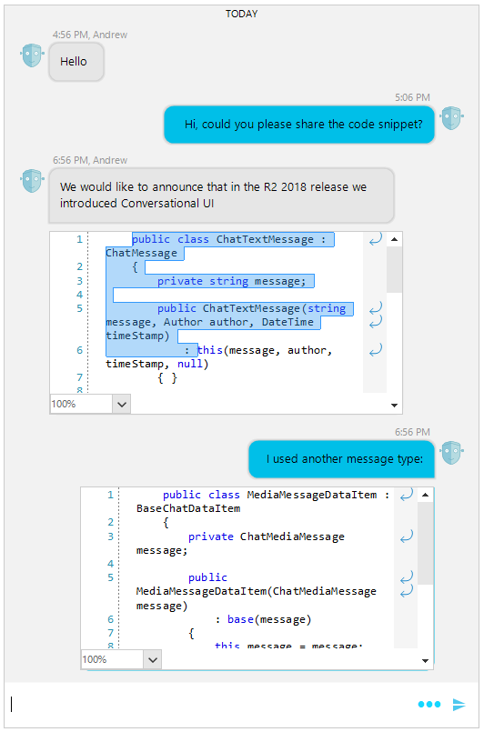

## Environment
 
|Product Version|Product|Author|
|----|----|----|
|2023.3.1010|RadChat for WinForms|[Desislava Yordanova](https://www.telerik.com/blogs/author/desislava-yordanova)|
 
## Description

This tutorial demonstrates a sample approach how to display C# code snippets in chat messages by using [RadSyntaxEditor]().

>caption Code snippet in a Chat Message



>note Depending on the code snippet's language, the proper [tagger]() has to be used to observe the respective syntax highlighting.

>caution Since RadSyntaxEditor is a heavy control with rich functionalities, it is used as a control, and can not be used as an element. However, it is important to note that using controls in visual chat elements may slow down the scrolling and will cause visual glitches as the controls don't support clipping. Please have this in mind as side effects in case you decide to use the demo.

## Solution 

To achieve the above result, follow the steps: 

1\. Create a derivative of **TextMessageItemElement** and replace its **ChatMessageBubbleElement** with a custom one which hosts a read-only **RadSyntaxEditor**. Thus, you will benefit from the code formatting that RadSyntaxEditor offers. 

2\. Then, create a custom [Chat Factory]() and integrate the custom message element as follows:
 

````C#
        public RadForm1()
        {
            InitializeComponent();

            this.radChat1.Author = new Author(Properties.Resources.bot, "Nancy");

            this.radChat1.ChatElement.ChatFactory = new CustomChatFactory();

            Author author2 = new Author(Properties.Resources.bot, "Andrew");
            ChatTextMessage message1 = new ChatTextMessage("Hello", author2, DateTime.Now.AddHours(1));
            this.radChat1.AddMessage(message1);
            ChatTextMessage message2 = new ChatTextMessage("Hi, could you please share the code snippet?", this.radChat1.Author, DateTime.Now.AddHours(1).AddMinutes(10));
            this.radChat1.AddMessage(message2);
            ChatTextMessage message3 = new ChatTextMessage("We would like to announce that in the R2 2018 release " +
                                                           "we introduced Conversational UI", author2, DateTime.Now.AddHours(3));
            this.radChat1.AddMessage(message3);
            string code1 = @"    public class ChatTextMessage : ChatMessage
    {
        private string message;

        public ChatTextMessage(string message, Author author, DateTime timeStamp)
            : this(message, author, timeStamp, null)
        { }

        public ChatTextMessage(string message, Author author, DateTime timeStamp, object userData)
            : base(author, timeStamp, userData)
        {
            this.message = message;
        }

        public string Message
        {
            get { return message; }
            set
            {
                if (this.message != value)
                {
                    this.message = value;

                    this.OnPropertyChanged(""Message"");
                }
            }
        }
    }";
            CodeSnippetChatMessage message4 = new CodeSnippetChatMessage(code1, author2, DateTime.Now.AddHours(3));
            this.radChat1.AddMessage(message4);

            ChatTextMessage message5 = new ChatTextMessage("I used another message type:", this.radChat1.Author, DateTime.Now.AddHours(3));
            this.radChat1.AddMessage(message5);

            string code2 = @"    public class MediaMessageDataItem : BaseChatDataItem
    {
        private ChatMediaMessage message;

        public MediaMessageDataItem(ChatMediaMessage message)
            : base(message)
        {
            this.message = message;
        }

        public ChatMediaMessage MediaMessage
        {
            get { return this.message; }
        }
    }";
            CodeSnippetChatMessage message6 = new CodeSnippetChatMessage(code2, this.radChat1.Author, DateTime.Now.AddHours(3));
            this.radChat1.AddMessage(message6);
        }

        public class CodeSnippetChatMessage : ChatTextMessage
        {
            public CodeSnippetChatMessage(string message, Author author, DateTime timeStamp) : base(message, author, timeStamp)
            {
            }

            
        }
        public class CustomChatFactory : ChatFactory
        {
            public override BaseChatDataItem CreateDataItem(ChatMessage message)
            {
                CodeSnippetChatMessage codeSnippetMessage = message as CodeSnippetChatMessage;
                if (codeSnippetMessage != null)
                {
                    return new CodeSnippetDataItem(codeSnippetMessage);
                }
                return base.CreateDataItem(message);
            }
            public override BaseChatItemElement CreateItemElement(BaseChatDataItem item)
            {
                if (item.GetType() == typeof(CodeSnippetDataItem))
                {
                    return new CodeMessageItemElement();
                }
                return base.CreateItemElement(item);
            }
        }

        public class CodeSnippetDataItem : TextMessageDataItem
        {
            public CodeSnippetDataItem(ChatTextMessage message) : base(message)
            {
            }
        }

        public class CodeMessageItemElement : TextMessageItemElement
        {
            protected override Type ThemeEffectiveType
            {
                get
                {
                    return typeof(TextMessageItemElement);
                }
            }

            public override bool IsCompatible(BaseChatDataItem data, object context)
            {
                return data.GetType() == typeof(CodeSnippetDataItem);
            }

            protected override LightVisualElement CreateMainMessageElement()
            {
                return new CustomChatMessageBubbleElement();
            }

            public override void Synchronize()
            {
                base.Synchronize();
                CustomChatMessageBubbleElement bubble = this.MainMessageElement as CustomChatMessageBubbleElement;
                bubble.DrawText = false;
                bubble.CodeElement.Document = new Telerik.WinForms.SyntaxEditor.Core.Text.TextDocument(bubble.Text);
                bubble.CodeElement.Text = bubble.Text;
            }
        }

        public class CustomChatMessageBubbleElement : ChatMessageBubbleElement
        {
            protected override Type ThemeEffectiveType
            {
                get
                {
                    return typeof(ChatMessageBubbleElement);
                }
            }

            RadHostItem host;
            RadSyntaxEditor  codeElement;

            public RadSyntaxEditor  CodeElement
            {
                get
                {
                    return this.codeElement;
                }
            }

            protected override void CreateChildElements()
            {
                 base.CreateChildElements();
                codeElement = new RadSyntaxEditor ();
                codeElement.IsWordWrapEnabled = true;
                codeElement.SyntaxEditorElement.IsReadOnly = true;
                CSharpTagger currentLanguageTagger = new CSharpTagger(codeElement.SyntaxEditorElement);
                codeElement.TaggersRegistry.RegisterTagger(currentLanguageTagger);
                host = new RadHostItem(codeElement);
                codeElement.Dock = DockStyle.Fill;
                host.MinSize = new Size(400, 200);
                this.Children.Add(host);
            }

            

            public override string Text
            {
                get
                {
                    return this.codeElement.Text;
                }
                set
                {
                    base.Text = value;
                    this.codeElement.Text = value;
                }
            }
        }      
        
````
````VB.NET
    Public Sub New()
        InitializeComponent()
        Me.RadChat1.Author = New Author(My.Resources.bot, "Nancy")
        Me.RadChat1.ChatElement.ChatFactory = New CustomChatFactory()
        Dim author2 As Author = New Author(My.Resources.bot, "Andrew")
        Dim message1 As ChatTextMessage = New ChatTextMessage("Hello", author2, DateTime.Now.AddHours(1))
        Me.RadChat1.AddMessage(message1)
        Dim message2 As ChatTextMessage = New ChatTextMessage("Hi, could you please share the code snippet?", Me.RadChat1.Author, DateTime.Now.AddHours(1).AddMinutes(10))
        Me.RadChat1.AddMessage(message2)
        Dim message3 As ChatTextMessage = New ChatTextMessage("We would like to announce that in the R2 2018 release " & "we introduced Conversational UI", author2, DateTime.Now.AddHours(3))
        Me.RadChat1.AddMessage(message3)
        Dim code1 As String = "    public class ChatTextMessage : ChatMessage
    {
        private string message;

        public ChatTextMessage(string message, Author author, DateTime timeStamp)
            : this(message, author, timeStamp, null)
        { }

        public ChatTextMessage(string message, Author author, DateTime timeStamp, object userData)
            : base(author, timeStamp, userData)
        {
            this.message = message;
        }

        public string Message
        {
            get { return message; }
            set
            {
                if (this.message != value)
                {
                    this.message = value;

                    this.OnPropertyChanged(""Message"");
                }
            }
        }
    }"
        Dim message4 As CodeSnippetChatMessage = New CodeSnippetChatMessage(code1, author2, DateTime.Now.AddHours(3))
        Me.RadChat1.AddMessage(message4)
        Dim message5 As ChatTextMessage = New ChatTextMessage("I used another message type:", Me.RadChat1.Author, DateTime.Now.AddHours(3))
        Me.RadChat1.AddMessage(message5)
        Dim code2 As String = "    public class MediaMessageDataItem : BaseChatDataItem
    {
        private ChatMediaMessage message;

        public MediaMessageDataItem(ChatMediaMessage message)
            : base(message)
        {
            this.message = message;
        }

        public ChatMediaMessage MediaMessage
        {
            get { return this.message; }
        }
    }"
        Dim message6 As CodeSnippetChatMessage = New CodeSnippetChatMessage(code2, Me.RadChat1.Author, DateTime.Now.AddHours(3))
        Me.RadChat1.AddMessage(message6)
    End Sub

    Public Class CodeSnippetChatMessage
        Inherits ChatTextMessage

        Public Sub New(ByVal message As String, ByVal author As Author, ByVal timeStamp As DateTime)
            MyBase.New(message, author, timeStamp)
        End Sub
    End Class

    Public Class CustomChatFactory
        Inherits ChatFactory

        Public Overrides Function CreateDataItem(ByVal message As ChatMessage) As BaseChatDataItem
            Dim codeSnippetMessage As CodeSnippetChatMessage = TryCast(message, CodeSnippetChatMessage)

            If codeSnippetMessage IsNot Nothing Then
                Return New CodeSnippetDataItem(codeSnippetMessage)
            End If

            Return MyBase.CreateDataItem(message)
        End Function

        Public Overrides Function CreateItemElement(ByVal item As BaseChatDataItem) As BaseChatItemElement
            If item.[GetType]() = GetType(CodeSnippetDataItem) Then
                Return New CodeMessageItemElement()
            End If

            Return MyBase.CreateItemElement(item)
        End Function
    End Class

    Public Class CodeSnippetDataItem
        Inherits TextMessageDataItem

        Public Sub New(ByVal message As ChatTextMessage)
            MyBase.New(message)
        End Sub
    End Class

    Public Class CodeMessageItemElement
        Inherits TextMessageItemElement

        Protected Overrides ReadOnly Property ThemeEffectiveType As Type
            Get
                Return GetType(TextMessageItemElement)
            End Get
        End Property

        Public Overrides Function IsCompatible(ByVal data As BaseChatDataItem, ByVal context As Object) As Boolean
            Return data.[GetType]() = GetType(CodeSnippetDataItem)
        End Function

        Protected Overrides Function CreateMainMessageElement() As LightVisualElement
            Return New CustomChatMessageBubbleElement()
        End Function

        Public Overrides Sub Synchronize()
            MyBase.Synchronize()
            Dim bubble As CustomChatMessageBubbleElement = TryCast(Me.MainMessageElement, CustomChatMessageBubbleElement)
            bubble.DrawText = False
            bubble.CodeElement.Document = New Telerik.WinForms.SyntaxEditor.Core.Text.TextDocument(bubble.Text)
            bubble.CodeElement.Text = bubble.Text
        End Sub
    End Class

    Public Class CustomChatMessageBubbleElement
        Inherits ChatMessageBubbleElement

        Protected Overrides ReadOnly Property ThemeEffectiveType As Type
            Get
                Return GetType(ChatMessageBubbleElement)
            End Get
        End Property

        Private host As RadHostItem
        Private _codeElement As RadSyntaxEditor

        Public ReadOnly Property CodeElement As RadSyntaxEditor
            Get
                Return Me._codeElement
            End Get
        End Property

        Protected Overrides Sub CreateChildElements()
            MyBase.CreateChildElements()
            _codeElement = New RadSyntaxEditor()
            _codeElement.IsWordWrapEnabled = True
            _codeElement.SyntaxEditorElement.IsReadOnly = True
            Dim currentLanguageTagger As CSharpTagger = New CSharpTagger(_codeElement.SyntaxEditorElement)
            _codeElement.TaggersRegistry.RegisterTagger(currentLanguageTagger)
            host = New RadHostItem(_codeElement)
            _codeElement.Dock = DockStyle.Fill
            host.MinSize = New Size(400, 200)
            Me.Children.Add(host)
        End Sub

        Public Overrides Property Text As String
            Get
                Return Me._codeElement.Text
            End Get
            Set(ByVal value As String)
                MyBase.Text = value
                Me._codeElement.Text = value
            End Set
        End Property
    End Class

```` 

## See Also

* [How to Select and Copy Text in Chat Messages]()
* [ChatElementFactory]()
* [Custom Items]()


    
   
  
    
 
